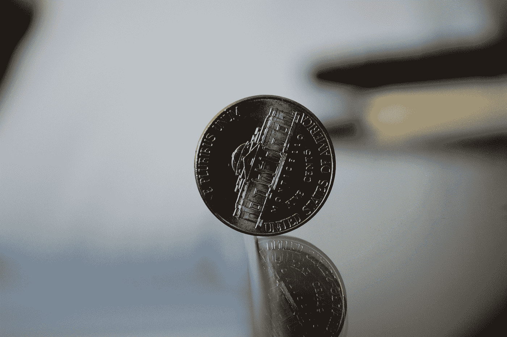
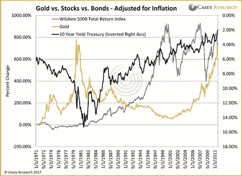
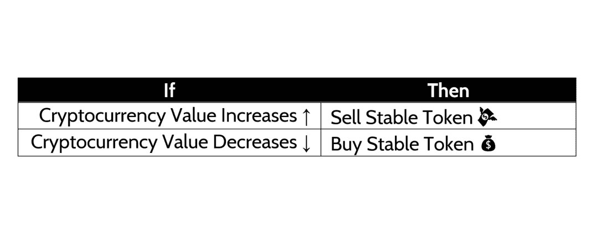

# 关于稳定令牌(加密)您需要了解的内容

> 原文：<https://medium.com/hackernoon/a-crash-course-in-stable-tokens-3d9e32760f2b>

## 解决加密货币的波动性问题

# 稳定令牌简介

加密货币最受批评的一个方面是，它们的价值会在短时间内发生巨大变化。想象一下，你上周买了价值 100 美元的 ICO 代币，却发现本周你的代币价值不足 50 美元？如果这个令牌与产品的效用无关，那就意味着[你在一周内损失了两倍的价值](https://www.bloomberg.com/news/articles/2017-11-01/shining-star-of-initial-coin-offerings-crashing-back-to-earth)。作为一个投机者，你可能不在乎，但作为一个用户，这是令人担忧的。这个问题有可能通过**稳定令牌**得到解决。

本质上，稳定令牌是一个极其简单的概念。取一种货币的价值，比如美元(USD ),并构建一个始终与该货币具有相同价值的令牌。例如 1 个[系绳](https://tether.to)令牌= 1 美元。由于其纯粹的功利主义方面，稳定的代币有望成为最重要的加密货币类型之一。

理论上听起来很棒，但现实是，稳定的令牌是最难实现的加密货币之一。本周我们将快速探究稳定代币，看看这种加密货币的应用和挑战。

# 资产、商品货币与稳定

稳定代币的最大问题是，没有一种货币，即使是美元，有完全稳定的价值。影响货币价值的最大因素是:经济的健康，商品和服务的进出口，以及通货膨胀。那么，政府货币的价值从何而来？

Volatility in the DogeCoin over time. Image from [https://coinmarketcap.com/currencies/dogecoin/](https://coinmarketcap.com/currencies/dogecoin/)

各国使用的现有货币可以分为两种类型:

1.  法定货币是一种货币单位，其价值由发行它的政府支持。
2.  商品支持的货币从商品中获得价值，通常是黄金或白银。货币价值越高，发行货币的政府购买的白银或黄金就越多。虽然这是一个过于简单的解释，但它是商品支持货币的核心特征。

美元过去是由黄金支持的，黄金存放在美联储。但在 1971 年，尼克松总统将美元从一种商品支持的货币转变为法定货币，并将黄金的价值与美元完全分离。结果是美元的购买力大大降低，但经济不受黄金供求的影响。这使得政府能够更好地控制货币的价值，如下所述。

Image taken from: [https://i1.wp.com/www.caseyresearch.com/sites/default/files/GoldvsStocksvsBondsAdjustedforInflation_2_2012.png?resize=480%2C348](https://i1.wp.com/www.caseyresearch.com/sites/default/files/GoldvsStocksvsBondsAdjustedforInflation_2_2012.png?resize=480%2C348)

商品支持货币的缺点是，供应受到操纵，不受政府监督。法定货币的好处在于，控制货币的政府机构可以控制影响货币稳定的一个因素:总供应量。

供应影响货币稳定的一个例子是美元。以此为例，我们看到了一种商品支持的货币是如何容易受到大规模价格冲击的。第一个是发现新的黄金储备，第二个是人们/组织囤积大量黄金。我们可以从图表中看到，随着世界走向更加全球化的贸易(涉及到与非黄金/白银支持的货币进行交易)，黄金价格大幅上涨，而股票和债券相对稳定，为上述论点提供了证据。

# 稳定令牌和稳定化

稳定代币非常类似于商品支持的货币，它们的价值可以与多种不同的资产挂钩。一些稳定的代币由黄金、白银甚至美元支持。由于美元不像任何普通加密货币那样波动，它提供了某种程度的稳定性。一些代币实际上是购买黄金作为抵押品。

稳定令牌最令人兴奋的用途是充当储备货币，以防加密货币生态系统中发生激烈的事情，这需要相对非易失性的令牌。例如，如果一个人要在以太坊的智能合同中实现一笔贷款，他可以用一个稳定的令牌从技术上保证这笔贷款。保险的机制是这样的:如果贷款人不及时还款，利息仍然可以根据相对稳定的价值储存来计算。这使我们能够利用以太坊的去中心化特性来自动化交易，而不是通过银行，同时仍然保持为这种贷款提供保险的能力。

# 运行中的稳定令牌

然而，稳定令牌的实现需要一些独特的技术考虑，围绕如何控制它们的供应..

考虑因素包括建立两个令牌，稳定令牌和常规加密货币，其中稳定令牌充当债券，常规加密货币充当股票。

债券是非常稳定的价值储存手段，而股票是非常不稳定的价值储存手段。每当加密货币的价值变化太大时，可以通过将它们兑换成一定数量的稳定令牌来控制供应。如果价值下降太快，代币的发行者可以购买固定数量的加密货币的稳定代币，然后销毁多余的加密货币(因此增加每个现有加密代币的价值)。如果价值上升过快，就会发生相反的情况，产生更多的加密货币。

这样，稳定代币的价值可用于调节另一代币的供应，以抑制严重的通货膨胀或通货紧缩。由于稳定代币的价值相对于法定货币是固定的，因此确定兑换多少以保持相对固定的价值是一件简单的事情。

# 结论

稳定的代币提供了一种抵消当今加密货币内在波动性的方法，但作为一种权衡，不允许像以太坊和比特币那样的高投资回报。

虽然有些人可能会认为，为了让加密货币得到广泛使用，这最终需要发生，但它们往往缺乏去中心化的一些好处，并且与某些经济体有着内在的联系(就像美国经济对美国支持的稳定令牌一样)。

至于哪种方法是最好的，没有明确的答案，但是有希望最终稳定的代币和常规加密货币的混合最终可以兼具分散货币的优势和常规法定货币的稳定性，并有适当的金融控制。

想帮忙吗？在 Bountey 上支持我们！[https://www.bountey.com/bestoficos](https://www.bountey.com/bestoficos)

想在 ICOs 中保持最新？
**访问美国**[**https://thebestoficos.com**](http://thebestoficos.com/)

有一个有趣的故事？
**写我们在 info@bestoficos.com**