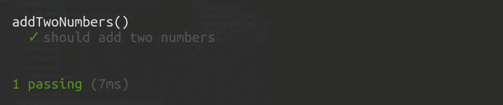

# Node.js 测试速成班

> 原文：<https://medium.com/hackernoon/a-crash-course-on-testing-with-node-js-6c7428d3da02>


JavaScript 是一种美丽的语言。你一定认为我疯了。也许你疯了才会同意我。但是我为什么要说这样的话呢？作为一种语言，JavaScript 不提供任何支持。如果你给它一点点机会，它就会咬你的头，如果不处理，它会有奇怪的错误信息。所以你告诉我，它为什么美丽？

因为它创造了优秀的、负责任的、聪明的开发人员。通过担心被最小的错误弄得头破血流，你适应并克服了。获得的技能与编程的共同点较少，更多的是与程序员的精神状态有关。因为你已经习惯了没有一种无形的力量引导你通过代码。相反，你依靠你自己，和你自己的技能。因此，我说了一些和上面一样疯狂的话。

那么，为什么这会造就优秀的程序员呢？一个好的程序员是有责任心的，细致的，可靠的。像这样的程序员确保他们的代码工作。不管是哪个环境，还是哪个机器。这些技术大师总是用测试来覆盖代码，以确保他们的工作是有效的。他们受到我最大的尊敬。我愿意相信他们也有你。

# 一步步来。

为了奠定基本测试用例的基础，让我们创建一个简单的函数。

调用这个函数我们可以看到结果是 6。因为我们知道基本的数学，这是完全合理的。但是如果函数真的很复杂呢？

让我们确保编写一个测试用例，以确保该功能无论如何都是有效的。

看到这个了吗？我们定义要添加的值，并创建它们的总和。然后我们调用`addTwoNumbers()`把它赋给另一个变量。完成这些后，我们准备测试等式。我们在期待什么？嗯，`sum1`应该等于`sum2`，如果我们创建的函数按预期工作的话。运行这段代码，您应该会看到命令行中记录了以下内容:

```
addTwoNumbers() should return the sum of its two parameters.
Expect 6 to equal 6.
Passed.
```

祝贺你，你已经编写了你的第一个单元测试！单元测试的行为在于为小代码单元编写测试。因此得名。这意味着您将编写单独的测试用例来验证函数、方法和对象的行为。就像我们上面做的一样。

如果我们故意在代码中添加一个 bug 会怎么样？检查单元测试是否会正常失败。将`addTwoNumbers()`功能改为:

```
function addTwoNumbers(x, y) {
  return x + x; // deliberate bug!
}
```

再次运行单元测试，您会看到它失败了。

```
addTwoNumbers() should return the sum of its two parameters.
Expect 6 to equal 10.
Failed.
```

# 一点理论。

单元测试由三部分组成。

1.  安排
2.  行动
3.  维护

仅从它们的名字就很容易理解它们代表什么。让我们在查看一些代码的同时对其进行分解。

在第一部分，我们**安排**所有必要的先决条件和投入。你可以看到我们定义了要添加的变量，以及这些变量的和。第二步是**对被测试的函数、对象或方法进行**操作。最后，我们**断言**预期的结果已经出现。

你可能会觉得断言这个词有点咄咄逼人。作为一个非英语母语的人，当我第一次听到这个词的时候，我当然知道。不用担心，它只意味着*来认领。你在断言一个真理，意思是你声称某事是真实的。就这么简单。*

> *断言*是一个对程序员错误进行基本的健全性检查的工具。
> 
> — Marijn Haverbeke，[雄辩的 JavaScript](http://eloquentjavascript.net/08_error.html#h_Sb9V3BEus1)

想写自己的论断？你当然知道。看看这个。

在第 1 行，我们实例化了一个名为`assert`的新对象，并立即添加了一个名为`equal`的方法。如果传递的两个参数不相等，该函数将抛出一个错误。就是这样，这就是整个方法的全部逻辑。现在，在第 27 行，我们在 try catch 块中包装了 **assert** 阶段，并调用了`assert.equal()`方法。只有当值不相等时，才会引发错误并在 catch 块中被捕获。否则，执行线程将继续执行，并将`'Passed.'`记录到控制台。去试试吧！

# 我们认真点怎么样？

上面的例子显示了测试的基本原理。还指出了在编程领域取得成功所需的心态。是时候拿出大枪了。您很少会在生产环境中使用上面的代码。然而，这对理解未来是至关重要的。

您可以使用各种工具为生产中的 Node.js 应用程序编写测试。内置的断言库就是一个例子。是的，Node 确实内置了断言。只改 1 号线。

通过为内置节点模块更改我们的自定义 assert 对象，我们的代码工作起来完全一样。Node 中的默认断言非常强大，您可以在这里花更长的时间查看它们。

然而，像[摩卡](https://mochajs.org/)和[柴](http://chaijs.com/)这样的工具是测试 Node.js 应用程序的主要工具。

> **Mocha** 是一个功能丰富的 JavaScript 测试框架，运行在 [Node.js](http://nodejs.org/) 和浏览器中，让异步测试*变得简单*和*有趣*。Mocha 测试连续运行，允许灵活和准确的报告，同时将未捕获的异常映射到正确的测试用例。
> —mochajs.org
> 
> **Chai** 是一个用于[节点](http://nodejs.org/)和浏览器的 BDD / TDD 断言库，可以愉快地与任何 javascript 测试框架配对。
> —chaijs.com

我们来看看这个。首先，您需要通过将一个新的节点项目挂接到 npm 来初始化它。

在您选择的目录中打开一个终端窗口，并运行:

```
npm init
```

请按照所有提示随意输入。完成后，您需要安装所需的模块。

```
npm install --save-dev mocha chai
```

现在，您可以打开您选择的代码编辑器，开始添加文件，如下所示:

```
> test
  - test.js
- addTwoNumbers.js
```

一个*测试*目录下有一个 *test.js* 文件，另一个名为 *addTwoNumbers.js* 的文件在该目录的根目录下。继续将`addTwoNumbers`函数粘贴到 *addTwoNumbers.js* 文件中，如下所示:

不要忘记导出它，以便以后需要它。现在我们可以开始有趣的部分了。打开 *test.js* ，开始为我们的测试打基础。

在文件的开头我们需要同时要求 *Chai* 和 *addTwoNumbers* 。看我们要求*柴*的方式，只抓**指望**。Chai 提供了三种创建断言的接口。都是有效的。你选择哪一个只是偏好。我觉得`expect`很适合我。不要被测试语法搞糊涂了。它是用来模拟自然的人类语言模式的。`describe`模块创建了一个测试环境。`it`模块定义了需要通过的测试用例。大声读出来听起来不错。形容`addTwoNumbers()`，应该加上两个数字。很有道理！现在你能明白为什么除了确保代码工作之外，测试也很重要了吗？测试本身就是文档。写一个测试将解释代码做什么。从事代码基础工作的其他开发人员很快就会理解它。

剩下的就是做测试了。在你的*包. json* 的脚本部分添加`"test": "mocha"`，你就可以开始了！

> **提示**，你的 **package.json** 应该是这样的:

跳回你的终端窗口并运行`npm test`。你会看到一个很棒的界面，上面有一些绿色的文字，说明有一个测试通过了！



# 接受这一切。

您现在已经体验了用测试覆盖代码的自然过程。所有的例子都展示了单元测试，这已经足够了。当你熟悉这些概念时，理解集成和端到端测试就像在公园散步一样容易。但这是另一篇文章的主题。

我强烈建议您继续使用这些测试工具。尝试将它们包含到您现有的开发过程中。你会看到代码质量和心理健康的整体改善。相信我，拥有一个完全绿色的测试套件对放松神经有奇效。

如果你想看看我们上面写的所有代码，[这里是库](https://github.com/adnanrahic/a-crash-course-on-testing-with-nodejs)。或者如果你想看我最新的文章，请到这里来。

[](https://medium.com/@adnanrahic/latest) [## 阿德南·拉希奇写的最新故事

### 阅读 Adnan Rahi 在 Medium 上写的最新故事。软件工程师@bookvar_co .编码教育家@ACADEMY387…

medium.com](https://medium.com/@adnanrahic/latest) 

*希望你们喜欢读这篇文章，就像我喜欢写这篇文章一样。*
*你觉得这个教程会对某人有帮助吗？不要犹豫分享。如果你喜欢它，点击下面的* ***拍手*** *，这样其他人会在媒体上看到它。*