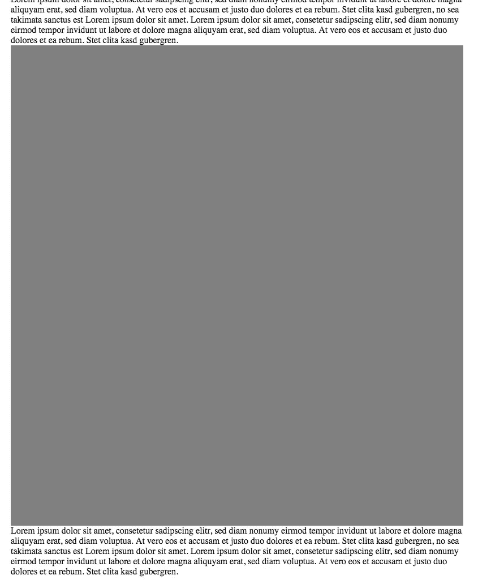
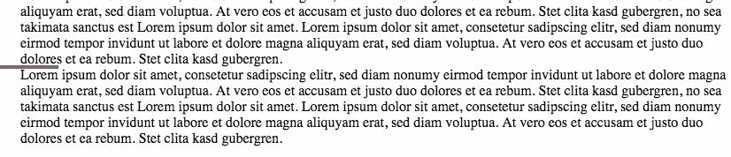
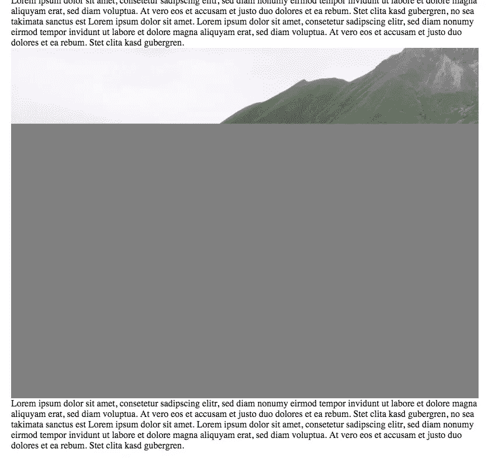

# HTML5 的响应图像实现缺少一种处理纵横比的方法

> 原文：<https://medium.com/hackernoon/a-crucial-feature-that-html5s-responsive-image-implementation-is-still-missing-9f7b21f8c988>

## HTML5 的 responsive image 实现提供了一个极好的工具来解决大量图片网站的性能问题。但是仍然缺少一个关键的特征。

*最初发表于***。**

*如果你不知道响应图像是如何工作的，我推荐你阅读 Eric Portis 在 Smashing Magazine 上的文章，因为我不会详细讨论其中的机制。*

*但是，要提醒您的是，一个简单的标记应该是这样的:*

*在当前的语法中，我们只在宽度上定义了我们的[图像](https://hackernoon.com/tagged/image)约束。这基本上没问题，因为大多数布局都受到网站宽度或设备宽度的限制。事实上，这就是我们在 CSS 中制作响应图像的方式:*

*`img { width: 100%; height: auto; }`*

*但是等等，难道没有一个好的理由来定义一个图像的绝对高度吗？是啊！这一切都归结于网页的渲染。当浏览器加载图片时，它还不知道图片的尺寸。然而，在许多情况下，由于图像没有被[渲染阻塞](http://fabianstiehle.com/render-path)，网站的其余部分已经被渲染，而图像仍然在加载。*

**

*A normal none responsive image with fixed width and height and a grey background set via CSS. The image is not yet loaded.*

*在这个阶段，浏览器知道图像的两件事:`width: 100%;`和`height: auto;`。浏览器可以计算宽度，因为它知道父容器的宽度。然而，高度是相对于图像的宽高比而言的，只有当图像被加载后，浏览器才能知道。目前，浏览器必须猜测高度，但它总是会出错。(Firefox guess 是方形格式，chrome 将初始高度设为 0px)。一旦浏览器知道了图像的实际高度，它就必须重新绘制它。这种重绘通常会强制重绘一堆其他元素。你可能在坏消息网站上注意到了这一点，你已经在阅读一篇文章，突然所有的文字开始跳跃。*

**

*A responsive image with variable height in chrome. I marked the position of the image in red. Chrome sets the initial height to zero.*

**

*The image pushes the text to the bottom once it’s loaded.*

*有一个基于容器宽度和长宽比设置图像高度的巧妙技巧。但是这是一项相当大的投资，因为它需要你自己计算长宽比，并把它注入到 HTML 标记中。*

# *如何解决这个问题？*

*早在 2014 年就有[讨论解决这个](https://github.com/ResponsiveImagesCG/picture-element/issues/85)[问题](https://lists.w3.org/Archives/Public/www-style/2016Jun/0072.html)。看起来一个额外的基于身高的值可能最终会到来。*

*`srcset="https://via.placeholder.com/150x100 150w 100h`*

*但是这能解决我们刚刚讨论的纵横比问题吗？我们将不得不看看。如果你想帮助推动事情的发展，你可以看看 GitHub 上的讨论。这个问题受到的关注越多越好。*

**原载于*[*fabianstiehle.com*](http://fabianstiehle.com/HTML5s-missing-responsive-images-feature)*。**