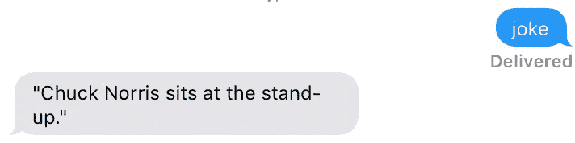

# 一个简陋的 iMessage API

> 原文：<https://medium.com/hackernoon/a-crude-imessage-api-efed29598e61>

如果你家里有一台 Mac 电脑(像我一样，它运行 [Kodi](http://kodi.tv) 并连接到我的电视上)，你也可以**利用它以不同的方式控制或查询你的家。**

作为一名 [iPhone](https://hackernoon.com/tagged/iphone) 用户，我认为能够使用 iMessages 向我的房子发送和接收命令会很棒，无论我是在家还是在其他地方。



Asking my Mac for a joke, it responds

因此，为了限制本文的范围，我将实现一个非常简单的笑话机器人。

首先，让我们编写一个由 [AppleScript](https://hackernoon.com/tagged/applescript) 支持的 shell 脚本，它允许我们发送消息。我们需要这样做，因为苹果不提供开放的 API。

让我们为“信息”创建一个实际的 AppleScript 处理程序。app:

这个脚本需要放在您的*~/Library/Application Scripts/com . apple . ichat*文件夹中。

要安装处理程序，打开 Messages.app，转到*首选项>常规*并选择 *MessageReceive.script* 文件。

现在—收到信息后，Messages.app 会将信息发送到 AppleScript 接收处理程序。

最后，由于 *MessageReceive.script* 只是调用 shell 脚本*~/bin/message receive . sh*，我们也必须创建它:

```
#!/bin/bash# Set shell options
shopt -s nocasematchsender=`echo ${1} | cut -d ':' -f 2`
read linesendChuckNorrisJoke() {
    message=$(curl -s "[http://api.icndb.com/jokes/random](http://api.icndb.com/jokes/random)" | python -mjson.tool | grep '\"joke\"' \
        | cut -d : -f 2 | sed 's/&quot;/\"/g')
    ${HOME}/bin/SendMessage.sh "${sender}" "${message}"
}if [[ $line =~ "joke" ]]; then
    sendChuckNorrisJoke
    exit 0
fimessage="I do not understand what you mean."
${HOME}/bin/SendMessage.sh "${sender}" "${message}"
```

上面的脚本只是一个只适用于 Chuck Norris 笑话数据库的黑客。

这个概念应该很清楚，也就是说，你可以用任何类型的脚本来替换它，比如你自己的人工智能机器人，或者开关灯。

[](http://bit.ly/HackernoonFB)[](https://goo.gl/k7XYbx)[](https://goo.gl/4ofytp)

> [黑客中午](http://bit.ly/Hackernoon)是黑客如何开始他们的下午。我们是 T21 家庭的一员。我们现在[接受投稿](http://bit.ly/hackernoonsubmission)并乐意[讨论广告&赞助](mailto:partners@amipublications.com)机会。
> 
> 如果你喜欢这个故事，我们推荐你阅读我们的[最新科技故事](http://bit.ly/hackernoonlatestt)和[趋势科技故事](https://hackernoon.com/trending)。直到下一次，不要把世界的现实想当然！

[](https://goo.gl/Ahtev1)