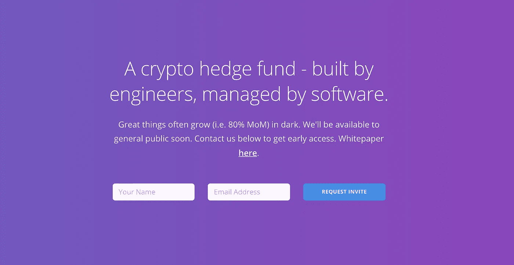

# 秘密对冲基金

> 原文：<https://medium.com/hackernoon/a-crypto-hedge-fund-b1d2e93a703>

## 区块链理念

## 走过一个加密对冲基金的发展。

这个故事最初出现在 Unmade *的* [*节目中，在那里我每周都会分享一个来自未来的科技商业创意。*](https://unmade.email/editions/crypto-hedge-fund)

我认为自己是区块链的坚定拥护者之一。我是《区块链协议》的支持者，不仅仅是加密货币及其不断飙升的美元价值的支持者。加密货币在区块链世界是不可避免的。它们是促使节点工作并形成网络的激励因素。没有他们，就没有区块链。

> 加密货币对于区块链就像燃料对于你的汽车一样重要。

因此，无论我们如何给区块链贴上未来科技的标签，它也是一个另类经济体。哪里有经济，哪里就有交易者和投资者。哪里有投资者，哪里就有对冲基金的机会。

# 加密对冲基金

> “风险来自于不知道自己在做什么。”—沃伦·巴菲特

**整个加密生态系统正处于其**婴儿期，且易变。但是，只有在短期内观察单个加密资产，才能注意到波动性。从长远来看，整个密码市场可以被视为一直在增长。这个市场的这一特点使得建立对冲基金的时机已经成熟。

对于投资者来说，最好的策略是投资大量加密资产(从而对冲风险)，并激烈交易以转换利润的波动性。但是并不是每个人都能做到，因为对个人来说，这简直是工作量太大了。这使得它成为一个巨大的投资者市场，这些投资者希望自己的钱被投资，但没有足够的时间和资源来独自完成这项工作。此外，每一枚硬币或代币都需要安全地存放在钱包里。加起来就是头疼。

对冲基金会吸引成千上万这样的投资者。

# 通过令牌信任

> "对无辜者的信任是骗子最有用的工具."—斯蒂芬·金

**与股票市场的对冲基金不同，**加密对冲基金可以完全透明，通过代币提供信任。代币将是代表基础基金总价值的代表性代币，使得:

`Value of a token = Total value of the fund / Number of tokens in supply`

考虑一个开放式基金，每次有人把他们的钱投资到基金中，新的代币就会产生以维持代币的当前价值。

`New tokens to be created = Amount invested / Value of a token`

每次，有人返回他们的代币以换取利润，代币将被销毁，基金的钱将被归还。

`Amount to be returned = Value of a token * Number of tokens returned`

我已经过度简化了公式，当然，你可以投入一些费用(入场费或出场费，或者两者都有)来弥补基金的收入。

我试图提出的核心观点是，在加密资产领域可以存在一只对冲基金，它可以通过代币传递信任和透明度。

# 黑仔优势？

> "通往利润的道路布满了不公平的优势."—刘易斯·霍维斯

在传统世界中，每一个成功的对冲基金都基于只有他们自己才能获得的独特见解。这可能是一种更好的交易方式，也可能是获得一些内幕信息或其他完全不同的东西。

> 如果你在市场上没有什么特别的东西，你可能会活下来，但你是为了繁荣，而不仅仅是为了生存。

对冲基金必须拥有别人没有的不公平优势。优势越不公平，基金就越有利可图。

对于加密资产的世界，我有一个想法。加密资产在一个方面不同于传统股票，这就是它们可以通过向区块链贡献工作来凭空产生。

我预测，这个市场上的大多数对冲基金也将由金融专家建立，他们将是交易的巨兽。因为区块链非常透明和分散，所以获得内幕信息的范围非常小，因为不会有太多内幕信息。这些对冲基金大多会错过的，是对它们来说最陌生的部分。这将是他们会完全忽略的一部分，即加密资产也可以作为奖励获得。

# 可挖掘的对冲基金

> “在奖励之前必须有劳动。你在收获之前先播种。你在收获欢乐之前，先在泪水中播种。”拉尔夫·兰森

**一家对冲基金以某种方式找到了如何利用加密资产的采矿部分的方法，将会比其他基金拥有明显的不公平优势。不应该做什么？建立大型采矿农场。建立这样的农场成本很高，你将不再是一个对冲基金。**

可能要做的是，有一种方法可以创建一个移动和计算机设备的全球网络。这个由大量设备组成的网络将设备聚集在不同的组中，并全天挖掘不同的加密资产。几乎每台笔记本电脑都处于闲置状态，至少会耗电几个小时。几乎每部手机都要插上电源充电一整夜。如果电力可以被用来开采一些加密资产(不管有多小)并用来交换对冲基金的代币会怎么样？否则能量会被浪费掉。

这不是为了盈利而开采加密货币。它是通过将闲置的电力投资于加密资产来最大限度地减少浪费。

能够进行智能切换、能够协调网络中的每个节点以产生最大回报的软件可能成为不公平优势。

# 上帝

这个想法让我夜不能寐。我花了无数时间来完善它的经济学。随着时间的推移，我对这个想法非常感兴趣，最近我开始和一个团队一起追求这个想法。

有了这个想法，我还想邀请大家对我们的事业提出反馈意见。

如果你们中的一些人也想继续这个想法，我会很高兴。创意是廉价的。执行死刑的人是无价的。或者也许，合力？请在**mohit【at】god token【dot】org**上给我写信。

> 创意是廉价的。执行死刑的人是无价的。

—

***关于作者***

[https://twitter.com/mohitmamoria](https://twitter.com/mohitmamoria)

*莫希特·马莫里亚是*[***【godtoken.org】***](https://godtoken.org)*的首席执行官，也是一份每周时事通讯的编辑，*[*un made*](https://unmade.email)*，它将一个来自未来的创业想法发送到你的收件箱里。*

他定期为世界上最大的出版物撰稿，包括 HackerNoon、TechCrunch、TheNextWeb、CoinTelegraph 等。

*有反馈吗？在推特上做朋友***。**