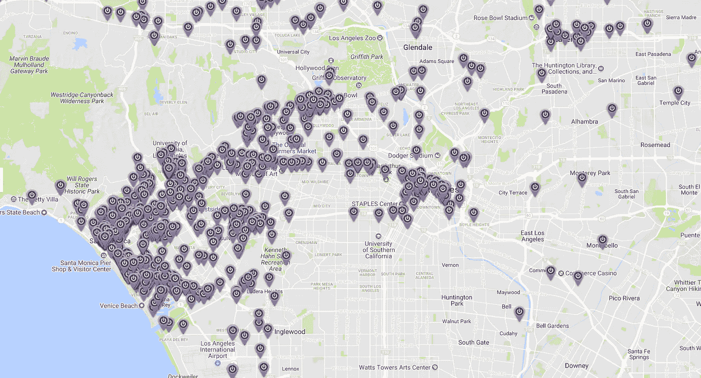

# 洛杉矶一家初创公司的首席技术官实习项目

> 原文：<https://medium.com/hackernoon/a-ctos-internship-program-out-of-a-los-angeles-startup-d3dc8e1d0810>

Los Angeles Startup Scene

1999 年，当我还是大学二年级学生的时候，我得到了一个彻底改变我人生轨迹的机会。我遇到了 Kaoru Hayashi，他是东京一家名为 Digital Garage 的科技初创公司(现在是日本的一家上市公司)的首席执行官和联合创始人，他邀请我在他位于东京的初创公司实习三个月。直到今天，我仍然珍惜那次实习经历的每一刻——第一次学习如何用 Python 和 Zope 编程，接触开源技术，支持富士摇滚音乐会的现场网络报道，与酷的东京青少年一起闲逛等等。如果我没有参加这次实习，今天我可能会坐在一个小隔间里，而不是经营一家创业公司。回想起来，这绝对是我永远不会用任何东西来交换的东西。

如今，作为一家金融服务初创公司的首席技术官，我正在通过 Camino Financial 的工程实习项目复制这一经历。在洛杉矶，来自各行各业的人才济济一堂。这里还有一个健康的科技创业生态系统:一个由当地风险投资家和附近世界一流大学组成的巨大网络。这些年轻人才缺少的是一个在现实世界职业环境中证明自己的机会。我想专门为很少或没有计算机科学背景的年轻人创建一个实习项目。这个想法是让他们接触真实世界的软件项目，同时完成涵盖主要计算机科学主题的严格课程。最好的部分是这是**一个带薪实习项目**，这样实习生可以赚些钱并获得经验，同时获得乐趣和学习新技能。

*到目前为止，我们在这方面取得了一些成功，这就是我们如何破解代码的。*

# 我们实习生的理想侧写

Training to become a programming jedi!

我们向所有热爱编码和软件的人敞开大门。经验是次要的，也不是必须的，但绝对是最好的。我们寻求的另一件事是对应用技术解决借贷领域问题的深刻理解。在初创公司，开放的思维和在压力下工作的能力是我们寻找的一些重要品质。

# **招聘启动**

Programmers delight

当我们在网上发布我们的第一个暑期实习项目时，我们收到了很多来自加州学生的回复。大多数申请人来自洛杉矶附近，但也有相当多的人住在州外。收到压倒性数量的回应当然令人兴奋，但筛选这么多申请人并不容易。我们首先通过电话筛选出合适的人选，如果他们看起来不错，我们会给他们发送编程任务。这些任务非常简单，可以测试申请者对 Python、Django 和 Git 的理解。尽管任务本身并不难，但许多应用程序并没有在规定的时间内完成任务。在某种程度上，这是可行的，因为它节省了我们接触真正有动力的人的大量时间。

然后我们邀请这些候选人到我们的办公室进行面对面的面试。有时，我们会给候选人更多的编程任务，其他时候我们会尽量让候选人与我们的全职员工见面。接下来将是一个模仿《美国达人》或《美国偶像》的内部选拔过程——一个讨论(有时是辩论)和投票过程，然后选出一名实习生。一旦做出决定，候选人通常会在两周内开始实习计划。

说来有趣，我们一路上遇到了一些非常有趣的候选人。有些人开始时非常热情，但一看到任务就消失了。有些人试图完成任务，但很难完成——并给出了一大堆无法完成的理由(例如，汽车、公寓、搬家、朋友、家人等方面的问题)。在任务中表现出色的人并不一定意味着他们会在面对面的面试中表现出色。不合格的主要原因是化学成分不匹配。我们有一个应聘者进来了，但在简历上撒了谎。那肯定留下了不好的印象。

# 平衡工作和学习的实习生

我们计划的执行重点是为我们的实习生提供在职培训，同时实习生参加知名大学的计算机科学在线课程。在一个典型的星期里，一个实习生会参与我们的 sprints，做实际项目中的任务。他们将与我们的全职员工密切合作，熟悉我们的技术体系和流程。除此之外，我们还会安排去参加科技会议/培训，并参观该地区的其他科技公司。除了办公室工作，他们会按照自己的进度完成指定的在线课程。这是一个荣誉系统，所以不需要提交作业。然而，我们会定期举行简短的期中和期末考试，看看我们的实习生是否吸收了材料。总而言之，这是一个相当繁忙的时间表！

另一方面，该计划背后的理念是实际测试那些走进我们大门的人的极限。创业环境绝对不适合每个人，我们需要知道候选人是否适合。我们采用了一些非常规的方法:我们将允许实习生访问生产系统，并让他们负责实时部署。当虫子变得猖獗时，我们也会把它们扔进滚烫的火里。我们还允许他们与我们的第三方供应商联系，以跟进问题。我们还会给他们自由选择他们喜欢的工具来解决手头的问题。最重要的是，我们让候选人对他们在公司的工作质量负责。不用说，我们会相应地赞扬和谴责。

# 实习项目的挑战

我们项目的最大风险是从一开始就确定一个合适的候选人。这基本上是基于最初的互动，如测试、面试等，对性格和天赋潜力的判断。然而，这并不总是容易的，所以这里需要一点运气。

另一个主要挑战是我们的实习生在创业环境中承受压力的能力。每周都有一些事情。我不记得有一个星期没有任何生产或 IT 问题。此外，员工问题也很难处理。实习生自己也有私事要处理。所有事情同时发生会让人不知所措，让人半途而废。

节目持续时间也是一个重要的考虑因素。时间太短——你的初创公司可能会过早地让没有经验的人全职工作。太久——你的实习生可能会在别处找到机会。找到合适的持续时间是反复试验的结果。这在很大程度上取决于初创公司和奖励结构本身。

与时长相关的是节目内容本身。我通常会根据实习生的兴趣和经验量身定制指定的课程。然而，有时工作中的软件项目会让我们的实习生完全不知所措。以我的经验来看，这可能并不理想，因为它剥夺了一个实习生建立长期成长所急需的基础的时间。同样启发式地，一个呼吸多于深度的项目可能对所有人都更有益。

# 实习生毕业及以后

当我们的第一个实习生毕业时，我们聊了聊。

"你通过实习项目学到了什么？"我问。

“你知道……写软件，学算法，还有——”他回答。

“我的意思是哲学上你学到了什么？”我打断了。

他停顿了很长时间，想了很多。

“人有情绪。项目会变得艰难。就我个人而言，我也有很多事情要做...这是苦中带甜，但我很高兴我做到了，”他说。

在我的眼前，看到一个没有经验的候选人转变成一个非常有能力的工程部门的员工，这是令人惊讶的。当场，我们给了一个全职职位的机会。不到两天，他就接受了这份工作，对于这个机会，他感到无比的感激和兴奋。

这再次证实了我的信念，即人才是可以培养的——你只需要努力寻找，并确保他们通过严格的实习计划。

*请访问我的* [*博客*](https://obicho.github.io/) *获取更多发表的文章和演讲。*