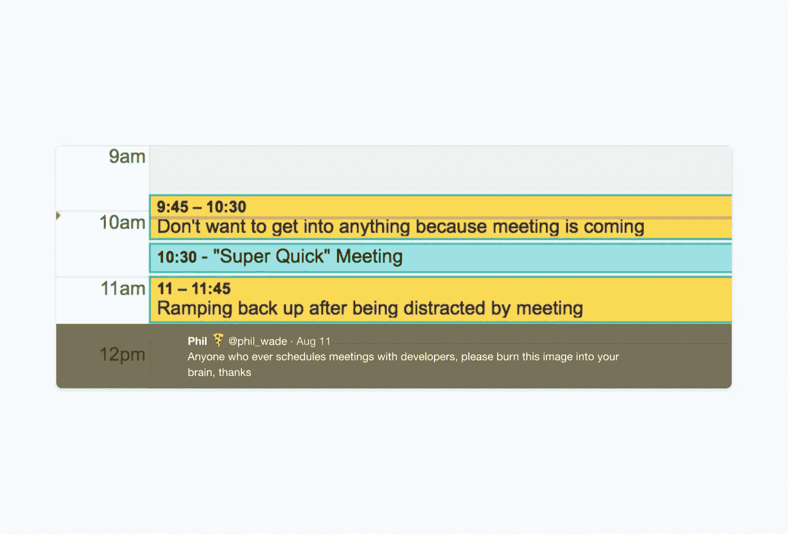

# 我有时会犯的一个危险的错误是用最危险的写作应用程序写出来的

> 原文：<https://medium.com/hackernoon/a-dangerous-mistake-i-sometimes-make-written-using-the-most-dangerous-writing-app-e92866c53390>

(image from [an awesome Tweet of Phil Wade](https://twitter.com/phil_wade/status/896010517617180672))

我有时会犯的一个危险的错误是用最危险的写作应用程序写出来的

我希望你有一个愉快的夏天。我正在用[我](http://www.themostdangerouswritingapp.com/)[在产品搜索](https://www.producthunt.com/posts/the-most-dangerous-writing-app)上发现的最危险的写作 app 写这篇文章。

很简单。如果我停止写作超过 5 秒钟，我会丢失我写的所有东西，并且无法恢复。它旨在关闭我内心的编辑器，让我自由地写作。很好玩但是压力很大。写这个的时候已经三次内容丢失了！5 秒钟的休息时间不算多，试试吧！

这是我一直犯的错误。

当你设计一个产品时，你有一个产品设计团队和一个开发团队。

您经常过早地将设计发送给开发团队。他们开始编码，甚至可能完成它。然后你意识到你需要改变一个交互或者你忘记了一些你应该设计的重要的东西。也许他们花了一周的时间编写前一个特性，有时你要求的更改比原计划花了两倍(或更多)的时间。

我经常犯这样的错误，也听说很多创业公司也是如此。

我很感激我的开发团队拒绝开始编写他们认为没有考虑到所有必要细节的东西。在开始任何编码之前，我们将回到设计，考虑所有不同的场景和细节。这是避免浪费时间和沮丧的唯一方法。

你犯了哪些我应该吸取教训的错误？在评论中讨论。

附言

-如果您还没有参加 2018 年 5 月 23 日至 24 日在巴黎举行的年度活动 Leade.rs，请保留日期。这将是我们的第三次。

-我的朋友 Ryan Holmes，Hootsuite 的创始人，写了一本很酷的新书[价值 40 亿美元的推文](https://www.amazon.com/4-Billion-Dollar-Tweet/dp/0692846719)。

像这样？订阅[我的每周简讯](http://leade.rs/loicnewsletter)。