# 照片中没有移民的一天

> 原文：<https://medium.com/hackernoon/a-day-without-immigrants-in-photos-f873f257aa83>

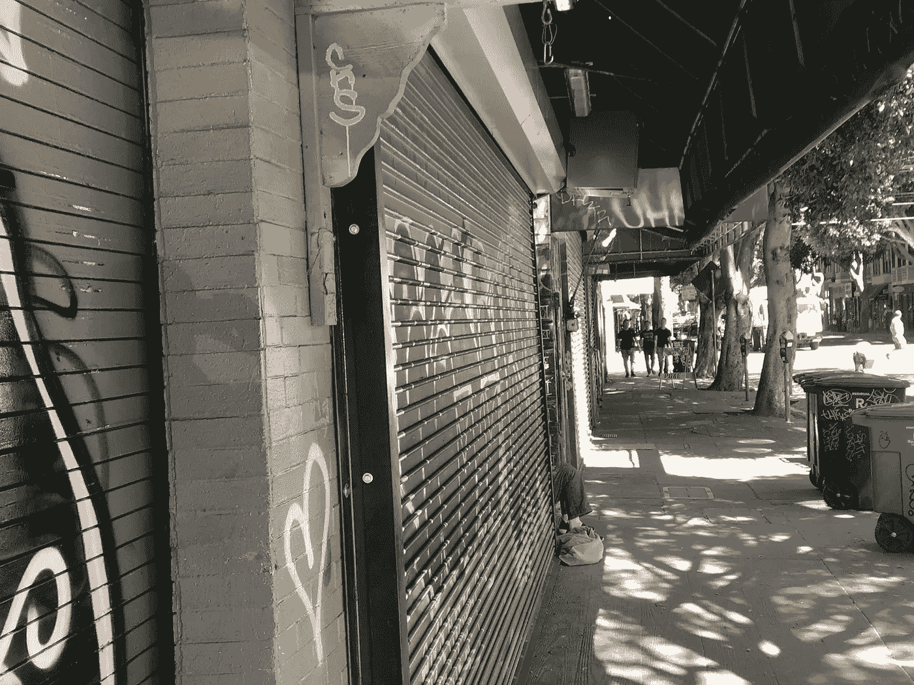

今天，旧金山教区的一幕让我不寒而栗。这是它看起来的样子，在照片中…有一个令人惊讶的结局。

便利店:

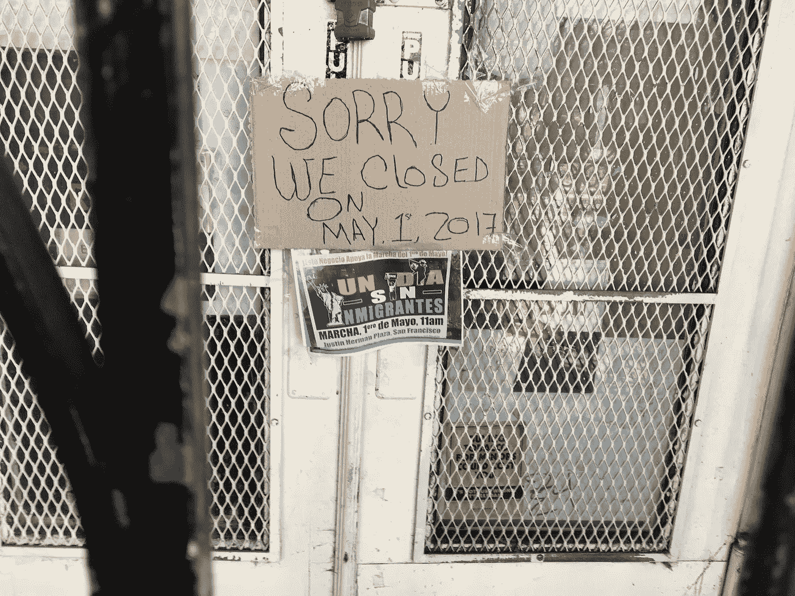

披萨店:

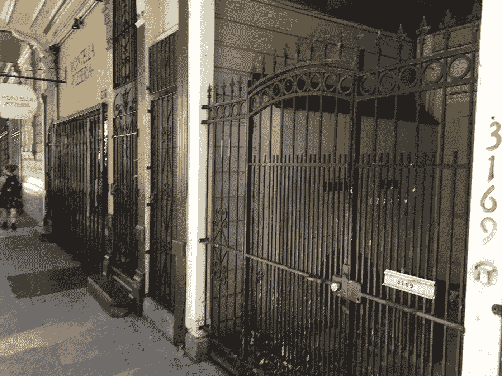

一家餐馆和一家书店:

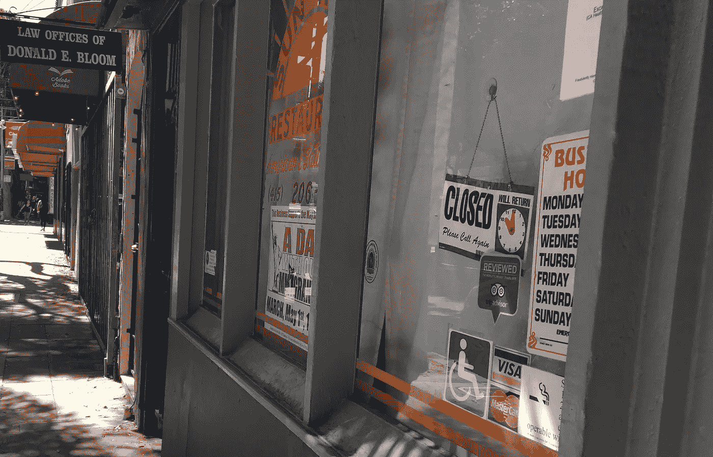

面包店:

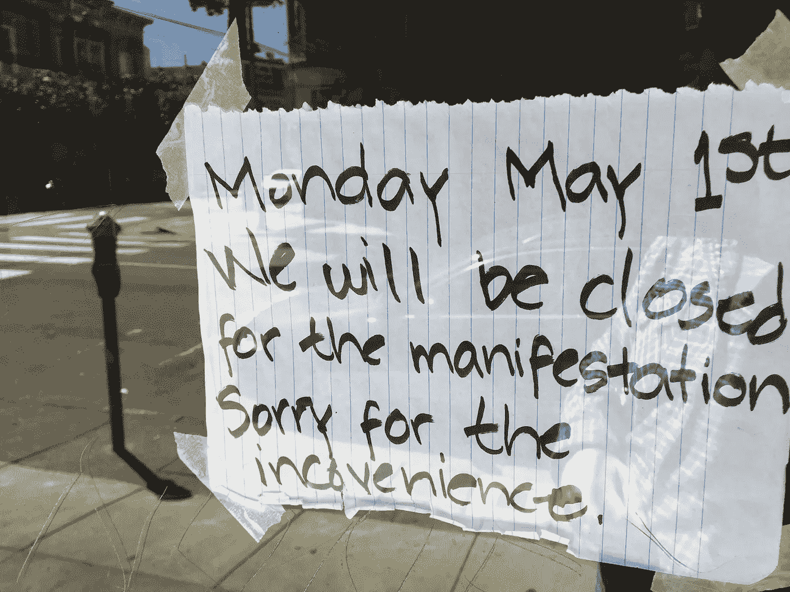

鸡腿:

酒吧和烧烤店:

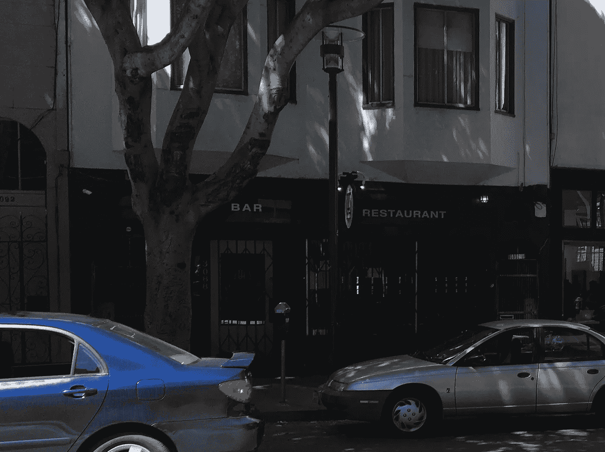

滑板商店:

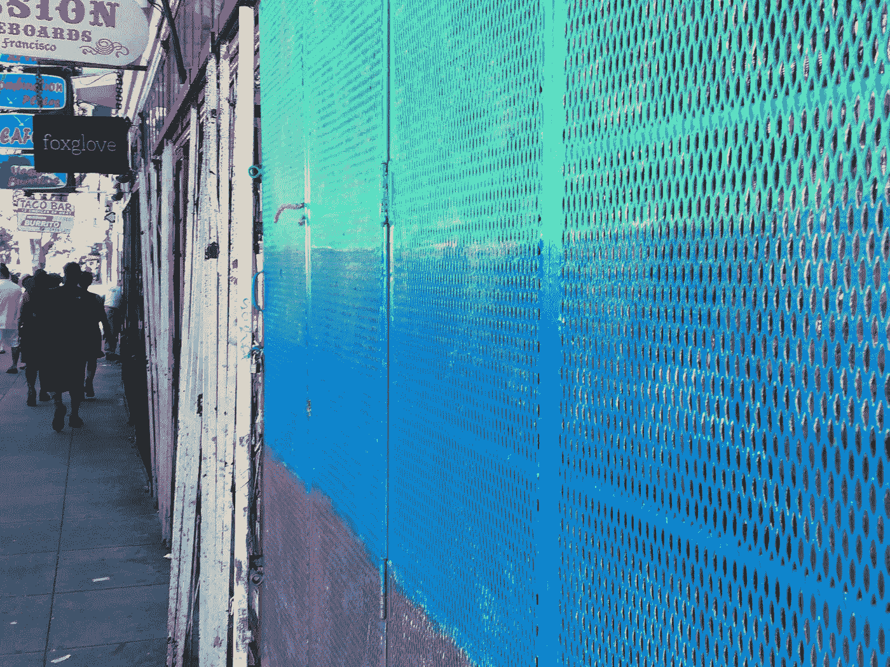

一个塔克利亚:

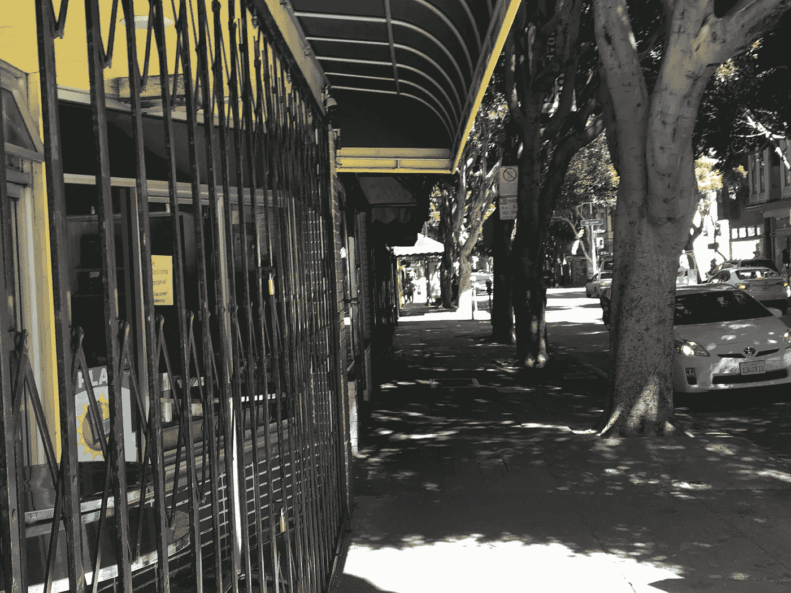

咖啡店:

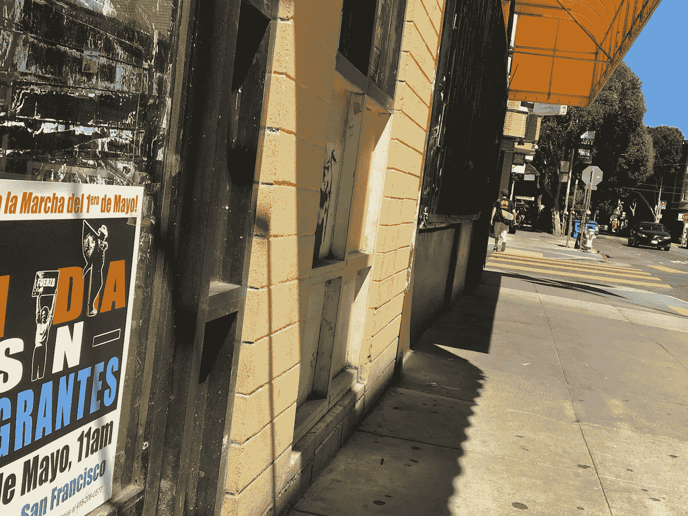

农产品市场:

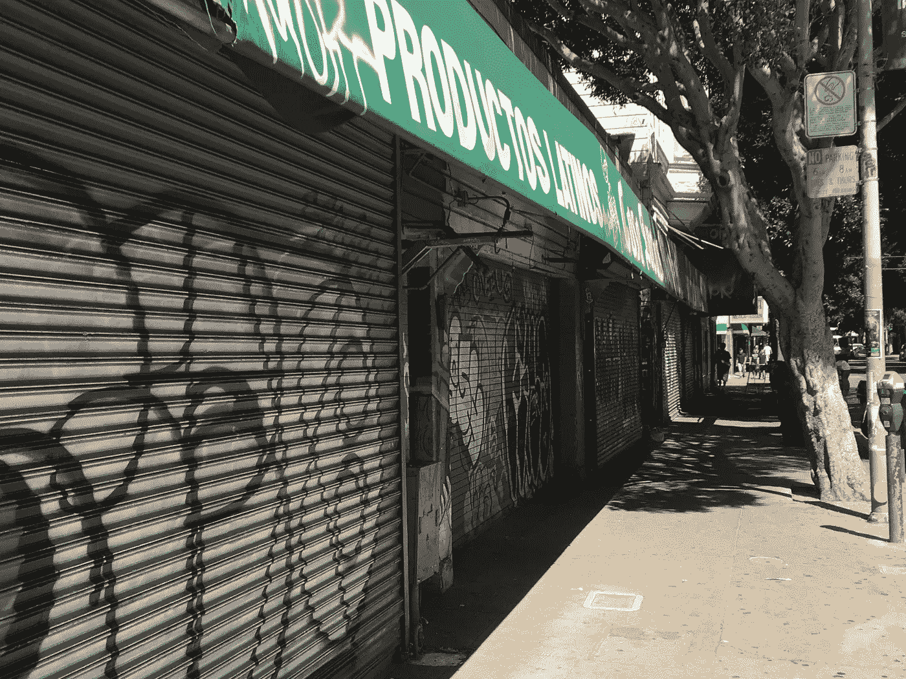

一家餐馆:

我的办公室:

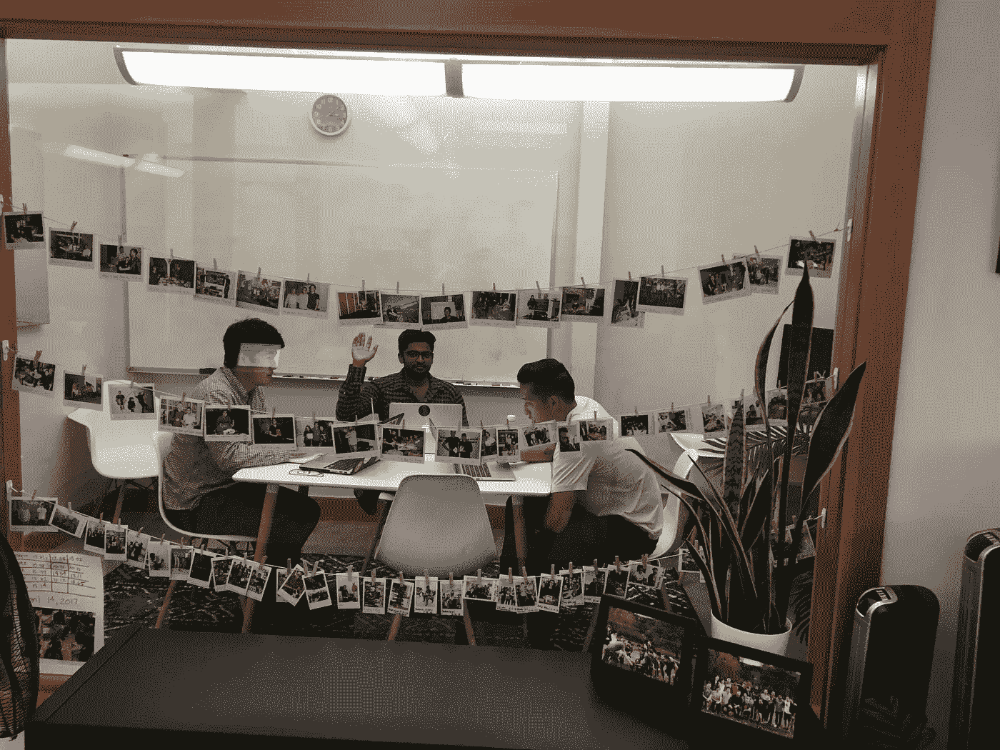

上面的照片是我的公司 [TINT](http://tintup.com) 的三位联合创始人的抓拍。首席执行官蒂姆是台湾和泰国移民的孩子。Ryo 出生在日本，Nik(中间那个毁了我偷拍照片的家伙)来自印度。

没有他们，我就不会有高薪的技术工作。

## 令人惊讶的结局

我答应给这篇文章一个惊喜的结局。在一天结束的时候，当我感觉有点沮丧的时候，我妈妈给我发了这两张照片。

我的妹夫，出生在土耳其的奥尔罕，今天收到了他的美国国籍！恭喜你，欢迎你，奥尔罕！

News outlets: download [high quality images](http://filefoundation.com/share/withoutimmigrants.zip) here. I grant them to public domain under the [CC0 license](https://wiki.creativecommons.org/wiki/CC0) (except the pics of my brother-in-law and sister)! You can reach me for comment at the contact form at the bottom of [this page](https://www.fogcitylearning.com/).

如果你和我一样欣赏生活中的移民，请💚和分享。这些照片被看到是很重要的。

> [黑客中午](http://bit.ly/Hackernoon)是黑客如何开始他们的下午。我们是 [@AMI](http://bit.ly/atAMIatAMI) 家庭的一员。我们现在[接受投稿](http://bit.ly/hackernoonsubmission)并乐意[讨论广告&赞助](mailto:partners@amipublications.com)机会。
> 
> 如果你喜欢这个故事，我们推荐你阅读我们的[最新科技故事](http://bit.ly/hackernoonlatestt)和[趋势科技故事](https://hackernoon.com/trending)。直到下一次，不要把世界的现实想当然！

