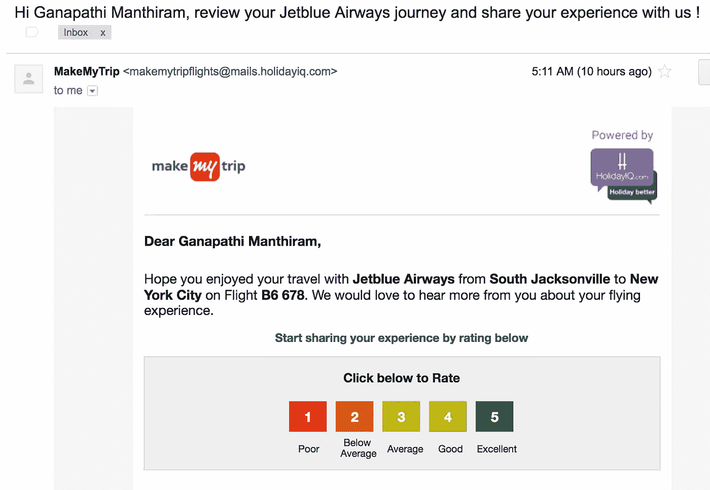
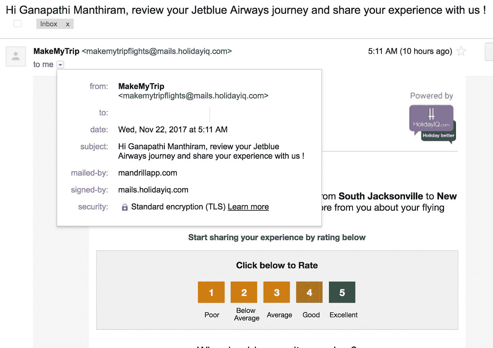
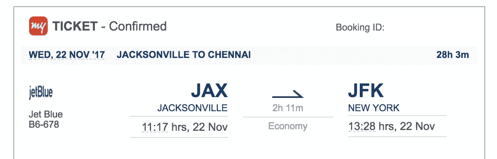

# 由#MakeMyTrip 引发的缺陷(可能会影响)

> 原文：<https://medium.com/hackernoon/a-defect-might-affect-blown-by-makemytrip-295d9db43e68>

我开发[软件](https://hackernoon.com/tagged/software)已经很长时间了。我总是坚持对软件解决方案采用系统化的方法。我仍然与[争论，让](https://hackernoon.com/tagged/making)确保软件没有缺陷，不会直接影响人们的生活。一个小小的软件缺陷可能会影响人们内心的平静。这对软件、产品涉众或技术团队都没有好处。

海文说了我的哲学；我今天有一次经历，一个错误的软件通知让我的生活糟糕了 3 分钟。它只延伸到 3 分钟的程度，但可以解释下面更详细讨论的场景。

在美国出差后，我将返回印度。我的航班是从佛罗里达州杰克逊维尔到纽约，纽约到钦奈。我早就在“ [MakeMyTrip](http://www.makemytrip.com) ”预定了机票今天早上我必须去机场赶飞机，乘坐美国东部时间上午 11:17 从杰克逊维尔飞往纽约的捷蓝航空公司的飞机。

我昨天已经准备好了行李，很高兴三周后回到印度，很高兴见到我的家人和朋友。所有人都在早上 5:30 设置了闹钟，并在做好所有准备后平静地上床睡觉。

我在早上 5:30 被闹钟叫醒，第一件事就是(像往常一样)开始检查我的电子邮件。你知道吗…一个小小的…不，那时还不算小…一个大大的惊喜在我的电子邮件里等着我。请在下面寻找邮件…

我的航班预定在上午 11:30，但是我收到了一封来自“ [MakeMyTrip](http://www.makemytrip.com) ”的电子邮件，询问我从 JAX 到纽约之行的反馈。你可以想象接下来几分钟我的思维过程…我确定我知道航班是在上午 11:30，但是这封不合适的邮件让我恐慌了一会儿。

一切都好。 ***邮件可能是软件通知/反馈模块的一个微小 bug。但是你可以看到它如何在清晨影响一个人。这一事件将成为我将来谈论软件开发中的“缺陷/bug”时谈论的一个案例。希望“ [MakeMyTrip](http://www.makemytrip.com) ”能尽快修好。***

**感谢您抽出时间阅读本文！:)**

***所有“人”的长相都是为了“激励”&“欣赏”。如果你喜欢读这篇文章，请点击下面的“鼓掌”按钮||我会为你写更多的文章，这对阅读这篇文章的读者来说意义重大。***

*作者是 Agira Technologies (#agiratech，***)首席执行官加纳帕蒂·M。**

***对我说“嘿”…***

*[**Quora**](https://www.quora.com/profile/Ganapathi-Manthiram)**|**[**LinkedIn**](https://www.linkedin.com/in/ganapathim/)**|**[**脸书**](https://www.facebook.com/agiratechnologies/) **|** [**推特**](https://twitter.com/mganapathi)|[**网站**](http://www.agiratech.com)*

****很想听听你对这个话题的看法和经验……****

****联系我:*** *您或您的公司正在寻找一个有才华的、创新的&手把手的、善于沟通的专家开发/设计团队&概念化帮助* ***构建+扩展您的网络&手机 app*** *？个人(直接)发邮件到****ganapathi@agiratech.com****免费咨询！**

*我很乐意帮助你。*