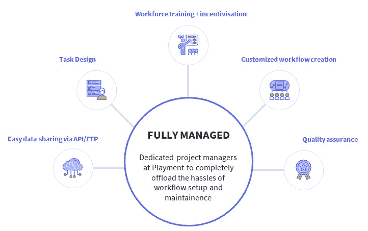

# 为计算机视觉建立训练数据的权威指南

> 原文：<https://medium.com/hackernoon/a-definitive-guide-to-build-training-data-for-computer-vision-1d1d50b4bf07>

像谷歌、微软、亚马逊和脸书这样的科技巨头已经宣布了他们的人工智能优先的产品战略。人工智能效应已经影响了所有企业的产品路线图，这些企业现在每个季度都推出基于人工智能的重要应用程序，以实现业务流程的自动化。具体来说，计算机视觉正在被广泛探索，并在从传统银行到尖端自动驾驶汽车的各个行业得到应用。

令人惊奇不是吗！

但是，简而言之，如何开始实现计算机视觉或 CV 呢？主要步骤如下:

1.  收集大量数据
2.  贴上标签
3.  获取 GPUs 训练 ML 模型需要大量的计算资源
4.  选择一个算法->训练你的模型->测试它->教模型它还不知道的东西
5.  重复上述要点，直到你得到可接受的质量

这 5 个步骤中的每一个都有自己的技术和操作挑战列表。在本文中，我将从第二点(训练数据的标记)开始帮助你。

我已经写了一些你可以开始收集训练数据的方法。这取决于您计划工作的用例。

## 计算机视觉的流行用例:

1.自动驾驶汽车(Waymo、特斯拉、Cruise)——自动驾驶汽车需要识别它前面和后面有什么！)，无论是另一辆车，路标，行人，甚至是追逐梦想的迷途小鸡。

2.无人机——亚马逊希望很快通过无人机给你送货。无人机需要知道它们前面有什么，这样它们才不会撞到鸟或电线。无人机也被军方用于安全监视和侦察行动。

3.地图和卫星(Mapbox，这里是 Orbital Insight)——卫星捕获的图像数据量正在激增！这些数据正被用于识别受飓风影响地区的幸存者，改进地图，甚至根据停车场停放的汽车数量来预测沃尔玛的销售额！

4.机器人——CV 正被用于制造机器人手，可以识别和挑选货架上的物品、工业自动化，甚至踢足球。

5.面向 BFSI 的 OCR 用于信用评级、贷款处理、手写数据转录等的文档转录。

6.医学-在计算机辅助手术中，使用结合了计算机视觉的管理和技术方法的检查表来检测图像中的手术工具是很重要的。

7.农业技术——前日本嵌入式系统设计师 Makoto Koike 开始使用机器学习和深度学习的用例，从而帮助他父母的黄瓜农场，他对按照大小、形状、颜色和其他基本属性对黄瓜进行分类的工作量感到惊讶。

# 收集数据

我前面提到的流程的第一步是收集数据。如果您刚刚开始，有一些很棒的免费和付费标准数据集:

**现有的开放标记数据集储存库:**

1.  [上下文中常见的对象(COCO)](http://mscoco.org/)
2.  [ImageNet](http://image-net.org/)
3.  [谷歌的公开图片](https://github.com/openimages/dataset)
4.  [凯蒂](http://www.cvlibs.net/datasets/kitti/eval_road.php)
5.  [爱丁堡大学信息学院的 CVonline:图像数据库](http://homepages.inf.ed.ac.uk/rbf/CVonline/Imagedbase.htm)
6.  [又一个计算机视觉数据集索引(YACVID)](http://yacvid.hayko.at/)
7.  [mldata.org](http://mldata.org/)
8.  [GitHub 上的 CV 数据集](https://github.com/jbhuang0604/awesome-computer-vision#datasets)
9.  [ComputerVisionOnline.com](http://www.computervisiononline.com/datasets)
10.  [Visualdata.io](http://www.visualdata.io/)
11.  [UCI 机器学习知识库](https://archive.ics.uci.edu/ml/datasets.html)
12.  [Udacity 自动驾驶汽车数据集](https://github.com/udacity/self-driving-car/tree/master/datasets)
13.  [城市景观数据集](https://www.cityscapes-dataset.com/)
14.  [comma . ai 自动驾驶数据集](https://archive.org/details/comma-dataset)
15.  [MNIST 手写数据集](http://yann.lecun.com/exdb/mnist/)

这些数据集为任何想要开始学习 ML 的人提供了一个很好的起点。如果你想为一个附带的项目建立一个简单的模型，它们甚至是有用的。但是对于大多数实际用途来说，他们就是不切它。

你的简历模型的真正优势只能通过收集专有的训练数据来开发，这些数据类似于你期望你的最终模型能够很好地工作的数据。这些数据通常是细微的，并且不同于一般可用的数据集。

收集数据有许多不同的方法。你可以搜索互联网或者使用你的用户收集的数据(比如脸书，谷歌照片)或者从汽车摄像头收集的数据(Waymo，Tesla ),或者你甚至可以从转售者那里购买数据集！

# 标记数据

一旦你有了数据，你需要给它贴上标签。在这里，您主要需要关注两件事情:

1.  你如何标记数据？
2.  谁给数据贴标签？

注意:上述用例的数据通常是图像、视频，甚至是配备激光雷达的汽车的 3D 点云。为了简单起见，我们现在只考虑图像。

## 选择图像注释工具

网上有很多图像注释工具。然而，根据您的需求选择正确的可能是一个问题。以下是选择工具时要考虑的要点。

**需要考虑的因素:**

1.  工具安装时间和工作量
2.  标签准确度
3.  贴标速度

**最流行的图像注释工具:(在麻省理工学院许可下)**

[***逗号着色***](http://commacoloring.herokuapp.com/) —帮助训练 Comma.ai 自动驾驶技术背后的机器学习。例如，你从汽车仪表盘摄像头中看到一张照片，然后要求你给照片的某些部分上色；像图像的哪一部分是天空，哪一部分是道路，识别任何交通标志等。他们还在这里开源了项目[背后的代码。](https://github.com/commaai/commacoloring)

[***注释的***](https://annotorious.github.io/) —帮助给图像添加注释和标签。向网页上的图像添加绘图和注释。您可以从少于三行代码开始。它是麻省理工学院许可的，在商业和非商业项目中免费使用。

[***label me***](http://labelme.csail.mit.edu/Release3.0/)—帮助你建立计算机视觉研究的图像数据库。您可以通过访问注释工具为数据库做出贡献。

**另一个图像注释工具列表(免费使用):**

1.  [Alp 的深度学习标注工具](https://alpslabel.wordpress.com/)
2.  [矩形标签](https://rectlabel.com/)
3.  [VGG 图像注释器(VIA)](http://www.robots.ox.ac.uk/~vgg/software/via/)
4.  [索特](http://www.szoter.com/#intro)
5.  [Alexander klser 的 LEAR 图像注释工具](https://lear.inrialpes.fr/people/klaeser/software_image_annotation)
6.  [Drupal 的图像注释器插件](https://www.drupal.org/project/image_annotator)
7.  WordPress 的恶魔图像注释插件
8.  [Landmarker.io](https://github.com/christopher5106/FastAnnotationTool) 、[树懒](https://cvhci.anthropomatik.kit.edu/~baeuml/projects/a-universal-labeling-tool-for-computer-vision-sloth/)、 [vatic](http://web.mit.edu/vondrick/vatic/) 、 [ViPER-GT](http://viper-toolkit.sourceforge.net/products/gt/) 、[斐济](http://fiji.sc/)、 [MediaTeam GTEditor](http://www.mediateam.oulu.fi/downloads/MTUGV/) 、[label](https://sweppner.github.io/labeld/)和 [Imglab](https://github.com/davisking/dlib/tree/master/tools/imglab)

**从头开始构建定制注释工具**

如果开放工具不能满足您的需求，您可能需要投入工程资源来定制它们，甚至从头开始构建。可以理解，这是非常昂贵的，没有人愿意这样做，除非它是必要的。

**专门的标注工具**

像 Playment 这样的公司构建了特殊的工具，这些工具结合了从每天注释各种场景和用例的数千幅图像中学到的最佳实践。我们有世界一流的 UX 设计师不断改善注释者的体验，使注释过程更加高效。

## 选择劳动力池

**内部:**

你可以雇佣一名实习生，请你的同事来帮助你，或者如果你有时间和金钱，你可以建立一个运营团队。但是，这些选项都不能随着您的增长而扩展。

**外包:**

你可以外包出去放松一下。很简单，不是吗？

不完全是。你需要雇佣一个懂人工智能的 BPO，让他们加入你的工具，培训他们注释的最佳实践，建立更多的工具来查看他们的工作，建立 QA 模型来确保标签的准确性，确保他们不偷懒&你的钱花得值。不过，看起来你不能放松太多。

**完全托管的解决方案**

或者你可以去找像 Playment 这样的专家。你只需要分享数据，一些黄金标准的例子和标签指南。游戏会处理好剩下的事情。我们使用企业级 SLA 标记全球大中型企业的培训数据。这意味着您可以获得有保证的质量和大规模周转时间。

# 选什么？什么时候？

有些情况下，您只需在内部完成少量工作，而当数据量很大时，就将它外包出去。

我们经常听到我们的客户说:

> “嗨，团队。我们非常需要这项服务。我们目前正在经历 MTurk，但我们的团队需要更简单的东西”

没有外包公司或代理可以在短时间内解决 100，000 个图像注释的规模问题。众包提供了规模。但是像亚马逊 Mechanical Turk 这样的传统众包平台仅仅是一个微任务自由职业市场，在这个市场上，所有的任务创建、员工激励和 QA 都是任务的创造者。这就像从馅饼皮的一端吃馅饼一样！

像 Playment 这样的完全管理的解决方案是一种混合模型，用于为训练数据选项注释图像。使用人类+人工智能，我们通过将任务发送到正确的云劳动力来完全自动化注释过程，从而实现卓越的对象检测。

# 以下是 Playment 的工作原理

从确定人群容量、创建工作流到处理任务设计、指令、鉴定/管理/支付注释者以及 QA，这种方法需要客户最少的努力(到目前为止)。有了有保证的企业 SLA，在众包的规模和速度下，您会获得比内部注释器更好的质量，减去您所花费的时间和精力。

[Playment](https://playment.io/?utm_source=hackernoon&utm_medium=referral&utm_content-training-data-cv) 相信一个人工智能的世界，因此我们奉献我们的知识来帮助社区走过正确的旅程。请发送电子邮件至 [hello@playment.io](mailto:hello@playment.io) 了解更多信息。

> [*> >最初发表于 Playment 博客。*](https://blog.playment.io/training-data-for-computer-vision/?utm_source=hackernoon&utm_medium=referral&utm_content=td-blog)