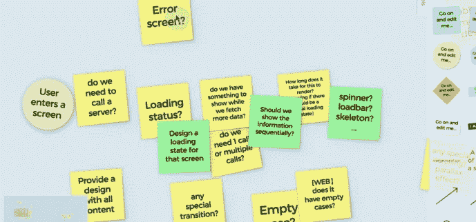
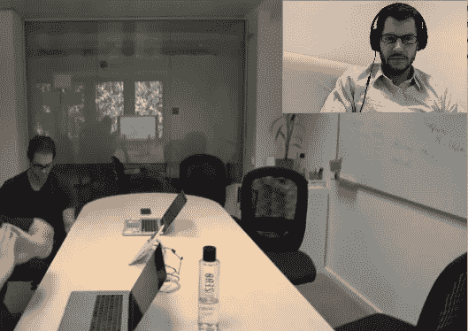
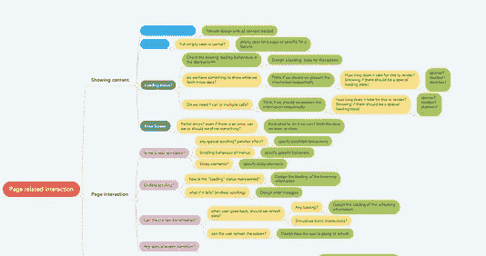
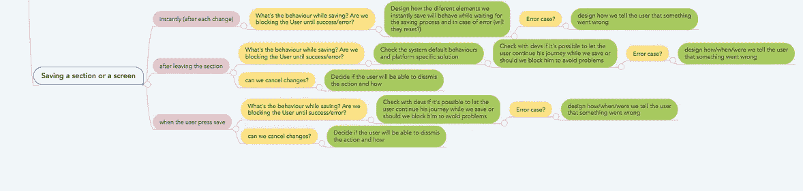
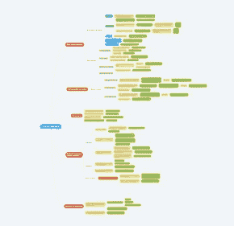

# 一名设计师、一名开发人员和一名产品经理走进一家酒吧…

> 原文：<https://medium.com/hackernoon/a-designer-a-developer-and-a-product-manager-walk-into-a-bar-9704693e024d>

## 旨在改善彼此之间的协作

Original Photo by [frank cordoba](https://unsplash.com/photos/6wjpQZ5gYnc?utm_source=unsplash&utm_medium=referral&utm_content=creditCopyText)

> “我可以列出至少三件事，当我看你的设计时，我会一直问”——一位不知名的开发者

这句话来自我们的团队回顾，关于改善我们的[设计师](https://hackernoon.com/tagged/designers)和开发者之间的合作。它一直困扰着我，并最终引发了我们团队新协作工具的[开发](https://hackernoon.com/tagged/development)。

在设计创作过程中，我们已经在开发人员和设计师之间建立了紧密的合作关系。尽管如此，当我们需要将设计分解成更小的可供开发的模块时，问题会源源不断地出现在我们的细化会议中。这些问题会围绕一些较小但重要的细节，比如保存用户设置时的错误处理。由于我们的工程师在服务器如何提供信息方面的专业知识，一些问题会单独出现。

我们重视这两个学科之间的这种讨论，因为它们有助于我们制定更强大的设计解决方案，可以在没有太多中断的情况下开发。但是，我们也认为值得尝试进一步改进我们的流程，因为存在一些反复出现的挑战:

*   在我们所做的不同特性实现中，类似的问题经常需要澄清。
*   如果问题无法在我们的优化会议中得到解答，它会为设计团队带来额外的工作进展。他们需要回到绘图板，这也增加了我们的开发人员的移交时间。
*   有些问题会出现得太晚，从而中断了开发流程，直到它们能够被回答。

> 我们的意图:我们希望通过帮助设计师和开发人员尽早澄清关键问题来提高产品开发过程的效率。

这就是“开发者清单”背后的想法是如何诞生的。

## 去拿清单

在我们的公司[hack wee](https://hackweek.xing.com/)k——探索新技术和新想法的季度机会——期间，我们开始将我们的想法转化为可用的清单。

核对表已经被用于各个领域，比如航空安全和医院治疗，以减少错误和提高质量。我们希望将这些优势带入我们的世界，以提高我们设计的整体标准。此外，我们希望通过让我们的设计师用列表来挑战他们工作的就绪性，让“工程师的眼睛”更接近我们的设计过程。我们的开发人员在为我们的下一个开发迭代创建任务时，可以用它来激发思考。由于使用清单(基本上是检查清单)几乎不需要什么努力，因此在我们的团队中采用的可能性也会很高。

当然，这也有助于我们在短时间内创建一个简单的工具清单。一开始我们是三个人的团队:一个设计师，一个开发者，一个产品经理(我)。后来，更多的人加入进来，帮助提供有价值的反馈。

## 远离快乐之路

为了确保我们在清单上有所有正确的问题，我们强迫自己记住过去一年中所有的困难情况——我们去了没有人愿意再去的地方。除了有治疗价值之外，这种锻炼被证明是有效的；在很短的时间内，我们的数字便利贴板列出了各种反复出现的痛苦。我最喜欢的例子:

*   **保存:**如果用户没有保存就离开屏幕怎么办？如果出现保存错误该怎么办？
*   **页面的不同状态**:该页面是否有空、出错和加载状态？如果可以的话是应该早一点展示一些信息，还是一次全部展示？
*   **与页面上的元素交互:**元素有多少种可能的状态？有没有状态切换的动画？与某个元素的交互会在其他地方触发动画/状态变化吗？

需要澄清的从来都不是显而易见的事情。然而，它仍然是为我们的用户提供一致和愉快的体验的关键项目，也是允许我们的开发人员不间断地进行实现的项目。

As we are a distributed team our brainstorming sessions looked like this: A web based post-it board (we used Ideaflip) and video conferences.

## 页面和元素的故事

我们将我们的便利贴合并成两组:与页面上的交互相关的问题和与页面上的单个元素相关的问题。这些小组有几个主题相关的问题分组。我们选择了一个树形图来帮助浏览这个结构。

这是上面的一些例子在清单上的样子:

A detailed look at the checklist; from left to right: Page related interactions / Saving / The whole checklist

在下一次迭代中，我们将努力使清单变得更容易消化和浏览，因为它变得比预期的更大。对于我们的一小群创作者来说，当我们重新审视正在进行的设计并发现缺失的信息时，它已经被证明是有帮助的。

## 将清单付诸行动

对我们来说，清单的第一个“测试版”已经很有价值了。尽管如此，仍有很大的发展空间——尤其是在我们还无法预测的方向上。因此，我们将继续在团队中使用该工具来验证质量和效率方面的预期改进。此外，我们正在向尽可能多的人展示该工具，以发现新的场景并提高列表的可理解性。

我们的目标是把这个列表作为一个工具，让新的设计师和开发人员加入进来。该列表应该帮助他们了解在设计时需要哪些信息以及应该问哪些问题。

## 一次值得的旅行

在这个兼职项目中，让我着迷的是我们这个多元化的小团队中的积极情绪。我们的讨论从来没有变成谁必须提供什么的指责游戏。将我们的想法转化为有助于我们团队的东西，就像指引和安抚人心的北极星。

对一些人来说，我们似乎希望清单能减少我们相互交谈的时间。事实恰恰相反。我们只想把时间花在讨论最重要的事情上——在正确的时间进行正确的对话。

你对清单有什么想法？你是否使用过相似或完全不同的方法来改善团队协作？我们的 DevSigner 清单已经从一个松散的便利贴集合发展成为一个对我们有用的工具。尽管如此，仍有很大的改进空间，我们很高兴收到任何反馈。

感谢[米盖尔](https://twitter.com/miguel_eedl)和[克里斯汀](https://twitter.com/cmonfortep)——出色的设计师和开发者也参与了这项工作。