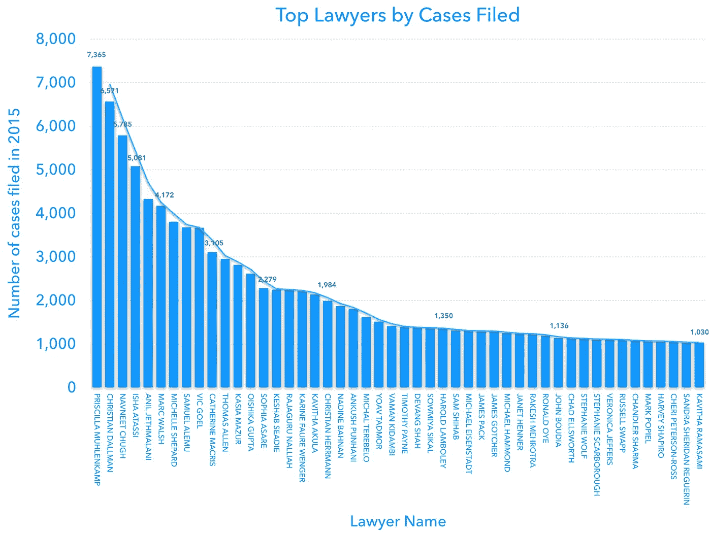
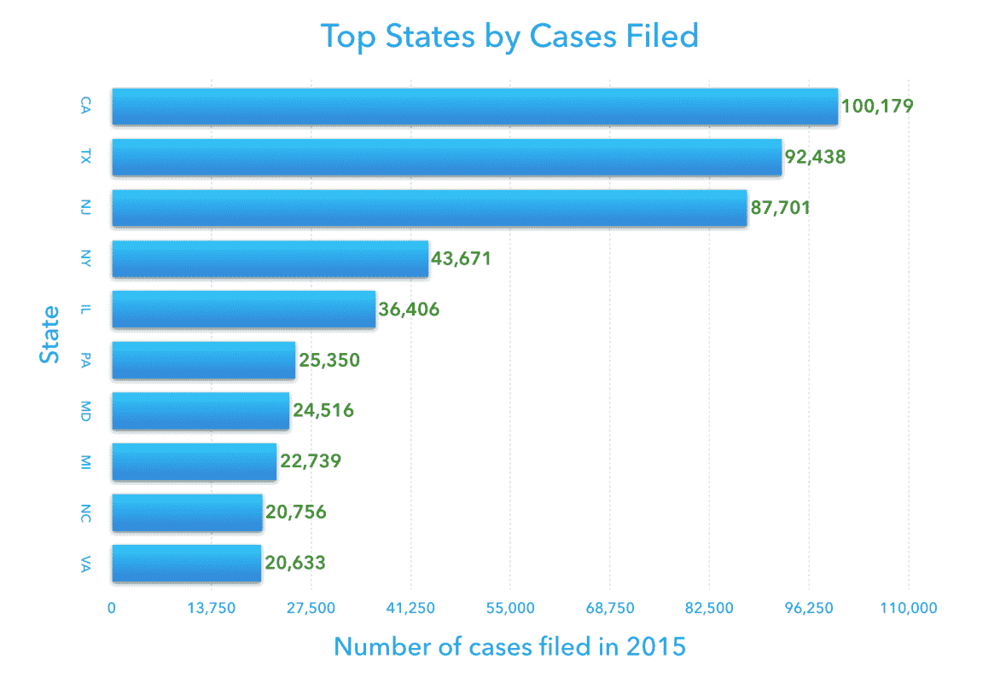
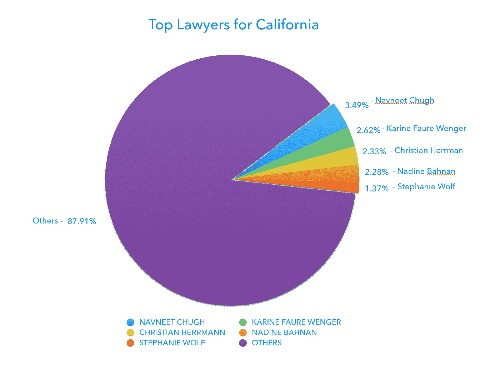
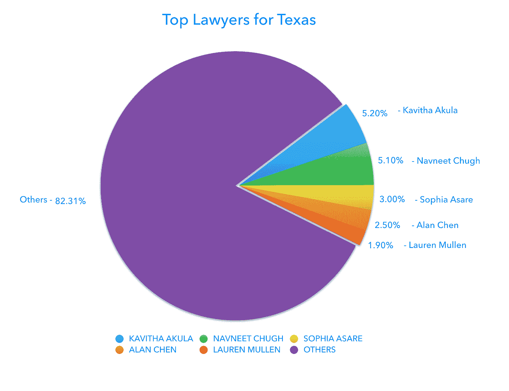
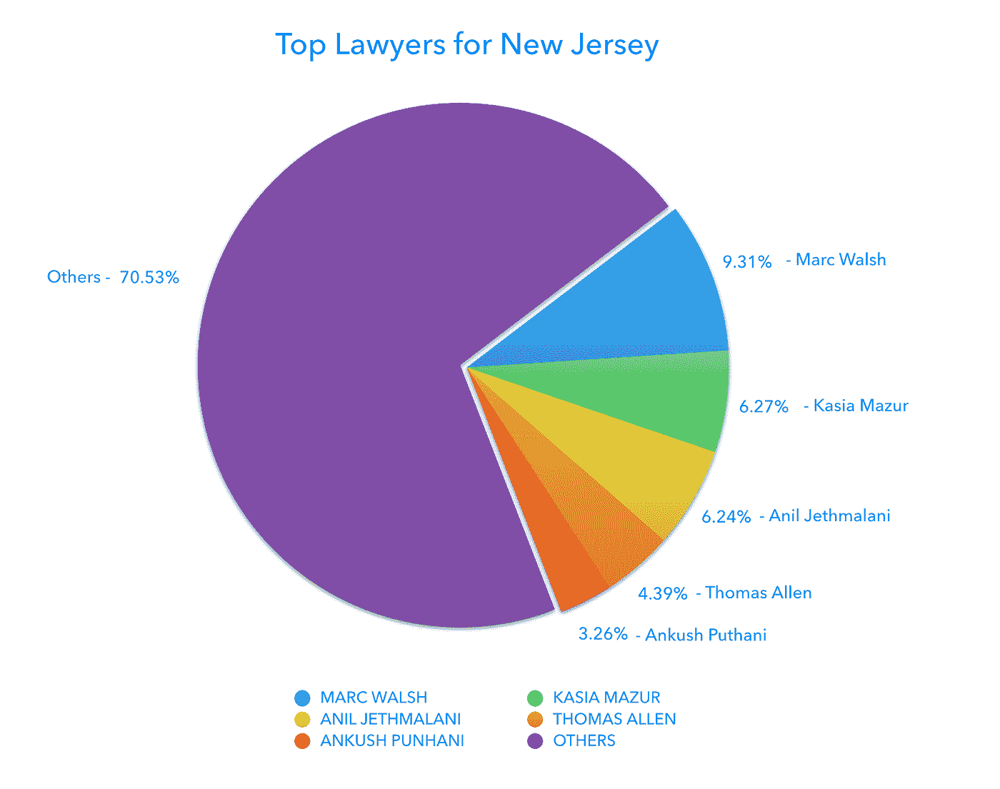
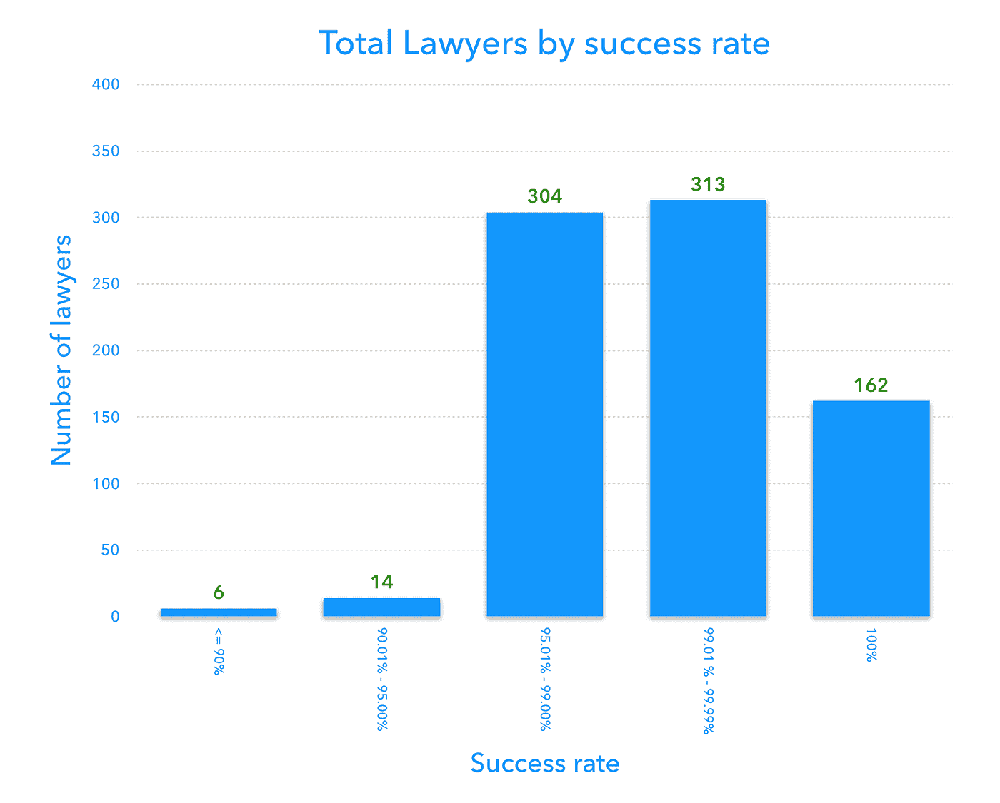
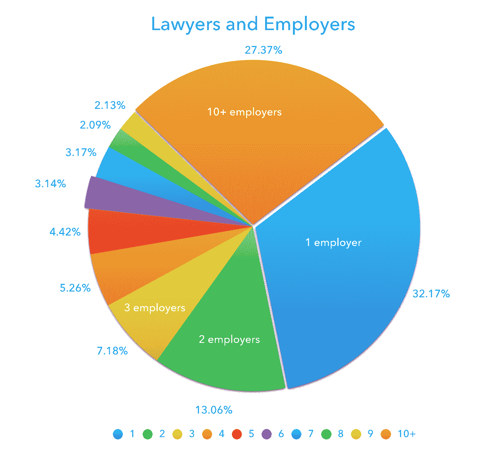

# H-1B 签证律师详解

> 原文：<https://medium.com/hackernoon/a-detailed-analysis-of-h-1b-visa-lawyers-25f400b3ac70>

每年都有成千上万努力工作的人向 USCIS 申请在美国工作的机会。他们提交大量的文书工作，试图证明自己的技能，希望获得批准。有成千上万的律师在为这些员工准备申请。到目前为止，还不知道这些代表员工准备和提交申请的律师的成功率。

我们公司使用广泛的数据分析和机器学习来为 F-1、OPT、H-1B、O-1、L-1 和 TN 签证持有者做出贷款决策。我们利用数据帮助申请签证的人做出更好的决定，这似乎是合适的。这就是为什么我们花了几个小时做艰苦的工作给你带来的数据，以帮助你对你的 H-1B 律师做出更好的决定。

这是我们接下来几周将分享的多部分 H-1B 签证分析的第一部分。

## [点击订阅我们的博客，获取更多有用的内容](http://eepurl.com/cbeUHL)

律师不被谈论太多，但在申请 H-1B 时，他们是最重要的人。如果你的律师弄糟了你的申请，你没有拿到签证，你可能不得不永远离开这个国家。

一个案子有很多方面，有些律师擅长于很好地陈述你的案子来增加你获得 1B 批准的机会，有些则不然。我们发现，有些律师的支持率是 100%，而有些律师的支持率低于 80%。一个好的律师会对你的申请产生巨大的影响。

> 问正确的问题可以把你从一个糟糕的 H-1B 律师那里解救出来。明智地选择你的 H-1B 申请人。

# 总体统计— H-1B (2015 年)

立案总数:618，804(包括新申请、续展、转让)

律师提交的案件:391，678 起(可提供律师姓名)

*   认证案例:348，869
*   撤回的案件:13 278 起
*   拒绝受理的案件:6 009 起
*   证明撤销的案件:23 522 起

# 顶级律师

下图显示了按案件数量排名的前 50 名律师。

我们看到，提交的案件总数明显下降，这表明一些律师显然比其他人更受欢迎。下降的速度要慢得多，大约每年 1，000 起案件。

> *提交案件数量排名前三的律师:*
> 
> 普里西拉·穆伦坎普——7，365
> 
> 克里斯蒂安·达尔曼——6571 人
> 
> nav neet Chugh—5785

# 州

以下是 2015 年美国公民及移民服务局受理案件数量最多的 10 个州。前三个州在申请总数上遥遥领先于其他州。排名第四的州提交的申请不到排名第三的州的 50%。

> *2015 年提交的 H-1B 案例数量排名前三的州*
> 
> 加利福尼亚州——100，179 人
> 
> 德克萨斯州——92348 人
> 
> 新泽西州——87701 人

如果排名前三的州提交了如此多的案件，那么有趣的是，看看是很多律师提交了这些申请，还是只有少数律师非常活跃。

## [点击订阅我们的博客，获取更多有用的内容](http://eepurl.com/cbeUHL)

让我们在下面探索一下加利福尼亚、德克萨斯和新泽西的情况。

# 加利福尼亚

没有明确的顶级律师接手大多数案件，市场也很分散。2015 年，共有 2738 名律师提交了 H-1B 案件。前 5 名律师的立案量约占全部案件的 12.08%。

> *按提交案件百分比排名的前 5 名律师:*
> 
> navneet Chugh——3.49%
> 
> 郭佳欣·福雷·温格公司
> 
> 克里斯蒂安·赫尔曼——2.33%
> 
> 纳丁·巴赫南——2.28%
> 
> 斯蒂芬妮·沃尔夫——1.37%

# 德克萨斯州

德克萨斯州的顶级律师在提交的案件总数中所占的比例更高。这位顶级律师拥有 5.20%的股份。这可能是因为申请签证的律师总数较少。2015 年，只有 1605 名律师提交了 H-1B 案件。前 5 名律师的立案量约占全部案件的 17.60%。

> *按提交案件百分比排名的前 5 名律师:*
> 
> 卡维塔·阿库拉——5.20%
> 
> 海军陆战队——5.10%
> 
> 索菲亚·阿萨尔——3.00%
> 
> 艾伦·陈——2.50%
> 
> 劳伦·马伦

# 新泽西

随着提交的案件总数减少，顶级律师的比例大幅增加。这位顶级律师拥有 9.31%的份额(大约是德克萨斯州的 2 倍，加利福尼亚州的 3 倍)。2015 年，共有 1226 名律师提交了 H-1B 案件。前 5 名律师的立案量约占全部案件的 29.46%。

> *按提交案件百分比排名的前 5 名律师:*
> 
> 马克·沃尔什——9.31%
> 
> 凯撒马祖尔——6.27%
> 
> 阿尼尔·杰特马拉尼——6.24%
> 
> 托马斯艾伦——4.39%
> 
> 安库什·普特哈尼——3.26%

这有助于我们了解哪些律师在申请 H-1B 签证的热门州最活跃。

# 成功率

一个好的律师不仅取决于立案数量，还取决于成功率。如果你聘请律师为你的 H-1B 申请文件，你会得到签证，而不必面对拒签信。

2015 年，美国 50 个州约有 7，413 名律师申请签证。正如我们所料，其中约 55%的律师申请了前三大州——加利福尼亚州、德克萨斯州和新泽西州的雇主签证。

> ***2015 年只有 799 名律师提交了 100 份或以上的签证。***

对于这部分分析，我们将只考虑这 799 名律师，并计算他们的成功率。

在这 799 名律师中，只有 162 名律师有 100%的成功率。他们在 2015 年申请的每个人都拿到了签证。这些律师可以被认为是最好的。

## [点击订阅我们的博客获取更多有用的东西](http://eepurl.com/cbeUHL)

# 下图按律师成功率列出了律师总数(2015 年提交 100 起或以上案件的律师):

这 5 名律师在 2015 年提交的 H-1B 案件中成功率最低:

> *被拒案件百分比最低的 5 名律师:*
> 
> 阿莎·马丹——28.19%
> 
> 凯撒马祖尔——6.27%
> 
> 阿尼尔·杰特马拉尼——6.24%
> 
> 托马斯艾伦——4.39%
> 
> 安库什·普特哈尼——3.26%

# 律师和雇主

所有雇主都有自己喜欢的律师或内部律师来提交签证申请。一些律师保持独立，同时为多个雇主工作。

下图显示了很大比例的律师为少数雇主工作。他们可能签了长期合同，雇主不想换律师，因为这既费钱又费时。

> 超过 50%的律师为 3 个或更少的雇主工作。

> *为最多雇主工作的前 5 名律师:*
> 
> dak shini Senanyake——302 名雇主
> 
> 瑞安湾——275 名雇主
> 
> 马克·泰勒——255 名雇主
> 
> Navneet Chugh — 254 名雇主
> 
> 索菲亚·阿萨尔——234 名雇主

这是一个关于申请签证的律师的快速概述。在我们的下一篇文章中，我们将深入了解申请这些签证的公司。如果你在这些公司中的一家工作，或者将要为他们工作，下一篇文章将会给你一些有用的数据，告诉你在申请 H-1B 时会遇到什么情况。

关于高跷:

Stilt 向在美国的国际学生和工作专业人士(F-1、被占领土、H-1B、O-1、L-1、TN 签证持有者)提供贷款，利率低于任何其他贷款机构。在[维基百科](https://en.wikipedia.org/wiki/Stilt_(company))了解更多关于我们的信息，或者访问[https://www.stilt.co](https://www.stilt.co/?utm_source=medium&utm_medium=referral&utm_term=visa&utm_content=h1b_visa_analysis&utm_campaign=2016-08-26)了解我们。如果您有任何问题，请访问[https://help.stilt.co](https://help.stilt.co/)或发送电子邮件至[team@stilt.co](mailto:team@stilt.co)。

 [## 虚假贷款

### 国际人士个人贷款从未如此简单。贷款给聪明且有财务责任感的外籍人士…

www.stilt.co](https://www.stilt.co)