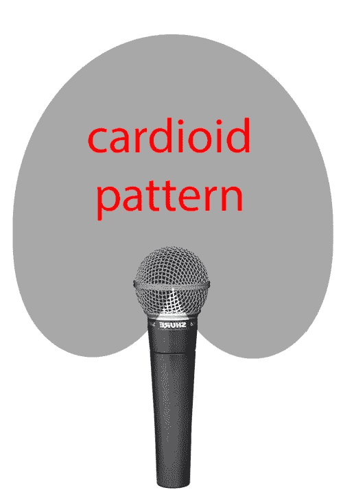

# 更好的演示开发者指南—第 1 部分，舞台艺术

> 原文：<https://medium.com/hackernoon/a-developers-guide-to-better-presentations-part-1-stage-craft-36e75853656c>

我不是最好的公众演说家或演讲者，但我给予很多，并乐于给予。我也参加了许多聚会和会议，因此已经建立了一个很好的工作和不工作的清单。我计划这篇文章已经有一段时间了，但在上周一个重大技术项目的特别糟糕的演示让我失望之后，我觉得有动力离开我的屁股去写它。第一部分(数量未定)包括舞台艺术和声乐技巧。

## 舞台艺术

我明白，站在一个满是陌生人的房间前是很伤脑筋的，有些人比其他人更擅长，随着时间的推移，你可以获得信心，但同时这里有三个提示可以帮助你至少看起来像你知道你在做什么，从而提供更好的演示，获得更好的反应，并增强你的信心。我将在本系列的后面部分更详细地介绍这个主题，现在，我将介绍舞台艺术的一般技巧。

## 请自便

除非有人强迫你说话，否则你会想这么做。享受你自己，观众也会喜欢这个演讲。如果你知道你的主题，那么不管你有多紧张，这都会过去，特别是在技术演示中，人们更感兴趣的是你要说什么，而不是你怎么说。

## 练习

我犯了练习不够和“即兴发挥”的错误，当内容让你吃惊或流程不太顺畅时，这在演示中很明显。如果有机会，排练几次，最好是在有建设性和值得信赖的观众面前。

## 你是那 5%

好吧，这个数字是我瞎编的，但我想说的是，不管你感觉有多紧张，或者你认为自己有多糟糕，你都是有勇气站出来说话的一小撮人中的一员。是的，会有人批评你的努力，但除非他们也有勇气站上舞台做得更好，否则别理他们。

## 声乐和麦克风技术

对于从事技术工作的人来说，却普遍缺乏正确使用话筒的知识。我坐在座位边上，反复观察演讲者，向他们做手势，告诉他们如何调整麦克风，让听众能够听到。麦克风是一种老式的技术，它获取模拟信号(即不是由微芯片产生的信号)并对其进行处理，对于事件，通常会对其进行放大。

有一句老话我非常喜欢，这句话适用于许多场合，尤其是麦克风。

> 你不能擦亮一坨屎。

从英国口语翻译过来。大便就是便便。所以，是的，你不能润色它，但它的意思是，你的努力，以改善质量差的东西将是静脉，最好是从更好的质量开始。关于麦克风技术，这意味着如果你怯生生地、小声地、含糊不清地说话，那么麦克风会强调这一点。提高你的自信需要时间，但作为一名前音乐家，我可以分享一些简单的技巧，让你更清楚地了解自己。

## 慢慢说

你在舞台上说话的速度总是比你想象的要快，所以慢下来，暂停一下，深呼吸。很可能你或你的一些听众不是在用他们的母语说话或听，所以放慢语速还有其他好处。

## 从你的横隔膜说话

这是一个你可能需要学习的技能，如果你想认真对待这个问题，我强烈建议你去上歌唱课(这对肌肉张力也很有好处)，但是你可以从有意识地提高你的声音和向下呼吸你的身体开始。这比听起来容易，试试吧。以这种方式呼吸也意味着你呼吸更少，这可以减少你的紧张。

## 发音

这是说得更清楚的艺术，有些人比其他人更容易掌握，这可能是你需要学习的另一项技能。我给你的建议是每个单词都要发音清晰。这有助于说得更慢，也有助于那些用非母语听/说的人。

现在你知道如何更好、更清晰地说话，你可以专注于让麦克风放大这一点。首先，我想问你是否需要一个麦克风。有过度依赖技术的倾向(真的？肯定不是！)并且总是使用麦克风，即使是一个有很多人的小房间。如果你觉得你不需要麦克风，每个人都能听到你，那么礼貌地拒绝一个。

你可能会遇到三种类型的话筒，我将总结一下对它们的建议。

## 手持式传声器

这是你可能遇到的最常见的情况，根据活动及其预算，质量会有所不同。这些通常被称为“心形”麦克风，它们的拾音模式有点像压扁的心(有点像 AirBnB 的标志😁)在麦克风的球状末端周围。

*Image taken from* [*http://transom.org/2016/recording-live-events/*](http://transom.org/2016/recording-live-events/)

格局不大，所以理想情况下直接拿着话筒**放在嘴的前面**，距离不超过 10cm，尽量保持在一致的位置。看看专业歌手的照片，看看他们如何使用麦克风并模仿他们(尽管要注意唱歌比说话声音大得多)。我喜欢靠近麦克风，这样它就能捕捉到我讲话中的所有微妙之处，但这是我个人的事情。专业表演者通常有自己的麦克风来防止其他用户的细菌，对于偶尔的 meetup 演示来说，这可能是多余的，但如果你经常说话(出于某种原因你正在阅读这篇文章)，那么你可能会考虑购买自己的麦克风。

测试音量时，不要敲打麦克风，这对麦克风、放大器和听众都不好。开始讲话，如果有任何问题，会有人告诉你。

## 讲台麦克风

你会在大学、会议中心和其他场所举办的活动中遇到这些问题。它们通常是安装在讲台顶部可弯曲臂上的小型麦克风。类似的原理也适用于手持话筒。把它放在你的嘴前面，但是你可以更靠后，因为它们更敏感。值得注意的是，如果你的笔记本电脑在讲台上，麦克风可能会听到你打字和点击的声音。如果可能的话，请人调整音量，并靠近麦克风以拾取重要的声音。

再说一次，没有必要为了测试而去敲打它，开始正常地说话。

## 头戴麦克风

随着麦克风变得越来越便宜，我看到它们被越来越多地使用，我喜欢它们，因为这意味着你可以四处走动。它们是小麦克风，你可以戴在耳朵上，放在嘴巴旁边。它们通常连接到电池组，然后无线连接到放大器。由于这些麦克风很敏感，通常由音响工程师管理，除了前面提到的说话技巧之外，您不必担心太多。如果电池开始耗尽，你将有声音问题，但同样，将有一个声音工程师来帮助。

## 跟我说话

以上是第一部分的内容，在下一部分，我将介绍演示的内容。如果你有任何建议想与读者分享，请在下面添加。

> [黑客中午](http://bit.ly/Hackernoon)是黑客如何开始他们的下午。我们是 [@AMI](http://bit.ly/atAMIatAMI) 家庭的一员。我们现在[接受投稿](http://bit.ly/hackernoonsubmission)并乐意[讨论广告&赞助](mailto:partners@amipublications.com)机会。
> 
> 如果你喜欢这个故事，我们推荐你阅读我们的[最新科技故事](http://bit.ly/hackernoonlatestt)和[趋势科技故事](https://hackernoon.com/trending)。直到下一次，不要把世界的现实想当然！

