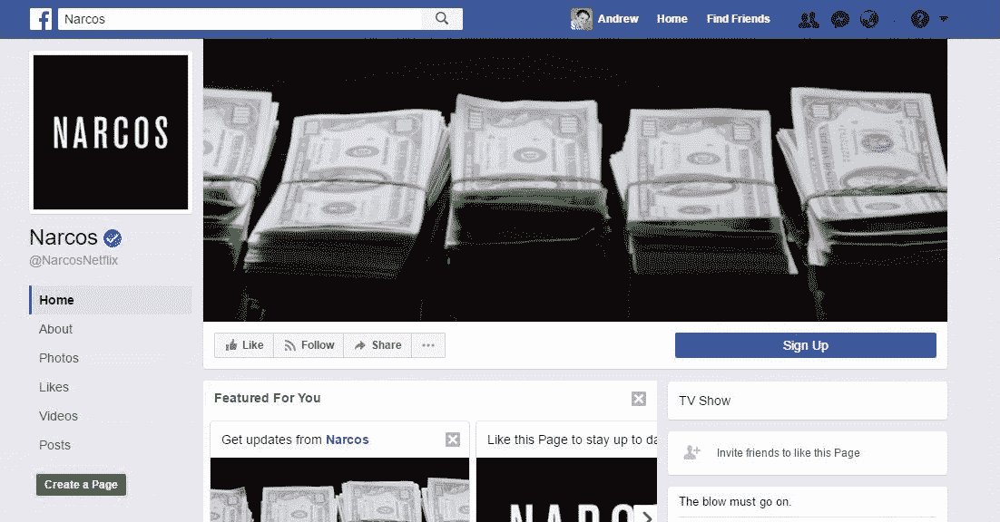
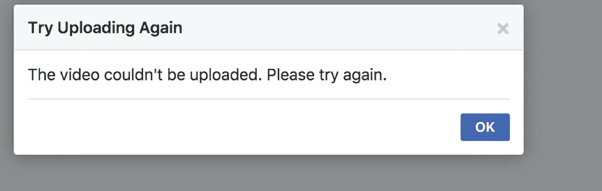
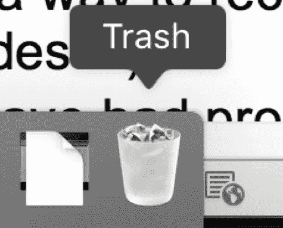

# 对任何开发人员来说都是一个教训的脸书 Bug 故事

> 原文：<https://medium.com/hackernoon/a-facebook-bug-story-that-is-a-lesson-for-any-developer-46df4d4659d1>

> **TLDR** :一个[脸书](https://hackernoon.com/tagged/facebook)的漏洞可以导致一个视频从你管理的页面上被删除，而你并没有做错任何事情。你失去了视频和相应的帖子，所有的喜欢，反应和链接到它的分享。脸书的支持并没有恢复它。

脸书真的喜欢推送内容，或者至少看起来是这样。脸书最不喜欢推广的是视频。视频就像移动的图片，如果一张*图片胜过千言万语*，那么一段视频可能更有价值！

脸书推广视频的最后一次努力是将它们添加到页面封面部分。如果执行得好，它看起来会很棒。

Example of facebook cover image with a video

我管理着一个脸书页面，上面有几千个赞，还有一个一周前推送的重要视频。所以我决定试试这个新功能。

过程非常简单，点击更改封面，选择现有视频，定位，选择缩略图，然后…发布！嗯，除了最后一次点击之后会发生:

Ups, it seems that Facebook can’t upload a video that is already in the video gallery?

什么？哪里出了问题？这段视频已经在脸书公开发布了，它没有理由出错。但是它失败了，因为一个误导性的错误信息。这个视频是在我的画廊，我没有上传任何东西。那么，为什么上传会失败呢？

和任何[软件](https://hackernoon.com/tagged/software)一样，你可能会再次尝试这个过程(就像错误框提示的那样)来看看输出是否不同。除了当你去选择视频的时候，它已经不在那里了！

# Tada！不见了！删除了！

你投资的广告中所有的赞、股份、浏览量、金钱？浪费了！

你的视频被某个神秘的 bug 删除了，你并没有真正记录下来，因为内容不是你所期望的。

# 你现在能做什么？

1.  **联系支持？**

祝你好运，找到任何有意义的方法，得到有意义的答案。你可以尝试业务支持，我这样做了，但他们无法帮助取回视频，借口是用户的错误！

> “他们进行了分析，发现帖子被一个用户删除了。不幸的是，我们无法恢复它，一旦用户删除内容，这将成为永久删除。”

**2。再次发布视频！**但是所有的“反应”、分享、评论和观点，即使是你投资的钱，现在都不见了。

# 这对软件开发人员有什么启示

学会重视人的内容。即使人们明确地删除了一段内容，也要给他们一个撤销刚才操作的选项。

Remember the trash can?

移动开发者可能已经了解了这一点。轻松访问强大的功能，如滑动删除/归档，但在操作失误时可以快速恢复:

A prime example of what mobile does that should be more common: a quick and easy UNDO button

我希望来自脸书或其他平台的人能从这篇文章中吸取教训:

*   没有错误应该删除人内容；
*   即使人们明确删除了内容，也应该有办法恢复它(几十年来每台电脑上都有一个垃圾文件夹……)；
*   即使你无法改正错误，也要尽快接受。

这最后一点，对我这个用户来说，可能是最重要的。在与支持团队的所有互动中，我完全不知道他们看到了我制作的重现问题的视频，或者是一个已知的问题。他们没有为错误道歉，只是为不便道歉，这是不一样的…

一些额外的注意事项:

*   我在不同的脸书账户上用两个不同的页面，两个不同的视频复制了这个错误四次。有错误和丢失视频的截图来自其中一个实验。
*   对于那些读了这篇文章并认为“他只是为了让脸书支持者翻转一些开关并返回他意外删除的内容”的人，我可以提供一个视频来重现所描述的问题。(我还有一个 HTTP 请求，服务器用 HTTP 状态代码 500 响应。)