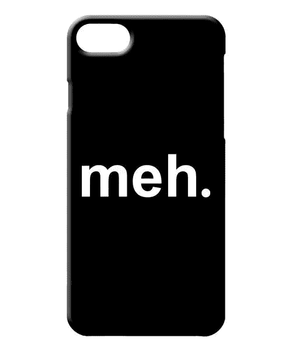

# 告别 iPhone 7

> 原文：<https://medium.com/hackernoon/a-farewell-to-iphone-7-7ee75e41be4>

这是我第一次写我自己的 iPhone，奇怪的是，我并不是要称赞它或记住它。

我拥有过的每一部 iPhone 都给了我一点通常与[苹果](https://hackernoon.com/tagged/apple)联系在一起的神奇感觉，喘息，兴奋，那种“我不敢相信我生活在未来”的感觉……**除了 iPhone 7** 。

自从 iPhone 3G 问世以来，我每两年就拥有一部 iPhone。

iPhone 3G 是我的第一部手机(在 iPod Touch 之后)，多点触控仍然是一项看起来很神奇的技术。随着应用程序的出现和惊人的移动数据速度，感觉不可思议。随着时间的推移，它变得很慢，几乎无法使用，这是唯一一部每次更新体验都降级的 iPhone。

iPhone 4 非常不可思议:视网膜屏幕看起来非常漂亮，这是一个令人兴奋的成就，这是第一款可以拍摄出与当时数码相机不相上下的照片的 iPhone 相机……还有它的设计，天哪！iPhone 有史以来最漂亮的设计。

**iPhone 5** 轻得令人难以置信，额外的屏幕空间非常受欢迎。Siri 是我以前从未体验过的东西，是我在电影中多次看到的人工智能的第一次，现在是在现实生活中。这款手机轻薄小巧。这也是第一部屏幕贴在玻璃上的手机，第一次你可以感觉到你真的在用手指触摸界面，没有任何距离。

iPhone 6 也有很多神奇之处。TouchID 令人难以置信(这是我第一部输入密码的手机)。弧形玻璃使手势成为一种享受。大屏幕是一个如此受欢迎的变化。相机是一个不可思议的改进，这是第一部拍摄效果接近 DSLR 的 iPhone。

iPhone 6 最终出现了问题，我设法把它弄弯了，两年后电池也坏了，所以…我没有再等第三年来买 iPhone X，而是去买了 iPhone 7。

所以我们来看看我现在的 iPhone(直到下周)。iPhone 7 是第一款没有什么特别之处的手机。一点也不觉得神奇。不动的 home 键？咩。相机改进？在弱光下很好，但比 6 好不了多少。没有耳机孔？那可不好，只是咩。颜色？是的，这是迄今为止他们做的最好的黑色…但是，哼。电池寿命从来没有这么好，速度也没有这么大的改善。

iPhone 7 一直是我唯一的“meh”iPhone。一点也不差，但这是第一部没有任何“神奇”之处的手机。

这绝对像是一部“我们今年需要拿出点什么”的手机。这是苹果公司第一次连续三年重复设计。是的，它有很多很好的改进，但它和以前的型号之间的距离让它感觉应该是 iPhone 6SS。所以看到它走了我并不难过。

下周我的 iPhone X 就要上市了，我认为它会有很多魔力。我特别期待:有机发光二极管上的黑人、FaceID 体验、全屏手机、大幅改进的相机以及电池寿命的提高。

我们将拭目以待，但就目前而言，我很高兴我离开了“咩”iPhone。