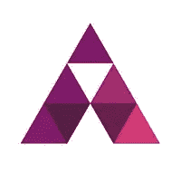

# 最后的告别！

> 原文：<https://medium.com/hackernoon/a-final-farewell-6c29851614fe>

我们很高兴地宣布，盖洛普已被大型维京游戏公司收购。BVG 是一家位于多伦多的游戏公司，多年来一直与我们密切合作。作为盖洛普的客户，他们亲身体验了我们团队的专业知识和技术。使用客户智能推动有价值的移动用户增长是他们成功的核心，我们无法想象还有比这更适合我们团队的了。

四年前，我的兄弟阿尔卡里姆·纳赛尔(Alkarim Nasser)和他当时的商业伙伴保罗·克罗(Paul Crowe)讨论了一个想法，即如何利用第一方数据为营销人员提供更精确的目标。我们希望通过使用数据科学从根本上改变广告的方式，为广告商创造透明度，并帮助他们了解每一分钱的下游影响。

作为一名营销人员，我很高兴解决了我们许多人面临的一个难题。我在纽约大学的最后一年写了一篇关于公司商业计划的硕士论文，后来在 2013 年成立了 Gallop，作为 Alkarim 的公司 BNOTIONS 的一个部门。我们继续管理超过 100 万美元的支出，推出自助服务平台，并赢得了行业领导者的认可。与此同时，我们聘请了一位首席执行官，筹集了数百万美元的资金，组建了我们的团队。

尽管如此，我们仍然面临强大的阻力。我们的行业发展迅速，成熟的竞争对手也在提供类似的服务，而我们受到内部不一致的困扰。虽然这是一次成功，但我们也从中吸取了一些教训。

对于有抱负的企业家和早期创业公司，我给你的建议是:

*   保持管理精益
*   关注老年人… *确保你的产品做一件事，而且只做一件事做得特别好*
*   以产品而非销售为重点建立早期领导地位
*   失去正式的董事会——很难在这么早的阶段利用他们的洞察力
*   慢下来——在筹集[风险投资](https://hackernoon.com/tagged/venture-capital)时，时机就是一切——最好是把事情做对，而不是太快

我们很高兴我们的团队将有机会在大型维京游戏中继续构建我们的愿景。没有那些我们永远称之为朋友的人的帮助和支持，我们不可能走到这一步；我们的客户、合作伙伴和天使投资者。**感谢您对我们的信任，并成为这一不可思议的旅程的一部分。**

至于我，我期待着我的下一次[创业](https://hackernoon.com/tagged/startup)，性质略有不同…

我丈夫和我期待着在接下来的几个月里迎来一个女婴。我期待着观察她一周又一周的成长。:)

真诚地

Farzana Nasser，Gallop 创始人