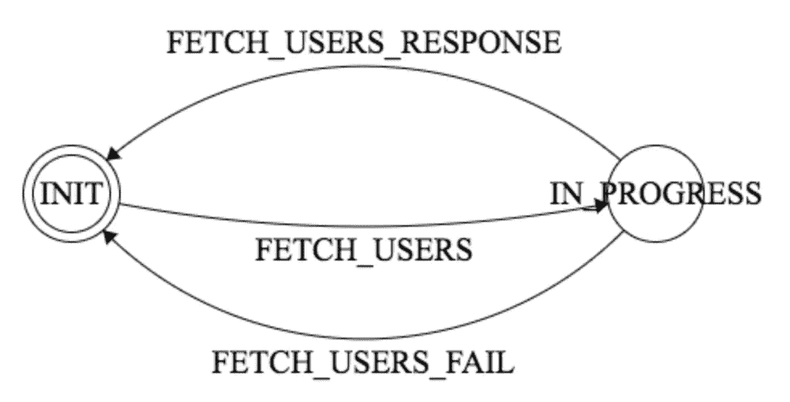
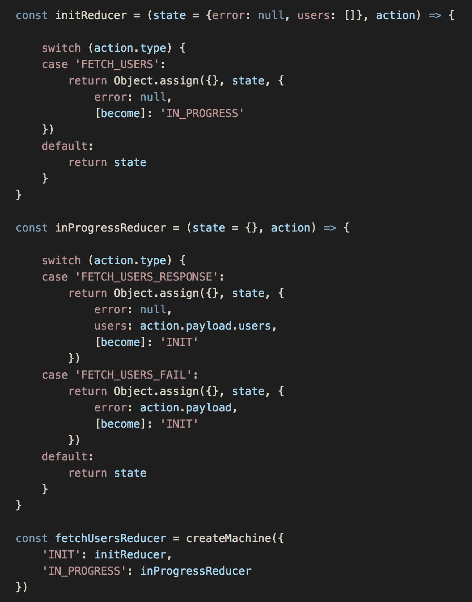
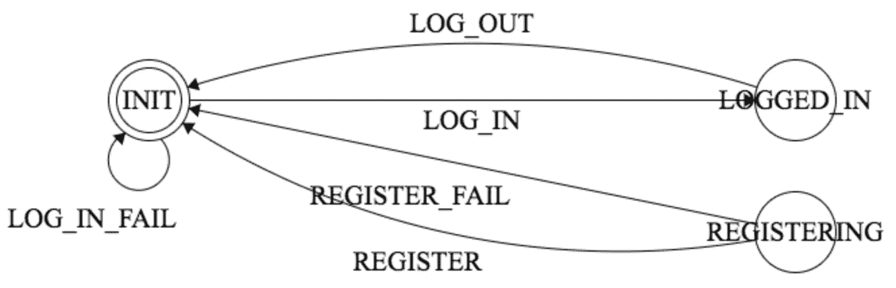

# Redux 的有限状态机助手

> 原文：<https://medium.com/hackernoon/a-finite-state-machine-helper-for-redux-c18519643719>

我注意到 [Redux](http://redux.js.org/) 应用程序经常嵌入特别的[有限状态机](https://en.wikipedia.org/wiki/Finite-state_machine#Example:_coin-operated_turnstile)，关于当前状态的信息散布在[Redux](http://redux.js.org/docs/basics/Reducers.html)中。我在 [Redux](https://hackernoon.com/tagged/redux) 中写了一个使用有限状态机的小助手叫做 [redux-machine](https://www.npmjs.com/package/redux-machine) 。在这篇文章中，我将深入探讨:

*   一个有限状态机的例子以及如何用 redux-machine 实现
*   使用冗余机的优势

# redux-机器示例

这是一个非常简单的处理数据获取的状态机的例子，它将有助于展示如何使用 redux-machine:

finite state machine for handling API call state in Redux

用语言来说:

*   INIT 是初始状态
*   当状态为“初始化”且动作类型为“获取用户”时，机器转换到“进行中”状态。
*   当状态为“进行中”且动作类型为“获取用户响应”或“获取用户失败”时，机器转换到“初始”状态。

> 我使用术语“状态”而不是“状态”,以避免与“状态”混淆。所以 *INIT* 和 *IN_PROGRESS* 是状态。

下面是如何用 redux-machine 实现状态机:

state machine implemented with redux-machine

特殊部分是**变成**符号，它将减速器转换到不同的状态。当状态为 **INIT** 时， **fetchUsersReducer** 的作用类似于 **initReducer** 。当状态为 **IN_PROGRESS** 时， **fetchUsersReducer** 的作用类似于 **inProgressReducer** 。

Redux-machine 以一种非特定和显式的方式在存储中保持当前状态。它用状态键将当前状态存储在存储器中。例如，当状态为**进行中**时，“状态”的值为“进行中”

一个 app 可以有任意多个 redux-machine 创建的减速器，这些减速器可以嵌套。这很有帮助，因为任何重要的应用程序都会在状态机中包含状态机。例如，如果 app 的主要流程是:

a simplified main flow for an app

那么 fetchUsers 中的状态仅在主应用程序状态为 LOGGED_IN 时相关。

# [冗余机](https://www.npmjs.com/package/redux-machine)的优点

redux-machine 将当前状态显式化，并将您的状态保存在 redux 存储中。将所有状态保存在存储区中有助于:

*   调试:整个状态很容易检查。redux-machine 还兼容[时间旅行调试](https://www.youtube.com/watch?v=xsSnOQynTHs)。
*   向用户传达状态。例如，当请求被激活时使用加载微调器，或者当用户登录时使用“已登录”指示器。

[redux-saga](https://yelouafi.github.io/redux-saga/docs/api/index.html) 和 [redux-observable](https://redux-observable.js.org/) 擅长建模用户工作流，但是在 redux 商店之外存储状态。

# 请求反馈

我还没有广泛使用过 [redux-machine](https://www.npmjs.com/package/redux-machine) ，所以欢迎反馈和建议。

> [黑客中午](http://bit.ly/Hackernoon)是黑客如何开始他们的下午。我们是阿妹家庭的一员。我们现在[接受投稿](http://bit.ly/hackernoonsubmission)并乐意[讨论广告&赞助](mailto:partners@amipublications.com)机会。
> 
> 如果你喜欢这个故事，我们推荐你阅读我们的[最新科技故事](http://bit.ly/hackernoonlatestt)和[趋势科技故事](https://hackernoon.com/trending)。直到下一次，不要把世界的现实想当然！

