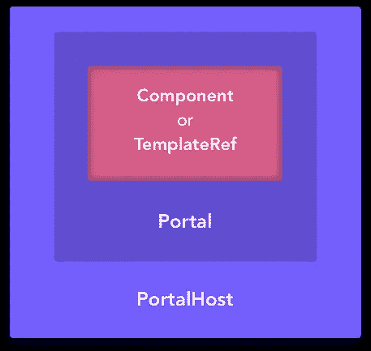

# 棱角分明的 CDK 初探

> 原文：<https://medium.com/hackernoon/a-first-look-into-the-angular-cdk-67e68807ed9b>

在这篇文章中，我深入探讨了最近发布的 Angular CDK 的一些特性。具体我就说说 Portal 和 PortalHost。

*TL；DR:我用最近发布的角度 CDK 构建了一个简单的例子。跳转到本文末尾的代码或者* [*访问 Stackblitz*](https://stackblitz.com/edit/angular-cdk-portal-basic) *中的工作演示。*

# **棱角分明的物质 CDK**

作为一点介绍，Angular Material 团队[前几天发布了](http://angularjs.blogspot.com.co/2017/07/angular-material-status-update.html)Angular Component 开发套件。我不会花太多精力解释什么是 CDK，所以我宁愿在这里引用它们:

> CDK 的目标是给开发者更多的工具来为网络构建令人敬畏的组件。这对于希望利用角形材料的特性而不采用材料设计视觉语言的项目尤其有用。— **棱角分明的团队**

因此，很明显，CDK 是由一堆服务、指令、组件、类、模块等组成的，这使得我们在开发 Angular 组件时更加容易。在当前的第一个版本中，它们包含了可访问性、文本方向性、平台检测和动态组件实例化的特性。**在这篇文章中，我将专门讨论动态组件实例化。还没有文档，但是你可以在这里看一下代码。CDK 是在@angular/cdk npm 包下发布的。**

## 我为什么要考虑用这个呢？

CDK 背后的人和角状物质背后的人是同一批人。Angular Material 团队的任务之一就是在考虑性能、a11y、i18n、可扩展性等因素的情况下，为如何在 Angular 中正确构建组件打下良好的基础。所以，在差不多 [3k 期结束](https://github.com/angular/material2/issues)后，我确信他们对如何为网络构建好的组件略知一二。使用自动 CDK 是一种安全的方法，可确保将最佳实践纳入您的组件生产工作流程。

# 门户和门户主机

我将尽力解释这两个核心概念，它们在 Angular 素材库中被大量使用。在 CDK 源代码中有一个关于这个主题的简短文档，你可以在这里访问。简单地说，CDK 公开了一个 API，让您通过门户和门户主机进行动态组件实例化。这意味着您可以轻松地在任何其他元素中注入组件或模板，无论它是一个`ng-template`还是一个普通的 DOM 元素(比如`document.body)`)。让我们来分解一下`Portal`和`PortalHost`的概念。

**Portal:****您想在其他地方插入的 UI 块。它可以是 Component 或 TemplateRef。**

****PortalHost:** 要渲染门户的地方。PortalHost 有一个名为`DOMPortalHost`的具体实现，它基本上允许您将门户附加到 Angular 应用程序上下文之外的任意 DOM 元素，比如`document.body`。**

****

**A Component or Template Ref is attached to a Portal. A portal is then attached to a PortalHost. A PortalHost can be an ng-template or an arbitrary DOM element.**

**在我们跳到如何在真实世界场景中使用这些概念的例子之前，我建议您在这里访问 CDK 源代码[中的`portal.ts`实现。不要试图理解具体的实现细节(如果你想的话就去做)，而是看一看这些类和它们的方法。通过阅读它们的名字，你将很快掌握每个类和方法的作用。这会让你对这些工具为你做了什么有一个很好的感觉。](https://github.com/angular/material2/blob/master/src/cdk/portal/portal.ts)**

# **例子**

**在本例中，我们将构建一个简单的服务/组件，让我们显示完整的宽度/高度 *Loading…* 消息。当您在几个屏幕中从一个 API 加载数据时，这真的很方便。下面的代码片段假设已经通过`npm install @angular/cdk`安装了 CDK。**

**我们将在我们的文档的`<body>`中添加一个组件，所以如果你能先看看这篇文章中的*普通的、非 cdk* 方法[，下面的代码会更有意义。](/@caroso1222/angular-pro-tip-how-to-dynamically-create-components-in-body-ba200cc289e6)**

## **该组件**

**我们应该做的第一件事是创建一个带有 *Loading…* 消息的组件。它也可以有一个旋转器，一个阴影背景，淡入/淡出动画等。因为这不是这篇文章的核心，我假设你已经知道如何去做，我将在这里跳过实现细节。您应该注意的一件事是**将您的组件添加到您的模块的** `**entryComponents**`。为了便于举例，我们将组件命名为`LoadingSpinnerComponent`。**

## **服务**

**这就是我们应用在这篇文章中学到的概念的地方。我们将构建一个服务`LoadingSpinnerService`，它公开两个简单的方法:`reveal()`和`hide()`，这两个方法将分别显示和隐藏我们的加载微调器(咄)。**

## **分解要点**

**我真的觉得代码是非常自我解释的，但我还是会添加一些评论。请遵循片段注释中的数字:**

1.  ****创建对门户的引用:**如前所述，门户是用于包含组件或模板引用的抽象。在这种情况下，我们将从之前创建的`LoadingSpinnerComponent`构建一个门户。**
2.  ****创建对 PortalHost:** 的引用，我们将使用`document.body`来注入我们的组件。我们选择了一个 DOM 元素作为主机的锚点，所以我们使用了`PortalHost`的`DomPortalHost`实现。**
3.  ****注入依赖关系:**这些依赖关系是`DomPortalHost`构建门户主机所需要的。如果你想了解 CDK 是如何处理所有这些依赖关系的，请访问这篇文章，在这篇文章中，我详细介绍了所有这些细节。**
4.  ****创建门户:**`Portal`抽象类有两个实现:`ComponentPortal`和`TemplatePortal`。我们使用前者作为我们的构造函数，因为我们想要基于我们的`LoadingSpinnerComponent`创建一个门户。**
5.  ****创建 PortalHost:** 与第 4 点相同，我们使用构造函数基于 DOM 元素`<body>`构建 PortalHost。如果你想知道为什么我选择了`document.body`来附加组件，原因很简单:loading spinner 是一个应该放在屏幕中任何其他元素之上的组件，如果放在任何其他元素之内，我们不想处理堆叠问题。此外，它作为一个对话框工作，因此，从架构上来说，它不应该是任何组件的后代的一部分。**
6.  ****显示微调器:**通过简单地将组件连接到门户主机来显示组件。就这么简单。**
7.  ****隐藏旋转器:**通过简单地将组件从门户主机上拆下来隐藏组件。就这么简单。**

****工作演示(鸣谢** [**格欣奥克斯**](https://medium.com/u/dc147cdeb83e?source=post_page-----67e68807ed9b--------------------------------)**):**[https://stackblitz.com/edit/angular-cdk-portal-basic](https://stackblitz.com/edit/angular-cdk-portal-basic)。**

**我希望这篇文章能激励你去玩新的棱角分明的 CDK。Angular Material 团队肯定会在接下来的几周内为 CDK 添加更多功能，敬请关注。**

**如果你喜欢这个，请展示你的爱并分享。通过 Twitter [@caroso1222](https://twitter.com/caroso1222) 联系我。**