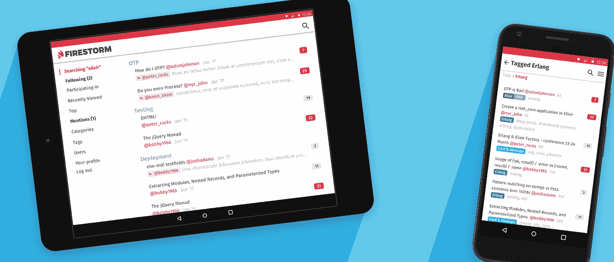

# 免费介绍长生不老药，OTP，埃克托，凤凰

> 原文：<https://medium.com/hackernoon/a-free-introduction-to-elixir-otp-ecto-and-phoenix-228d0e994fc1>

今天，DailyDrip 发布了**五周的免费内容，向人们介绍 Elixir 编程语言**，并帮助他们准备使用 Ecto 和 Phoenix 构建 web 应用程序。我们制作了 25 集短片(每集大约 5 分钟)，带你从“这是什么长生不老药？”到“酷，我知道如何构建一个基于 Phoenix 的基本 webapp”。在此基础上，我们在持续的优质内容中构建了一个具有生产能力的应用程序。

如果你只是想看内容，[你可以跳过](#e4e5)，否则留下来，我们会看看为什么我们在长生不老药生态系统上投入了这么多时间。

# 一点历史

四年前我开始使用 ElixirSips，因为我在几个项目中遇到了并发和容错问题。通过研究，我得出结论，这些问题的解决方案是[演员模型](https://en.wikipedia.org/wiki/Actor_model)，这让我想到了《二郎》和《长生不老药》。18 个月前，亚当加入了我的团队，ElixirSips 变成了 DailyDrip。我们的目标是帮助你**成为更好的开发者**；为此，我们每天都会制作关于 Elixir、Elm 等内容的短片。

# firestorm——一个基于凤凰城的开源论坛

去年晚些时候，我们注意到缺乏使用 Elixir 和 Phoenix 的实例项目。与此同时，我们对将评论插入到 [DailyDrip](https://www.dailydrip.com) 中的选项并不满意。所以我们在 Kickstarter 上开始了 [Firestorm Forum](http://firestormforum.org) 项目[，我们的想法是提供关于其开发的内容。Kickstarter 成功了！](http://kickstarter.com/projects/1003377429/firestorm-an-open-source-forum-in-phoenix-from-eli)

作为 Kickstarter 的一部分，我们创建了免费内容，向更多人介绍长生不老药。这就是我们在这篇文章末尾宣布的内容。我们也将继续在[每日疗法主题](https://www.dailydrip.com/topics/elixir)中建立火暴论坛。我们正在以我们从经验中学到的生产应用程序构建方式构建这个项目，使用最佳实践，如**持续集成、持续部署和可靠的测试套件。**

我们已经开发了 Firestorm 的 alpha 版本，并在社区内试用。我们正在为凤凰 1.3 改造火焰风暴。我们预计在 7 月初达到 1.0。

*We produced the design via collaboration with our backers and our designer, Amy.*

随着这个项目的发展，它将为任何构建生产 Elixir 应用程序的人可能遇到的问题提供现实世界的解决方案。我们希望这有助于个人和团队接受万金油和它的社区。详细的开发日志也让人们很容易[对火风暴](http://github.com/dailydrip/firestorm)本身做出贡献，当然！

如果没有[和所有为我们的 Kickstarter](https://github.com/dailydrip/firestorm/blob/master/PATRONS.md) 做出贡献的人的支持，我们在这个项目上花费的免费内容和时间是不可能的。我们非常感激，并希望这个项目能够证明为世界构建高质量的开源软件是可能的——同时也生产高质量的教育材料。如果你**对火风暴论坛的成功感兴趣，**或者发现免费内容有价值，并且**想在世界上看到更多这类事情**，如果你[在 DailyDrip 注册一个个人或团队账户，我们将不胜荣幸。](https://www.dailydrip.com/pages/pricing)

# 创业很难！

严峻的事实是，我们在为你提供所有这些内容的同时也在赔钱。我们试图帮助开发者创造一个更好的世界。我们有一些很棒的内容，不仅能帮助你学习[仙丹和凤凰](https://www.dailydrip.com/topics/elixir)，还能帮助你学习[榆树](https://www.dailydrip.com/topics/elm)、[反应原生](https://www.dailydrip.com/topics/react-native)、[迅捷 3](https://www.dailydrip.com/topics/swift) 、[灰烬](https://www.dailydrip.com/topics/ember)以及[更多](https://www.dailydrip.com/topics)。人们告诉我们，他们喜欢我们的内容，但是为了继续制作它，以及像 Firestorm 这样的项目，我们需要更多的付费用户。

我们很乐意帮助您或您的开发团队了解软件世界的最新动态。此外，如果您有一个需要高级开发人员解决的难题，[我们可以帮助](mailto:support@dailydrip.com)。

我们想养活我们的家人，专注于制作优秀的内容和开源软件，请点击这里订阅[帮助我们实现这一目标。也就是说，不多说，这里是我们的免费内容！](https://www.dailydrip.com/pages/pricing)

# 插曲

## 第 1 周:开始药剂

在第一周，您将学习 Elixir 编程语言语法及其工具的基础知识，并学习如何在进程间发送消息。我们以一个自我指导的练习结束，来建立一个你自己的独立过程。

*   [【001.1】仙丹入门](https://www.dailydrip.com/topics/elixir/drips/introduction-to-elixir) —语言入门，安装二郎和仙丹
*   [【001.2】基本的 Elixir 语法和概念](https://www.dailydrip.com/topics/elixir/drips/basic-elixir-syntax-and-concepts) —学习语言的基础知识，以及如何运行脚本。
*   [【001.3】混合和模块](https://www.dailydrip.com/topics/elixir/drips/mix-and-modules-db615e15-d790-403d-a6d0-c65444e35ef2) —使用混合工具并定义模块、函数和结构
*   [【001.4】流程和消息](https://www.dailydrip.com/topics/elixir/drips/processes-and-messaging-08687de7-07c6-4cc3-b6c6-4398d137820c) —流程是并发的单位。我们将生成一些进程，并让它们进行对话。
*   [【001.5】Elixir Weekly Drip # 1 和练习:String up caser“micro service”](https://www.dailydrip.com/topics/elixir/drips/elixir-weekly-drip-1-and-exercise-string-upcaser-microservice)—更多阅读链接和一个免费练习，以构建一个过程，该过程使用发送的任何字符串的大写版本进行响应。

## 第二周:中级药剂

在第二周，你将学习如何使用 ExUnit 编写测试，语言本身的更多方面，以及如何管理状态。

*   [【002.1】中间药剂制备](https://www.dailydrip.com/topics/elixir/drips/intermediate-elixir-prep) —准备了解管理状态和测试。
*   [【002.2】具有状态的进程，以及代理](https://www.dailydrip.com/topics/elixir/drips/processes-with-state-and-agent) —管理具有进程和消息的状态，然后查看标准库中的代理模块，以获得更简单的方法来完成相同的事情。
*   [【002.3】‘for’Comprehensions](https://www.dailydrip.com/topics/elixir/drips/for-comprehensions)——处理可枚举和集合的能力和优雅。
*   [【002.4】使用 ExUnit 进行测试](https://www.dailydrip.com/topics/elixir/drips/testing-with-exunit) —深入了解 ExUnit、测试驱动开发和 doctests。
*   [【002.5】Elixir Weekly Drip # 2 和练习:逆向波兰符号计算器](https://www.dailydrip.com/topics/elixir/drips/elixir-weekly-drip-2-and-exercise-reverse-polish-notation-calculator) —文档链接、控制结构、可枚举数和构建逆向波兰符号计算器的练习。

## 第 3 周:检察官办公室

在第三周，您将了解 OTP。这是标准库的一部分，旨在帮助您更好地对并发流程建模。它还提供了监督树，这是使用 Elixir 构建容错应用程序的基础。

*   [【003.1】准备学习动态口令](https://www.dailydrip.com/topics/elixir/drips/preparing-to-learn-about-otp) —逆向波兰符号计算器练习的解决方案，以及学习动态口令的预备读物。
*   [【003.2】GenServer 和 Supervisor](https://www.dailydrip.com/topics/elixir/drips/genserver-and-supervisor) —构建通用服务器和监督树
*   [【003.3】监督任务和代理](https://www.dailydrip.com/topics/elixir/drips/supervising-tasks-and-agents) —使用监督人处理任务和代理中的细微差别。
*   [【003.4】genstate machine](https://www.dailydrip.com/topics/elixir/drips/genstatemachine)—用数字锁模拟一扇门，探索构建有限状态机。
*   [【003.5】Elixir Weekly Drip # 3 和练习:受监督的 RPN 计算器和带式打印机](https://www.dailydrip.com/topics/elixir/drips/elixir-weekly-drip-3-and-exercise-supervised-rpn-calculator-and-tape-printer) —有趣的链接和练习，使用 GenServer 和带式打印机构建 RPN 计算器。

## 第四周:埃克托

在第四周，我们介绍了 Ecto，它可以帮助您与数据库进行交互。我们将开始为一个论坛构建一个数据模型，并以几个重要的查询结束。

*   [【004.1】准备学习 Ecto](https://www.dailydrip.com/topics/elixir/drips/preparing-to-learn-about-ecto) —上周练习的解答和一些阅读材料，为我们学习 Ecto 做准备。
*   [【004.2】Ecto 基础知识](https://www.dailydrip.com/topics/elixir/drips/ecto-basics) —通过创建一个基本模式并对其进行查询来开始使用 Ecto。
*   [【004.3】使用变更集的 Ecto 验证](https://www.dailydrip.com/topics/elixir/drips/ecto-validation-with-changesets) —确保您的数据灵活地满足您的要求。
*   [【004.4】Ecto 关联和更多查询](https://www.dailydrip.com/topics/elixir/drips/ecto-associations-and-more-queries) —探索如何在 Ecto 中对关联数据建模以及查询的更多细节。
*   [【004.5】药剂每周点滴#4 和练习:更多查询](https://www.dailydrip.com/topics/elixir/drips/elixir-weekly-drip-4-and-exercise-more-queries) —一些与 Ecto 相关的链接和一个编写更详细查询的练习

## 第五周:凤凰城

在第五周也是最后一周的免费内容中，你将了解凤凰城，我们将从头开始建立火风暴论坛。Firestorm 是一个开源的基于 Phoenix 的论坛引擎，旨在提供一个大型的、真实的 Phoenix 代码库，供人们学习。

*   [【005.1】准备了解凤凰](https://www.dailydrip.com/topics/elixir/drips/preparing-to-learn-about-phoenix) —解一道 Ecto 习题，准备了解凤凰。
*   [【005.2】开始使用 Phoenix](https://www.dailydrip.com/topics/elixir/drips/getting-started-with-phoenix) —创建一个新的应用程序并生成一些资源。
*   [【005.3】凤凰与前端](https://www.dailydrip.com/topics/elixir/drips/phoenix-and-the-frontend) — HTML、CSS、JavaScript 都是实实在在的东西。
*   [【005.4】Phoenix 中的嵌套资源](https://www.dailydrip.com/topics/elixir/drips/nested-resources-in-phoenix) —类别有线程，我们的 URL 应该反映这一点。
*   [【005.5】药剂每周点滴#5 和练习:修复测试](https://www.dailydrip.com/topics/elixir/drips/elixir-weekly-drip-5-and-exercise-fix-tests)——修复上一集之后的测试，以及一些凤凰相关的链接。

## 第六周:开始大风暴

第六周是优质内容开始的地方，我们将从这里继续前进。本周我们从早午餐转向 Webpack2，实现 OAuth 认证，研究 Ecto。Multi，了解如何使用变更集更智能地处理一些事务，并处理视图和布局。

*   [【006.1】Webpack 2 与 Phoenix](https://www.dailydrip.com/topics/elixir/drips/webpack2-with-phoenix) —在 Phoenix 应用程序中用 web pack 代替早午餐
*   [[006.2]通过 OAuth 的认证](https://www.dailydrip.com/topics/elixir/drips/authentication-via-oauth) —使用 Ueberauth 向 OAuth 提供商认证用户。
*   [【006.3】向具有数据库事务的线程添加帖子](https://www.dailydrip.com/topics/elixir/drips/adding-posts-to-threads-with-database-transactions) —使用 Ecto.Multi 处理数据库事务。
*   [【006.4】在 Phoenix 中使用 Ecto 关联](https://www.dailydrip.com/topics/elixir/drips/using-ecto-associations-in-phoenix) —更智能地修改和插入关联数据。
*   [【006.5】凤凰视图、模板和布局](https://www.dailydrip.com/topics/elixir/drips/phoenix-views-templates-and-layouts) —让 Firestorm 看起来更像它应该的样子。

非常感谢你的关注，请把这篇文章分享给任何你认为可能对仙丹感兴趣的人。

> [黑客中午](http://bit.ly/Hackernoon)是黑客如何开始他们的下午。我们是 AMI 家庭的一员。我们现在[接受投稿](http://bit.ly/hackernoonsubmission)并乐意[讨论广告&赞助](mailto:partners@amipublications.com)机会。
> 
> 如果你喜欢这个故事，我们推荐你阅读我们的[最新科技故事](http://bit.ly/hackernoonlatestt)和[趋势科技故事](https://hackernoon.com/trending)。直到下一次，不要把世界的现实想当然！

