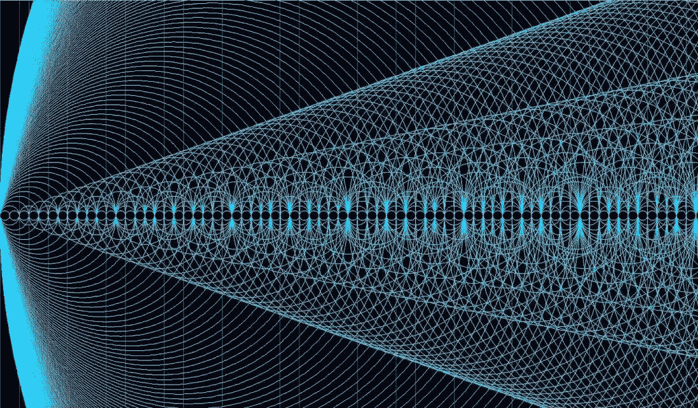
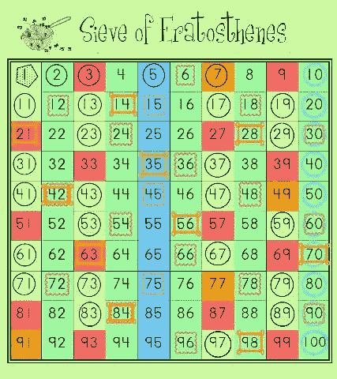
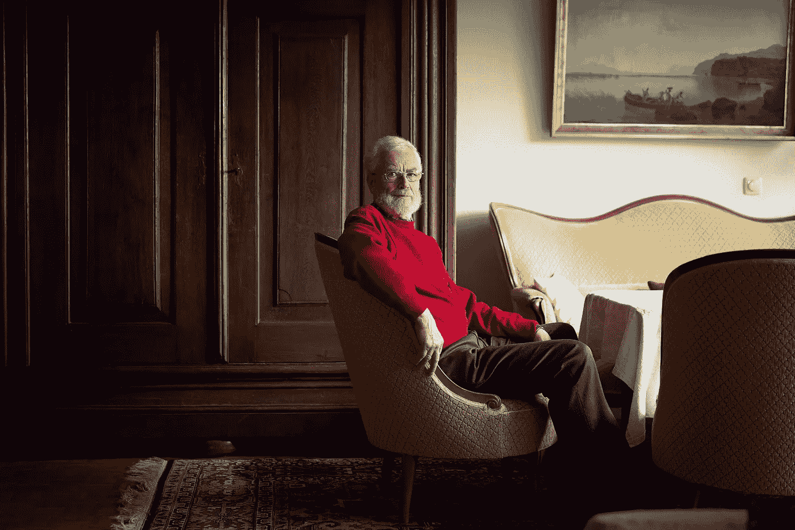

# 一个朋友发给我一个著名的未解数学题的拟议证明——那么为什么我还没有读它呢？

> 原文：<https://medium.com/hackernoon/a-friend-sent-me-a-proposed-proof-of-a-famous-unsolved-maths-problem-so-why-havent-i-read-it-446b006675c9>

## 当数学失去它的光芒，然后又恢复它

本周，我的收件箱收到了一封奇怪的电子邮件。一个朋友，代表他的朋友，给我发了一个数学证明的大纲。我经常收到这些电子邮件，但它们通常来自希望验证他们的问题集解决方案的学生。这是不同的:正在讨论的证据是关于*孪生素数*的猜想；[数学的一大未解之谜](https://hackernoon.com/tagged/mathematics)。作者正在对他的方法进行理性检查。如果他的论点被证明是有效的，我朋友的朋友将会把他的名字铭刻在数学民间传说中。我甚至可以把脚注说成是他的伟大推动者。

我激动的心情被一种强烈的怀疑情绪所抑制。我努力接受数学的伟大已经触手可及。我的反应充分说明了我与数学的关系。

*孪生素数*猜想指出，有无穷多个相隔两个的素数。孪生素数对的例子包括{5，7}、{29，31}和{41，43}。欧几里德很久以前就证明了质数本身是无限供给的；孪生素数猜想将它们的存在向前推进了一步。150 多年来，它一直是研究的主题。2014 年，当张义堂(Yitang Zhang)证明 7000 万以内有无限多的素数对时，数学家们欢欣鼓舞。这可能值得再读一遍；它说，素数的确会无限地成对出现，但它们之间的间隔可能高达 7000 万。

事实上，任何一种上限都是值得庆祝的。所以你可以想象一年后当界限减少到 246 时数学家们有多努力。一些世界上最好的数论者正在努力将这个界限缩小到 2，这将使孪生素数猜想成为现实。

The Sieve — surely too simple ([source](https://uk.pinterest.com/explore/sieve-of-eratosthenes/))

现在，在我的收件箱里，有一份两页的总结，来自一个新手数学家(一个对本科数学有基本了解的程序员)，他声称已经赢得了这场比赛。他只分享了一个大纲，以免他完全成熟的证据的荣耀从他身上被偷走。乍一看，这似乎不过是厄拉多塞的筛子的巧妙应用。作者承认他的方法看似简单——但他希望这种方法足够新颖，能够躲过这些年来伟大的数学头脑。

> 我相信奇迹，但我不会天真到认为奇迹存在于简单的数学证明中。

我不能责怪那个尝试的家伙——我也经历过，我自己的尝试在 hello 失败了。是我们中的梦想家在追逐星星。然而，令人不安的现实是，只有极少数人通过相当大的努力和牺牲才获得成功。

[安德鲁·怀尔斯小时候偶然发现费马大定理](https://www.youtube.com/watch?v=qiNcEguuFSA)(这个名字起得不恰当，因为当时它只是一个猜想)时，他敢于梦想。怀尔斯毕生致力于寻找一个 350 多年来数学家们一直未能找到的证明。怀尔斯知道什么是牺牲，他把自己的工作描述为一种痴迷，并把自己关了 7 年来实现他的抱负。他是幸运者之一；每当我走过牛津大学以怀尔斯名字命名的数学研究所时，我都会想起他的遗产。但是更多的人动摇了。

> 对于每一个安德鲁·怀尔斯，都有大量的数学头脑，但却没有一座建筑以他们的名字命名。

成功证明的回报可能会改变生活，但当成功的几率如此之低时，我们的好奇心往往会让位于失败主义。我不追求新的数学证明的主要原因也是我最痛苦的原因:它们是我无法理解的*。我的博士学位证明了挤出一点点新的数学真理所需要的极度努力。这些发现不再披着优雅的五行证明的外衣。虽然职业数学家乐于拓展知识的新领域，但他们也承认这需要蛮力和诚实的努力。*

对于除了少数痴迷的人之外的所有人来说，当你探究数学的最深处时，它就失去了光芒；以至于我无法让自己仔细阅读两页的证明大纲。

并非一切都失去了。这一插曲是与一位数学家朋友(最好的那种)共进午餐时自然而然的话题。当我反思我对《数学之旅》的冷淡拒绝时，我的朋友让我想起了托马斯·罗延的奇怪案例。

罗延在 2014 年成为头条新闻，当时他证明了另一个备受追捧的猜想，即*高斯相关不等式(GCI)。* Royen 已经退休，在他的领域并不特别出名。[他展示了 GCI](https://arxiv.org/pdf/1408.1028.pdf) 的一个简短证明——对其他人来说太短而不能当真(数学证明往往跨越几十页；怀尔斯的证明达到一百多个)。当罗延将他的证明作为 Word 文档提交给一家不知名的期刊时，他的事业没有得到任何帮助(这一行为招致数学家的嘲笑，他们希望论点被整齐地包装在乳胶中)。

Thomas Royen — the man who gives us reason to believe again ([source](https://www.quantamagazine.org/20170328-statistician-proves-gaussian-correlation-inequality/))

然而尽管如此，罗延的证明是合法的。他的 6 页文章推翻了这个猜想，用一个他认为“完全不同且相对较短”的论点结束了其他人沉浸了几十年的探索。

> 经验:也许数学奇迹仍然会发生。我们只需要多相信一点点。

Royen 最后感谢了唐纳德·理查兹，他一路帮助了他。如果我支持这位有抱负的孪生素数猜想的解决者，也许这就是等待着我的奖赏。

Royen 的例子重新唤醒了我的一部分，我相信数学可以是优雅和令人惊讶的，即使是在最高水平上。至少，它打破了帕斯卡的赌注——我的夜晚将被用来梳理这两页的大纲。我仍然心存疑虑，但我的愤世嫉俗已经消退，我还没有完全准备好放弃我对数学的热爱。

*我是一名研究数学家，后来成为教育家，从事数学、* [*教育、*](http://education) *和创新的研究。*

*来打个招呼上* [*推特*](https://twitter.com/fjmubeen) *或者*[*LinkedIn*](https://uk.linkedin.com/in/junaidmubeen)*。*

如果你喜欢这篇文章，你可能想看看我的以下作品

 [## 那次我“几乎”解决了孪生素数猜想

### 我第一次真正的数学经历

hackernoon.com](https://hackernoon.com/the-time-i-nearly-solved-the-twin-prime-conjecture-8f033030fe90)  [## 我不再理解我的博士论文(以及这对数学教育意味着什么)

### 本周早些时候，我通读了我的博士论文。我的研究是在一个叫做泛函的纯数学领域…

medium.com](/@fjmubeen/ai-no-longer-understand-my-phd-dissertation-and-what-this-means-for-mathematics-education-1d40708f61c)  [## 我的导师如何挽救了我的博士学位——数学的金发姑娘原则

### 数学无处不在

mystudentvoices.com](https://mystudentvoices.com/how-my-supervisor-saved-my-phd-the-goldilocks-principle-for-mathematics-2f90e44e7407) 

> [黑客中午](http://bit.ly/Hackernoon)是黑客如何开始他们的下午。我们是 [@AMI](http://bit.ly/atAMIatAMI) 家庭的一员。我们现在[接受投稿](http://bit.ly/hackernoonsubmission)，并乐意[讨论广告&赞助](mailto:partners@amipublications.com)机会。
> 
> 如果你喜欢这个故事，我们推荐你阅读我们的[最新科技故事](http://bit.ly/hackernoonlatestt)和[趋势科技故事](https://hackernoon.com/trending)。直到下一次，不要把世界的现实想当然！

