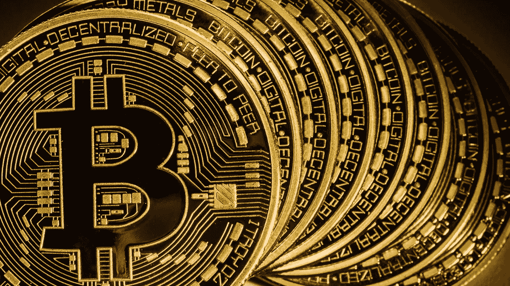

# 加密货币定价的根本性转变

> 原文：<https://medium.com/hackernoon/a-fundamental-shift-in-cyptocurrency-pricing-c00ff2b04e52>

比特币的价格每隔几周就会创下历史新高。

其他大多数硬币的价格都低于一年来的最高水平。

过去的情况是，如果比特币上涨，其他大多数货币也会上涨。反之亦然。

现在情况不再是这样了。

**ALT 币的定价不再与比特币和以太坊价格挂钩。**在过去，要购买替代硬币，个人必须拥有比特币或以太坊。随着比特币和以太坊价格的上涨/下跌，替代硬币的价值也在上涨/下跌。

买家现在正在将比特币的价格与替代性货币分离开来。买家变得越来越谨慎。买家现在开始评估替代硬币的优点。买家在问自己，他们到底在买什么，拥有什么。

**所有其他硬币都被视为不如比特币。**即使是以太坊，与比特币相比，其定价也相对持平。以太坊的定价变化与所有其他替代硬币一致。

比特币被认为与其他任何硬币完全不同。这是有道理的，因为比特币目前是一种可以用来交换商品和服务的货币。

随着越来越多的“主流”企业接受比特币作为支付形式，这一差距将继续扩大。