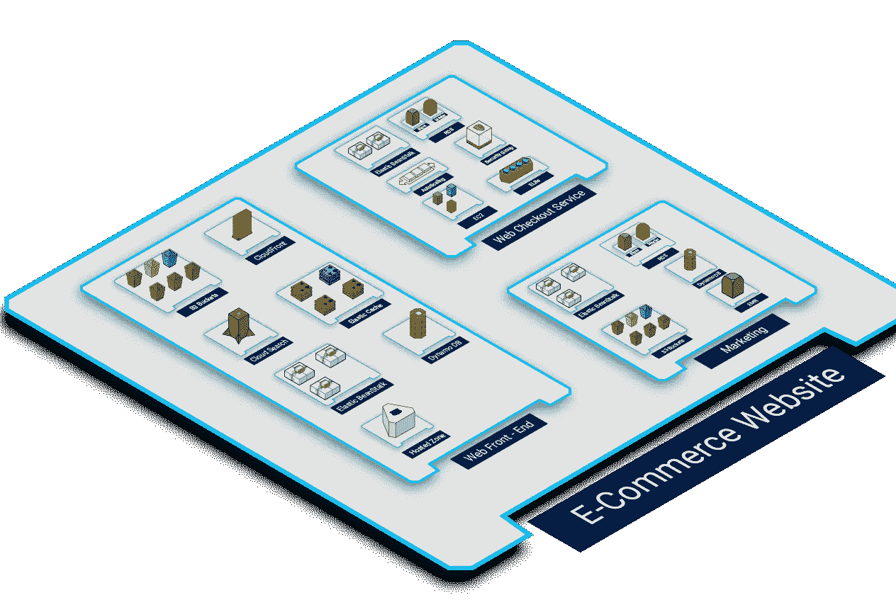
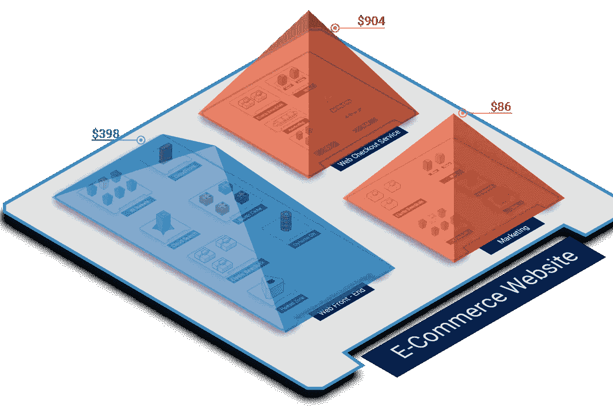
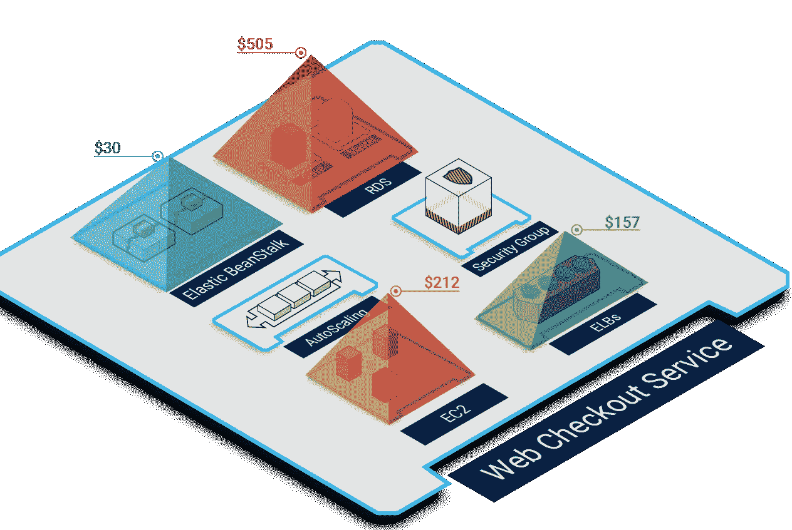
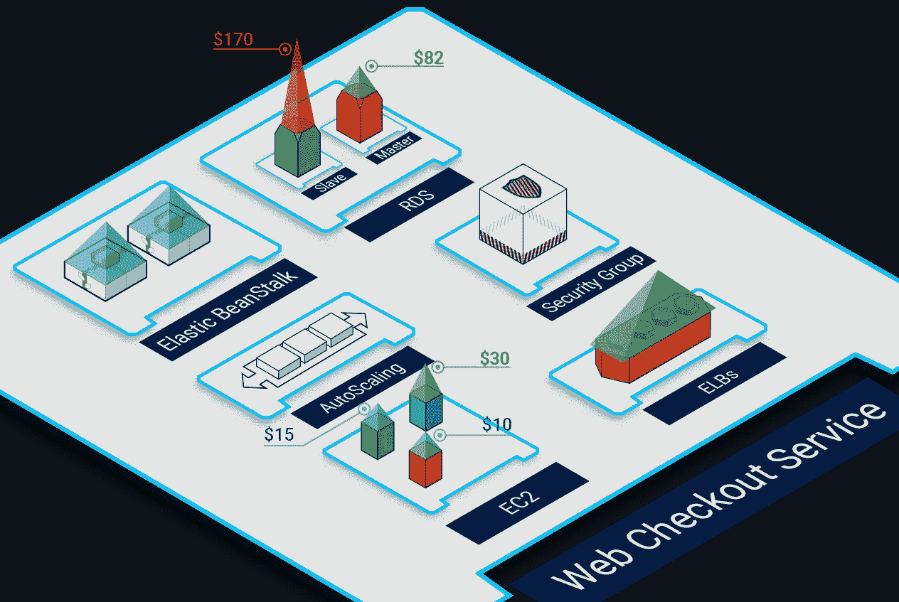
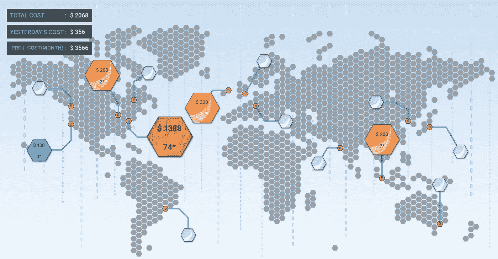
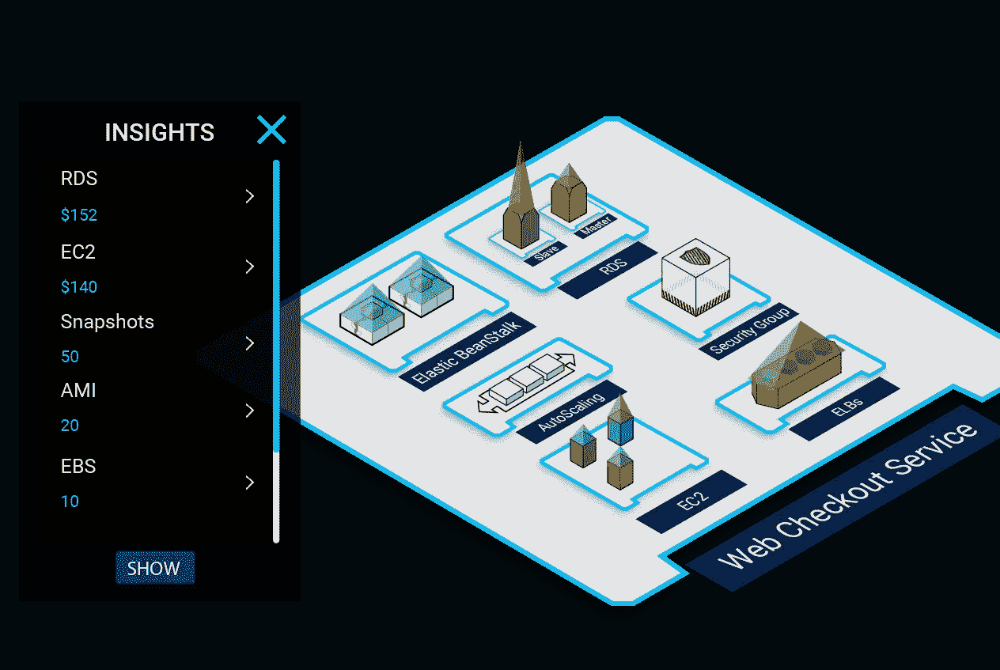
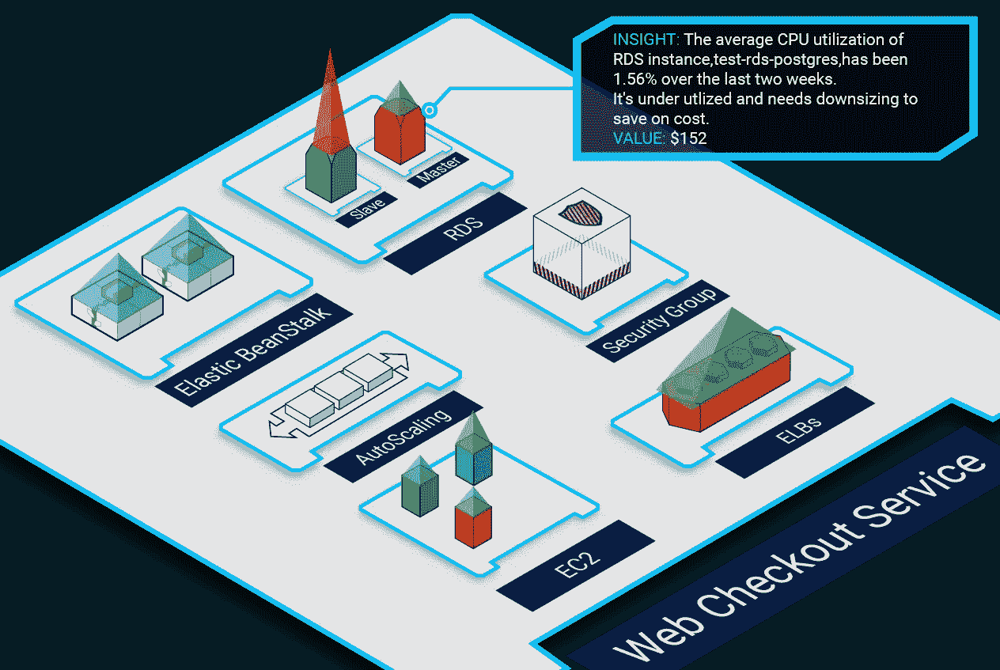

# 利用 TotalCloud 可视化成本分析器实现 AWS 成本节约最大化的游戏计划

> 原文：<https://medium.com/hackernoon/a-game-plan-to-unlock-maximum-aws-cost-savings-with-totalcloud-visual-cost-analyzer-20687bbcc14c>

Marv 是一家电子商务企业的 IT 经理，负责控制其部门的云计算成本，自从其公司的云使用规模扩大以来，他一直面临着一个巨大的挑战。他发现很难提取关于哪个团队成员每月推动增长以及哪个应用程序或资源导致 AWS 账单激增的详细信息。他也很难弄清楚目前云库存中发生了什么。他的二十人团队由 DevOps 和 CloudOps 组成，正在努力优化云的使用。无论规模和垂直行业如何，此类挑战是当今每个 IT 部门面临的典型情况。

# 你不能保存你看不见的东西

随着企业对云的使用增加，基础架构的复杂性也相应增加，账单的复杂性也相应增加。尽管 Amazon 通过整合计费和标记解决了这一挑战，但像 Marv 这样的 IT 经理仍然需要隔离开发环境以及测试帐户，以确定不同项目、部门、运行在 AWS 上的各种应用程序等之间的成本泄漏。

> 此外，当他不了解完整的 AWS 使用情况时，他如何识别或分析节约机会？

Marv 有一个解决办法——使用 *TotalCloud Cost Analyzer* ,它将成本映射到用于构建电子商务网站的实际 AWS 资源，并将其全部呈现在可视化的交互式控制台上。

# 虚拟实时查看 AWS 成本溢出并采取纠正措施

在 AWS 上实现最佳成本节约的第一步是绘制每个资源以及应用程序整体的成本，并分析资源利用率。

通过 *TotalCloud Cost Analyzer 的* Group-View，Marv 可以使用多个参数对其电子商务网站的资源进行动态分组，从标签值、标签关键字和 VPC ID 到资源类型和应用程序，并开始映射这些分组资源的成本，以获得更好的成本视角；所有这些都在一个视觉丰富的界面上。

*TotalCloud Cost Analyzer’s* Grouping Example for an E-Commerce Website

Marv 可以分析每个资源或整个应用程序的开销，并采取纠正措施。他可以获得不同资源组的 AWS 支出的实时鸟瞰图。他还可以使用 TotalCloud *成本分析器的*交互式放大功能，只需滚动几下鼠标，就可以深入到每个资源级别，并执行根本原因分析。

# **TotalCloud 成本分析器组视图**

这是 Marv 的第一级成本分析，以了解应用程序级别(如电子商务网站)的 AWS 支出，或者我们称之为“组级别”，用丰富的颜色代码表示每个组的支出，即 Web 前端、Web 结账服务和营销引擎。

*TotalCloud Cost Analyzer’s* Group View Example for an E-Commerce Website

# **TotalCloud 成本分析器深入查看**

这是 Marv 的第 2 级成本分析，以了解 AWS 在资源组级别的支出，丰富的颜色代码表示特定资源组的支出。

*TotalCloud Cost Analyzer’s* Drill Down View Example for an E-Commerce Website’s Web Checkout Service

*TotalCloud Cost Analyzer* 可以帮助 Marv 进一步深入了解特定应用的资源使用情况(例如，同一个电子商务网站的结账服务)，并直观地了解单个资源的成本。

> 最重要的是，视觉上丰富的颜色代码(表示每个资源的成本)为 Marv 提供了有关 AWS 成本的第一手信息，否则这些信息很难用数据丰富的报告来理解。

*TotalCloud Cost Analyzer’s* Resource Level Cost Analysis Example for an E-Commerce Website’s Web Checkout Service

> Marv 还可以一眼就识别出所有的问题资源和优化资源，从而消除了通过庞大的报告和仪表板来了解总体成本的需要。

# 即使不标记资源，也能清楚地了解 AWS 成本

标记在识别成本泄漏和了解应用程序级别的整体资源使用方面起着关键作用。因此，为了获得更好的成本视角，像 Marv 和他的 DevOps 团队这样的 IT 经理使用组织范围的标记实践和报告。然而，开发人员有时会忽略或忘记标记资源，包括在自动扩展组中动态分配的新资源。在这种情况下，Marv 可能会失去他希望的所有节约成本的机会。

> TotalCloud 通过智能功能解决了定位未标记资源的挑战。即使 DevOps 和 CloudOps 团队忘记标记资源，Marv 仍然可以获得特定应用程序的成本视角。因为，默认情况下，TotalCloud 在应用程序级别对资源进行分组。

TotalCloud’s Default Application Level Grouping of Resources

# 了解最昂贵的地区，对所有地区的花费一目了然

除了获得 AWS 支出的定制深入视图，Marv 和他的团队还可以通过 *TotalCloud 的全球视图*快速了解当前全球支出、预计支出和前一天的支出！

*TotalCloud’s Globe View*

# 获得前瞻性和规范性的见解

Marv 甚至可以获得关于 AWS 成本流失和基于云资源使用的潜在节约的关键建议和深刻见解。此外，他的 DevOps 和 CloudOps 团队可以研究这些见解，采取补救措施，并相应地优化 AWS 云的使用，以节省 AWS 支出。

TotalCloud Insights

Marv 还可以对问题资源进行根本原因分析，并通过实时库存视图采取纠正措施。

TotalCloud Resource Level Insight

因此，通过库存的实时视图，Marv 和他的团队可以可视化受影响的资源，与其他资源进行比较和对比，以建立正确的成本视角。

**总而言之，TotalCloud Cost Analyzer 方便用户:**

> **1。从全球视角了解 AWS 在各地区的支出。**
> 
> **2。根据 AWS 上托管的项目和应用，通过其组视图获得 AWS 支出的可见性。**
> 
> **3。借助 it 俯视图，根据其业务需求获得完整的成本视角。**
> 
> **4。通过其深入查看获取资源级别的 AWS 支出数据。**
> 
> **5。利用提供智能建议的前瞻性见解采取纠正措施。**

# 一句话:利用 TotalCloud Cost Analyzer 实现 AWS 的最大节约

在像 AWS 这样按需付费的云世界中，成本很容易失控。但借助 TotalCloud 强大的交互式可视化控制台，Marv 及其 DevOps 和 CloudOps 团队等 IT 经理可以完全控制他们的 AWS 支出。此外，通过实时呈现资源，帮助他们根据实例的当前定价快速做出决策和调整。

您是像 Marv、DevOps 或 CloudOps 工程师那样的 IT 经理之一，试图找出如何最大限度地节省 AWS 成本吗？如果是，需要试用一下 *TotalCloud 成本分析器*。

> 今天就来一次[免费试用](https://totalcloud.io/download.html)，亲自检验一下。

