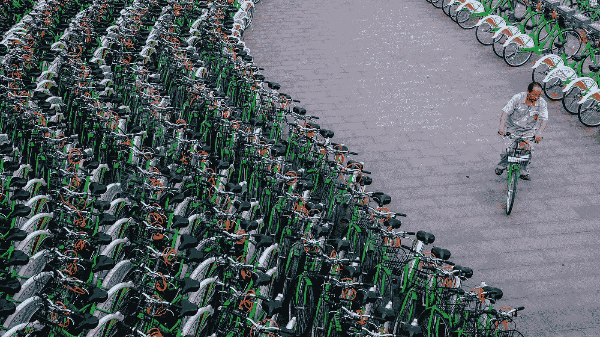
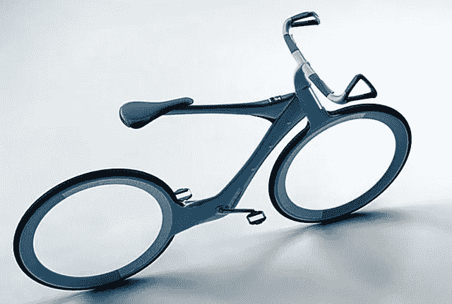
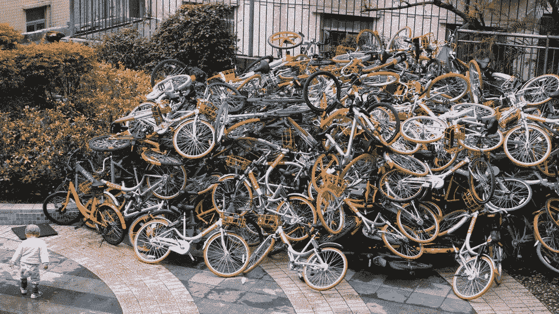

# 澳大利亚自行车共享市场的总体分析

> 原文：<https://medium.com/hackernoon/a-general-analysis-of-the-bike-sharing-opportunity-in-australia-7593fd12c907>

目前，自行车共享是风险投资生态系统中的一个强劲趋势。它起源于中国，目前在美国越来越受欢迎，它建立在旧的自行车出租站系统的基础上，有一个重大的转变:当你到达目的地时，你可以简单地把自行车放在你想去的任何地方，然后继续前进。

这些自行车不需要像墨尔本市资助的自行车共享中心那样被回收并送回码头。这是可能的，因为新技术，如低能耗蓝牙，全球定位系统和 2G 无线系统，便于跟踪，以及集成锁，使他们可以在城市中安全，独立地停放。

中国这些较新的自行车共享公司在城市地区分销产品，那里的人口密度和交通问题令大多数美国城市相形见绌。用户可以启动一个应用程序来定位最近的自行车，并可以轻松地使用它们进行单程旅行，在目的地附近有空闲空间的地方锁定它们。

在中国，总部位于北京的 [Ofo](https://www.ofo.so/) 已经从风投那里融资超过 5.8 亿美元，估值超过 1B，总部位于上海的[摩拜单车](http://mobike.com/global/)也以类似的估值融资 4.1 亿美元。顾客每天骑自行车 1000 万次，相比之下，伦敦的老式系统每年服务 1000 万次。

在美国，新的竞争对手如雨后春笋般涌现，如[社交自行车](https://www.google.com.au/url?sa=t&rct=j&q=&esrc=s&source=web&cd=1&cad=rja&uact=8&ved=0ahUKEwiEo4uix7TTAhXDKJQKHXo2D1wQFggkMAA&url=http%3A%2F%2Fwww.sobi.com%2F&usg=AFQjCNEZhSe-zQ3c_Phz8k4_xv0n3SPftw&sig2=8R4HCz3xN42PaWyRggFRyA)(被称为 SoBi)[lime bike](https://www.google.com.au/url?sa=t&rct=j&q=&esrc=s&source=web&cd=3&cad=rja&uact=8&ved=0ahUKEwi8h_HCx7TTAhVCpJQKHbmfCkEQFggtMAI&url=http%3A%2F%2Fwww.limebike.com%2F&usg=AFQjCNG5sNyJSzaRVpsJeRY94ZnoBv0MQg&sig2=PPEpVQe0_6g23eYZV6Heeg)和 [Spin](https://spin.pm/) ，它们希望实现相同的模式。Atomico 和 [a16z](https://techcrunch.com/2017/03/15/limebike-raises-12-million-to-roll-out-bike-sharing-without-kiosks-in-the-us/) 等顶级风投正在下注，现金充裕的中国公司也在寻求向美国扩张。

自然，澳大利亚地区并不是这些玩家的首选，这为本地玩家提供了一个潜在的机会，成为第一个进入市场并在我们地区建立品牌的人。

**机遇**

澳大利亚相对于其大面积而言人口较少，这意味着与北京、纽约或欧洲主要首都相比，人口密度不是一个大问题。这意味着自行车共享可能不太受欢迎，因为人们可以更快地开车，而且很少有地方是汽车无法到达的。

然而，另一方面，城市化的发展、年轻人汽车拥有量的减少(加上优步效应)以及环保意识的增强等大趋势都将使自行车共享变得流行。虽然很难想象一个商人会骑着自行车穿过城镇，但也很难想象一个千禧一代会乐意这么做。此外，澳大利亚人对运动和户外有着文化上的亲近感，这也是一个因素。

当打算创造一个新的市场时，评估 TAM 是困难的。然而，粗略的估计给了我们一个乐观的前景。尽管现有公司的商业模式略有不同，但美国用户的平均成本约为每使用半小时 1 美元。在中国，平均费用约为每半小时 7 美分。然而，将澳大利亚等同于美国市场更符合逻辑。市场领导者 Ofo 在北京拥有约 45，000 辆自行车，为约 2，150 万人口提供服务，每天有 150 万次骑行(半小时)，每 466 人有 1 辆自行车，7%的人口使用其中一辆自行车。相当于像悉尼这样的澳大利亚大城市，我们每天有 30 万人骑行。按照悉尼每天 10 万人次的保守观点，你每天的收入将达到 30 万。将这个数字乘以澳大利亚所有主要城市(大约 2.5 倍)，你每年的营业收入就是 2.75 亿美元！

自然，新西兰也可以考虑在内，还有其他尚未成为现有参与者目标的东南亚国家。自行车技术含量低，价格便宜，不依赖于良好的道路和其他类似的基础设施，因此它们对新兴经济体也很有吸引力，正如它们在中国的受欢迎程度所证明的那样。

**未来**

在中国，自行车被用作最后一公里服务。通勤者可能乘火车或公共汽车去上班，在车站下车，然后骑自行车走完最后一英里。长期以来，最后一公里一直是一个重大的物流挑战。电子商务巨头亚马逊(Amazon)一直在跟踪无人机送货，作为将这一方面降至最低的工具。

随着自动驾驶汽车和 IOT 越来越多地出现在我们的日常生活中，自行车共享公司将有能力为消费者提供下一代日常交通工具。想象一下大都市的自动电动自行车，运送顾客和包裹。一家拥有市场份额的自行车共享公司将处于有利地位，能够与主要交通平台(优步？)的未来。

此外，可以获得关于有效路线和人口流动的大量数据。这些数据可以被货币化。另一个潜在的收入来源可能来自与服务相关的广告。

**风险**

自然，制造和维护自行车的初始资本将会很高。用于驱动该模型的技术成本正在商品化，因此越来越便宜，但电动自行车的兴起使事情变得模糊不清。

澳大利亚最大的风险是严格的头盔法律，这一特点严重阻碍了墨尔本和布里斯班现有自行车系统的普及。也许有可能游说政府改变这条法律，特别是在拥挤的城市里自行车低速行驶，受伤的风险会减少。另一个策略(由优步首创)可能是鼓励用户藐视法律，直到群众支持浪潮推动创新向前发展。

此外，中国也发生过成堆的自行车被随意丢弃在城市周围的事件，造成了不安全和丑陋的环境。一些公司用经济激励来激励顾客把自行车放在安全的地方，这可能是有帮助的。总的来说，当初创公司开始为一个拥有大量不受监管的自行车的城市提供服务时，地方政府并不领情。这种风险可以通过与当地政府合作来避免，或者通过上面的优步策略。

**总结**

自行车共享的趋势正在增长，尽管它还没有袭击澳大利亚。记住上面的信息，有潜力建立一个大公司。专注于澳大利亚的风险投资公司应该留意攻击这一领域的潜在公司。

> [黑客中午](http://bit.ly/Hackernoon)是黑客如何开始他们的下午。我们是 [@AMI](http://bit.ly/atAMIatAMI) 家庭的一员。我们现在[接受投稿](http://bit.ly/hackernoonsubmission)并乐意[讨论广告&赞助](mailto:partners@amipublications.com)机会。
> 
> 如果你喜欢这个故事，我们推荐你阅读我们的[最新科技故事](http://bit.ly/hackernoonlatestt)和[趋势科技故事](https://hackernoon.com/trending)。直到下一次，不要把世界的现实想当然！

