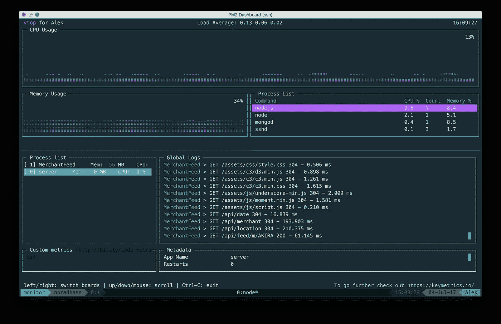
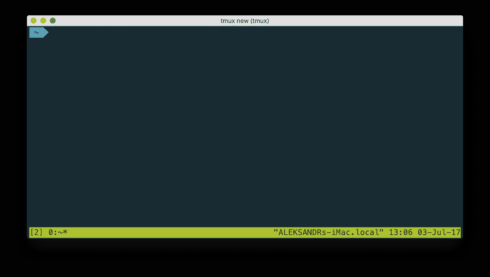
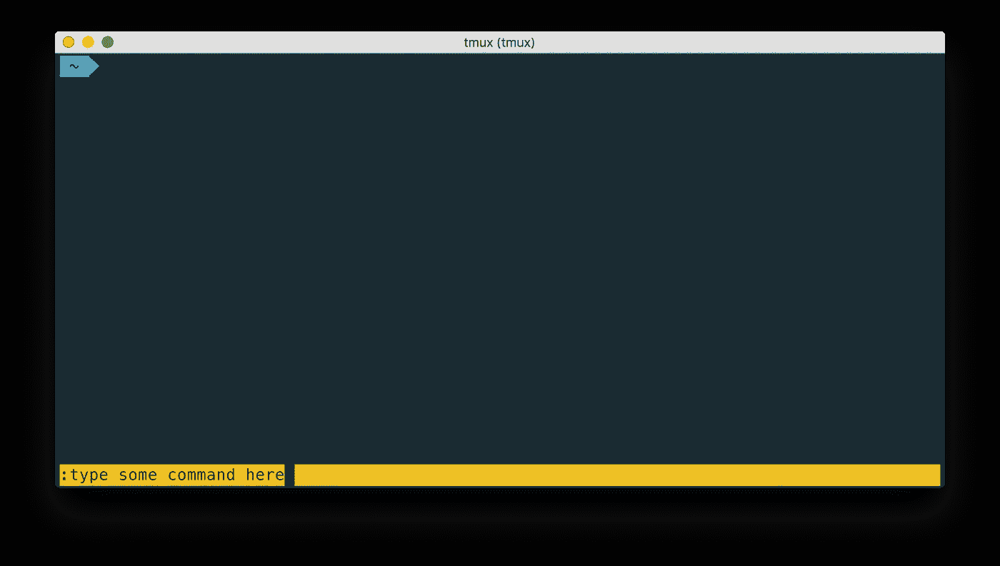
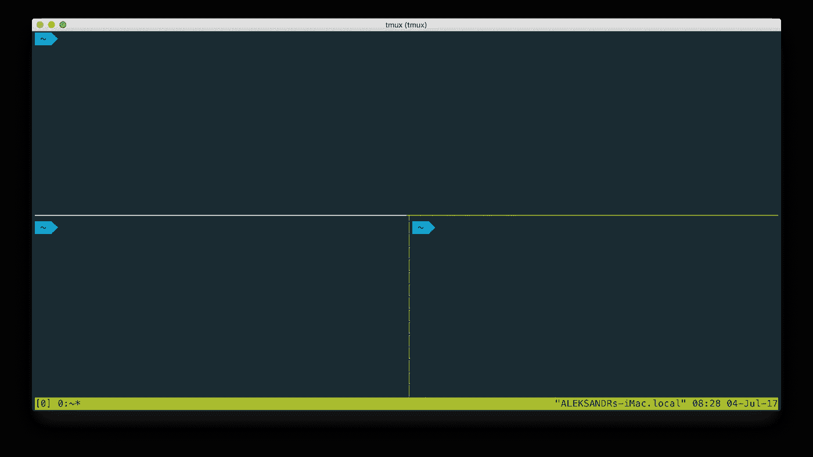
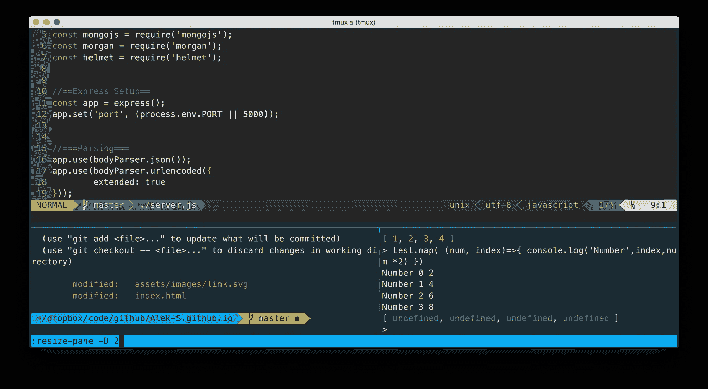
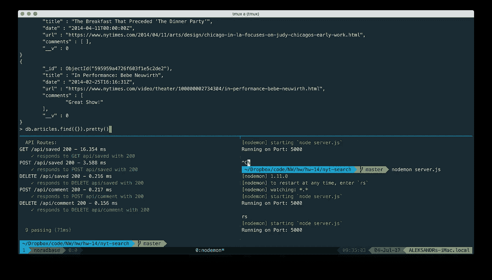

# 对 tmux 的简单介绍

> 原文：<https://medium.com/hackernoon/a-gentle-introduction-to-tmux-8d784c404340>



***tmux*** *running on a remote Ubuntu server, with* [***vtop***](https://github.com/MrRio/vtop) *on the top pane and* [***PM2***](http://pm2.keymetrics.io/) *on the bottom*

# *什么是* tmux？

官方措辞将 tmux 描述为一个屏幕多路复用器，类似于 GNU [屏幕](https://www.gnu.org/software/screen/)。本质上，这意味着 tmux 允许您在命令行环境中平铺窗口窗格。这反过来允许你在一个终端上运行或监视多个程序。

tmux 的一个常见用例是在一个远程服务器上，您有一个经常使用的通用布局，并且希望有一种快速跳转的方式。例如，如果您通过跳转服务器进行连接，并且希望同时连接到其他远程 SSH 会话。类似地，如果您必须进入 [Vim](https://hackernoon.com/vim-functionality-with-sublime-looks-a1bbaf5512d3) ，您可以使用 tmux 在同一个终端窗口中访问您的 shell 或 REPL，获得类似 IDE 的体验。

本指南将介绍 tmux 的安装和基本用法，帮助您入门和运行。或者，您可以跳过所有阅读内容，直接进入 ***主要命令概要*** 部分下的须知命令。

# 装置

本指南将重点介绍 MacOS 和 Ubuntu。如果你在 CentOS 或者 Amazon Linux 上，可以用`yum`代替`apt-get`。

## MacOS 安装

在 Mac 上开始使用 tmux 最简单的方法是使用[家酿](https://brew.sh/)包管理器。

**1** 。如果你还没有安装 Homebrew，打开终端或 [iTerm](https://www.iterm2.com/) 并粘贴以下命令:

```
/usr/bin/ruby -e "$(curl -fsSL https://raw.githubusercontent.com/Homebrew/install/master/install)"
```

**2** 。一旦安装了 Homebrew，就可以使用`brew`来安装 tmux:

```
brew install tmux
```

**3** 。通过检查版本*(注意大写的* `*V*` *)* 确认已安装:

```
tmux -V
```

## Ubuntu / Debian Linux 安装

Ubuntu 的安装与 Mac 类似，除了我们将使用预装的`apt-get`软件包管理器。请注意，我们必须将`apt-get`作为`sudo`运行。这是因为用户帐号没有足够的权限安装 tmux，所以`sudo`将允许我们以超级用户的身份安装它。

**1** 。更新`apt-get`以确保我们是最新最棒的:

```
sudo apt-get update
```

**2** 。安装 tmux:

```
sudo apt-get install tmux
```

**3** 。通过检查版本确认它已安装:

```
tmux -V
```

# 上车和下车

tmux 是基于会话的。要在 tmux 中启动一个新的会话，只需在终端中键入`tmux new`。一旦你进入 tmux，唯一明显不同的是底部一直存在的绿色条*(关于定制选项，参见***部分)。**

**

*Default view after starting new session*

*如果你在一个单独的窗格中，你可以输入`exit`来退出，你将从你来的地方返回。*

*一个重要的注意事项是`exit`不是唯一的出路，通常也不是最好的出路。为此我们有`detach`。然而，在我们开始之前，我们首先要了解前缀…*

## *使用前缀*

*tmux 中的所有命令都需要前缀快捷键，默认情况下是`ctrl+b`。我们会经常用到这个前缀，所以最好记住它。输入`ctrl+b`之后，您可以运行一个 tmux 命令，或者输入`:`得到一个 tmux 提示符。*

**

*“**ctrl+b :**” to get tmux command prompt*

*输入前缀时，tmux 本身不会有任何变化。所以，如果你输入`ctrl+b`而没有任何变化，这并不一定意味着你输入错误。*

## *连接、分离和删除*

*如前所述，一个更好的不退出会话的方法是`detach`会话。为此，首先输入前缀命令，然后输入`d`的分离快捷键:*

```
*ctrl+b d*
```

*这将分离当前会话并使您返回到正常的 shell。*

*然而，仅仅因为你出去了并不意味着你的会议结束了。分离的会话仍然可用，允许您从停止的地方继续。要检查哪些会话处于活动状态，您可以运行:*

```
*tmux ls*
```

*tmux 会话将在左侧各有一个与之相关联的编号*(自然索引为零)*。该号码可用于连接和返回到同一会话。例如，对于第 3 个会话，我们应该键入:*

```
*tmux attach-session -t 3*
```

*或者，我们可以使用以下命令转到上次创建的会话:*

*`tmux a #`*

## *命名会话*

*现在我们*可以*只依赖会话号，但是如果我们根据会话的预期用途来命名会话，会使我们的生活变得容易得多。*

*要使用特定名称启动新会话，我们只需执行以下操作:*

```
*tmux new -s [name of session]*
```

*有了指定的会话，现在当我们做`tmux ls`时，我们看到的是会话名。同样，我们可以使用以下名称附加一个会话:*

```
*tmux a -t [name of session]*
```

*请注意，我们用`a`代替了`attach-session`，以帮助节省击键次数。*

# *管理窗格*

*在 GUI 桌面环境中，你有窗口。在 tmux 中，你有窗格。就像 GUI 中的窗口一样，这些窗格允许您与多个应用程序进行交互，同样可以打开、关闭、调整大小和移动。*

*与标准的 GUI 桌面不同，这些窗格是平铺的，主要由 tmux 快捷方式管理，而不是鼠标*(尽管鼠标功能可以添加*[](https://github.com/gpakosz/.tmux)**)*。要创建一个新的窗格，你只需水平或垂直分割屏幕。**

**要水平拆分窗格:**

```
**ctrl+b "**
```

**要垂直拆分窗格:**

```
**ctrl+b %**
```

****

**tmux split horizontally, with lower pane split vertically**

**您可以使用相同的方法进一步拆分窗格。例如，在上面的截图中，首先使用`ctrl+b "`水平分割屏幕，然后使用`ctrl+b %`在下方窗格中垂直分割屏幕。**

**要从一个窗格移动到另一个窗格，只需使用前缀后跟箭头键:**

```
**ctrl+b [arrow key]**
```

## **调整窗格大小**

**假设我们需要一个额外的空间来容纳我们的一个窗格，并希望将该窗格向下扩展几行。为此，我们将进入 tmux 提示符:**

```
**ctrl+b :**
```

**在那里，我们可以键入`resize-pane`，后跟一个方向标志:`-U`表示向上，`-D`表示向下，`-L`表示向左，`-R`表示向右。最后一部分是要移动的行数。**

**例如，如果我们在顶部窗格中，并希望将其向下扩展两行，我们将执行以下操作:**

```
**ctrl+b :
resize-pane -D 2**
```

****

****resize-pane -D 2** being entered**

# **用自定义主题变得有趣**

**定制 tmux 主要通过`.tmux.conf`文件来完成。**

**从头开始创建一个自定义主题非常耗时。因此，最好使用一个预先制作的主题作为出发点。在吉姆·梅尔伯格的 tmux-themepack 回购上可以找到一个特别好的收藏。**

**只需选择您想要的一个并将配置复制到`~/.tmux.conf`中，然后用`tmux source-file ~/.tmux.conf`获取它。**

****

**tmux running [**Cyan theme**](https://github.com/jimeh/tmux-themepack/blob/master/powerline/default/cyan.tmuxtheme) with 3-pane layout**

# **额外资源**

**这里的可能性只是冰山一角。如果你准备进一步深入兔子洞，下面的链接应该有助于填补空白。**

*   **[**cheat sheet**](https://gist.github.com/MohamedAlaa/2961058)by[Mohamed alaa](https://github.com/MohamedAlaa)**
*   **[**tmux-themepack**](https://github.com/jimeh/tmux-themepack) 作者[吉姆·梅尔伯格](https://github.com/jimeh)**
*   **[**陶的 tmux**](https://leanpub.com/the-tao-of-tmux/read) 作者[托尼·纳洛克](https://leanpub.com/u/tonynarlock)**
*   **[**哎呀我的 Tmux！**](https://github.com/gpakosz/.tmux) 作者[格雷戈里·帕科兹](https://github.com/gpakosz)**

# **主要命令摘要**

*****问题/评论/其他？*** *通过*[*GitHub*](https://github.com/Alek-S)*或*[*LinkedIn*](http://linkedin.com/in/alekshnayder)给我留言**

**[](http://bit.ly/HackernoonFB)****[](https://goo.gl/k7XYbx)****[](https://goo.gl/4ofytp)**

> **[黑客中午](http://bit.ly/Hackernoon)是黑客如何开始他们的下午。我们是 [@AMI](http://bit.ly/atAMIatAMI) 家庭的一员。我们现在[接受投稿](http://bit.ly/hackernoonsubmission)并乐意[讨论广告&赞助](mailto:partners@amipublications.com)机会。**
> 
> **如果你喜欢这个故事，我们推荐你阅读我们的[最新科技故事](http://bit.ly/hackernoonlatestt)和[趋势科技故事](https://hackernoon.com/trending)。直到下一次，不要把世界的现实想当然！**

****