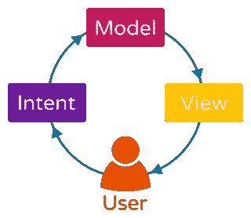
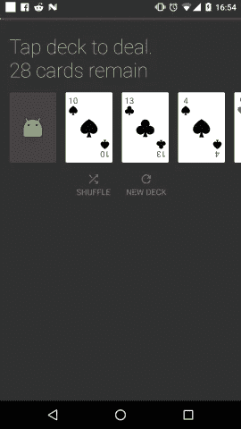
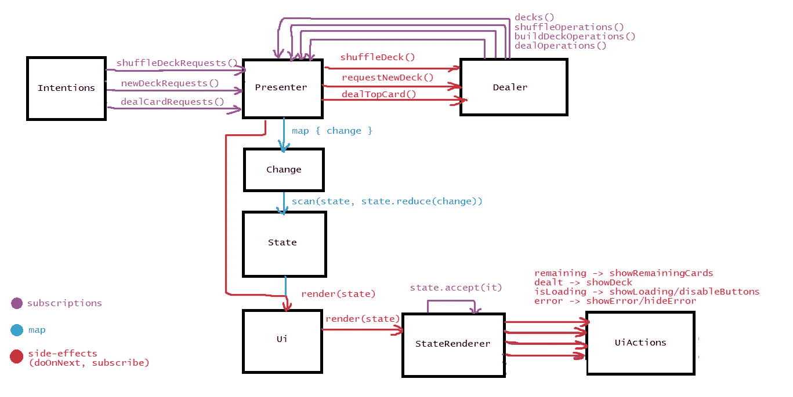

# 透过一副纸牌看 MVI 一眼

> 原文：<https://medium.com/hackernoon/a-glance-at-mvi-through-a-deck-of-cards-4298a349b090>

from [https://lambda-it.ch/blog/post/reactive-data-flow-in-angular-2](https://lambda-it.ch/blog/post/reactive-data-flow-in-angular-2)

自从我看到使用 RxSealedUnions 实现[“网球形”的示例后，我就一直对 MVI 很好奇。老实说，我仍然不完全确定它是如何工作的(我认为它应该有自己的文章)——它在 lambdas 上看起来更好，它是一个有限状态机的实现，具有严格定义的状态，其中联合定义了给定的状态，以及它们在给定的状态下如何反应。](https://github.com/pakoito/RxSealedUnions2/blob/master/rxsealedunions2/src/test/java/com/pacoworks/rxsealedunions2/tennis/TennisGame.java#L21)

有了这个联合设置，无效的州是不可能的。

Tennis Kata: scorePoints() by Pakoito

虽然这是 MVI 希望通过其不变的视图状态实现的——对我来说，也许还有许多其他人，MVI 的概念似乎很难理解、掌握和实现。

如果你想了解 MVI，你会看到令人生畏的代码和令人生畏的框架，如[cycle . JS](https://cycle.js.org/)(JS)[Redux](http://redux.js.org/)(JS)[Cyklic](https://github.com/bkase/cyklic/blob/master/lib/src/main/java/com/bkase/cyklic/example/SimpleCounter.kt#L20-L35)(Kotlin)，以及最后但同样重要的 [Elm Architecture](https://guide.elm-lang.org/architecture/) [用 Elm](https://github.com/evancz/elm-todomvc/blob/master/Todo.elm#L119-L196) (一种函数式语言，不像 C#、C++或[Java](https://hackernoon.com/tagged/java)——它们是命令式的)！

最重要的是，许多 [Redux](https://hackernoon.com/tagged/redux) 例子喜欢展示同步代码，在那里你添加一个 TODO 到一个没有持久性和异步操作的内存存储中——好吧，现实生活并不那么容易。

但说够了，我答应 MVI，所以我们走吧！

# 一副扑克牌

幸运的是， [Zak Taccardi](https://medium.com/u/bbd9a49ea3d9?source=post_page-----4298a349b090--------------------------------) (他是一个很酷的人，你应该跟随他)收集了一个基于 MVI 架构的相当平易近人的例子(这是他之前关于状态渲染器的[帖子的后续)。](https://hackernoon.com/model-view-intent-mvi-part-1-state-renderer-187e270db15c)

Picture of the Deck of Cards app

源代码可以在 [Zak Taccardi 的 Github 资源库(](https://github.com/ZakTaccardi/deck-of-cards) `ZakTaccardi/deck-of-cards` [)](https://github.com/ZakTaccardi/deck-of-cards) 获得，并且是用 Kotlin 编写的。

然而，如果你对跟随 Kotlin 感到不安，那么幸运的是，我花了时间将代码转换为 Java，这可以在一个 fork ( `[zhuinden/deck-of-cards](https://github.com/Zhuinden/deck-of-cards)` [)](https://github.com/Zhuinden/deck-of-cards) 中的[我的名字下找到。](https://github.com/Zhuinden/deck-of-cards)

.

.

.

该应用程序本身看起来相当简单——你可以点击卡片来分发这副牌的顶部，你可以要求应用程序洗牌。并且你可以创建一副新的牌(它会把所有发的牌拿出来重新洗牌)。

操作本身不是即时的，它模拟了中间的“加载”，因为“网络请求”需要时间。

偶尔，也有随机注入的“错误”,以表明有时事情并不顺利，我们也需要处理错误状态。

# 组件概述

Components and their interactions with one another

这里有一些重要的事情需要注意。

*   **意图**:指用户可以通过 UI 触发的动作。
*   **Presenter** :订阅所有暴露的请求和触发状态变化的操作。当一个请求/操作发生时，它们被映射到一种类型的`Change`——用于根据先前的状态和变化减少(评估)新的状态。
*   **变化**:表示一种变化类型，它决定了状态应该如何变化。
*   **状态**:表示应用程序的状态——在这种情况下，如果洗牌，当前的牌正在发牌，正在建立新的牌，或者是否有错误。
*   **Ui** :将`render(State)`通话从主持人处委托给`StateRenderer`。
*   **StateRenderer** :将`State`分成几个部分，并分别观察其中的变化(使用`PublishRelay`和`distinctUntilChanged()`过滤器)，然后调用`UiActions`，当给定属性发生变化时，它会修改 UI。
*   **UiActions** :表示可以操作 UI 的动作。基本上是 MVP/MVVM 的*视图*。

## 关于经销商…

最后剩下的组件严格来说不是架构的一部分，它是一个特定于应用程序的组件:经销商。

事实上，我没有在上面列出它，因为它的行为有点…奇怪。不是使用`flatMap()`或`concatMap()`来连接“输入”请求和“输出”修改的卡片组或操作——而是使用`doOnNext()`的组合来单独订阅`BehaviorRelay`,但是由于`deck`是一个`BehaviorRelay`,它存储以前的值！

如果这是严格的 MVI，唯一的`deck`将存在于`State`中，庄家将接收状态，并从那里使用该副牌。

将`doOnNext()`与继电器一起使用的异常现象很可能源于每个公开的操作提供了多个事件，通常既有甲板的变化，又有`__Operation`。这可以替换为一个公共的密封类，并公开一个发出多个事件的`Observable`(然后调用`onComplete()`)。

但是，尽管与经销商的沟通并非完全无状态，我们仍然可以从这个例子中学到很多。

# 意图

Intentions (user actions)

所有的用户操作都通过`PublishRelay` s 公开。演示者监听它们，并将它们映射到更改，另外触发`Dealer`做它的事情。

# 提出者

Presenter

演示者订阅了来自`Intentions`(用户操作)和`Dealer`的事件。这些都被转换成`Change`对象的子类，基于这些子类，从先前的状态评估出新的状态，并将新的状态呈现给 UI。

# 变化

Change

命名可以改变状态的动作是所有 MVI 方案 的 ***心脏。在 Redux 中，这是`Action`，在本例中，这是`Change`。它代表了国家可以改变的方式。***

# 状态

State

状态存储当前状态(不出所料)，但也描述了如何使用`Change`评估新状态。在 Redux 中，这将被称为`StateReducer`。

当对象改变时，它的一个副本被返回，给定的变量根据它如何被`Change`影响而修改。

# 状态渲染器

State Renderer

presenter 告诉 Ui 呈现状态，但这实际上是由`StateRenderer`处理的，它将调用右边的`UiActions`来确定如何让 Ui 显示我们希望它显示的内容。

# UiActions

UI Actions

正如我们所看到的，UiActions 代表了 MVI 的`View`，关于它就不多说了。

# 结论

纸牌的例子让我们看了一眼 MVI。我们最重要的收获是:

*   应用程序逻辑是通过公开事件来驱动的，特别是对于与 UI 的交互(`Intentions`，架构的名称由此而来)
*   命名可以改变状态的动作
*   状态是明确的，并且总是不可变的，并且总是在变化时被复制
*   在这种情况下，负责“驱动 Ui”的是`StateRenderer`
*   显然，`PublishRelay`对于将我们的流分割成多个流非常有用！:)

如需更多资源，您可以查看:

*   [kunididirectional](https://github.com/CesarValiente/KUnidirectional/)(没有 Rx 的例子！)
*   [汉尼斯·多夫曼关于 MVI 的著作](http://hannesdorfmann.com/android/model-view-intent)
*   [这段视频由后面的家伙循环播放。JS](https://www.youtube.com/watch?v=1zj7M1LnJV4) (这是 Android 上 MVI 变种背后的灵感)
*   【Redux(与 MVI 非常相似)背后的人制作的这个视频讲述了他如何将商店转变为减速器
*   这是杰克·沃顿关于管理国家的演讲。)
*   *(也许也是这个* [*由 Christina Lee 在 ViewDrivers 上谈*](https://news.realm.io/news/kau-lee-kase-reduxing-ui-borrowing-from-web/) *那也许有一天我们也会明白，连同这个* [*命题后面的*](https://gist.github.com/bkase/dbfc79353ed67a27a822)*)*

再次特别感谢 [Zak Taccardi](https://medium.com/u/bbd9a49ea3d9?source=post_page-----4298a349b090--------------------------------) 写了一个例子，看完就明白了。

*源代码可在 Zak Taccardi* *的* [*Kotlin 或 me*](https://github.com/ZakTaccardi/deck-of-cards) *的* [*Java 中抄录。*](https://github.com/Zhuinden/deck-of-cards)