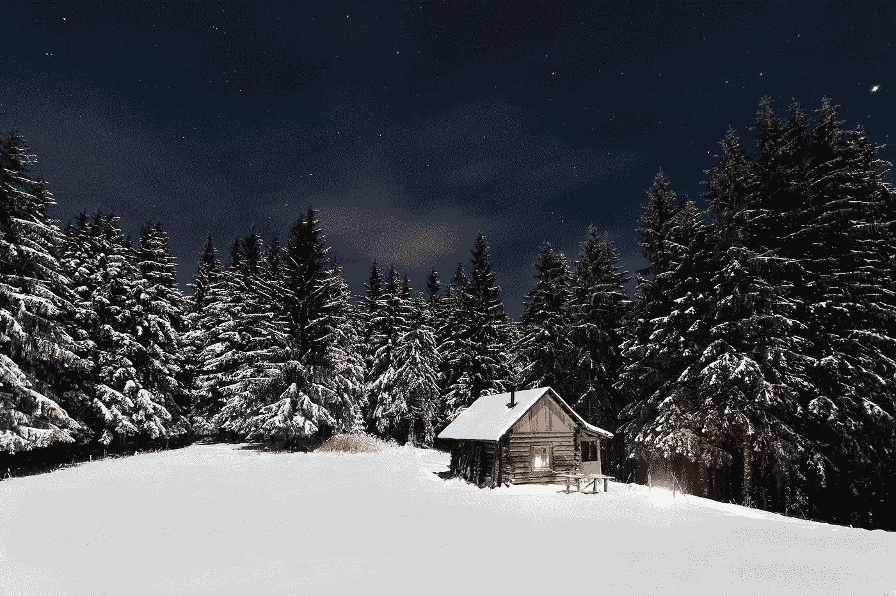
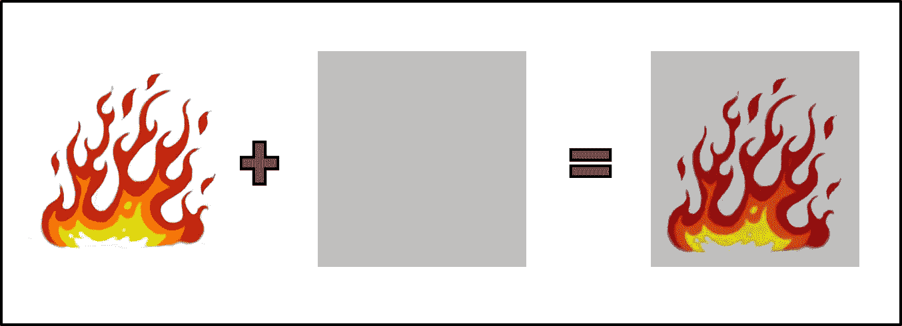
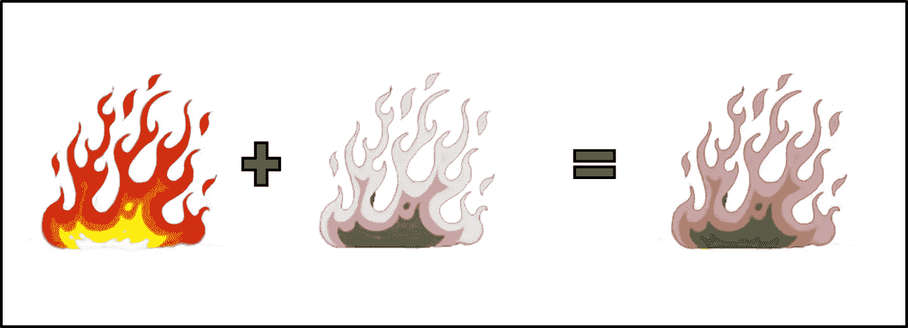
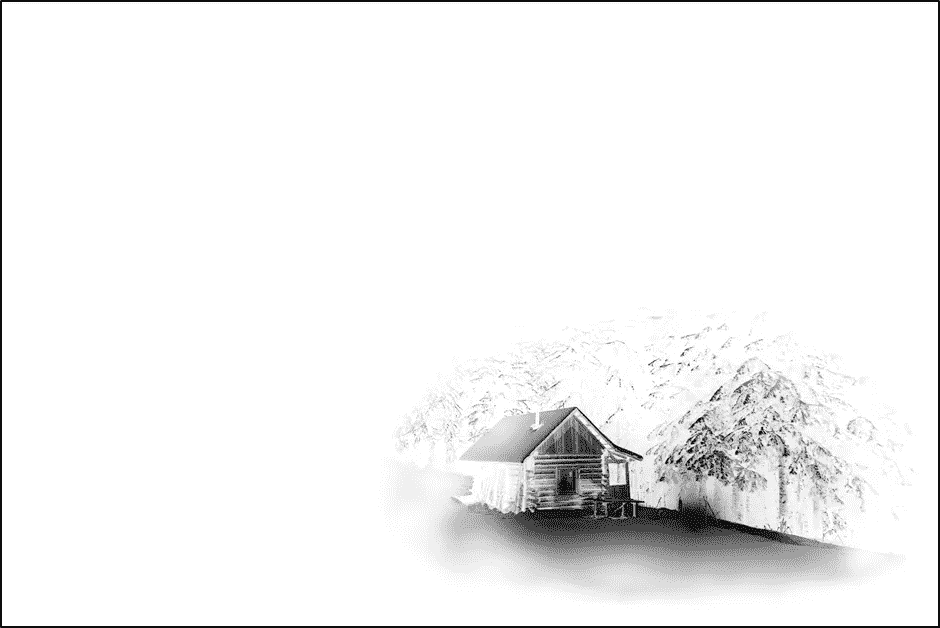
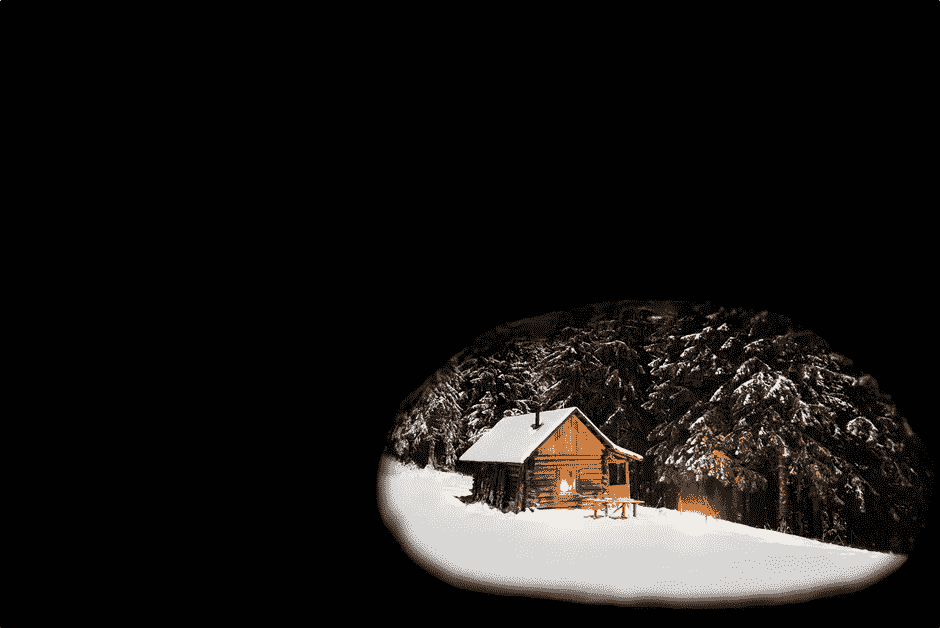
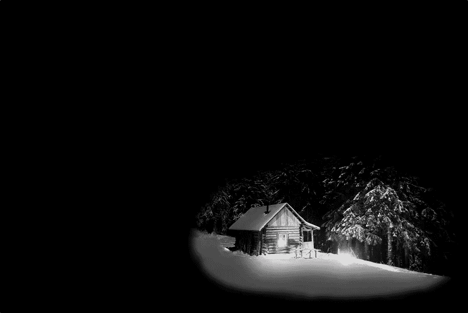
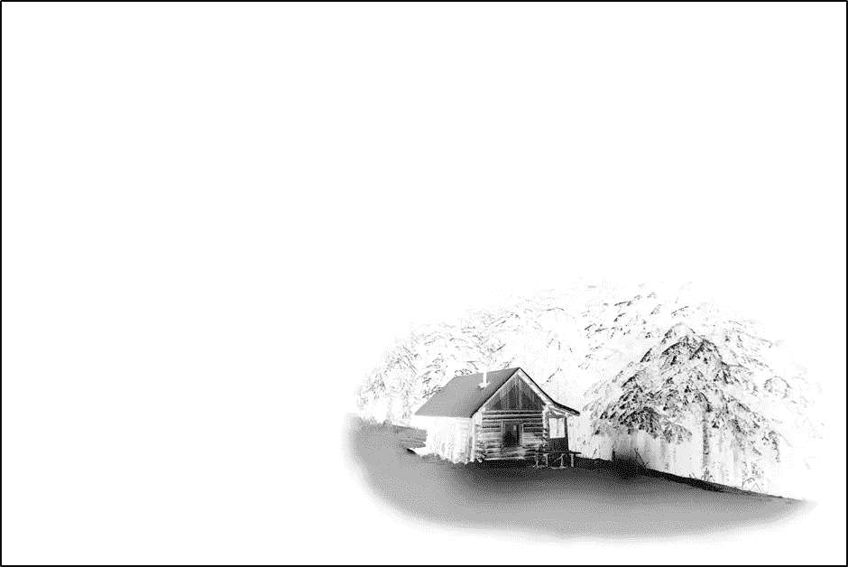
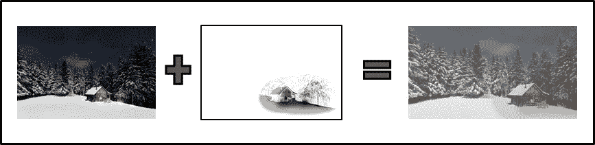
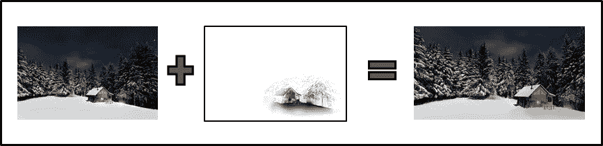

# 带有 CSS 动画的发光、噼啪作响的火焰效果

> 原文：<https://medium.com/hackernoon/a-glowing-crackling-fire-effect-with-css-animations-8724ff691f44>



Initial background image from Pexels

对于任何真正的艺术家或 [*CSS*](https://hackernoon.com/tagged/css) *忍者来说，这个故事可能不会是革命性的，但对于温特来说是一个有趣的副业。享受吧。*

为了庆祝即将到来的假期，我们最近在我们的[轨迹视频对话](https://inthelocus.com)应用程序中添加了一个冬季背景主题。我们首先从 [Pexels](https://www.pexels.com/) 中发现了一张舒适的冬季图片。不错的开始，但气氛还不够。好的，加上劈啪作响的火的声音。简单到可以找到一段来自 freesound.org 的好听的录音，比如这首“[壁炉 3 小时](http://www.freesound.org/people/hansende/sounds/263994/)”。或者 YouTube 上有同样声音的视频版本，嵌在下面。

Fireplace sound with video!

啊……现在我们开始觉得更舒服了。然而，看着静止的照片，听着噼啪作响的炉火，感觉有点太静态了。让我们使用一些 CSS3 动画魔法，让火发光！

我们想确保我们的动画运行流畅，不会消耗太多的 cpu 周期。我们的视频会议网络应用已经有足够的计算能力。从文章[流畅如奶油:用 CSS3 实现 60 FPS 动画](/outsystems-experts/how-to-achieve-60-fps-animations-with-css3-db7b98610108#.oqvri84ac)中，我们看到:

> 利用**变换**和**不透明**属性，现代浏览器可以很好地制作四种风格的动画。
> 
> **位置** —变换:translate x(*n*)translate y(*n*)translate z*(n*)；
> 
> **缩放** —变换:缩放(*n*)；
> 
> **旋转** —变换:旋转(*n*deg)；
> 
> **不透明度** —不透明度:*n*；

好的，很好。我们可以利用不透明动画来创建一个发光的效果。我们的背景图像已经有一个明亮的火灾场景。我们可以添加一个半透明的覆盖层来选择性地使这个场景变暗，并设置不透明度来产生发光效果。



Our simplified goal, darken the fire

太好了。只不过我们不想让我们的整体形象变暗，我们只想让火焰和被火照亮的区域变暗。大概是这样的:



Tailored fire darkening overlay

为了创建一个实际场景的覆盖图，我使用了 Photoshop。我肯定不是 Photoshop 高手，所以会保持这个高水平。基本上，我们想要创建一个图像，在有火或火的地方是最暗的，而在其他地方是亮的/完全透明的。我们的最终目标是:



Final overlay image for winter scene

首先，我们删除图像中任何不想被影响的部分，并用黑色替换。把边缘弄光滑一点。



Just the image portion we want to affect

现在，我们希望我们的叠加图像优先变暗被火照亮的区域。在这一步，这意味着我们希望所有发光的部分显示得更白，其余的部分显示得更黑。我主要是在特定的颜色上使用色调/饱和度/亮度滤镜。使红色和黄色变亮，并使剩余的颜色变暗。



After tweaking colors

现在我们反转图像:



Inverted

快到了。但是等等，看看当我们将这张图像半透明地覆盖在基础图像上时会发生什么:



That’s not right!

哎呀，整个图像被洗掉了。这是因为，叠加图像的背景是白色的。如果我们简单地叠加这张图像，并给它一个 CSS 不透明度，暗区会使基础图像变暗，但是白色区域会使基础图像变亮。我们需要的不是颜色的变化，而是透明度的*变化。我们希望将图像转换为灰度，然后从灰度强度映射到不透明度，创建一个全黑且不透明度不同的新图像。据我所知，Photoshop 没有一个简单的方法来做到这一点。但是免费的开源编辑器 [GIMP](https://www.gimp.org/) 做到了。下面引用的这篇文章告诉我们如何去做。*

> 1)打开您的文档(即黑白照片)
> 
> 2)在图层菜单中右击照片选择“添加 Alpha 通道”
> 
> 3)转到顶部的颜色菜单，选择“颜色到 Alpha ”,一个显示颜色的窗口出现，点击确定。
> 
> 就是这样。你完了。只需要一分钟。

太好了。现在我们终于有了最终的叠加图像。



There we go! Dimmed fire.

很好，现在来看 CSS 部分，它变得相对简单。我们只是绝对地放置两张图片，叠加在上面。然后动画覆盖的不透明度。CSS 看起来像这样:

```
img.base{
  position: absolute;
  /* position, height, width, etc as appropriate. */
  z-index: 0;
}img.overlay{
  position: absolute;
  /* position, height, width, etc as appropriate. */
  z-index: 1;
  opacity: 0.0;
  animation-delay: 0.5s;
  animation-duration: 15s;
  animation-direction: normal;
  animation-iteration-count: infinite;
  animation-name: fireFlicker;
  animation-timing-function: linear;
}[@keyframes](http://twitter.com/keyframes) fireFlicker {
  0%, 10% { opacity: 0; }
  15%,20% { opacity: 0.13; }
  22%,23% { opacity: 0.026; }
  25%,35% { opacity: 0.08; }
  39%,42% { opacity: 0.22; }
  44%,47% { opacity: 0.13; }
  49%,50% { opacity: 0.026; }
  52%,54% { opacity: 0.08; }
  57%,58% { opacity: 0.24; }
  60%,63% { opacity: 0.17; }
  65%,72% { opacity: 0.08; }
  77%,85% { opacity: 0.026; }
  90%,95% { opacity: 0.17; }
  100% { opacity: 0; }
}
```

显然这里有很大的变化空间。我选择了一个以 0 不透明度开始和结束的动画，并且无限向前循环。或者，你可以有一个向前和向后交替的动画。选择`linear` 中的`animation-timing-function`,是因为与其他选项相比，它的计算成本更低。然而，我确实认为`ease-in-out`看起来更好一点。动画关键帧在一段时间内保持恒定值(即每行有 2 个百分比值，表示不透明度在这些值之间保持不变)。相对于不断变化的动画，这样做也是为了减少计算量。15 秒的动画时间似乎太长了，以至于看不出动画是在循环播放。

就是这样！我相信可以做更多的工作来提高效果。我考虑过添加另一个叠加层来给火焰添加一点闪烁，但是没有时间或者艺术技巧！这种效果是故意相对微妙的，但可以通过调整动画值来夸大。

前往[地点](https://inthelocus.com)，点击“获取您的房间”，观看现场效果。然后点击“进入房间”按钮，一切都准备好了。这个场景应该至少在 2016/2017 年冬季期间保持直播。或者更简单的是，下面有一个代码笔。

感谢阅读！如果你喜欢你所读的，一定要💗下面。如果你想知道为什么我们还在开发另一个视频会议应用程序，看看我的文章“2016 年了，为什么视频会议还是很糟糕？”

[CodePen of the glowing fire effect](http://codepen.io/calchris42/pen/KNEBPq).

[](http://bit.ly/HackernoonFB)[](https://goo.gl/k7XYbx)[](https://goo.gl/4ofytp)

> [黑客中午](http://bit.ly/Hackernoon)是黑客如何开始他们的下午。我们是这个家庭的一员。我们现在[接受投稿](http://bit.ly/hackernoonsubmission)并乐意[讨论广告&赞助](mailto:partners@amipublications.com)机会。
> 
> 如果你喜欢这个故事，我们推荐你阅读我们的[最新科技故事](http://bit.ly/hackernoonlatestt)和[趋势科技故事](https://hackernoon.com/trending)。直到下一次，不要把世界的现实想当然！

