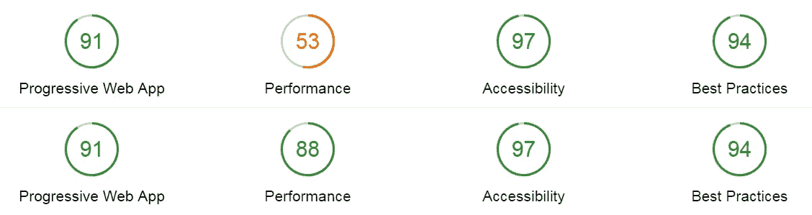

# 使用 React 和 Redux 创建 Web 应用程序的指南

> 原文：<https://medium.com/hackernoon/a-guide-to-creating-web-applications-with-react-and-redux-2f6bc0775951>


Photo by [Radek Grzybowski](https://unsplash.com/photos/eBRTYyjwpRY) on [Unsplash](https://unsplash.com/)

在[之前的一篇文章](https://hackernoon.com/a-beginners-guide-to-progressive-web-apps-the-frontend-web-424b6d697e35)中，我试图写一篇深入的指南来开始使用**渐进式网络应用**。从那以后，我学到了很多，同时也注意到了我所使用的工具的一些变化，我决定写一些后续的和重写的指南。就像上次一样，我将添加一个**TL；博士在每一部分帮助你找出你想读文章的哪一部分。**

[](https://hackernoon.com/a-beginners-guide-to-progressive-web-apps-the-frontend-web-424b6d697e35) [## 渐进式网络应用入门指南&前端网络

### 为前端 web 开发，跟上 Javascript 生态系统以及所有新术语和华而不实的…

hackernoon.com](https://hackernoon.com/a-beginners-guide-to-progressive-web-apps-the-frontend-web-424b6d697e35) 

如果你还没有读过我之前关于 PWAs 的文章，我强烈建议你在继续之前先读一读。

## React、CSS 框架和 JSON 文件

上一次，我从零开始，解释了从哪里获得样本数据，以及为什么像 React 和 CSS 框架这样的工具对于这样的项目是有用的。我们仍将使用我的宠物项目 [**mini.css**](http://minicss.org/) 进行造型，以及 [**React**](https://reactjs.org/docs/installation.html) ，但我们也将添加 [**Redux**](http://redux.js.org/#installation) 到组合中。除此之外，我们还将使用 [**JSONbin.io**](https://jsonbin.io/) 为我们的 PWA 创建我们自己的 JSON 文件，而不是从一些 API 获取数据。这样，我们将能够创建一个定制的数据结构来满足我们的需求，并模拟设计 API 端点的过程。

[](https://hackernoon.com/5-reasons-to-try-out-mini-css-62ddb47b9370) [## 试用 mini.css 的 5 个理由

### 在这篇文章中，我将解释为什么 mini.css 是 css 框架生态系统的一个有价值的补充，以及…

hackernoon.com](https://hackernoon.com/5-reasons-to-try-out-mini-css-62ddb47b9370) 

本文中 React 的一个关键点是，我们不需要像以前那样编写自己的**服务工作者**。如今，`create-react-app`为我们提供了一个预构建的服务工作者实现，它可以在发生任何变化时自动更新，使我们能够更快、更轻松地创建 pwa。

除此之外，我将向您介绍 Redux，它非常热门有很多原因，主要是因为它允许您**全局管理状态**，并且它被认为是扩展您的应用程序的完美选择。对于这个特定的项目，这可能有点大材小用，但是尝试新工具总是好的。

> **TL；DR:** React 现在支持服务人员开箱即用，允许更轻松地创建 PWA。Redux 对于管理全局状态以及扩展我们的应用程序来说是无价的。

## 定义数据结构

上一次，我们使用了几个 RESTful JSON APIs 来获取数据并提供给用户。这一次，我们将做一些稍微不同的事情，定义我们自己的**数据结构**，并在线存储它，以便我们的 PWA 可以访问它。我们想要创建一个简单的应用程序，在结构上类似于博客，所以我们想要定义一个类似于**博客文章**的数据结构。下面是一篇文章的 JSON 对象应该包含的内容:

*   **ID:** 可以唯一标识帖子的值
*   **标题:**文章标题的字符串表示
*   **图片:**文章特色图片的链接
*   **作者:**带有文章作者姓名的字符串
*   **标签:**包含文章关键词的字符串列表
*   **内容:**文章实际内容的字符串表示
*   **添加日期:**表示添加文章的日期

基于上面的结构，我使用了一个 [Lorem Ipsum 生成器](https://www.lipsum.com/)和一些来自 [Unsplash](https://unsplash.com/) 的精彩图片来创建一个包含 25 个帖子的样本 JSON 文件。你可以在这里看一下—记住 JSON 对象的定义非常重要，因为它将在某种程度上决定我们页面的结构。

> **TL；DR:** 数据结构的定义是确定应用程序内容并开始构建它的良好开端。JSON 是模拟 API 响应的理想格式。

## 创建应用程序外壳


What our finished application will look like

构建 PWA 的第一步是创建一个**应用程序外壳**。为了做到这一点，我将使用 **mini.css** ，以及一些定制的 css 来使它看起来更加完美。因为这是一个简单的博客应用程序，所以我将使用一个`<header>`元素来添加一个漂亮的顶栏，带有一个图标和一个抽屉按钮，以及一个搜索字段(稍后会详细介绍)。除此之外，我想在`.drawer`中添加一个帖子列表。这个列表将是一个响应菜单，默认情况下在手机上是隐藏的。

```
create-react-app autumn-pwa
cd autumn-pwa
npm install --save redux react-redux
npm start
```

在我们开始设计应用程序外壳之前，我们需要**创建一个项目**。如果你已经在全球范围内安装了`create-react-app`，你应该通过运行上面的指令来启动并运行你的项目。当项目文件夹被创建时，前往 [mini.css 的仓库](https://github.com/Chalarangelo/mini.css)并获取你所选择的最新版本。

[](https://hackernoon.com/creating-a-mobile-friendly-navigation-using-mini-css-8cea580c51ed) [## 使用 mini.css 创建移动友好导航

### 在这个系列中，我们将介绍一些基本的概念和技术，帮助你开始使用 mini.css…

hackernoon.com](https://hackernoon.com/creating-a-mobile-friendly-navigation-using-mini-css-8cea580c51ed) 

我不打算深入讨论定制 CSS，因为这超出了本文的范围，并且在框架的网站上也有很好的记录，但是您可以使用它来创建您喜欢的应用程序外壳。在完成所有设置并运行之后，我的`App`组件看起来像这样:

The application shell for our PWA

您可能已经注意到，我们的应用程序 shell 缺少链接列表和帖子。在接下来的几个步骤中，我们将从 JSON 文件中获取数据，并根据这些数据动态创建这两个文件。

> **TL；DR:** 每个应用都需要一个应用外壳，里面包含了基本的 UI。应用程序外壳可以是几个空容器，稍后将动态填充数据。

## 连接冗余

自上次以来，到目前为止，我们还没有做任何非常不同的事情，但现在是时候开始一些新的东西了，即 **Redux** 。Redux 允许我们全局地管理我们的应用程序的状态，使得随意伸缩和改变它变得非常容易。这个特定的应用程序可能不会给你一个令人信服的理由来使用它，但它是一个很酷的工具，你很可能会需要它。最坏的情况是，你将知道如何使用另一个你可能很快就需要的工具。

[](http://redux.js.org/) [## 给我读 Redux

### 如果你来自 Flux，你需要理解一个重要的区别。Redux 没有一个…

redux.js.org](http://redux.js.org/) 

那么，Redux 如何与 React 结合使用呢？这真的相当简单，但是幕后发生的事情一开始会让你迷惑。Redux 为应用程序的状态使用一个**全局存储**，您可以通过发送**动作**与之交互。行动是与商店互动的唯一方式，您可以使用**行动创建者**来创建行动。这听起来可能很复杂，所以让我给你看一个例子:

An example of an action and an action creator

阅读上面代码中的注释应该有助于您理解什么是动作，什么是动作创建者。说到这里，我们需要谈谈 Redux 的最后一个非常重要的部分 Redux。简单地说， **reducer** 是一个被告知正在执行什么类型的动作(以及动作有效载荷中的任何参数)的函数，它的工作是相应地改变应用程序的状态。reducer 是一个纯粹的函数，它接受上一个状态和一个动作，然后返回下一个状态。大多数时候，你会看到一个 reducer 有一个`switch`语句，每个动作对应一个`case`。

好了，现在我们知道了 Redux 是如何工作的，让我们来写一些代码。我们希望我们的应用程序有两个动作，一个是让**查看博客中的所有帖子**，另一个是根据特定的查询搜索帖子。我上面给出的代码是搜索功能的动作创建器，所以如何创建一个动作创建器来查看所有的帖子应该是非常明显的(**提示:** *除了动作*的 `type` *之外，没有任何有效负载)。*

接下来，我们应该创建我们的 reducer，它目前是一个几乎为空的`switch`语句，看起来应该像这样:

Our reducer without any functionality implemented

最后，我们必须将我们的`App`组件`connect()`到 Redux 存储器和`mapStateToProps()`中，以便组件被传递给正确的`props`。然后，我们将把我们的`<App />`组件包装在一个`<Provider>`中，并将提供者的存储设置为`createStore(reducer)`，其中`reducer`是指我们刚刚创建的缩减器。

Connecting Redux to our application

> **TL；DR:** Redux 帮助我们管理应用程序的状态。它使用动作和动作创建者与商店进行交互。归约器是纯函数，它们被给定前一个状态和一个动作，然后返回下一个状态。为了利用 Redux，我们需要将我们的应用程序连接到它的商店，并将我们的应用程序组件包装在一个提供者中。

## 获取初始数据

在上一篇文章中，我向您展示了一种使用 AJAX 从 API 获取数据的方法。这一次，我们将使用`fetch()`和 **Javascript Promises** 为我们的应用程序获取数据。

 [## 在开始使用 async/await 之前理解承诺

### 随着 Babel 现在支持异步/等待开箱即用，以及 ES2016(或 ES7)即将到来，越来越多的人…

medium.com](/@bluepnume/learn-about-promises-before-you-start-using-async-await-eb148164a9c8) 

我可以写很多关于承诺和它们如何工作的文章，但我相信有很多其他文章比我更好地解释它们，所以我只打算解释你需要知道的。当您调用像`fetch()`这样的函数时，结果可能需要一段时间才能返回，或者甚至可能根本不会返回。在第一个场景中，您使用`.then()`处理结果，在第二个场景中，您使用`.catch()`处理错误。

在我们的例子中，我们相信 API 是好的，它不会返回一个错误(不管怎样，如果我们提供了正确的 URL，就不应该返回错误)，所以我们将省略`.catch()`部分，使用`.then()`。`fetch()`需要提供一个 URL，然后我们可以连锁一个或多个`.then()`调用，将尽快解决响应回来。

在 Redux 中运行这样的异步代码相当复杂，所以我们将使用另一种方法，即在`App`组件挂载后立即操作它。因此，我们将在我们的`App`的`componentDidMount()`方法中编写如下内容:

Fetching initial data from our JSON file

加载了我们的**初始数据**之后，填充导航列表以及显示我们刚刚从 JSON 文件中加载的所有数据的帖子列表应该很容易。我假设您熟悉 HTML 和 React，因此您可以轻松地自己完成这项工作。

> **TL；DR:** `fetch()`是一种我们可以用来从 JSON 文件(或 API)中获取数据的方法，它返回一个 Javascript 承诺。承诺用于异步运行代码，因此我们可以利用它们来加载数据，而不必等待数据来呈现我们的应用程序。

## 将状态移至 Redux

Redux 的一个关键点是，它使用`props`而不是`state`将数据传递给组件。这是我一开始很纠结的一件事，所以我故意让你把我们从 JSON 文件中得到的数据存储到我们的`App`组件的本地`state`中，以便解释一个具有本地状态的项目如何从 Redux 中受益，如果你花时间进行必要的修改的话。到现在为止，你的`render()`方法应该有一个呈现文章和链接的部分，如下所示:

然而，您希望您的**应用程序的状态由 Redux** 来管理。所以，你要做的第一件事就是把`this.state`改成`this.props`。一旦你这样做了，你就会开始得到错误，但是请耐心等待几分钟，你就可以开始了。我们需要将 JSON 数据传递给 Redux 的`store`，而不是复制到本地`state`。我们如何做到这一点？用一个动作！我将继续定义一个新的动作，然后将它添加到 reducer，然后告诉它将检索到的数据存储到全局`state`。最后，我将修改`componentWillMount`方法来分派该动作，这样一切都像以前一样工作。这是我最后得到的结果:

Moving local state to global store

> **TL；DR:** Redux 与组件`props`交互，不与`state`交互。从局部状态转移到全局状态很容易做到，并确保使用 Redux 处理所有事情。像`.fetch()`这样的异步调用可以根据需要利用动作与全局`store`进行交互。

## 添加搜索功能

**搜索**是任何类型的应用程序中最常见的功能。有许多方法可以实现搜索，但对于这个 PWA，我将使用 [**JS Search**](https://github.com/bvaughn/js-search) ，一个非常高效的搜索库，非常容易使用。继续安装，使用:

```
npm install js-search
```

[](https://github.com/bvaughn/js-search) [## bvaughn/js-search

### JS Search 是一个高效的客户端 JavaScript 和 JSON 对象搜索库

github.com](https://github.com/bvaughn/js-search) 

与任何工具一样，您应该花点时间阅读自述文件并理解它是如何工作的。根据提供的说明，创建搜索库的实例、按日期排序、向`title`、`tags`和`author`添加索引以及将文档集合设置为`posts`的列表应该很容易。

The finished reducer code

为了实际选择要显示的帖子，我们将使用帖子的`id`数组，所以继续将它添加到您的 reducer 的定义中，以及您的`App`组件的构造函数中。您还应该更新帖子和链接的呈现条件，如果`selected`数组不为空，则只显示选定的帖子，否则显示所有帖子。

最后，我们需要为我们的搜索字段挂接一个`onChange`事件，这样我们就可以向 reducer 发送动作。如果该字段为空，我们将清空`selected`帖子列表，否则我们将利用 JS 搜索来查找哪些帖子符合我们的查询。

Hooking up search to the reducer

> **TL；DR:** 客户端搜索可以很容易地用 JS 搜索库来实现，它只需要向我们的 Redux reducer 添加一点点逻辑，以及一个搜索字段的事件处理程序。

## 优化构建

我们的小 PWA 已经完成，我们甚至不用担心编写服务人员，因为`create-react-app`已经为我们处理好了。但是有一个小问题，那就是我们最终建筑的尺寸。跑`npm run build`会发现我们的 PWA 有多重。对我来说，光是文件`.js`就有 168 kb**那么大。对于像这样的小型博客应用程序来说，这是相当沉重的，所以想象一下对于一个相当大的网站来说，它的大小会是多少。**

优化 PWA 的大小似乎没有必要。在服务工作者第一次缓存了所有代码之后，就可以从缓存中提供服务了。从技术上讲，这是真的，但是如果我们的应用程序定期更新呢？如果我们有大量的资产需要大量的带宽呢？毕竟，在用户离开我们的网站之前，我们有大约 3 秒钟的时间。

我的首选是使用 [**Preact**](https://preactjs.com/) ，这是 react 的一个轻量级实现。为了使事情更容易，我将安装`preact-compat`和`preact-redux`以及`preact`，这样我们几乎不需要修改我们的代码。继续安装它们。然后，找到`react`和`react-dom`的任何引用，并替换为`preact-compat`。最后，用`preact-redux`替换`react-redux`的所有引用，并重新构建您的项目。

我的`.js`文件现在是 **77KB** ！这还不到以前大小的一半，这将大大加快加载速度。但是我们还能做更多。在 **Lighthouse** 中测试我的 PWA，发现页面上的图像需要很长时间才能加载，所以我需要解决这个问题。我的一个想法是使用被低估的`<picture>`元素在手机上展示一个更小、更低清晰度的图像。做了这个改变，编译并再次运行显示，虽然不完美，应用程序的性能已经好了很多，我减少了 1 秒的加载时间。



Lighthouse scores — performance comparison before and after optimizing image loading

> **TL；DR:** 捆绑的 Javascript 文件的最终大小可能会非常大，这会减慢我们 PWA 的初始加载时间。Preact 是一个轻量级且易于使用的替代方案，它将帮助您最小化应用程序的大小。

## 最终考虑

部署 PWA 时，我注意到 **Github 页面**不能正确地服务它。这是因为`index.html`中的所有路径都指向`/`，而不是`./`。如果你计划在 Github 页面上部署，我建议运行`npm run eject`，然后修改`/config/paths.js`中的`getServedPath()`指向`./`，而不是`/`。重新构建并部署到 Github 页面，我的 PWA 按预期运行，自动生成的服务工作器通知我*内容已缓存供离线使用*。

最终的源代码可以在这里找到，你可以在这里看到完整的应用程序。

> 希望现在你已经理解了进步的 Web 应用程序是如何工作的，以及如何利用所有的现代工具让你的生活变得更简单。非常感谢您的宝贵时间！