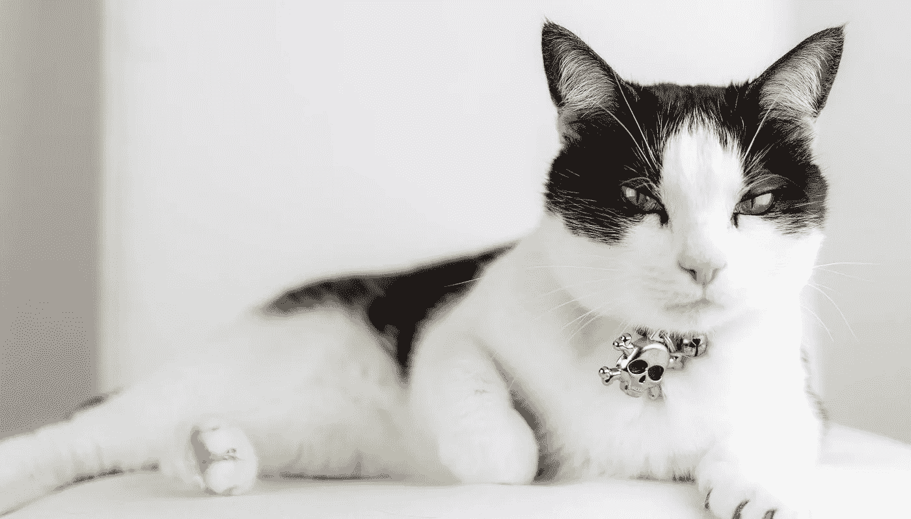
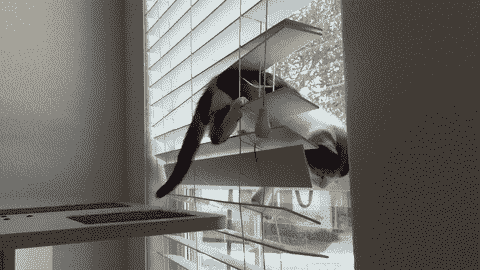

# 给你的猫做年度绩效评估的指南

> 原文：<https://medium.com/hackernoon/a-guide-to-giving-your-cats-their-annual-performance-review-fbf14610305>

My cat Linus, who is kind of a jerk but I just love his fuzzy little face.

随着这一年接近尾声，是时候坐下来和你的猫咪们聊聊，给它们一些关于它们表现的反馈了。为了帮助你准备这次谈话，我根据自己的经历写了一些指南。

# 对照标准进行评估

当考虑你的猫如何满足期望时，确保你是根据一个标准来评估的。它应该考虑到猫的水平，这最终是基于年龄和品种。2 级猫，如 6 个月大的波斯猫，不会有与 5 级猫(如 8 岁的灰色斑猫)相同的表现预期。理想情况下，你已经和你的猫详细讨论了这些期望。他们应该是合理的和可实现的，同时仍然提供足够的挑战，以允许个人成长。一些示例性能目标可以包括:白天预期睡眠的小时数(目标为 16-18)；在盒子里玩的时间；可爱程度从 1 到 10 分不等(这应该通过自我打扮和竖起耳朵、睁大眼睛的一般姿势来保持)。

# 关注影响

为了帮助你的猫成长，你的反馈必须具体可行。通过使用情境-行为-影响(SBI)模型，你的猫将能够理解你的反馈背后的基本原理。一个对话的例子可能是这样的:“彩虹糖，当我睡觉的时候，你凌晨 4 点跳到床上对着我的脸喵喵叫，把我吵醒了，这让我一整天都感到愤怒和疲惫。你可以产生更积极影响的一个方法是 STFU，至少睡到早上 8 点。”

# 如何组织需求改进讨论

这可能具有挑战性。你的猫可能会变得有防御性，或者更糟，完全忽视你，假装她不理解你。不要被骗了。她明白你说的一切。当您的猫没有达到预期时，您需要准备一个绩效改进计划或 PIP。该 PIP 应包括您的猫需要采取的具体步骤，以满足其角色和级别的期望。例如，你可以告诉她，她跳到柜台上，把她的便便爪子弄得你的食物准备区到处都是，这是不可接受的，必须在下个季度减少至少 80%。

> 也许有必要提醒她，在寒冷的冬夜里，有食物和温暖的地方睡觉，她是多么幸运。

帮助你的猫理解如果表现没有改善的后果。也许有必要提醒她，在寒冷的冬夜里，有食物和温暖的地方睡觉，她是多么幸运。作为你的猫的经理，你也应该意识到你自己在她表演中的角色。你足够在场吗？她有足够的空间成长和玩耍吗？有没有提供必要的玩具和家具给挠挠？如果你没有给你的猫一个合适的抓挠柱，惩罚它们抓挠沙发和破坏你的好东西是不公平的。

Cupcake Schoolbus tries to demonstrate impact by destroying my f-ing blinds.

# 何时给予团队反馈，何时给予个人反馈

你应该定期和你的猫进行一对一的交流。任何负面的反馈都应该私下给出，以免让一只猫在群体面前尴尬或羞愧。然而，当有益于整个团队时，可以在小组环境中给出一些反馈。例如，你可以和你所有的猫分享你是多么欣赏它们可爱的毛茸茸的脸，以及它们在蜷缩起来好好依偎之前在你腿上做饼干时是多么可爱。

> 彩虹糖，我喜欢那次你试着跳到书架上，但是完全没跳着，摔倒了。我笑了好几天。

# 不要漏掉积极的一面

你可能更关心你的猫的负面行为，但重要的是在该感谢的时候表示感谢。再一次，遵循 SBI 模式:“彩虹糖，我喜欢那次你试图跳到书架上，但完全错过并摔倒了。我笑了好几天。这个视频在 Instagram 上获得了 50 多个赞。”记住，在你的猫成长的过程中，你的工作就是支持它们，鼓励它们向前倾，努力成为猫。

***在 Instagram 上关注莱纳斯和纸杯蛋糕校车***[***@莱纳斯 _ 讨厌 _ 纸杯蛋糕***](https://www.instagram.com/linus_hates_cupcake/)