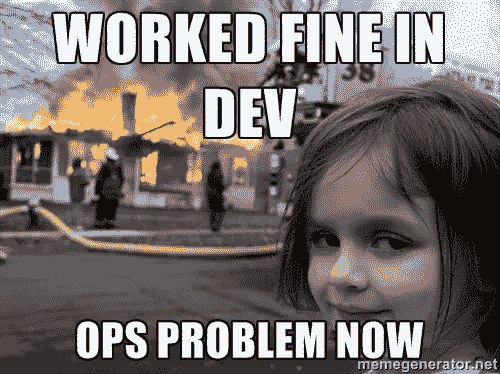
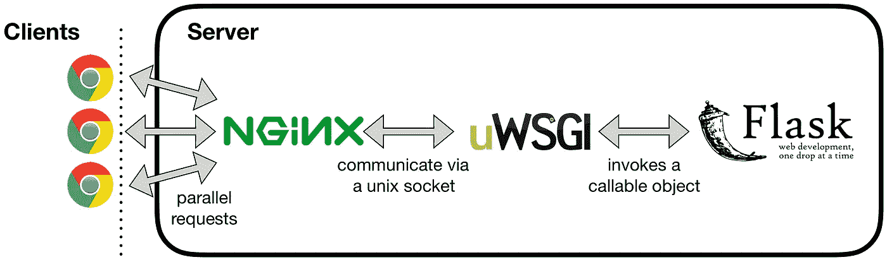
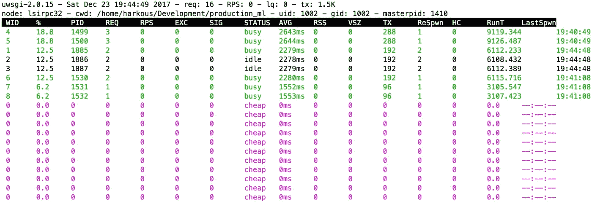

# 生产中扩展机器学习模型的指南

> 原文：<https://medium.com/hackernoon/a-guide-to-scaling-machine-learning-models-in-production-aa8831163846>


构建机器学习模型的工作流程往往在评估阶段就结束了:你已经达到了一个可以接受的精度，并且" *ta-da！* *使命完成。*

除此之外，为您的论文或内部文档获取那些好看的图表可能就足够了。

事实上，并不总是需要付出额外的努力将模型投入生产。即使是这样，这项任务也会委托给系统管理员。



然而，如今，许多研究人员/工程师发现他们自己负责处理从构思模型到向外界提供服务的完整流程。无论是大学项目还是个人实验，展示我们的工作通常是让更多观众感兴趣的好方法。很少有人会花额外的精力去使用一个价值不能立即被感知的系统。


在本文中，我们将一起经历这个工作流；一个我不得不自己反复做的过程。假设你已经建立了一个机器学习或者深度学习模型，使用你喜欢的框架(scikit-learn，Keras，Tensorflow，PyTorch 等。).现在你想通过一个 API 向全世界大规模提供服务。

**通过*【大规模】*，我们不是在谈论一家大公司的工业规模。我们的目标是充分利用那台拥有大量 CPU 和大容量 RAM 的服务器，**闲置在您的机构或云中。这需要一次处理多个请求，随着负载的增加产生新的进程，随着负载的减少减少进程的数量。您还需要额外的保证，即服务器在意外的系统故障后会重新启动。

如果这是你的想法，让我们一起经历它。

我们将考虑 Linux 服务器上基于 Python 的框架的上下文。我们的设置将包括:

*   [**Anaconda**](https://anaconda.org) :用于管理包安装，创建一个隔离的 Python 3 环境。
*   [**Keras**](http://keras.io)**:**一种高级神经网络 API，能够在 [TensorFlow](https://github.com/tensorflow/tensorflow) 、 [CNTK](https://github.com/Microsoft/cntk) 或 [Theano](https://github.com/Theano/Theano) 之上运行。
*   [**Flask**](http://flask.pocoo.org/) :构建 RESTful APIs 的极简 python 框架。尽管很容易使用，但 Flask 的内置服务器默认情况下一次只服务一个请求；因此[它本身不适合](http://flask.pocoo.org/docs/deploying/)在生产中部署。
*   [**nginx**](https://nginx.org/en/) :高度稳定的 **web 服务器**，提供负载均衡、SSL 配置等好处。
*   [**uWSGI**](https://uwsgi-docs.readthedocs.io/en/latest/)**:**一个高度可配置的 **WSGI 服务器** (Web 服务器网关接口)，允许分叉多个工作器一次服务多个请求。
*   [**systemd**](https://en.wikipedia.org/wiki/Systemd)**:**在多个 Linux 发行版中使用的一个 *init* 系统，用于管理引导后的系统进程。

Nginx 将是我们与互联网的接口，它将是处理客户请求的接口。Nginx 拥有对二进制 uWSGI 协议的本地支持，它们通过 Unix 套接字进行通信。反过来，uWSGI 服务器将直接调用 Flask 应用程序中的可调用对象。这是满足请求的方式。



The complete workflow illustrated

本教程开头的一些注意事项:

*   **上述大部分组件可以很容易地用等效组件替换，其余步骤几乎没有变化**。比如 Keras 可以轻松换成 PyTorch，Flask 可以轻松换成[瓶](https://bottlepy.org/)等等。
*   **我们将只考虑服务模型超过 CPU 的情况。**典型案例是访问具有大量 CPU 内核的服务器，并尝试利用这些内核为模型提供服务。另一方面，大量购买 GPU 的成本更高。此外，根据您的应用，在预测时使用 GPU 获得的速度增益可能并不显著(特别是在 NLP 应用中)。

# 设置环境

首先，我们需要安装`systemd`和`nginx`包:

```
sudo apt-get install systemd nginx
```

接下来，我们必须按照官方网站上的说明[安装 Anaconda，包括下载可执行文件，运行它，并将 Anaconda 添加到您的系统路径中。下面，我们将假设 Anaconda 安装在主目录下。](https://www.anaconda.com/download/#linux)

本文中的所有代码和配置文件都可以从附带的 [Github 资源库](https://github.com/harkous/production_ml)中获得。但是请确保您按照下面的步骤来获得完整的工作流程。

[](https://github.com/harkous/production_ml) [## harkous/production_ml

### production_ml —在生产中扩展机器学习模型

github.com](https://github.com/harkous/production_ml) 

接下来，让我们从`environment.yml`文件创建隔离的 Anaconda 环境。下面是这个文件的样子(它已经包含了我们将要使用的几个框架):

我们运行以下命令来创建环境:

```
conda env create --file environment.yml
```

当我们想要激活这个环境时，我们运行:

```
source activate production_ml_env
```

到目前为止，我们已经安装了 Keras，还有 flask、uwsgi、uwsgitop 等。所以我们准备好开始了。

# 构建 Flask Web 应用程序

出于本教程的目的，我们不会深入研究如何构建您的 ML 模型。相反，我们将使用 Keras 中捆绑的[路透社新闻专线数据集](https://keras.io/datasets/#reuters-newswire-topics-classification)来修改主题分类的示例。这是构建分类器的代码:

要复制我们在这里使用的设置，只需运行以下命令来训练一个没有 GPU 的模型:

```
export CUDA_VISIBLE_DEVICES=-1
KERAS_BACKEND=theano python build_classifier.py
```

这将在文件夹`models`中创建一个模型文件`reuters_model.hdf5`。现在，我们已经准备好通过`4444`端口上的烧瓶为模型提供服务。在下面的代码中，我们提供了一个支持`GET`请求的 REST 端点`/predict`，其中要分类的文本作为参数提供。返回的 JSON 的形式是`{"prediction": "N"}`，其中`N`是表示预测类的整数。

为了启动 Flask 应用服务器，我们运行:

```
python app.py
```

瞧啊。现在我们已经有了简单、轻量级的服务器。

您可以使用您最喜欢的 REST 客户端(例如 [Postman](https://www.getpostman.com/) )来测试服务器，或者只需在您的 web 浏览器中访问这个 URL(用您的服务器的 URL 替换`**your_server_url**`):`[http://**your_server_url**](http://your_server_url):4444/predict?text=this is a news sample text about sports and football in specific`

您应该得到这样的响应

```
{
  "class": "11"
}
```

# 配置 uWSGI 服务器

现在，我们开始扩展我们简单的应用服务器。uWSGI 将是这里的关键。它通过调用文件`app.py`中的可调用对象`app`与我们的 Flask 应用程序通信。uWSGI 包含了我们所追求的大部分并行化特性。其配置文件如下所示:

**在你这边，你要把** `**my_app_folder**` **选项修改为自己 app 目录的文件夹，把** `**my_user**` **选项修改为自己的用户名。**根据您的需求和文件位置，您可能还需要修改/添加[其他选项](http://uwsgi-docs.readthedocs.io/en/latest/Options.html)。

`uwsgi.ini`中的一个重要部分是我们使用 uWSGI 中更便宜的 [**子系统**](http://uwsgi-docs.readthedocs.io/en/latest/Cheaper.html)的部分，它允许我们并行运行多个 workers 来服务多个并发请求。这是 uWSGI 的一个很酷的特性，在这里，只需几个参数就可以实现动态缩放。采用上述配置，我们将始终拥有至少 5 名工作人员。随着负载的增加，priest 将一次分配 3 个额外的工作线程，直到所有的请求都找到可用的工作线程。以上工作人员的最大数量设置为 50 人。

在您的情况下，最佳配置选项取决于服务器中的内核数量、可用的总内存以及应用程序的内存消耗。看看[官方文件](http://uwsgi-docs.readthedocs.io/en/latest/Cheaper.html)中的高级部署选项。

# 用 nginx 连接 uWSGI

我们快到了。如果我们现在启动 uWSGI(我们稍后会启动)，它将负责从文件`app.py`中调用应用程序，我们将受益于它提供的所有缩放功能。然而，为了从互联网获取 REST 请求并通过 uWSGI 将它们传递给 Flask 应用程序，我们将配置 nginx。

这里是 nginx 的一个准系统配置文件，只有我们在这个应用程序中所依赖的部分。当然，nginx 还可以用于配置 SSL 或服务静态文件，但这超出了本文的范围。

我们将这个文件放在`/etc/nginx/sites-available/nginx_production_ml`中(为此您需要 sudo 访问)。然后，为了启用这个 nginx 配置，我们将它链接到`sites-enabled`目录:

```
sudo ln -s /etc/nginx/sites-available/nginx_production_ml /etc/nginx/sites-enabled
```

我们重启 nginx:

```
sudo service nginx restart
```

# 配置 systemd 服务

最后，我们将启动我们之前配置的 uWSGI 服务器。然而，为了确保我们的服务器在系统重启或意外故障后不会永远死亡，我们将把它作为`systemd`服务推出。下面是我们的服务配置文件，我们使用以下命令将它放在`/etc/systemd/system`目录中:

`sudo vi /etc/systemd/system/production_ml.service`

我们从以下方面开始服务:

```
sudo systemctl start production_ml.service
```

要允许此服务在机器重新启动时启动:

```
sudo systemctl enable production_ml.service
```

在这个阶段，我们的服务应该成功启动。如果我们稍后更新服务，我们只需重新启动它:

```
sudo systemctl restart production_ml.service
```

# 监控服务

为了监视服务并查看每个工作人员的负载，我们可以使用`[uwsgitop](https://github.com/xrmx/uwsgitop])`。在`uwsgi.ini`中，我们已经在应用程序文件夹中配置了一个 stats 套接字。要查看统计信息，请在该文件夹中执行以下命令:

```
uwsgitop stats.production_ml.sock
```

这是一个正在运行的 workers 的例子，其中已经产生了额外的 workers。要模拟你这边这么重的负载，即使是简单的任务，也可以人为的在预测代码中加一个`time.sleep(3)`。



向服务器发送并发请求的一种方法是使用 curl(记住用服务器的 url 或 IP 地址替换`YOUR_SERVER_NAME_OR_IP`)。

为了监控应用程序本身的日志，我们可以使用`journalctl`:

```
sudo journalctl -u production_ml.service -f
```

您的输出应该如下所示:


# 最终注释

如果您已经达到了这个阶段，并且您的应用程序已经成功运行，那么本文就达到了它的目的。在此阶段，一些额外的注意事项值得一提:

*   uwsgi 中的`**lazy-apps**` **模式:**为了让本文足够通用，我们在 uwsgi 中使用了`lazy-apps`模式，它为每个工作者加载一次应用程序。[根据文档](http://uwsgi-docs.readthedocs.io/en/latest/articles/TheArtOfGracefulReloading.html)，这将需要 O(n)时间来加载(其中 n 是工人的数量)。这也可能需要更多的内存，但会给每个工作人员带来一个干净的环境。默认情况下，uWSGI 以不同的方式加载整个应用程序。它始于一个过程；然后，它会多次分叉以获取额外的工作线程。这导致更多的内存节省。然而，这并不适用于所有的 ML 框架。例如，Keras 中的 TensorFlow 后端在没有`lazy-apps`模式的情况下会失败(例如，check [this](https://github.com/keras-team/keras/issues/5640) 、 [this](https://github.com/keras-team/keras/issues/2397) 和 [this](https://stackoverflow.com/questions/40154320/replicating-models-in-keras-and-tensorflow-for-a-multi-threaded-setting) )。最好的办法是先不使用`lazy-apps = true`进行尝试，如果遇到类似的问题，再使用它。
*   **Flask App 的参数:**因为 uWSGI 调用`app`作为可调用的，所以 App 本身的参数不应该通过命令行传递。您最好使用类似于 [configparser](https://docs.python.org/3/library/configparser.html) 的配置文件来读取这些参数。
*   **跨多个服务器扩展:**上面的指南没有讨论多个服务器的情况。幸运的是，这可以在不显著改变我们的设置的情况下实现。受益于 nginx 中的 [**负载平衡特性，您可以设置多台机器，每台机器都有我们上面描述的 uWSGI 设置。然后，您可以配置 nginx 将请求路由到不同的服务器。nginx 提供了多种方法来分配负载，从简单的循环到计算连接数量或平均延迟。**](https://www.nginx.com/resources/admin-guide/load-balancer/)
*   **端口选择:**以上指南使用端口 4444 进行说明。请随意适应您自己的端口。并确保您在防火墙中打开这些端口，或者要求您所在机构的管理员这样做。
*   **套接字权限:**我们已经通过向所有用户授予写访问权限来许可套接字权限。您也可以根据自己的目的随意调整这些权限，并使用不同的用户/组运行服务。确保您的 nginx 和 uWSGI 在更改后仍然可以成功地相互通信。

原来如此！我希望这个指南和[相关的资源库](https://github.com/harkous/production_ml)能够对那些试图将他们的模型作为 web 应用程序的一部分或者 API 部署到产品中的人有所帮助。如果您有任何反馈，请在下面留言。

感谢您的阅读！您可能也有兴趣在我的媒体页面上查看我的其他文章:

[](/@hamzaharkous) [## Hamza Harkous —中等

### 阅读哈姆扎·哈库斯在媒介上的作品。瑞士 EPFL 博士后；在隐私、NLP 的交叉点上工作…

medium.com](/@hamzaharkous) 

…或者看到我发的推文:

[](https://twitter.com/hamzaharkous) [## Hamza Harkous (@hamzaharkous) |推特

### Hamza Harkous 的最新推文(@hamzaharkous)。博士后@ EPFL；在隐私、自然语言处理和…

twitter.com](https://twitter.com/hamzaharkous)