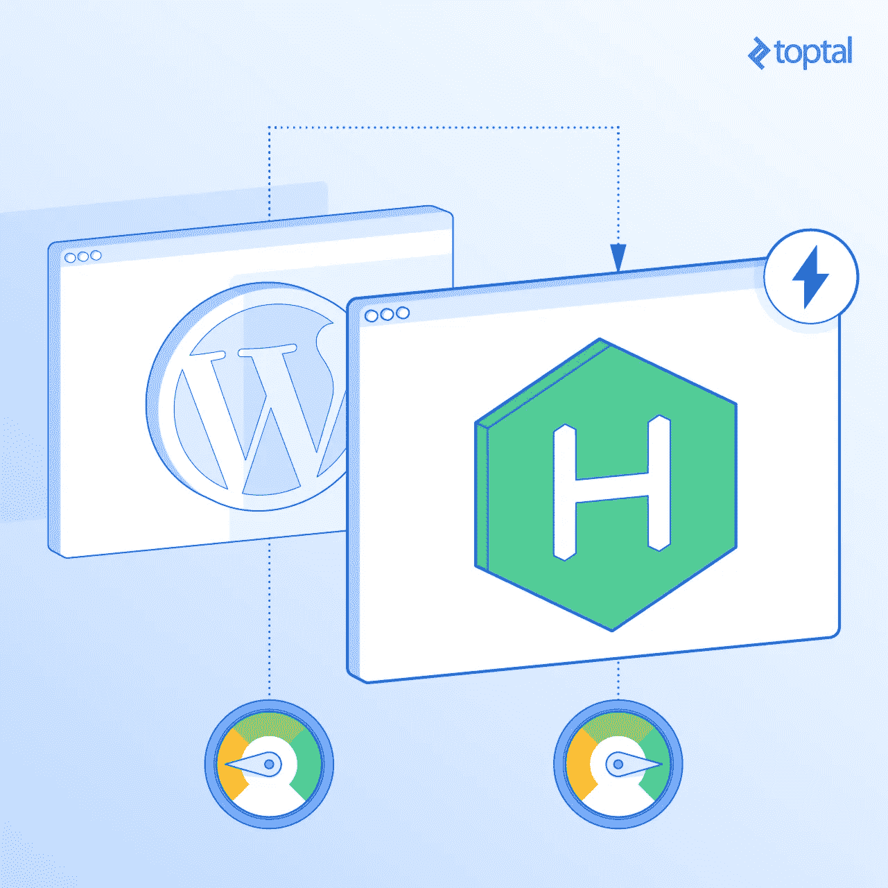

# 使用 Hexo 和 WordPress 的静态站点生成器指南

> 原文：<https://medium.com/hackernoon/a-guide-to-static-site-generators-using-hexo-and-wordpress-e6c0b17285cb>

静态站点生成器是将模板编译成静态 HTML 页面的系统。如果这听起来有效率的话——是的。没有服务器处理或渲染，因此静态网站往往非常快速和轻量级，为您和您的用户节省宝贵的时间和带宽。这种效率的提高反映在更低的成本和潜在的更高收入上。

# 从优化 WordPress 到静态化

说到高效的收入来源，我想到了 WordPress。它为 28%的互联网提供动力，是一个强大的平台，具有许多出色的功能，包括由一系列插件、主题、API 等支持的广泛的用户和内容管理。

即使是我们行业的大玩家也在使用 [WordPress](https://www.toptal.com/wordpress) 。像 *Smashing Magazine* 和 *CSS-Tricks* 这样的网站使用 WordPress，尽管在这两种情况下都有明显的定制实例。然而，使用 WordPress 可能是一项单调乏味的任务，尤其是在定制和优化性能的时候。

早在 2015 年，我就开了一个小博客。我的第一反应是使用 WordPress。这给了我一个飞跃，因为我已经在使用 WordPress 了。我在 [DigitalOcean](https://www.digitalocean.com/) 上新建了一个 droplet 作为服务器，建立了 [Vesta](https://vestacp.com/) 作为托管控制面板，安装了 WordPress 作为博客平台。最终，我设计并开发了一个全新的 WordPress 主题。唯一缺少的是内容。

我知道我想分享一些关于 Atom 的技巧，因为当时我正在使用这个伟大的编辑器。我发表了几篇关于它的文章，并与社区分享。

起初，我并没有太关注性能，因为我太专注于内容。过了一会儿，我发现了一些性能问题。Google PageSpeed Insights 上的分数很糟糕，所以我努力修复和优化我的网站，获得了几乎 99/100 的满分:

*   我从 Nginx+Apache 换到 Nginx+PHP-FPM。
*   我使用 CloudFlare 来提高速度和保护。
*   我使用 Cloudinary 来托管图像。
*   我调整了我的主题并使用了关键的 CSS。

唯一的警告是谷歌分析缓存问题，当时我不知道如何解决。

但是，如果 99/100 或 100/100 仍然不能获得您想要的性能，该怎么办呢？这就是静态页面生成器介入争论的地方。

# 输入静态页面生成器和 Hexo

那么什么是静态站点生成器呢？

顾名思义，静态网站生成器是一个生成静态 HTML 文件的系统。提供静态 HTML 文件比动态创建页面要快得多。没有服务器渲染或编译，这通常会导致页面加载延迟。

谈到性能，我们必须考虑缓存。尽管缓存 WordPress 有多种技术，但这通常不是一项简单的任务，不像缓存静态文件。提供缓存文件比从服务器提供实际文件更高效，并且在加载网站时可以节省时间。

今年 6 月，《粉碎》杂志的维塔利·弗里德曼在我所在城市的一个研讨会上介绍了 [JAMstack](https://jamstack.org/) 。我从未听说过它，我很感兴趣。研讨会结束后，我研究了一下这个新概念，我意识到它有多棒。我意识到我的网站不需要 WordPress。

第一步是决定使用哪个静态页面生成器。我不知道[有多少个](https://www.staticgen.com/)。我决定尝试一下 [Hexo 博客](https://hexo.io/)框架。它可部署到 [Netlify](https://www.netlify.com/) ，有从 WordPress 迁移过来的插件，使用 Node.js，我比较熟悉，不像 Jekyll 和 Hugo 分别基于 Ruby 和 go。而且，正如我后来发现的那样，它发展得非常快。



# 将 WordPress 迁移到 Hexo

Hexo 的安装非常简单。使用 npm 全局安装 **hexo-cli** ，运行 **hexo init** 命令，安装 npm 依赖项，瞧:

```
npm i -g hexo-cli hexo init <blog-name> cd <blog-name> npm install
```

要进行迁移，安装 [hexo-migrator-wordpress 插件](https://github.com/hexojs/hexo-migrator-wordpress)。这个插件需要 XML 文件作为源。XML 文件可以通过 WordPress 导出工具导出，可以在**工具- >导出- > Wordpress** 下的管理面板中找到。最后，键入 **hexo migrate** 命令完成导入。

```
hexo migrate wordpress <source>
```

剩下唯一要做的就是检查结果。运行 **hexo server** 命令启动服务器，在给定地址打开浏览器。

```
hexo server
```

# 降价及其局限性

Hexo 支持开箱即用的 Markdown。Markdown 是一种标记语言，许多人用它来格式化自述文件、评论和帖子。但是它也可以用来写你的文章。它的语法很直观，也很容易学习。

Markdown 的另一个优点是它生成干净有效的 HTML。这使得开发人员可以创建干净且可维护的 CSS 规则来设计博客文章和页面。

开发人员的生活从来都不容易。我们经常会遇到一些问题，这些问题可能会导致我们在意想不到的事情上花费时间。如果我们在这个过程中学到了一些东西，那么我们没有浪费时间，这是一件好事。同样的事情也发生在我身上。我以为一切都很顺利，因为没有编译错误，但后来我注意到有些事情并不像预期的那样。

例如，Codepen 演示无法加载。我搜索了一个 Hexo 插件，找到了一个。不幸的是，这个[插件](https://github.com/timnew/hexo-tag-codepen)不是官方的，它产生了不可接受的 HTML 错误。我想做出贡献并解决这些问题，但是最近的拉请求拖了一年半还没有解决。我认为这样会更容易派生存储库，修复问题，并在 Hexo 页面上发布插件，这样任何人都可以使用它。[插件](https://github.com/maliMirkec/hexo-tag-codepen)被接受了，我更新了内容，Codepen 演示非常有效。

类似的问题也发生在 CanIUse 嵌入式系统上。现在我知道了如何创建一个 Hexo 插件，没有理由不这样做。我的 [hexo-caniuse 插件](https://github.com/maliMirkec/hexo-caniuse)也发布了，我的 [hexo-cloudinary 插件](https://github.com/maliMirkec/hexo-cloudinary)也发布了，用于从 Cloudinary CDN 加载响应图像。

# 重新设计和优化

网站的设计是相当基础的。Hexo 在官方网站上免费提供了一些主题，但我想为我的 Hexo 网站提供一个独特的主题。在我阅读了[文档](https://hexo.io/docs/themes.html)并了解了如何定制 Hexo 之后，我开始从零开始开发一个原创主题。

为了创建新的模板，我决定使用 [EJS 作为](http://www.embeddedjs.com/)的模板。从未与 EJS 共事过，我把它看作是学习新模板语法的机会。如果你不喜欢 EJS，Hexo 通过插件为你提供 [Swig](http://www.swig.org/) 、 [Haml](http://haml.info/) 或 [pug](https://pugjs.org/api/getting-started.html) 支持。

在重新设计的过程中，我非常关注性能。通过遵循最佳实践，我们可以进一步提高静态网站的速度。将 JavaScript 文件放在文档的底部，并使用[关键 CSS 技术](https://www.smashingmagazine.com/2015/08/understanding-critical-css/)为你的观众创造最佳体验。

SEO 优化对于博客在谷歌等搜索引擎上的可见性至关重要。Hexo 有一个内置的助手，用于插入打开的图形数据。Hexo 使用 YAML 文件存储网站和主题配置。我使用主题配置文件来配置站点名称、描述和各种社会 id。

将 Gulp 或 Webpack 添加到您的构建过程中总是有帮助的，也是值得推荐的。我用 Gulp 来缩小和压缩 CSS 和 JavaScript 文件，一切就绪。我可以部署它。

# 网络生活

Netlify 是一个为网站和应用程序提供高速托管的平台。它将自己定位为一个统一的平台，可以自动编写代码来创建高性能且易于维护的网站。

> "简单地推送你的代码，让我们来处理剩下的事情."

如您所料，配置网站非常简单:

1.  设置域。
2.  更改 DNS 记录。
3.  设置构建和部署。
4.  打开 SSL。

一切就绪后，我运行了一些基本测试来查看分数，包括 [Pingdom 网站速度测试](https://tools.pingdom.com/)、[网页测试](https://www.webpagetest.org/)和 [Testmysite.io](https://testmysite.io/) 。结果非常好，因为该网站在每个工具上都获得了最高分。

# 云耀斑

尽管分数很高，我还是想试试 CloudFlare，看看它能在多大程度上提高网站速度。CloudFlare 一开始可能会让人不知所措，但是学习如何使用它是最基本的。配置完 CloudFlare 后，我重新运行了测试，结果甚至更好。

最后的测试是 [Google PageSpeed Insights](https://developers.google.com/speed/pagespeed/insights/) 。手机版和桌面版的得分几乎都是 100%。问题是谷歌分析浏览器缓存。[我通过使用 Google Analytics 的 CloudFlare 应用解决了这个问题](https://www.silvestarbistrovic.from.hr/articles/fixing-google-analytics-caching-issue/)。

# 这要花多少钱？

在 Netlify 上使用 Hexo 和 CloudFlare 是免费的。

Hexo 是一个开源平台，所以无论你决定如何使用它都是免费的。它有一个很大的社区，根据 StaticGen，它是第三大流行的开源静态页面生成器。

Netlify 有一个开放的计划，为我们的托管提供了很大的选择。图像也托管在 Cloudinary 的开放计划上。CloudFlare 的免费计划允许我们配置大量的规则，可以加速您已经很快的网站。它还允许我们修复谷歌分析浏览器缓存问题。我也没有为域名付费，因为我使用的是政府提供的免费个人域名。

这个项目设置将我的预算降到了最低。如果您的项目需要更高级的特性，静态页面生成器仍然可以为您节省一些钱。

提供缓存文件意味着 CPU 和带宽的使用减少了，这反过来意味着你可以使用更便宜的主机方案和更少的硬件。不仅如此，你的网站会更快，这意味着你的用户会喜欢在移动和桌面设备上浏览。而且，因为页面加载速度会影响谷歌搜索排名，你的网站会排名更高，获得更多的访问者。

所有这些都意味着你可以将部分预算花在其他地方——例如，推广你的网站或创造额外的内容，这将有助于获得更多的收入。

# 静态站点生成器的案例

从 WordPress 迁移到一个静态页面生成器不是一件简单的事情，这绝对不是每个 WordPress 用户应该做的事情。然而，由于它的插件、优秀的文档和简单的 API，Hexo 使这种转变相对容易。

在决定是否将产品迁移到静态解决方案之前，您需要了解静态页面生成器的局限性，比如内容限制、降价学习曲线和版本控制。

你也应该知道 Hexo 是一个博客框架。它非常适合知道如何使用文本编辑器和终端的开发人员和技术人员。如果你喜欢使用网络界面来管理你的内容，有一个插件也可以提供这个功能。它叫做 [hexo-admin](https://github.com/jaredly/hexo-admin) ，相当受欢迎。

如果你已经在使用 WordPress，你应该停下来想一想你现在正在使用 WordPress 的哪些功能，哪些是不可或缺的。你有复杂的内容结构吗？你在使用用户管理吗？你在你的 WordPress 实例上使用了很多插件吗？它们都是必要的吗？你对你网站的表现满意吗？

如果大部分或者所有这些问题的答案都是否定的，那么你就可以用一个静态页面生成器来增强你的网站。根据使用案例和您的需求，静态页面可以帮助最大化效率，同时最小化成本。另一方面，如果你需要 WordPress 的灵活性，你可能甚至不会考虑这样的举动。

顾名思义，动态站点是在后端服务器上动态生成的。这意味着每个请求都会生成一个页面，这对于性能来说不是最佳的。

与动态网站不同，静态网站只提供静态文件。当用户发出请求时，静态文件由服务器提供，没有任何后端逻辑。

静态站点生成器是一个从模板创建静态文件的系统。最终输出是包含资源的 HTML 页面的集合，通常是 CSS 和 JavaScript 文件。

*最初发表于*[*【www.toptal.com】*](https://www.toptal.com/front-end/wordpress-to-html-with-hexo-blog)*。*