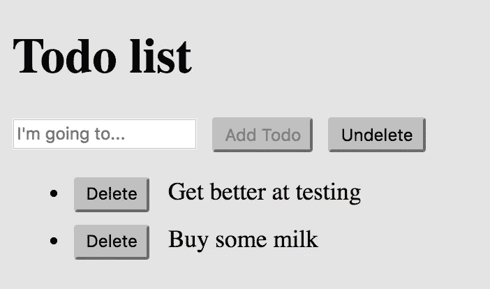
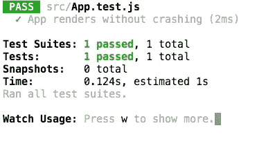
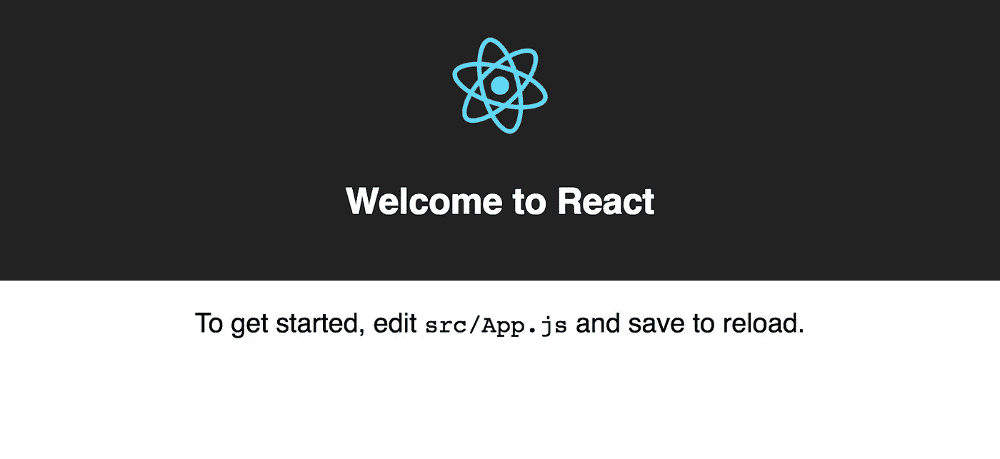
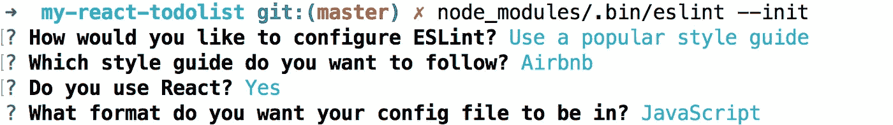
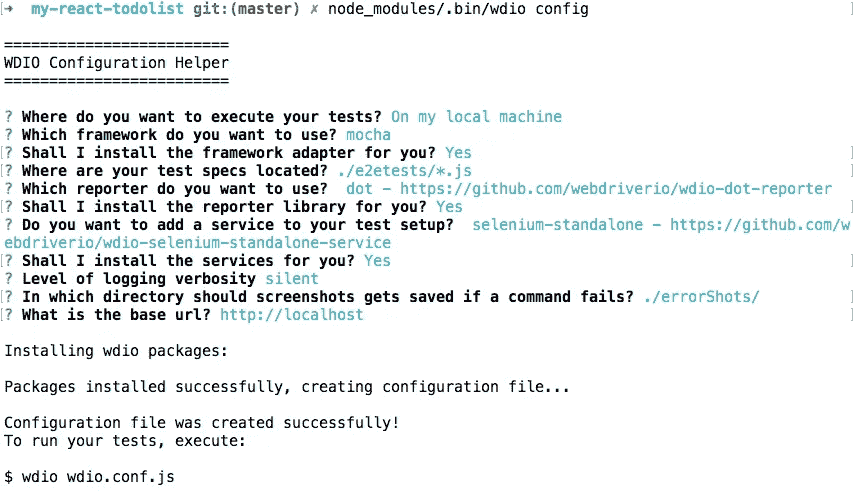
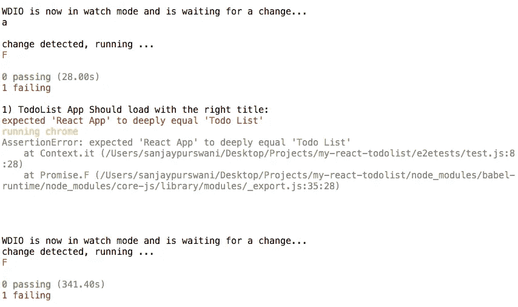
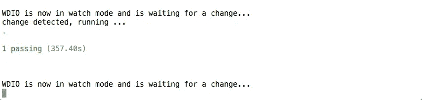

# TDD a React/Redux TodoList 应用程序指南—第 1 部分

> 原文：<https://medium.com/hackernoon/a-guide-to-tdd-a-react-redux-todolist-app-part-1-b8a200bb7091>

第一部分——你现在在这里。

[第二部分—链接](/@sanjsanj/a-guide-to-tdd-a-react-redux-todolist-app-part-2-8d4cb2dc154c)。

[第三部分——链接](/@sanjsanj/a-guide-to-tdd-a-react-redux-todolist-app-part-3-f25c2289c54)。

[第四部分——链接](/@sanjsanj/a-guide-to-tdd-a-react-redux-todolist-app-part-4-edb62e113c9b)。

*本教程假设对 JavaScript、前端、测试驱动开发和节点包管理器有一些了解，对*[*React*](https://hackernoon.com/tagged/react)*/*[*Redux*](https://hackernoon.com/tagged/redux)*几乎没有经验。这是我的观点，当你还在学习的时候，应该如何在这个非常基础的水平上做到这一点，它至少应该为你追求自己的最佳实践开辟道路。*

你对 React 了解得越少，我就越建议你扩展阅读支持链接。



High production value

# 介绍

上面的美就是我们在本教程中要做的——一个 React Todo list 应用程序，使用 Redux 作为我们的状态管理系统，使用 [webdriverIO](http://webdriver.io/) 进行端到端测试，使用 [enzyme](http://airbnb.io/enzyme/docs/api/) 进行单元测试。

你可以在 heroku 上在线查看完成的 app [。最后一个](https://my-react-todolist.herokuapp.com/) [git 仓库在这里](https://github.com/sanjsanj/my-react-todolist)。

我们将使用来自脸书的 [create-react-app](https://github.com/facebookincubator/create-react-app) 节点包来搭建我们应用的基础。如果你是 React 的新手，那么我建议[从头开始设置一个应用](https://codeburst.io/react-ecosystem-setup-step-by-step-walkthrough-721ff45a7fc1)几次，以熟悉所有的包和配置，但出于本教程的目的，我们将跳过这一步，让 create-react-app 为我们处理这些。


即使对于一个生产应用程序，我目前的感觉是最好使用 create-react-app，然后进行一些你可能想要的更改，这要高效得多。

*你可以在* [*这个 repo*](https://github.com/sanjsanj/create-react-app-ejected) *里看看 create-react-app 在幕后到底做了什么，我所做的就是搭起一个 app，然后运行* `*npm eject*` *来暴露所有的包、配置和脚本。文件的备注将被*`*package.json*`*`*config/*`*和* `*scripts/*` *文件夹的内容。**

# *创建应用程序*

*确保您安装了最新的[节点和 npm](https://nodejs.org/en/) 。*

*然后全局安装 create-react-app 包:*

*`npm install -g create-react-app`*

*在命令行中，我们转到要创建应用程序的父目录，然后运行以下命令:*

*`create-react-app my-react-todolist`*

*这将在与我们所在位置相关的`my-react-todolist/`文件夹中创建一个 react 应用程序。*

*然后，让我们转到该目录并安装我们需要的节点包:*

```
*cd my-react-todolist
npm install*
```

*如果你看一下`package.json`，你会注意到唯一的生产依赖项是`react`库和渲染它的`react-dom`，唯一的开发依赖项是一个叫做`react-scripts`的东西。神奇之处就在于此，它只是一个简单的包，将所有最重要的包作为其依赖项，并提供运行常见任务的脚本。您可以点击在 [npm 页面查看更多信息。](https://www.npmjs.com/package/react-scripts)*

*让我们运行测试作为健全检查，以确保一切都按计划进行。*

*`npm run test`*

*你应该有一个通过测试。*

**

*让我们运行我们的应用程序，看看它能做什么。*

*`npm run start`应该启动服务器并在[打开一个浏览器窗口 http://localhost:3000/](http://localhost:3000/)*

**

*我们成功了！我们是反动派。该领工资了。*

*在这一点上，我可能会进行第一次提交，并推进到 git，但这是你的电话。*

*   *[Git 提交](https://github.com/sanjsanj/my-react-todolist/commit/9f9c2f795ac63bbd1fe3a046b812125bae010910)*
*   *[储存库的状态](https://github.com/sanjsanj/my-react-todolist/tree/9f9c2f795ac63bbd1fe3a046b812125bae010910)*

# *埃斯林特*

*这一点是可选的，如果你是第一次使用实时 linter，那么你会发现一开始它是一个讨厌的东西，但它是一个必不可少的工具，如果你还没有习惯它，你也可以习惯它。*

*林挺非常有用，原因如下:实施风格规则和最佳实践，删除不需要的代码，减少认知负荷。*

*我目前最喜欢的是带有`airbnb`规则的`eslint`，它不是很时髦，但它是目前最流行的，也可能是最相关的选择。*

```
*npm install --save-dev eslint
node_modules/.bin/eslint —-init*
```

*这些是我使用过的选项，并建议您使用:*

**

*在这一点上，我们将为规则添加一个例外，当我们在一个`.js`文件中写 JSX 时，我们将告诉 eslint 不要抱怨。*JSX(带 XML 的 JavaScript)过于简化的定义是，它允许我们编写更加简洁、易读的 React 代码，包括标准的 html，在我们的 JavaScript 中，* [*阅读更多*](https://facebook.github.io/react/docs/jsx-in-depth.html) *。**

```
*"rules": {
    "react/jsx-filename-extension": [1, { "extensions": [".js", ".jsx"] }]
},*
```

*根据版本的不同，您的 eslint 可能看起来略有不同，但这就是我的`.eslintrc.js`配置的样子:*

*.eslintrc.js*

*   *[Git 提交](https://github.com/sanjsanj/my-react-todolist/commit/6bb1dc7e623bfaecb3eb59514648d76df1f50f73)*
*   *[储存库的状态](https://github.com/sanjsanj/my-react-todolist/tree/6bb1dc7e623bfaecb3eb59514648d76df1f50f73)*

# *重构*

*在我们继续之前，让我们用我们的应用程序做一点春季大扫除。*

*我们可以好好利用我们新发现的智力。打开`src/App.js`，我们应该会看到 eslint 对应用组件的抱怨。它希望我们把它写成一个无状态的纯函数，而不是现在的有状态的 React 组件。*

```
*// A stateful React componentclass App extends Component {
  render() {
    return (
      <div>My App</div>
    );
  }
}export default App*
```

*一个全功能的 React 组件可以让你访问所有的[生命周期方法](https://facebook.github.io/react/docs/react-component.html)以及存储和改变状态的能力，但是如果我们可以避免的话，这并不是编写代码的最好方式。*

*纯函数的好处是非常好测试，它们总是有可预测的回报，性能更好，并且是以不可变的函数风格编写的。*

```
*// A stateless pure functionconst App = () => (
  <div>My App</div>
)export default App*
```

*React 0.14 在 2015 年加入了纯函数模式，我鼓励你接受它们，它们使用起来很有趣。但是……您还应该知道如何编写有状态的 React 组件，以便在需要生命周期方法时使用，或者在组件本身中改变状态，而不是在状态管理系统中改变状态(在我们的例子中是 Redux)。*

*在这里阅读[无状态纯组件](/@joshblack/stateless-components-in-react-0-14-f9798f8b992d)，在这里阅读更多关于差异和[为什么你应该使用它们](https://hackernoon.com/react-stateless-functional-components-nine-wins-you-might-have-overlooked-997b0d933dbc)。*

*这就是我如何重构我的`App.js`，删除所有样板文件，为创建我们的待办事项列表做准备:*

*src/App.js*

*让我们重构我们唯一的单元测试，使用 [enzyme](http://airbnb.io/enzyme/index.html) ，一个让我们更容易测试的工具。我们还需要安装 react-test-renderer 依赖项。*

```
*npm install --save-dev enzyme react-test-renderer*
```

*这是我的`src/App.test.js`现在的样子:*

*src/App.test.js*

*`Line 2`我们从`enzyme`测试库中导入`shallow`模块。这将使[隔离测试](http://airbnb.io/enzyme/docs/api/ShallowWrapper/shallow.html)更加容易。关于渲染方法、选择器和断言的更多信息可以在[酶文档](http://airbnb.io/enzyme/docs/api/index.html)中找到。*

**如果你之前没有体验过 ES6* `*import*` *语法，那么* [*MDN 有一些不错的文档*](https://developer.mozilla.org/en-US/docs/Web/JavaScript/Reference/Statements/import) *你应该浏览一下。对于* `*require*` *文件和子模块来说，这是一种更好的方式，但是它需要传输文件。**

*然后重构我们的测试，浅层安装组件并断言它存在。*

*Eslint 可能会抱怨`it`和`expect`没有定义。为了消除这些错误，我们将在测试文件的顶部添加一个排除。*

*`/* global it, expect */`*

*确保您的测试仍然通过，并且您的应用程序仍然可以在浏览器中加载，只是内容很少。*

*   *[Git 提交](https://github.com/sanjsanj/my-react-todolist/commit/0575f83f0f8b5201d2da911d217d08921c3d184f)*
*   *[储存库的状态](https://github.com/sanjsanj/my-react-todolist/tree/0575f83f0f8b5201d2da911d217d08921c3d184f)*

# *端到端测试*

*在我们得意忘形并开始编码之前，让我们编写一个端到端(e2e)测试，实际测试我们的应用程序在浏览器中的表现是否如我们所愿。你可以称之为特性测试，或者验收测试，或者 UI 测试。*

*我们的 e2e 测试解决方案将涉及`[selenium](https://www.npmjs.com/package/selenium-standalone)`让我们启动浏览器、`[webdriverIO](http://webdriver.io/)`控制它和`[chai](http://chaijs.com/)`授予我们断言。*

*`npm install --save-dev selenium-standalone webdriverio chai`*

*并执行 webdriverIO 的设置:*

*`node_modules/.bin/wdio config`*

*这些是我使用过的设置，我将向您推荐:*

**

*确保你已经安装了 [Chrome](https://www.google.com/chrome/browser/desktop/index.html) ，然后编辑`wdio.conf.js`来选择它作为我们的默认浏览器。搜索:*

*`browserName: ‘firefox’,`*

*并替换为:*

*`browserName: ‘chrome’,`*

*在启动 selenium 服务器之前，我们必须执行一次性设置。我们可以手动完成这项工作，但如果我们想让任何人都可以轻松使用这个回购，那么我们真的应该设置一个任务。稍后，我们将在自述文件中记录我们如何设置、启动和测试我们的项目。*

*在`package.json`中，让我们创建几个脚本来处理我们的 e2e 测试需求:*

```
*"scripts": {
  "selenium-setup": "selenium-standalone install",
  "selenium-start": "selenium-standalone start",
  "e2e-tests": "wdio wdio.conf.js",
  "e2e-tests-watch": "wdio wdio.conf.js --watch",
  ...
}*
```

*下面是我的`package.json`现在的样子:*

*package.json*

*然后设置并启动 selenium 服务器:*

```
*npm run selenium-setup
npm run selenium-start*
```

*超级！现在我们可以写第一个 e2e 测试了。我手动进入了 wdio 配置中的`e2etests/`文件夹，所以我将把它写入其中。如果您使用默认设置，那么您的测试应该放在相应的文件夹中。*

*e2etests/test.js*

*为了更好地了解如何使用 webdriverIO，请阅读它的 API 文档。*

*现在，如果我们运行`npm run e2e-tests`，我们应该会得到一个失败的特性测试，因为我们还没有改变页面的标题:*

**

**我们可以运行* `*npm run e2e-tests-watch*` *如果我们想在‘监视’模式下运行我们的 e2e 测试，这意味着 webdriverIO 将监视我们通过* `*wdio.conf.js*` *告诉它跟踪的文件中的变化，然后在保存时重新运行测试。这更方便，但有时可能会给我们不必要的失败，只是在开发时要小心。**

*前往`public/index.html`，更改:*

*`<title>React App</title>`*

*收件人:*

*`<title>Todo List</title>`*

*看看通过测试的绿色荣耀。*

**

*   *[Git 提交](https://github.com/sanjsanj/my-react-todolist/commit/db3da9fd0f9db25536333319ae8597a704932a22)*
*   *[储存库的状态](https://github.com/sanjsanj/my-react-todolist/tree/db3da9fd0f9db25536333319ae8597a704932a22)*

# *概述*

*我们已经学会了如何:*

*   *建立开发环境。*
*   *创建我们的 React 应用。*
*   *使用 Eslint。*
*   *重构为 ES6 语法。*
*   *设置 e2e 测试。*
*   *让我们的第一个 e2e 测试通过。*

# *下一个*

*现在我们已经设置了大部分的应用程序，并且对我们的工作流程更加熟悉了，让我们继续编写单元测试并添加我们的第一个 todo。*

*第一部分——你现在在这里。*

*[第二部分—链接](/@sanjsanj/a-guide-to-tdd-a-react-redux-todolist-app-part-2-8d4cb2dc154c)。*

*[第 3 部分—链接](/@sanjsanj/a-guide-to-tdd-a-react-redux-todolist-app-part-3-f25c2289c54)。*

*[第 4 部分—链接](/@sanjsanj/a-guide-to-tdd-a-react-redux-todolist-app-part-4-edb62e113c9b)。*