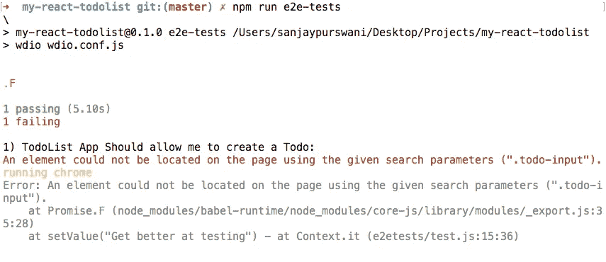
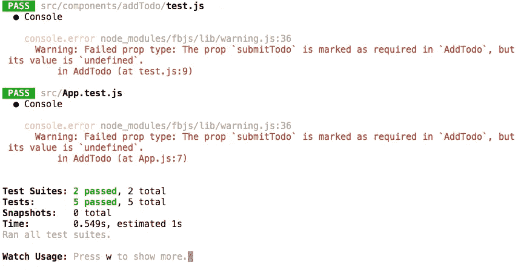
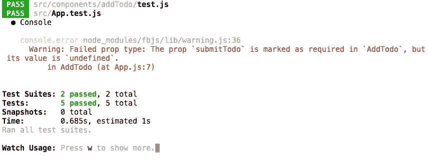
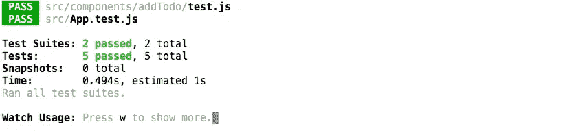
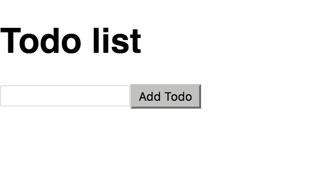

# TDD a React/Redux TodoList 应用程序指南—第 2 部分

> 原文：<https://medium.com/hackernoon/a-guide-to-tdd-a-react-redux-todolist-app-part-2-8d4cb2dc154c>

[第 1 部分—链接](/@sanjsanj/a-guide-to-tdd-a-react-redux-todolist-app-part-1-b8a200bb7091)。

第二部分——你现在在这里。

[第三部分——链接](/@sanjsanj/a-guide-to-tdd-a-react-redux-todolist-app-part-3-f25c2289c54)。

[第 4 部分—链接](/@sanjsanj/a-guide-to-tdd-a-react-redux-todolist-app-part-4-edb62e113c9b)。

# 添加待办事项

现在让我们编写一个更有用的特性测试，它将帮助我们编写相应的单元测试和代码来实际构建我们想要的功能:

e2etests/test.js

让我们用简单的英语把它分解。

`Line 9`创建一个`todoText`字符串常量。

`Line 10`导航到页面。

`Line 11`找到`.todo-input`元素，进入`todoText`。

`Line 12`点击`.todo-submit`元素。

`Line 13`找到`.todo-text`元素，并将其文本值赋给`actual`常量。

`Line 15`断言`actual`等于`todoText`。

运行测试，看着它失败。你应该有一个通过和一个失败的 e2e 测试，如果都失败了，你有一个观察模式的问题，应该手动运行 e2e 测试。我还没有时间来正确地调试这个手表问题，但是如果你有适当的动机，就继续吧。



在我们编写必要的代码之前，我们将编写适当的单元测试，在此之前，让我们修复 e2e 测试中的 eslint 错误。将以下注释添加到`e2etests/test.js`文件的顶部:

`/* global describe, it, browser */`

如果我们在那个文件中得到另一个 eslint 错误，抱怨`chai`是一个 devDependency，那么有一个已知的 bug 已经引起了一些关于 eslint 规则合并的争论。这与我们在这里做的事情无关，但是如果你想知道更多的话，请从这里开始阅读。

目前的解决方案是在我们的`.eslintrc.js`中添加另一条规则

```
rules: {
  ...
  "import/no-extraneous-dependencies": [2, { devDependencies: true }],
},
```

这是我的`.eslintrc.js`现在的样子:

.eslintrc.js

让我们创建下面的文件夹结构`src/components/addTodo/`，并在其中创建一个占位符`index.js`，将其留空。我们不想写任何我们不需要的代码，我们只需要足够的代码来通过我们的测试。所以让我们在`src/components/addTodo/test.js`写一个单元测试:

src/components/addTodo/test.js

`Line 5`从与该测试相同的文件夹中的`index.js`导入一个`AddTodo`组件。

`Line 9 — 10`浅层渲染组件到`component`常量，并期望它存在。

这个单元测试应该会失败，因为我们的`.../addTodo/index.js`没有返回任何东西，因此无法呈现。因此，让我们创建我们的组件:

*您应该让您的单元测试任务运行，如果不是，那么运行* `*npm run test*` *。*

src/components/addTodo/index.js

现在我们的测试应该通过了。让我们来编写下一个测试，这是我们离最终目标更近一步所必须做的最起码的工作:

src/components/addTodo/test.js

测试应该会失败，让我们尽最大努力让它通过:

src/components/addTodo/index.js

此时，我们可以将我们的`AddTodo`组件合并到我们的主`App`中，这将帮助我们通过 e2e 测试中的第一个错误，并显示我们还需要做什么:

src/App.js

`Line 2`导入`AddTodo`组件。

`Line 7`添加到我们的`App`。

`Line 6`添加适当的标题。

我们的 e2e 测试现在应该显示它能够找到`.todo-input`并在其中输入一些文本，但是它不能找到`.todo-submit`，所以这正是我们接下来要进行单元测试和编码的内容:

src/components/addTodo/test.js

所以让我们添加我们需要的`.todo-submit`元素，我们知道我们希望它是一个按钮。现在我知道你在想什么了，*‘一个输入，一个提交按钮，接下来是什么——一个表单？’*，没错你说对了，一个形式！

src/components/addTodo/index.js

我们的 e2e 测试可以在输入中输入文本，并单击提交按钮，但是我们需要为它挂接功能，但是让我们先编写一个适当的单元测试:

src/components/addTodo/test.js

`Line 1`为`jest`的 eslint 添加一个例外。

我们将`jest.fn()`方法指定为我们的模拟。我们使用它是因为它与我们的[应用](https://hackernoon.com/tagged/app)捆绑在一起，并为我们提供了[好的帮助方法](https://facebook.github.io/jest/docs/mock-functions.html)，使测试函数被调用变得容易，同时不用担心它的实际实现。

`Line 4`我们从`enzyme`进口`mount`模块。

`Line 15`我们实际上`mount`了我们的组件，所以我们可以访问表单提交上的`event`到`preventDefault()`。我们也用一个`submitTodo` prop 实例化它，我们给它一个`submitMock`函数。

`<AddTodo submitTodo={submitMock} />`翻译过来就是；创建一个 AddTodo 组件，它有一个名为`submitTodo`的属性，当我们实例化这个组件时，传入`submitMock`作为那个属性。稍后在组件本身中，我们将为道具编写一些验证，以确保它是一个函数。

`Line 17 — 19`我们期望我们的`submitTodo`从零个调用开始，一旦我们提交表单，它就有一个调用，确认事件被触发。

我们将要对我们的`AddTodo`组件进行实质性的修改，但是首先让我们安装 prop-types 节点包:

`npm install --save-dev prop-types`

src/components/addTodo/index.js

让我们来看看这些变化:

`Line 4 — 7`我们对组件的语法做了一点修改。因为我们想做的不仅仅是返回一些从开始构造时就有的标记:

```
const Something = () => (
  <p>Return something</p>
);
```

收件人:

```
const Something = () => {
  const text = "Return something"; return (
    <p>{text}</p>
  );
};
```

然后:

`Line 5`我们需要一个可变变量来存储我们的输入文本，所以我们做了一个`let input;`。

`Line 19 — 21`当我们提交表单时，我们希望发送输入的文本，所以我们告诉 [React](https://hackernoon.com/tagged/) 存储一个对这个 DOM 元素的`ref`(引用)，这意味着 React 将能够跟踪并在组件中使用它。然后将该元素赋给可变的`input`变量。

*以上还有更好的方法，但我认为这是一个很好的机会来探索一个*`*ref*`*[*的功能。*](https://facebook.github.io/react/docs/refs-and-the-dom.html)*

*`Line 10 — 14`我们告诉表单要做什么`onSubmit`。首先是`preventDefault`动作，在这种情况下是重新加载页面，因为这是表单提交的默认行为。然后用`input.value`调用一个`submitTodo`函数，在这个例子中是输入到输入中的文本。然后将`input.value`设置回一个空字符串，这样它就会清除输入文本框。*

*`Line 4`我们将`submitTodo`函数作为属性传递给组件，也就是`prop`。阅读关于[组件和道具](https://facebook.github.io/react/docs/components-and-props.html)的内容。*

*`Line 2`我们必须导入`prop-types`节点包，以便在我们没有为它们提供值时给我们正确的验证和默认值。*

*`Line 32 — 34`我们必须在我们的组件中验证`prop`，所以我们告诉 React 它将是一个函数，当我们实例化这个组件时，它是必需的。阅读关于[验证属性类型](https://facebook.github.io/react/docs/typechecking-with-proptypes.html)的内容。*

**

*我们刚刚编写的测试通过了，但是我们对`AddTodo`组件的修改破坏了另外两个测试。我们现在告诉组件，它在实例化时需要一个`submitTodo` prop，它是一个函数，是必需的，我们还没有提供默认值。*

```
*// src/components/addTodo/index.js
// Line 32 - 34AddTodo.propTypes = {
  submitTodo: PropTypes.func.isRequired,
};*
```

*现在在我们的测试中，我们希望组件的每个实例也有这个属性，但这将是许多重构的第一步，所以让我们稍微优化一下我们的设置，记住 DRY(不要重复自己)。*

*src/components/addTodo/test.js*

*`Line 8 — 17`我们创建一个可变的`component`变量，并将其分配给我们的`shallow`挂载组件`beforeEach`测试，并从每个单独的`it(...)`块中移除该分配。*

*`Line 33`我们仍然必须保留这个赋值，因为我们实际上希望`mount`在为这个测试渲染时使用它。*

*`Line 1`将`beforeEach`添加到 eslint 异常中。*

**

*现在我们要修复我们的应用程序测试。它告诉我们错误发生在哪里，`App.js Line 7`:*

*src/App.js*

*`Line 7`现在我们只是将一个空的 ES6 箭头函数`() => {}`传递给我们的`AddTodo`的`submitTodo`道具。这将允许我们通过我们的组件验证，并再次通过单元测试，尽管它不会帮助我们的 e2e 测试进展或实际上增加任何功能…但这是我们接下来要做的。*

**

*   *[Git 提交](https://github.com/sanjsanj/my-react-todolist/commit/cde73d27d845c8f6d25bc7b181400b3fa7453f6a)*
*   *[储存库的状态](https://github.com/sanjsanj/my-react-todolist/tree/cde73d27d845c8f6d25bc7b181400b3fa7453f6a)*

**

*What our App looks like now.*

# *概述*

*我们已经学会了如何:*

*   *写一个有用的特性测试。*
*   *单元测试 React 组件的创建。*
*   *验证属性类型。*

# *下一个*

*现在我们需要超越仅仅创建 UI，开始通过`actions`设置我们的事件调度程序，通过`reducers`设置事件处理程序。*

*[第 1 部分—链接](/@sanjsanj/a-guide-to-tdd-a-react-redux-todolist-app-part-1-b8a200bb7091)。*

*第二部分——你现在在这里。*

*[第 3 部分—链接](/@sanjsanj/a-guide-to-tdd-a-react-redux-todolist-app-part-3-f25c2289c54)。*

*[第 4 部分—链接](/@sanjsanj/a-guide-to-tdd-a-react-redux-todolist-app-part-4-edb62e113c9b)。*