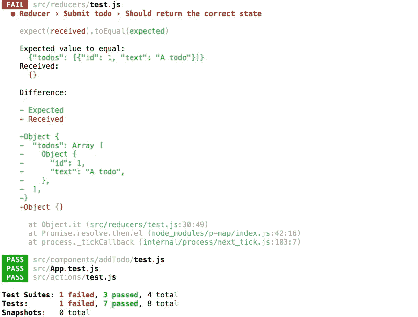
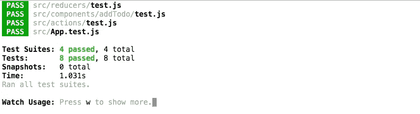
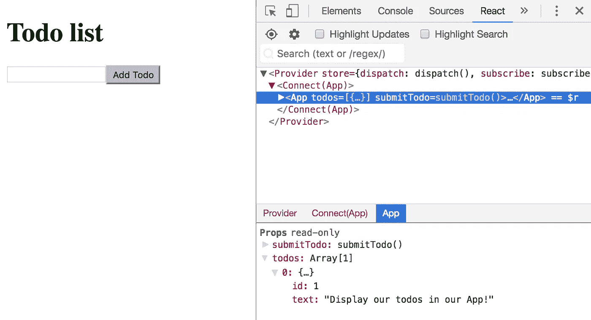

# TDD a React/Redux TodoList 应用程序指南—第 3 部分

> 原文：<https://medium.com/hackernoon/a-guide-to-tdd-a-react-redux-todolist-app-part-3-f25c2289c54>

[第 1 部分—链接](/@sanjsanj/a-guide-to-tdd-a-react-redux-todolist-app-part-1-b8a200bb7091)。

[第二部分——链接](/@sanjsanj/a-guide-to-tdd-a-react-redux-todolist-app-part-2-8d4cb2dc154c)。

第三部分——你现在在这里。

[第 4 部分—链接](/@sanjsanj/a-guide-to-tdd-a-react-redux-todolist-app-part-4-edb62e113c9b)。

# Redux

*我过于简化的解释是；UI 元素调度动作，该动作是仅包含相关信息的对象，该动作被发送到缩减器，缩减器接收应用和动作的当前状态并返回新状态，UI 订阅该状态，并在所述状态改变时有效地更新。*

我们正在谈论 [Redux](https://hackernoon.com/tagged/redux) ，基于 Flux 架构，[这里有一个非常好的解释](https://code-cartoons.com/a-cartoon-intro-to-redux-3afb775501a6)，如果你还不熟悉的话可以读一下。

# submitTodo 操作

我们将使用一个`constants`文件来确保一致性，消除愚蠢的语法错误，并帮助记录我们的代码:

src/constants/index.js

src/actions/test.js

`Line 7`因为我们将不止一次地使用一个`todoText`，我们也可以在`describe`的范围内将它设置为一个常量。

`Line 10 — 14`当我们以`todoText`作为参数调用`submitTodo`函数时，这是我们期望我们的应用程序调度的动作。这是我们的 Redux `reducer`为了存储这个 todo 所需的最低限度；一个`type`让缩减器知道这是哪种动作，一个`id`让它有一个惟一的标识符，还有 todo 本身的`text`。

`Line 16`断言。

失败的测试告诉我们要构建什么，所以让我们创建动作:

src/actions/index.js

`Line 3`创建一个可变变量来保存我们的`id`。

`Line 5 — 8`一个`nextId`帮助器方法，它递增`id`然后返回它。

`Line 11 — 17`我们的动作将`text`作为参数，并返回一个将被分派给我们的 reducer 的对象。

仅仅说`text,`是`text: text,`的简写。

我们的测试应该通过了。

*   [Git 提交](https://github.com/sanjsanj/my-react-todolist/commit/5ad7327180b966621f8e7c8bf2255e3ebd482ab2)
*   [储存库的状态](https://github.com/sanjsanj/my-react-todolist/tree/5ad7327180b966621f8e7c8bf2255e3ebd482ab2)

# submitTodo 缩减程序

这是我们基于动作存储和返回新状态的地方。首先，我们可以测试它在实例化时返回一个`initialState`:

src/reducers/test.js

`Line 3`我们导入`reducer`本身和它的`initialState`变量。

`Line 7`断言当我们在没有状态和空动作的情况下调用`reducer`时，它会正确地返回我们期望的`initialState`。

让我们通过测试:

src/reducers/index.js

`Line 1`从该文件中导出一个`initialState`模块。

`Line 3`导出`reducer`，这是一个以`state`(默认为`initialState`)和`action`为参数，简单返回`state`的函数。当这个归约器返回新的状态时，Redux 将跟踪它，并在将来的归约中使用所述新状态。

`Line 5`导入该文件时，默认导出`reducer`。

现在让我们测试它能否接收我们的`submitTodo`动作并返回一个新的正确状态:

src/reducers/test.js

`Line 3`导入我们的`types`常量。

`Line 7`设置一个`todoText`变量来帮助断言一致性。

`Line 15 — 19`设置我们希望传递给减速器的动作。

`Line 21 — 28`设置预期回报`state`，包含一个数组`todos`，其中链接了我们全新的 todo。

我们的测试向我们展示了什么是错误的，我们期望返回一个新的状态以及我们已经提交的 todo，但是我们仍然只是得到一个空的`initialState`对象。所以让我们来解决它:

src/reducers/index.js

`Line 1`导入`types`模块给我们我们的`constants`。

`Line 3 — 5`更改我们的`initialState`以包含一个`todos`键，它在实例化时是一个空数组。这将以 todo 对象的数组结束。

`Line 7`我们已经重构了我们的 reducer，使之成为一个不仅仅返回`initialState`的函数。

`Line 8`我们使用标准的`switch`语句返回基于`action.type`的新计算状态。

`Line 10 — 11`在我们的动作类型是“`SUBMIT_TODO`的情况下，我们返回这个状态的对象表示。

`Line 12 — 19`这种语法的要旨是；我们希望从返回任何存在的东西开始，然后重写我们想要添加、删除或更改的新东西。

`Line 12`返回解包状态，即状态的所有内容，包括空的`todos`数组。

`Line 13`用这个数组覆盖`todos`键。

`Line 14`这个数组包含我们当前状态的`todos`数组碰巧包含的任何内容，无论是什么都不是还是几十个 todo 对象。

`Line 15 — 18`现在添加一个新的对象到这个数组，给它一个我们传入的`action.id`的`id`，给它一个我们传入的`action.text`的`text`。

因此，我们刚刚返回了一个新的状态表示，它包含现有的状态和我们刚刚提交的新 todo。希望这有意义。

如果没有我们可以处理的`action.type`存在，我们的减速器的默认返回只是现有的状态。

我们的减速器单元测试现在通过了。所以从技术上来说，我们的代码现在知道如何向状态添加一个 todo，现在我们只需要设置 Redux，并通过我们的`App`组件将事情连接起来。

*   [Git 提交](https://github.com/sanjsanj/my-react-todolist/commit/6deb88554b92a768331a3bc54a3f90450e9e676f)
*   [储存库的状态](https://github.com/sanjsanj/my-react-todolist/tree/6deb88554b92a768331a3bc54a3f90450e9e676f)

# 布线冗余

首先我们需要安装`redux`和`react-redux`作为依赖项。

`npm install --save redux react-redux`

`redux`与 [React](https://hackernoon.com/tagged/) 完全分离，只是一种管理状态的方式，是我们应用程序的唯一真实来源。

`react-redux`为我们提供了`redux`的 React 绑定。

让我们来创建我们的商店:

src/store.js

`Line 1`从`redux`导入`combineReducers`和`createStore`子模块。

`Line 2`进口我司减速机，可还原商场新状态。

`Line 4 — 6`在这一点上是多余的，因为我们只有一个减速器，但随着我们应用程序的扩展，我们将希望减速器具有可管理的责任，并将使用`combineReducers`将其合并为一个供我们的商店使用。

`Line 8`我们默认导出我们的商店。简单。

然后:

src/index.js

`Line 5`从`react-redux`导入`Provider`模块，它的一个目的是为所有包装的子组件提供存储，在本例中是我们的应用程序及其所有子组件。

[React-redux-connect 解释。](http://www.sohamkamani.com/blog/2017/03/31/react-redux-connect-explained/)

`Line 7`导入我们上面创建的`store`。

`Line 10 — 15`我们在这里做了两件事；重构我们的代码，使其更加清晰，并将我们的`App`包装在我们的`Provider`中，在这里我们传递我们的 reducer 和 redux-store 作为`store`。

在我们的渲染方法中为`document`元素添加一个 eslint 异常。

最后:

src/App.js

导入`connect`，这样我们就可以将 redux 的必要部分暴露给我们的应用程序。

导入我们之前创建的`actions`,这样我们就可以在我们的组件中调度它们。

`Line 18`顾名思义，我们将在`store.js`中创建的状态准备给组件使用的属性。

同样，我们正在将应用程序中的可分派操作准备为可在组件中使用的属性。

`Line 21 — 25`我们已经创建了接受`text`参数的`submitTodo`分派事件，如果不为 falsey，它将分派我们的`actions.submitTodo`函数。

`Line 28``connect`模块现在完成了任务，它给我们的应用程序提供了与状态交互的两种方式；调度操作和订阅状态。另一种解释是:告诉商店如何改变并读取其状态。这现在成为我们从该文件的默认导出。

`Line 3`导入`PropTypes`进行我们的道具验证。

`Line 14 — 16`验证我们即将传入的`submitTodo`函数。

`Line 7`我们的`connect`已经给了我们访问`submitTodo`的权限，所以我们只需将它传递给我们的`App`。*注意:我们已经将其更改为非默认导出，连接的应用程序是默认的，但我们仍然会在稍后的测试中公开它。*

`Line 10`然后我们将它传递给需要它的`AddTodo`组件。

最后更新测试:

src/App.test.js

`Line 5`我们不得不从导入`App`改为导入`{ App }`，因为我们想在不使用整个连接组件的情况下单独测试这个组件，这需要我们传入一个`Provider`和`store`。

`Line 6`引入`initialState`作为我们应用的状态。

`Line 9`为`submitTodo`创建一个模拟函数。

`Line 11 — 15`稍微重构一下，让代码可读性更强，更容易扩展，然后消耗`state`和`submitTodo`。

下面对 [redux 和 connect](http://www.sohamkamani.com/blog/2017/03/31/react-redux-connect-explained/) 做一个清晰简洁的解释。

您可能还会发现 [react-redux API 文档](https://github.com/reactjs/react-redux/blob/master/docs/api.md#api)非常有用，并且会惊讶于它是如此的小和简单。

我们还没有显示我们的待办事项，但它们实际上可以通过用户界面输入并存储在状态中。抓取 [Chrome React devtools 扩展](https://chrome.google.com/webstore/detail/react-developer-tools/fmkadmapgofadopljbjfkapdkoienihi?hl=en)，输入一个 todo，然后点击提交。

现在去商店看看，看到它出现了:

Storing a todo in state

*   [Git 提交](https://github.com/sanjsanj/my-react-todolist/commit/65c21c74199bf3e1c1f96932cc231578fc16585b)。
*   [储存库的状态](https://github.com/sanjsanj/my-react-todolist/tree/65c21c74199bf3e1c1f96932cc231578fc16585b)。

# 概述

我们已经学会了如何:

*   试驾行动的创建。
*   减速器的试驾创作。
*   将 Redux 连接到我们的应用程序，这样它就可以调度事件和订阅状态。

# 下一个

让我们开始充分利用订阅 state 的能力，并开始展示一些待办事项吧！

[第 1 部分—链接](/@sanjsanj/a-guide-to-tdd-a-react-redux-todolist-app-part-1-b8a200bb7091)。

[第 2 部分—链接](/@sanjsanj/a-guide-to-tdd-a-react-redux-todolist-app-part-2-8d4cb2dc154c)。

第三部分——你现在在这里。

[第 4 部分—链接](/@sanjsanj/a-guide-to-tdd-a-react-redux-todolist-app-part-4-edb62e113c9b)。