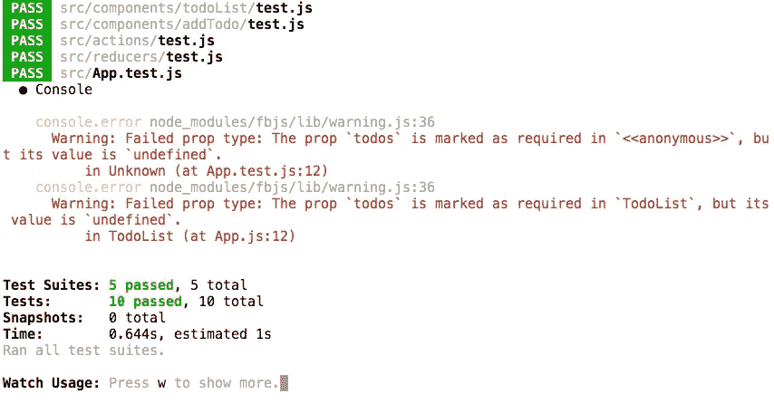
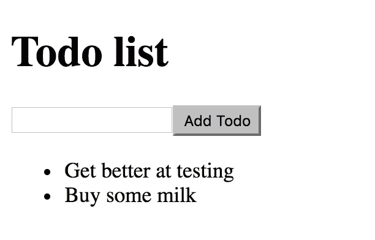
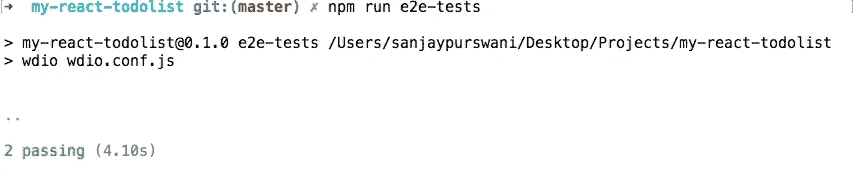
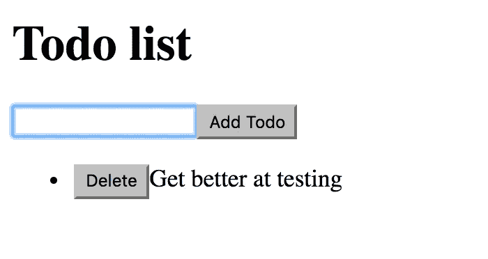

# TDD a React/Redux TodoList 应用程序指南—第 4 部分

> 原文：<https://medium.com/hackernoon/a-guide-to-tdd-a-react-redux-todolist-app-part-4-edb62e113c9b>

[第 1 部分—链接](/@sanjsanj/a-guide-to-tdd-a-react-redux-todolist-app-part-1-b8a200bb7091)。

[第二部分—链接](/@sanjsanj/a-guide-to-tdd-a-react-redux-todolist-app-part-2-8d4cb2dc154c)。

[第 3 部分—链接](/@sanjsanj/a-guide-to-tdd-a-react-redux-todolist-app-part-3-f25c2289c54)。

第四部分——你现在在这里。

# TodoList 组件

为了通过我们失败的 e2e 测试，我们还有几件事要做；有一个`.todo-text`元素，让它包含我们在表单中提交的文本。

创建文件夹结构`src/components/todoList/`，然后在`test.js`编写我们的第一个单元测试，这将允许我们创建我们的组件:

src/components/todoList/test.js

这应该是不言自明的，它非常类似于我们如何开始构建我们的`addTodo`组件。

`index.js`中的组件应该返回什么:

src/components/todoList/index.js

`Line 4`我们将把组件包装在一个`<ul>`中。

然后让我们测试列表中的 todo:

src/components/todoList/test.js

`Line 8 — 13`我们创建了我们的`todos` prop，一个包含一个 todo 的数组，作为带有`id`和`text`的对象。

实际上，我们将 todo 作为一个道具传递给组件。

`Line 22`我们期望我们的`todoList`将包含一个带有 todo 文本的`.todo-text`元素。

现在我们只需要让我们的 todo 渲染:

src/components/todoList/index.js

`Line 2`导入`PropTypes`供我们验证。

`Line 18 — 25`我们告诉我们的组件，它将接收一个名为`todos`的`prop`，它将是一个对象数组，它的`id`将是一个数字，`text`将是一个字符串，一切都是必需的。 [*反应道具类型验证*](https://facebook.github.io/react/docs/typechecking-with-proptypes.html) 。

我们将`todos` prop 传入我们的实际组件。

`Line 5 — 8`我们`map`通过我们的数组，返回一个`li`，它的内容是`todo.text`，它有一个`todo.id`的`key`,[React](https://hackernoon.com/tagged/react)需要`key`来更有效地知道如何重新渲染 DOM，如果你没有它，你将在开发中得到一个控制台警告。

`Line 11 — 15`我们返回我们的`ul`包装器，其中包含我们状态中每个 todo 的所有`li`。

*   Git 提交。
*   [储存库的状态](https://github.com/sanjsanj/my-react-todolist/tree/33dbea8e008b47bddc6acce8cf5d9570c0645495)。

# 显示待办事项

此时，我们的`TodoList`组件知道如何呈现自己，因此可以连接到我们的主应用程序。

src/App.js

`Line 5`导入我们的`TodoList`组件。

`Line 18 — 23`为其提供适当的验证。

`Line 8`将我们的 todos 数组作为一个`prop`从状态输入到我们的应用程序中，这样我们就可以将它传递下去。多亏了`line 26`，我们才把它变成了`prop`。

`Line 12`将`TodoList`组件添加到我们的`App`中，并将`todos`从状态传递给它。

我们现在得到一个测试错误，因为我们已经告诉组件它需要一个`todos`数组，但是还没有传入:

所以我们做出了改变:

src/App.test.js

简单地传递一个空数组给我们的道具，这将停止我们的抱怨。我们不想在父级对子组件进行单元测试。

现在，如果我们在浏览器中查看我们的应用程序，我们会发现我们实际上可以显示那些我们一直存储在状态中的可爱的待办事项。万岁。

现在我们的 e2e 测试应该通过了:

*   [Git 提交](https://github.com/sanjsanj/my-react-todolist/commit/5f03d81cbc3240e0beb71c8daa5dd77547e9d801)
*   [存储库的状态](https://github.com/sanjsanj/my-react-todolist/tree/5f03d81cbc3240e0beb71c8daa5dd77547e9d801)。

# 删除待办事项

首先，我们编写 e2e 测试:

e2etests/test.js

将上面的`Line 12 — 21`添加到你的 e2e 测试中。

该测试运行与之前相同的程序，然后单击`.todo-delete`元素，然后期望选择器的`state`等于“失败”。如果它存在(没有被删除)，就等于“成功”。

我喜欢通过编写动作、缩减器、创建组件，然后将其添加到应用程序来实现功能。

因此，让我们测试一下正确的操作。首先让我们创建一个适当的常数:

src/constants/index.js

`Line 3`我们新的 DELETE_TODO 常量。

然后，在`action`中，我们只需要知道删除一个 todo 将是它唯一的`id`。

src/actions/test.js

然后添加代码使其通过:

src/actions/index.js

现在让我们对我们的缩减器功能进行单元测试:

src/reducers/test.js

现在看来，这应该很有意义了。我们给我们的`reducer`一个包含 todo 的`startingState`，将它传递给我们刚刚创建的`action`，它将从存储中删除该 todo，并期望返回的状态确实不包含该 todo。

我们现在需要在我们的`reducer`中添加另一个`case`来处理这个问题:

src/reducers/index.js

当遇到 DELETE_TODO `action.type`时，我们返回一个包含所有现有`...state`的新状态，我们覆盖`todos`数组，使其成为一个过滤列表，其中`todo.id`与`action.id`不同。因此所有的`todo`都不是我们想要删除的。

那很容易，不是吗？

现在让我们测试一下我们的组件能不能让我们删除一个 todo:

src/components/todoList/test.js

`Line 1`将`jest`添加到 eslint 异常中。

`Line 8`为我们的删除功能创建一个模拟函数。

将我们之前的单个`todos`道具重构为一个包含我们需要的所有道具的对象。

`Line 20`让我们的`component`浅层渲染，把之前指定的`props`全部解包。

测试点击一个`.todo-delete`元素确实调用了我们的`deleteTodo`函数。

然后是通过测试的代码:

src/components/todoList/index.js

`Line 36`验证我们的`deleteTodo`道具。

`Line 4`将它传递给我们的组件。

`Line 8 — 14`添加一个“删除”按钮，该按钮将调用`deleteTodo`函数，并将`todo.id`作为`onClick`事件的参数。

现在，我们需要通过应用程序将它连接到我们的用户界面:

src/App.js

`Line 36 — 38`创建将分派适当动作的`deleteTodo`道具。

`Line 24`验证。

`Line 8`将其添加到我们组件的道具中。

`Line 12`将其添加到`TodoList`组件中。

而且真的就是这么简单。单元测试和 e2e 测试应该通过，功能应该在我们的应用程序在浏览器中工作。

*   [Git 提交](https://github.com/sanjsanj/my-react-todolist/commit/29d4f8459e68312a9ac4ebc83d22880314708b3b)。
*   [储存库的状态](https://github.com/sanjsanj/my-react-todolist/tree/6c40a3c8eef589c5784b88e32d98b3f5cce424d0)。

# 取消删除待办事项

如果你还和我在一起，那么你做得很好，绝对不是一个新手！所以是时候来点小挑战了。我不会告诉你怎么做，为什么不自己试一试呢？

想想你需要什么。

就在上面，你可以删除待办事项的所有功能，取消删除也一样。还要考虑如何、在哪里以及何时存储你最近删除的待办事项。有了这个地方，它应该点击！

做这件事不会太难，可能需要半个小时或几个小时，但你能做到。尝试和 TDD 它一个坚实的挑战。

然后看看我是如何做到的:

*   Git 提交。
*   [存储库的状态](https://github.com/sanjsanj/my-react-todolist/tree/c9092163b5fc648b540ab92f8061fbf3d75dd562)。

# 禁用按钮

因此，我们的应用程序在某种程度上是可行的，我们测试过的东西也是可行的。但是如果你尝试使用它，你可能会发现一些我们没有编码的错误。如果你愿意，你可以试着修改它们并添加更多的功能，但是在你这么做之前，我要给你的最后一个挑战是，当不适合点击按钮时，禁用**‘添加待办事项’**和**‘取消删除’**按钮。

想一想你可以如何实现这一点，谷歌一下，试一试。我们都知道你能做到！

你做完后，看看我是怎么做的。我绝对不会说有正确或错误的方法，只是不同的方法:

*   [Git 提交](https://github.com/sanjsanj/my-react-todolist/commit/ae5b9a0031c09220cc0f967bdbb5297951f7cd49)。
*   [储存库的状态](https://github.com/sanjsanj/my-react-todolist/tree/ae5b9a0031c09220cc0f967bdbb5297951f7cd49)。

# 设计它

作为一个前端，我很痛苦地称之为*风格的*，但我猜这不是一个 CSS 教程。如果你想把它变漂亮，那就穿上你的靴子。这正是我的样子:

High production value

*   [Git 提交](https://github.com/sanjsanj/my-react-todolist/commit/53af5cdba4e3630d9a49e935879c1249bdc0a79c?diff=split)。
*   [储存库的状态](https://github.com/sanjsanj/my-react-todolist/tree/53af5cdba4e3630d9a49e935879c1249bdc0a79c)。

# 部署到 Heroku

这是可选的，只是为了好玩，但如果你想免费轻松地在线部署你的应用程序，Heroku 提供了一个快速解决方案。如果你愿意的话，这将允许你使用生产版本和你自己的 CI/CD 管道。

首先[与 Heroku](https://devcenter.heroku.com/start) 建立联系。

然后按照 [heroku-buildpack](https://github.com/mars/create-react-app-buildpack) 的说明进行反应。

点击在线访问[应用程序。](https://my-react-todolist.herokuapp.com/)

# 撰写自述文件

我用简单的方法列出了如何设置、运行和测试我们的应用程序。

*   [自述](https://github.com/sanjsanj/my-react-todolist/blob/master/README.md)。
*   [存储库的最终状态](https://github.com/sanjsanj/my-react-todolist)。

# 以前的零件

[第 1 部分—链接](/@sanjsanj/a-guide-to-tdd-a-react-redux-todolist-app-part-1-b8a200bb7091)。

[第二部分—链接](/@sanjsanj/a-guide-to-tdd-a-react-redux-todolist-app-part-2-8d4cb2dc154c)。

[第三部分——链接](/@sanjsanj/a-guide-to-tdd-a-react-redux-todolist-app-part-3-f25c2289c54)。

第四部分——你现在在这里。

# 就这样…

是的，确实是。有什么反馈吗？请在下方留言。

我出 9000。