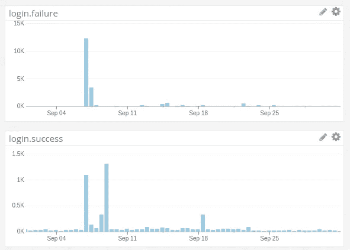
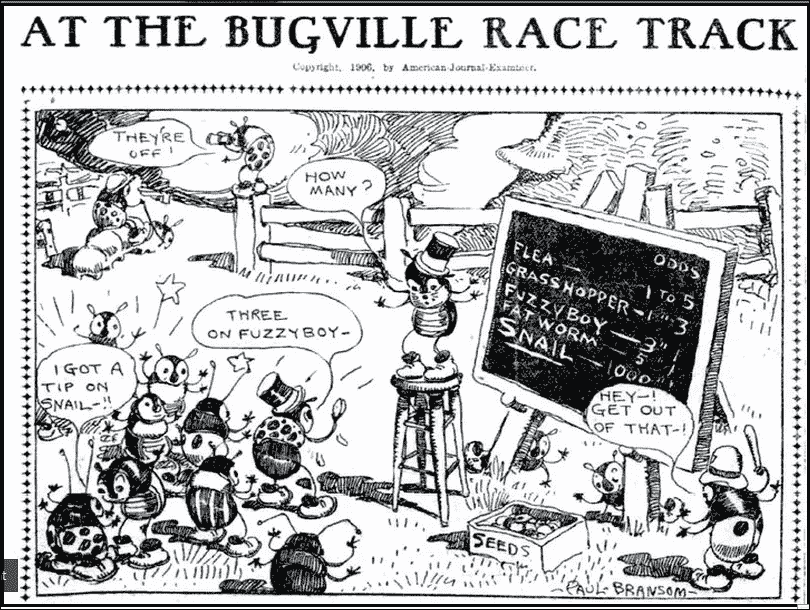

# 一个简单的故事

> 原文：<https://medium.com/hackernoon/a-hackerone-story-37c10bf5687f>

这一切都始于你的[组织](https://hackernoon.com/tagged/organization) [在 HackerOne](https://hackerone.com/rubygems/policy_versions?change=3539834#) 上发布程序[有人传播消息](https://twitter.com/disclosedh1/status/773241885003485184)。在一个孤立和寒冷的数据中心的一些 CPU 会崩溃，它会向你展示一个新的世界。

人们会试图暴力破解你的登录和注册过程。您是否一直在等待扩展您的 postgres 服务器？今晚你将无法避免它。

Number of failed and successful logins ([CC BY-NC 2.0](https://creativecommons.org/licenses/by-nc/2.0/))

在这样的日子里，好的监控系统会大放异彩。你[设置速率限制](https://github.com/rubygems/rubygems.org/pull/1414)以避免下一轮[登录攻击](https://www.owasp.org/index.php/Blocking_Brute_Force_Attacks)。[类似的脚本](https://hackernoon.com/tagged/similar-scripts)只要发现 500 内部服务器错误，就会试图吸你 app 的气。你的日志程序将会为一天内记录的错误数量创造新的记录，并淹没你的与日志程序集成的 slack 通道。一旦你开始一个接一个地解决问题，事情就会平静下来。

会萦绕在你的梦里。你介绍了 [rack-utf8_sanitizer](https://github.com/whitequark/rack-utf8_sanitizer) ，希望你不会再看到它们，但它们从未真正消失( [rails/rails#26891](https://github.com/rails/rails/issues/26891) )。

当你收到就在你眼皮底下的 [XSS 袭击](https://www.owasp.org/index.php/Cross-site_Scripting_(XSS))的报告的那一天是有福的。你可以协调[修复你用过的宝石](https://github.com/mislav/will_paginate/commit/ec9b9851901f8b74adc945302c0520320aaa7ead)，因为你还在摸索你的 [lamdas 和 procs](http://awaxman11.github.io/blog/2013/08/05/what-is-the-difference-between-a-block/) 。你会觉得聪明，但是这不会持续很久，因为现在你发现 [CSRF 令牌验证](https://nvisium.com/blog/2014/09/10/understanding-protectfromforgery/)可以在你的应用上被绕过。Rails 4 为[protect _ from _ forestate](http://api.rubyonrails.org/classes/ActionController/RequestForgeryProtection/ClassMethods.html#method-i-protect_from_forgery)引入了`with: :exception` 选项，并在`:null_session` 仍然是默认参数时切换到在其模板中使用它。你也梦想有一天铁路的重大更新会像小更新一样简单吗？

作为一个开源社区，你可能会跟不上步伐。重复的报告将会开始堆积，因为一旦原始报告归档，hackerone 的报告者会在他们之间分享错误。你认为 hackerone 社区还需要成长吗？

与此同时，您的密码重置令牌已经通过 referer header 泄露给了[第三方网站。这比听起来更糟糕，因为那些](https://robots.thoughtbot.com/is-your-site-leaking-password-reset-links)[代币可能不会在](https://github.com/thoughtbot/clearance/pull/682)[通关](https://github.com/thoughtbot/clearance)时到期。你要让专家知道，因为有些修复会比其他的更复杂。总是检查[can use](http://caniuse.com/#search=referrer)在你被新的闪亮的弄得眼花缭乱之前。希望你没有忘记重置你所有用户的`:confirmation_token`。

在自省的同时，你会回头看 [OWASP 十大备忘单](https://www.owasp.org/index.php/OWASP_Top_Ten_Cheat_Sheet)并认同这份清单非常真实。希望你会问自己为什么没有更多的人参与这样的项目。为什么蟑螂在开派对，好像你不在家似的。

[bugville](https://www.flickr.com/photos/25521202@N02/8251658570/) by [lady-traveler](https://www.flickr.com/photos/25521202@N02/) ([CC BY-NC 2.0](https://creativecommons.org/licenses/by-nc/2.0/))

这是一个合理的假设，让[你的杂货店](https://rubygems.org/)安全运行，同时提供你下一个获奖汤所需的所有配料。

当你仅仅因为一张感谢卡就拒绝记者采访时，你几乎会心碎，因为你没有为 rubygems.org 支付赏金。你没有钱买它。记者会求你重新考虑，而你只会说

> 只有 rubygems 客户端库中的问题才有资格获得奖金。

你知道你和你的公司可以帮助吗？

> [黑客中午](http://bit.ly/Hackernoon)是黑客如何开始他们的下午。我们是 [@AMI](http://bit.ly/atAMIatAMI) 家庭的一员。我们现在[接受投稿](http://bit.ly/hackernoonsubmission)，并乐意[讨论广告&赞助](mailto:partners@amipublications.com)机会。
> 
> 如果你喜欢这个故事，我们推荐你阅读我们的[最新科技故事](http://bit.ly/hackernoonlatestt)和[趋势科技故事](https://hackernoon.com/trending)。直到下一次，不要把世界的现实想当然！

