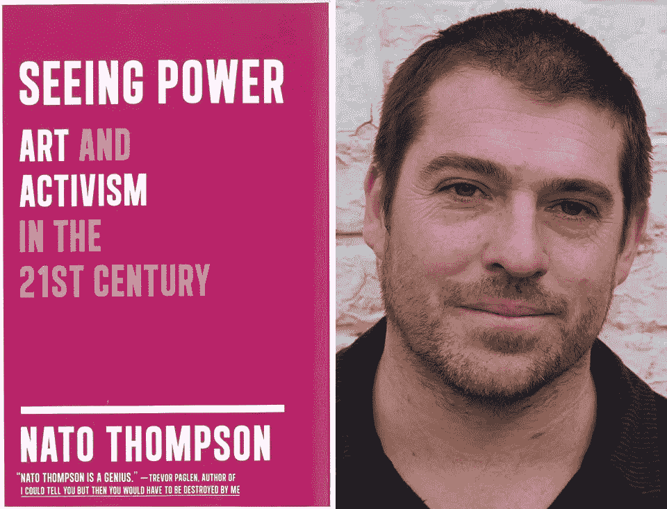

# 可能性的地平线

> 原文：<https://medium.com/hackernoon/a-horizon-of-possibilities-13fbafe870ed>

2 月 23 日，在东村卵形的爱因斯坦礼堂听完他的演讲后， **Nato Thompson** 让我对我国当代艺术和活动家运动的潜在可能性感到至少 48%的兴奋。

在那里，汤普森推出了他的新书、**《看见力量》(the seening Power)(**梅尔维尔出版社，2015 年)，他讨论了隐藏在我们工业趋势背后的文化机制:在说教和模糊的信息关系中的一系列动态，影响着抵制进步诗学的组织模式，以及这两者之间的一切。在与著名艺术家、活动家、作家和主持人 Gregory Sholette 的交谈中，他巧妙地揭示了这些动态如何在艺术和活动家参与的论坛中阻碍或产生战术和战略行动。Thompson 的经历涵盖了他为 Creative Time 组织的各种策展项目和活动，同时注意到[在广告活动中利用革命符号学的令人愤慨的例子](https://youtu.be/jqH_DnGL8a0)，隐藏在*潮人圈的营销和政治之下的身份缺失*，以及 Billy 牧师的戏剧与选择渗透当地机构基础设施的艺术家有关的语境。

这次演讲的特点是汤普森散发出洞察力和轻浮的火花，同时坚定地倡导彻底摆脱挥之不去的人文主义叙事的束缚，转向以生物为中心的范式。尽管他觉得新兴叙事的语言必须远远超越解决社交网络巨魔的怪诞强迫行为，但他观察到一些公共话语圈子中有一种“朝着积极方向训练”的趋势。汤普森认为，新兴创意部门的这种转变可能会揭示出许多共鸣——一个名副其实的“可能性的地平线”——他认为这只是开始睁开眼睛，看看有组织、民粹主义、相互依存和开放的文化的真正力量。

迫不及待地想读这本书。[下面是链接](http://www.mhpbooks.com/books/seeing-power/)。

> [黑客午间](http://bit.ly/Hackernoon)是黑客们下午的开始时间。我们是 [@AMI](http://bit.ly/atAMIatAMI) 家庭的一员。我们现在[接受提交](http://bit.ly/hackernoonsubmission)并很高兴[讨论广告&赞助](mailto:partners@amipublications.com)的机会。
> 
> 如果您喜欢这个故事，我们建议您阅读我们的[最新科技故事](http://bit.ly/hackernoonlatestt)和[趋势科技故事](https://hackernoon.com/trending)。直到下一次，不要把世界的现实视为理所当然！

