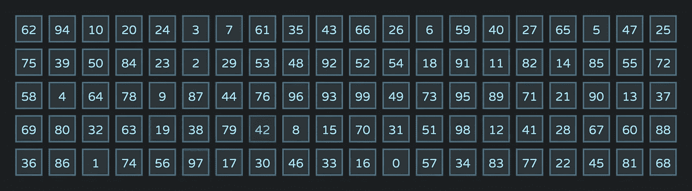

# 一个 JavaScript 面试问题和 XOR 的题外话

> 原文：<https://medium.com/hackernoon/a-javascript-interview-question-and-a-digression-into-xor-3f88bb5ab3be>



这是我从一位同事那里学到的一个问题。我在进行 JavaScript 采访时曾问过这个问题，但它实际上是一个与语言无关的脑筋急转弯:

> 假设有一个由 0 到 99(包括 0 和 99)的整数组成的 100 项数组。从数组中随机取出一个项目。如果只给你一个由 99 个元素组成的数组，你如何找到被去掉的那个数字？假设数组**没有排序** *。*

也许是由于“未排序”这一限定符起到了转移注意力的作用，大多数受访者急于得到一个答案，其中第一步就是对阵列进行排序:

> 我将首先对数组进行排序，然后遍历一次，查看后续项之间的差异。缺失的数字可以在差值不为 1 时找到。

这是一个有效的算法，但是由于涉及到排序，计算量会很大。然后我问他们是否能想出一个只需要遍历一次数组的解决方案。有很多方法可以解决这个问题，我喜欢把它作为面试问题的原因是，它展示了对机器在幕后做什么的更深入的理解(即`Array.prototype.sort`不只是免费地神奇地对数组进行排序。)

以下只是几个最优答案中的一个。之后，我将展示一个替代的、更“古怪”的答案——正是这个*答案促使我写这篇短文。*

如果将 99 项数组中的所有项相加，并且知道 0 到 99 之间所有整数的期望和，则可以通过从该期望和中减去数组中各项的和来找到缺少的数字。

整数之和[0..n]可以使用下面的公式计算:

```
n * (n + 1) / 2
```

所以，对于整数[0..99]我们知道总和是:

```
99 * (99 + 1) / 2 === 4950
```

顺便说一下，下面是如何准备一个缺少数字的数组(不是问题或答案的一部分，但您可以使用此设置来测试不同的答案):

```
const n = 99;// Will hold all numbers [0..99]
const all = [];for (let i = 0; i <= n; i++) {
  all.push(i);
}// Shuffle array by "sorting" by random comparison results
all.sort(() => Math.random() - 0.5);// Get a clone not to mess with the original array
const partial = all.slice(0);// Remove a random item
partial.splice(partial.length * Math.random() | 0, 1);
```

那么，我们答案的一个常规实现将是:

```
const expectedSum = 99 * (99 + 1) / 2;let partialSum = 0;for (let i = 0; i < partial.length; i++) {
  partialSum += partial[i];
}const missingNumber = expectedSum - partialSum; // Done!
```

或者，使用`[Array.protoype.reduce()](https://developer.mozilla.org/en/docs/Web/JavaScript/Reference/Global_Objects/Array/reduce)`和箭头功能:

```
const expectedSum = 99 * (99 + 1) / 2;
const missingNumber = expectedSum - partial.reduce((s, n) => s + n);
```

如果我们只是对已知的和进行硬编码，我们会得到这个简洁的一行程序，它直接计算出缺失的数字:

```
const missingNumber = 4950 - partial.reduce((s, n) => s + n);
```

我们现在在`missingNumber`找到了答案。对于所有的意图和目的，这是一个正确的答案，我们完成了。

在上面的回答中，我们使用了求和的方法，通过从期望和中减去部分和来直接找到缺失的数字。我们实际上是使用一个已知的校验和来查找一组值中的差异(例如，缺失的项目)。

求和并不是计算校验和时唯一起作用的操作。在校验和计算以及加密中出现的一个有用的运算符是 XOR ( [异或](https://en.wikipedia.org/wiki/Exclusive_or))。)

我们可以直接找到丢失数字的另一种方法是通过将部分数组中所有项的异或与所有整数的已知异或[0..99].最终的实现看起来更有趣。我们一会儿就会谈到它。

首先，快速回顾一下 XOR ( `^`)的作用。在位一级:

```
0 ^ 0 === 0
0 ^ 1 === 1
1 ^ 0 === 1
1 ^ 1 === 0
```

除了单个位之外，对任意两个数进行异或运算意味着按最低有效位对齐它们的位，并对每个对齐的位对进行异或运算。我们以`3 ^ 5`为例。`3`在二进制中是`011`，而`5`在二进制中是`101`:

```
 011
^ 101
-----
  110
```

所以二进制的`3 ^ 5`结果是`110`。或者用十进制，`6`。

XOR 有以下我们感兴趣的性质:

*   `0`是[标识元素](https://en.wikipedia.org/wiki/Identity_element) : `a ^ 0 === a`
*   每个数字都是它自己的[逆元素](https://en.wikipedia.org/wiki/Inverse_element) : `a ^ a === 0`
*   [关联性](https://en.wikipedia.org/wiki/Associative_property) : `(a ^ b) ^ c === a ^ (b ^ c)`

从上面可以看出，您可以通过将一个数字`a`与任意一个数字`b`进行两次异或运算来恢复该数字的值。假设`c`由下式获得:

```
c = a ^ b;
```

那么`c`再次与`b`异或的结果是什么？分 4 步进行:

1.  替换:`c ^ b === (a ^ b) ^ b`
2.  关联性:`c ^ b === a ^ (b ^ b)`
3.  逆元素:`c ^ b === a ^ 0`
4.  身份:`c ^ b === a`

我们得到原始值，`a`。

由此我们可以直观地得出以下结论:给定一个数字`a`，如果我们首先将它与 99 个其他数字进行异或运算，然后将结果与同样的 99 个数字进行异或运算，我们应该会得到`a`。

因此，我们可以通过以下方式找到问题中缺少的数字:

1.  计算或硬编码所有 100 个数字的异或[0..99]
2.  计算部分数组中给定的所有 99 个数的异或
3.  将上面的两个结果进行异或运算，直接找到缺失的数字

所以，让我们计算所有数字[0..99]以便在我们的回答中硬编码。但是让我们一边看`xor`的中间值一边做这件事:

```
let xor = 0; // 0 is the identity for XORfor (var n = 0; n <= 99; n++) {
  xor ^= n;
  console.log(xor);
}
```

上面的输出将是:

```
0
1
3
0
4
1
7
0
8
1
11
0
…
0
88
1
91
0
92
1
95
0
96
1
99
0
```

因为我们本质上是将位混合在一起，所以滚动 XOR 不会单调增加。有许多下降会回到 0。因此，与这些相同数字的总和不同，我们不会得出像 4950 这样的大数字。以及所有数字[0..99]才原来是 0！(原因的简短版本是偶数比特的 XOR 将总是以 0 结束。)

```
const expectedXor = 0; // Assume we know this for [0..99] alreadylet partialXor = 0;for (let i = 0; i < partial.length; i++) {
  partialXor ^= partial[i];
}const missingNumber = expectedXor ^ partialXor; // Done!
```

应用我们在前面的回答中使用的同样简洁的语法，并且知道 0 是 XOR 的单位元素，下面直接给出了缺少的数字:

```
const missingNumber = partial.reduce((x, n) => x ^ n);
```

在这个上下文中使用 XOR 在技术上没有什么突破性的。只是偶然发现数字的异或[0..99]原来是 0，这让第二个答案看起来有趣了很多，也制造了一个很好的借口，把题外话写成这样的 XOR。

# 奖金

我涉足 JavaScript [代码高尔夫](https://en.wikipedia.org/wiki/Code_golf)并在 [jsgolf](http://register.jsgolf.club) Slack 团队闲逛。我在那里问这个问题，是想看看高尔夫社区会把已经非常简洁的`a.reduce((x,n)=>x^n)`(称为数组`a`，去掉了空格)答案发挥到什么程度。

结果如下:

```
eval(a.join`^`)
```

以上答案的功劳归于 [veubeke](https://github.com/veu) 和 [corruptio](https://twitter.com/justecorruptio) 。

附:感谢 Leigh Bryant 对本文早期版本的编辑。