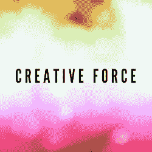

# 不平衡生活的一个重要好处

> 原文：<https://medium.com/hackernoon/a-key-side-benefit-to-the-imbalanced-life-49de594d2d2d>

这是新的一年，许多以生活平衡为中心的决心信息。随着生活变得越来越忙碌，不可避免的是，一个主要障碍变成了寻找帮助我们平衡生活的工具。但是在寻求平衡的过程中，我想记住的一件事是我的生活在混乱时期获得的价值:

没有初为人母的混乱，我就不会有家庭。如果没有在 T2 创业的混乱，我就不会有博客或网络。这些启动时间是由长时间的不平衡定义的，但我不会用它们来交换。这种不平衡激发了想法、解决方案和创造力。我可能会熬夜照顾孩子、写帖子、启动程序或回复电子邮件。但在我做这些事情的时候，我可以在未来的几年里欣赏到这些联系。

虽然我感谢现在坐在这里，有足够的平衡来在一个更悠闲的时间框架内写作，但我也感谢让我来到这里的混乱。所以我会说*虽然*平衡帮助我们获得视角，但不平衡也在提供塑造我们职业和经历的创造力方面发挥着作用。

下一次，当我们质疑自己熬夜太晚、过多查看电子邮件或忘记吃饭的倾向时，让我们记住，创造力可能正在推动这些决定，伟大的事情可能正在等待着我们！

[洛林·阿克曼](https://twitter.com/LorraineAkemann) |联合创始人兼编辑| [拥有应用程序的妈妈们](http://blog.momswithapps.com/)

> [黑客中午](http://bit.ly/Hackernoon)是黑客如何开始他们的下午。我们是阿妹家庭的一员。我们现在[接受投稿](http://bit.ly/hackernoonsubmission)并乐意[讨论广告&赞助](mailto:partners@amipublications.com)机会。
> 
> 如果你喜欢这个故事，我们推荐你阅读我们的[最新科技故事](http://bit.ly/hackernoonlatestt)和[趋势科技故事](https://hackernoon.com/trending)。直到下一次，不要把世界的现实想当然！

