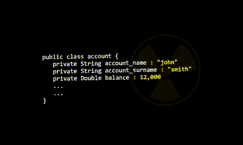

# Java 研究者的激光束

> 原文：<https://medium.com/hackernoon/a-laser-beam-for-java-investigators-99f38a2c3977>



每个 Java 开发人员迟早都会遇到同样的问题。他们希望能够看到他们的公共 API 之外的**。**

因为信息隐藏是聪明的，但是，当事情不工作时，有一个绕过它的方法是很好的。

[xr](https://gist.github.com/lorenzoongithub/7273902ac628b2761f46de2d0c2a31cd)(x 射线的缩写)给你一束激光指向任何 Java 对象。

## 将您的 x 射线射向 Java 对象

假设您得到了这个类的一个实例:

```
**public class Account** {
   private int account_number;
   private String first_name;
   private String last_name;
   private Double balance;... 
};
```

xr，让你揭示它的结构

```
**>>**xr(account);
*account_number
balance
first_name
last_name*
```

并检查其零件:

```
**>>**xr(account,"account_number"); 
*13342101*
**>>**xr(account,"first_name");
*John*
**>>**xr(account,"last_name"); 
*Smith*
**>>**xr(account,"balance");
*12,000*
```

目瞪口呆？我希望不会。

## 现在就使用它

*xr* 是一个现成的 Nashorn/JavaScript 函数，它使用内省来发现对象中的所有字段并获取它们的值。

要使用它，您需要在交互式环境中运行您的 Java 程序。所以，你有两个选择:

1.  使用 [jjs](https://docs.oracle.com/javase/8/docs/technotes/tools/windows/jjs.html)
2.  使用 [nudge4j](https://lorenzoongithub.github.io/nudge4j/)

对于这两个选项，您只需打一个电话:

```
**load**('[https://gist.github.com/lorenzoongithub/7273902ac628b2761f46de2d0c2a31cd](https://gist.github.com/lorenzoongithub/7273902ac628b2761f46de2d0c2a31cd)');
```

[](http://bit.ly/HackernoonFB)[](https://goo.gl/k7XYbx)[](https://goo.gl/4ofytp)

> [黑客中午](http://bit.ly/Hackernoon)是黑客如何开始他们的下午。我们是阿妹家庭的一员。我们现在[接受投稿](http://bit.ly/hackernoonsubmission)并乐意[讨论广告&赞助](mailto:partners@amipublications.com)机会。
> 
> 如果你喜欢这个故事，我们推荐你阅读我们的[最新科技故事](http://bit.ly/hackernoonlatestt)和[趋势科技故事](https://hackernoon.com/trending)。直到下一次，不要把世界的现实想当然！

