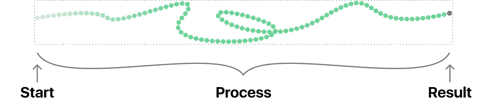
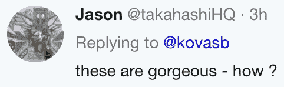
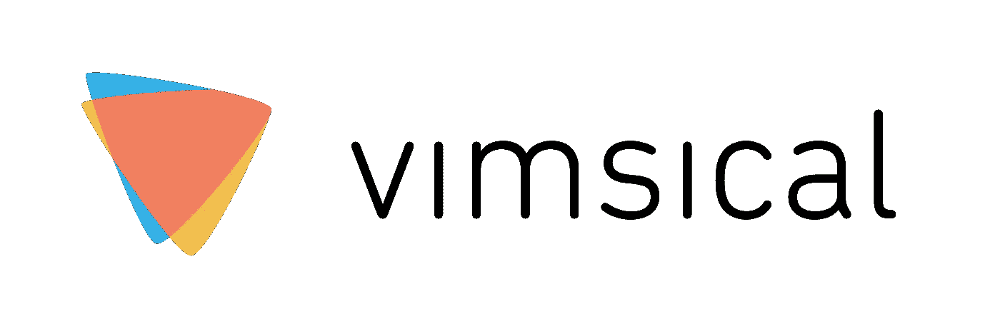

# 一个可以学习的世界

> 原文：<https://medium.com/hackernoon/a-learnable-world-20ee8da4690a>

初学走路的孩子既是文盲，又是高度科学的。完全不受口头事实的影响，他们进行反复试验，从经验中得出事实。快进 10 年，一名高中生坐在一本书前，绝望地试图将书的内容上传到她的大脑中。哪里出了问题？

当我们缩小并观察信息的景观时，我们注意到自第一个洞穴绘画以来所有媒体都分享的一件事:它们是**的结果**。好吧，这有什么好奇怪的？好吧，考虑一下。当我们制造东西时，我们大部分时间花在哪里？

无可争议地在**过程中**。流程是做出决策的地方。这是各个部分结合在一起的地方。但是因为我们受限于结果，通常我们所能做的就是给出一个👍继续前进。看看网上，你会不同意吗？这是一个设计好的消费社会。

埃及金字塔就是一个例子:

直到今天，我们还在推测金字塔是如何建造的。你可能会想*是啊，那是过去，但是今天——*，**那么今天呢？**

我刚刚在推特上滚动了 10 秒钟。这是我发现的第一件事:

[https://twitter.com/kovasb/status/906981138501169158](https://twitter.com/kovasb/status/906981138501169158)

这些是代码生成的图像。它们太迷人了！ 但是先看看**的评论:**

杰森将如何学习？科瓦斯会在推特上一步一步地指点他吗？祝你好运。他们会一起进行视频通话吗？真的吗？谁有时间做那个？Kovas 会给 Jason 指出这个项目的源代码吗？也许吧，但是如果是 5000 行代码呢？杰森将如何理解它？

随着我们的进步，我们的创作变得越来越复杂。问题是 ***复杂的东西很难重现。*** *看看上图就知道了。它甚至不是人为的。它是由人类编写的代码生成的。如果你想重建它，你会从哪里开始？互联网上有超过 30 亿人和他们的内容，试图弄清楚事情是一种完全疯狂的行为。这将人们分为两类:退回到抽象理论模型的广义思想家，以及成为某个领域大师的应用专家。* ***我们如何获得广泛的实用主义？***

> 我们的挑战不仅仅是教育，而是让世界变得不言自明。无论你看到什么，你都应该能够知道它是如何制作的。

怎样才能让 Kovas 的代码不言自明？首先，他必须向自己解释。为此他做了很多小实验。一定有那么一瞬间，Kovas 的代码只在屏幕上画了几个像素。一旦他做到了这一点，他就可以继续做下一件事，再下一件事。我们应该能够看到 Kovas 如何编写并将每个部分集成到不断增长的代码库中。但是光看是不够的。当我们跟随科瓦斯的线索，重新体验他的洞察力时，我们会发现科瓦斯知道一些我们不知道的技巧。为了理解代码是如何工作的，我们必须能够运行我们自己的实验。这意味着编辑 Kovas 的代码，看看我们的更改会如何影响结果。

如今，视频是捕捉过程的首选媒体。视频关心的只是像素改变颜色。你不能从中复制粘贴代码，也不能编辑它。在交互方面，我们有一些文件，像金字塔一样，总是处于结果状态。我们可以编辑它们，但我们看不到它们是如何制作的。我们需要的东西是**结合了类似视频的观看体验**和 **100%的互动内容。**

那是 Vimsical。**打**吧，**改**码&看你的**影响:**

Want to record your changes? Click [here.](https://vimsical.com/vims/5969777d-8dae-48a6-8b6c-838928b59382)

即使你以前从未编写过代码，我们打赌你也能找到并改变一个移动笔画的颜色。浏览一下时间线。当它在左边变化时，它的代码就写在右边。然后点击，自己改。这就是**推断学习。**这就是 Vimsical 的全部内容——**按照制作说明**运送作品。包括电池。

> ***vim****| vim |*
> ***名词*** 非正式 *能量；他年轻时充满活力。*
> 
> ***异想天开的****|ˈ(h)wimzik(ə)l|* ***形容词***
> *顽皮地古怪的或富于幻想的，尤指以吸引人的和有趣的方式:*一种**异想天开的**幽默感。

Vimsical 将数字媒体扩展到过程媒体。它集成到我们的应用程序中，与视频和像素不同，它以数据的形式记录我们的行为。这就允许它以 ***推导出*** *任何时刻我们工作的状态。它为我们分析工作方式提供了有意义的数据。它为我们提供了前所未有的最强大的支持。它为任何与之集成的应用程序带来版本控制。通过使内容可播放，它将每一个* *创作变成了一个教程。*

# 规模化的教育

在写任何严肃的代码之前，我们花了 2 年时间向教育界最喜欢的人学习。今天，我们的名单上有来自各行各业的 143 人。有些是业余博客爱好者，有些是有创造力的程序员和设计师。他们是大学教授，也是专业的在线教师，他们的教程有数百万的浏览量。我们问他们问题，当他们创造新材料时，我们看着他们的肩膀，我们走进他们的教室和他们的学生交谈。我们让他们玩我们的原型。我们的目标是找出教育中最大的瓶颈。

**学习**没担多少惊喜。学生参与度不够。学校把精力充沛的孩子放进教室，告诉他们坐下来听。在线上，学生观看被动视频，然后观看“互动”复选框测验。像翻转课堂这样的措施很有希望，但是我们认为它们没有解决问题的根源。

教学让我们大吃一惊。首先，在我们的调查中，我们了解到，在最好的情况下，在线教育者在我们看到的每分钟内容上至少花费 7 分钟。但令人瞠目结舌的是，向世界传授知识的创作者和出版商群体实在是太小了。今天，我们有少数教育工作者，他们把大部分时间都花在创造一刀切的内容上。这怎么可能呢？

> 让少数教育工作者把大部分时间花在制作一刀切的内容上是不合适的。

# 边做边教，边玩边学。

我们需要比翻转教室更进一步。我们需要翻转媒介。我们需要**让媒体本身变得可学习**而不是依赖于一小部分人，从而把每个人都变成教育者。

这就是我们建造 Vimsical 的原因。

感谢您的阅读。我们只是触及了表面。在 twitter 上关注我们的研究、技术和工艺的更新。如果你想使用 Vimsical，[联系](mailto:dennis@vimsical.com)。

*特别感谢 Julien Fantin、肖恩·威廉斯、Nicholas Mauro、Evan Korth、Alex Qin、Marie Casabonne、Amery Winter、Chloe Kramer、Arshad Chowdhury、Jared Katz、Steve Ojeda、Josh Kornreich 和 Cory Forsyth 一路走来的支持。*