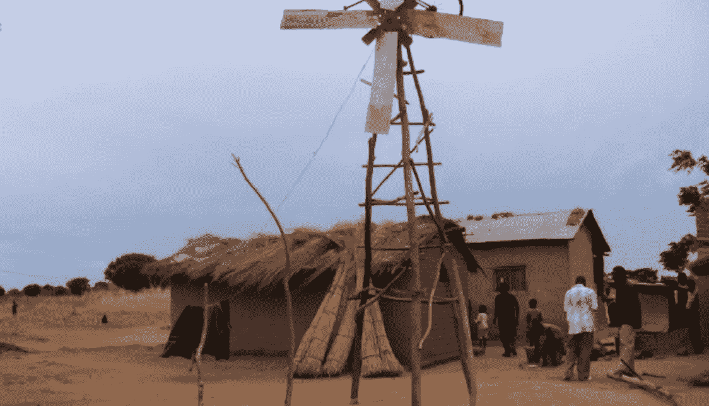

# 通过创新克服逆境的一课

> 原文：<https://medium.com/hackernoon/a-lesson-in-overcoming-adversity-through-innovation-768ee40cd9f1>

*[Photo: Flickr user* [*Erik (HASH) Hersman*](https://www.flickr.com/photos/whiteafrican/622366987)*]*

## 一个来自马拉维的男孩教我们如何用创新解决社会经济问题。

William Kamkwamba 来自非洲马拉维的一个名叫 Wimbe 的小村庄。2001 年底，当他的家人正在与危及生命的饥荒作斗争时，14 岁的 Kamkwamba 被迫从高中辍学，因为他的家人再也负担不起他的学费。他没有接受这种命运，而是通过从一个小型社区图书馆借书来自学。

Kamkwamba 受到他在这些书中看到的风车设计的图表和图片的启发，决定建造两台机器:第一台为[提供电力](http://www.fastcompany.com/explore/electricity)为他的家庭供电。第二个为他家的农场提供源源不断的饮用水和灌溉用水。

Kamkwamba 在马拉维的社会经济环境并不独特。[根据非营利组织饥饿项目](http://www.thp.org/learn_more/issues/know_your_world_facts_about_hunger_and_poverty?gclid=COTu8vr3vcACFU4F7AodNEkAAg)，8.42 亿人——或者说世界上八分之一的人——没有足够的食物。17 亿人缺乏清洁用水。75%的世界最贫困人口——即 14 亿妇女、儿童和男子——生活在农村地区，依靠农业和相关活动维持生计。国际能源机构和世界银行指出，全球仍有 12 亿人被蒙在鼓里。

Kamkwamba 通过接受教育克服了这些困难。

当他被迫离开正规学校时，他可以去一个小图书馆自学。然后，他利用这些知识制造工具，使他能够为家人获得水电等基本必需品，从而扭转他、他的家人，甚至一些当地村民的未来。

Kamkwamba 的故事告诉我们，只有通过思考创新来解决获取问题，我们才能开始真正解决这些社会经济问题。

通过创新克服逆境是一个过程，这个过程始于坚韧的精神，培养自己的好奇心，做别人没有做的事情。

## 精神韧性

创新的第一步是接受我们周围的世界需要改变，有时是因为意想不到和前所未有的事件，并相信我们作为个人必须采取主动来实现这种改变。它需要不断的学习和开放的心态，愿意以新的方式看待世界。一旦认识到这一点，一个人必须长期保持不可动摇的精神韧性。正如 Kamkwamba 在他 2009 年的 TED 演讲“我如何驾驭风”中所说:

> *“相信自己，相信；无论发生什么，都不要放弃！”*

## 培养好奇心

改变我们生活或做生意的方式需要想象力和创造力。这需要对世界保持好奇。我们越少沉浸在现状或想法中，我们就越能关注这个世界。甚至爱因斯坦也曾宣称他“除了强烈的好奇心之外没有任何特殊才能”，这意味着除了强烈的好奇心之外，没有更好的途径来培养创造性工作。

## 做别人不做的事

走非常规道路需要为更大的回报(金钱或其他)而冒险。与众不同需要勇气。创新的人往往不会纠结于事物，而是果断——未知不会让他们麻痹。他们投资于自己的能力，努力在没有机会的地方创造机会。这又把我们带回了精神坚韧的需要，因为很多时候这些风险不会马上得到回报。

将一个人已经拥有的访问权限和他需要的访问权限之间的点连接起来，加上上面描述的特征，使我们能够生存和发展。

观看 Kamkwamba 2009 年的 TED 演讲，了解他的更多成就:

**原创文章** [**@FastCompany**](http://www.fastcompany.com/3035392/hit-the-ground-running/a-lesson-in-overcoming-adversity-through-innovation) 。

***版权所有 2017 费萨尔·霍克。保留所有权利。***

我是一名[企业家和作者](http://faisalhoque.com/speaking/)。[沙多卡](http://shadoka.com/)等公司创始人。Shadoka 让抱负成为领导、创新和变革的动力。Shadoka 的加速器和解决方案汇集了管理框架、数字平台和思想领导力，以实现创新、转型、创业、增长和社会影响。

《“ [*《万物互联——如何在创意、创新和可持续发展的时代进行变革和领导》*](http://www.amazon.com/Everything-Connects-Creativity-Innovation-Sustainability/dp/0071830758/ref=sr_1_1?ie=UTF8&qid=1376488798&sr=8-1&keywords=everything+connects%2Bfaisal+hoque) 》(麦格劳·希尔)和《 [*《生存并茁壮成长:弹性企业家、创新者和领导者的 27 种实践*](http://survivetothrive.pub/) 》(励志出版社)的作者。在推特上关注我。*免费使用* [*万物互联*](http://app.everythingconnectsthebook.com/login.php) *领导力 app 和* [*生存茁壮*](http://app.survivetothrive.pub/login.php) *弹性 app。*

