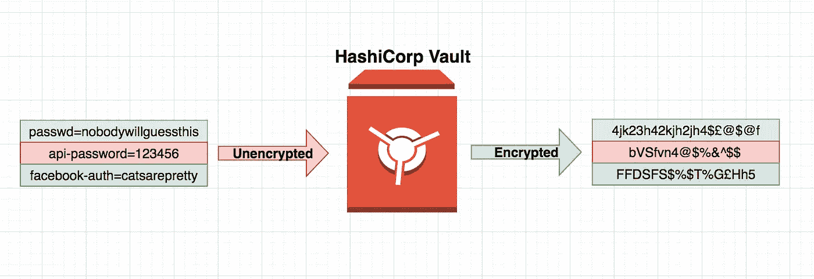
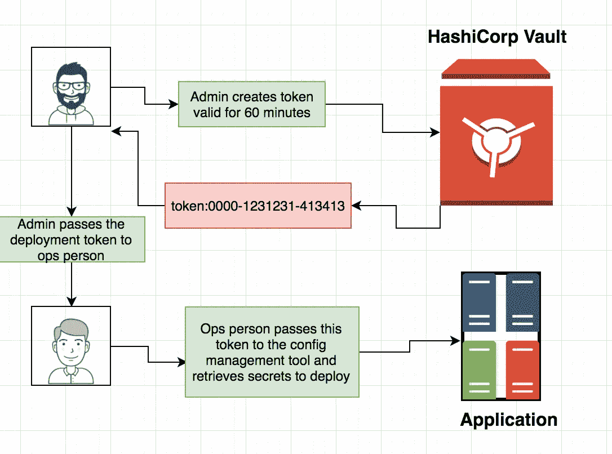
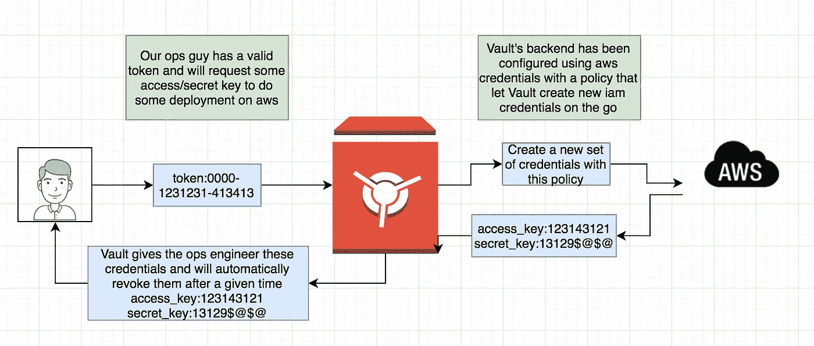
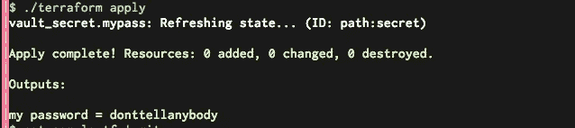
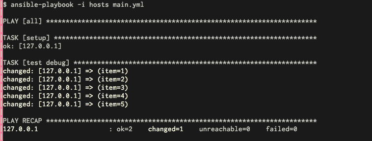
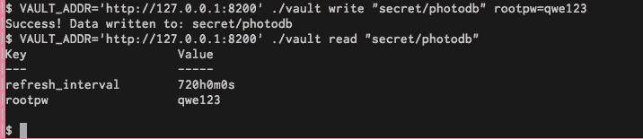
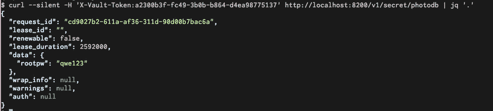
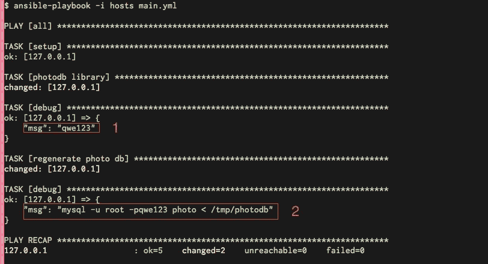

# 小小哈希公司金库游戏攻略:

> 原文：<https://medium.com/hackernoon/a-little-hashicorp-vault-introduction-d28382487b9f>

# **基础知识:**

这将是对哈希公司金库的介绍(为了简单起见(**不要把它与 Ansible 金库或任何其他金库**)从现在起**我将开始称之为金库**)

Vault 是一个 **Go** 应用程序，带有一个 **Rest/Cli** 接口，可以用来存储秘密，非常简单。

Vault 将存储这个信息**加密**(GCM 上的 256AES)，但是我们将在后面讨论这个

秘密是你通常戴上的东西。**git 忽略**或 **hiera-pgp** 或 **Ansible Vault** ，因为显而易见的原因你不想提交到源代码控制的东西。

因此，最简单的说法是，您将东西写入 Vault，Vault 将对其进行加密，并保存在那里供您检索。



The idea of Vault

# 谁能看到我的东西？：

金库使用一个**令牌**让你可以看到里面的信息，令牌可以根据需要**创建**和**撤销**。也可以将它们设置为在给定时间后**到期**。

例如，如果您需要在一个小时内授予对 vault 中某些信息的访问权限(因为有些内容被转储到 prod 中)，您可以授予他们一个大约一个小时的令牌(或者在他们确认更改完成后撤销令牌)

这是一个如何工作的愚蠢的图表，但显然它可以全部自动化:



Token creation and usage

**动手:**

你应该在 Go 1.7 上，我对 1.6 有一些问题，特别是在地形部分，我们稍后会谈到

好了，让我们安装 vault，并从中获得一些乐趣，正如你所知，像大多数 Go 项目一样，他们会发布预编译的二进制文件，这可能是最简单的方法，从官方网站([https://www.vaultproject.io/downloads.html](https://www.vaultproject.io/downloads.html))下载 vault

在 zip 文件中，您会发现一个具有魔力的二进制文件(不幸的是，vault 没有提供 initd 脚本或类似的任何东西，但我相信 google 会解决这个问题)，Vault 提供了一个开发模式供您测试，这就是我们现在要使用的，所以让我们启动一个开发服务器

```
./vault server -dev
```

这样做之后，vault 将创建一个**内存中的**后端(稍后将详细介绍后端),并且默认情况下，它将绑定 **tcp:8200** ,您也将获得一些输出，让我们看看:

```
==> Vault server configuration:***Backend: inmem***
              Listener 1: tcp (***addr: "127.0.0.1:8200"***, cluster address: "", **tls: "disabled"**)
               Log Level: info
                   Mlock: supported: true, enabled: false
                 Version: Vault v0.6.1==> **WARNING: Dev mode is enabled!**In this mode, Vault is completely in-memory and unsealed.
Vault is configured to only have a single unseal key. The root
token has already been authenticated with the CLI, so you can
immediately begin using the Vault CLI.The only step you need to take is to set the following
environment variables:**export VAULT_ADDR='**[**http://127.0.0.1:8200'**](http://127.0.0.1:8200')The unseal key and root token are reproduced below in case you
want to seal/unseal the Vault or play with authentication.Unseal Key (hex)   : b03efb974cbb9023213e550dcab35d0bdaa518b0fe412395917ab162df538811
Unseal Key (base64): sD77l0y7kCMhPlUNyrNdC9qlGLD+QSOVkXqxYt9TiBE=
**Root Token: b724183c-15bc-ffd4-1d53-824626348866**
```

好了，这是一个很大的输出，值得解释一下，按照发生的顺序:

*   后端(告诉你-dev 默认运行在内存中)
*   告诉您它绑定到的地址(127.0.0.1)和端口
*   告诉您 TLS 被禁用(对于开发模式)
*   告诉您导出 **VAULT_ADDR** ，稍后当我们向它读取/写入数据时，它将被 VAULT 读取。
*   根令牌，还记得我们上面提到的我们需要一个根令牌来创建其他令牌以便移交给运营人员吗？

# 认证、写入、读取、状态、令牌:

Vault 现在正在运行，它没有被妖魔化，所以它将在前台运行，您可以看到所有输出。

向您的本地保管库验证:

```
**$ VAULT_ADDR=**[**http://localhost:8200**](http://localhost:8200) **./vault auth adb1e4e3-e7c0-387b-5ad8-0d92fd282951**
Successfully authenticated! **You are now logged in**.
token: adb1e4e3-e7c0-387b-5ad8-0d92fd282952
token_duration: 0
token_policies: [root]
```

让我们向 vault 写些东西:

```
**VAULT_ADDR=**[**http://localhost:8200**](http://localhost:8200) ./vault **write secret** secret=**donttellanybody**
```

这很简单，基本上我告诉它要写并传递一个键值对，这样你以后就可以查找了:

```
$ **VAULT_ADDR=**[**http://localhost:8200**](http://localhost:8200) **./vault read secret**
Key                     Value
---                     -----
refresh_interval        720h0m0s
mysecret                **donttellanybody**
```

就是这样！我们已经编写了一个“安全地”存储在 vault 中的键/值对，并且我们能够检索它。

这是基本信息，还有很多关于 Vault 的信息需要阅读，但我不想让它变得太枯燥，但我想浏览一下:

**创建新令牌:**

这创建了一个没有过期时间和策略的基本令牌，稍后我们将看到更多相关内容:

```
$ VAULT_ADDR='[http://127.0.0.1:8200'](http://127.0.0.1:8200') ./vault **token-create**
Key             Value
---             -----
token           **6d2aed6c-e2e0-733b-3b81-5c0e34eec0cd**
token_accessor  96891866-e336-c6a6-a0c7-8d38861d5154
token_duration  0s
token_renewable false
token_policies  [root]
```

## 后端:

Vault 有一些后端(aws/ssh/inmem/etc ),作为模型(就 mvc 而言)或一些具有一些逻辑的虚拟文件系统。

例如，AWS 后端将按需创建 IAM 凭证，称为**动态机密(**[https://www . vault project . io/intro/getting-started/dynamic-secrets . html](https://www.vaultproject.io/intro/getting-started/dynamic-secrets.html))，并在需要时撤销它们。

这在使用自动化工具时非常有用，我们不想硬编码凭证，请看下面的示例场景:



the ops guy will have set of credentials for a given time , dynamically generated for him.

**Rest Api:**

Vault 的用处不大，因为它没有一个简单的方法来读取/写入信息，幸运的是，情况并非如此，让我们来看一点 rest api。

它基本上与 **GET/POST/DELETE** 一起工作，如果你曾经与 JWT 一起工作过，这将看起来很熟悉，我们一直在谈论的同一个令牌应该作为自定义头与请求一起传递，例如:

标题 **X-Vault-Token** 在那里为你变魔术。

显然，这打开了许多大门，这意味着你可以从 ansible 或 puppet 或 terraform 调用 Vault，无论你在哪里都可以选择编写一个小插件来执行 http/https 调用。

# **把东西钩在一起**

既然我们已经有了 **Vault** 明确运行**(在开发模式下，别忘了你不能使用它)**让我们试着模拟一下 **Ansible** 和 **Terraform** 如何连接到这个，显然我们将使用 rest api 连接到 Vault，幸运的是两者( **Terraform** 和 **Ansible** )都为我们提供了一个插件框架，我们可以在其中做这些事情。

# **地形**:

Terraform 也是用 Go 编写的，并且是预编译的，如果你不知道 terraform 是什么，你肯定应该看看他们的网站( [https://www.terraform.io](https://www.terraform.io) )，但是为了使它快速简单，terraform 让你在公共/私有云中部署虚拟基础设施。

例如，您可以使用一个特定的映像创建一个具有弹性负载平衡器的 5 层 VPC，在其上运行给定数量的 EC2 实例，所有这些都来自一个简单的文件，非常简单。

因此，问题是我们如何从 terraform 访问 Vault 存储值，例如，terraform 需要 IAM cred 或 RDS 等。

一个善良的 terraform 用户/开发者已经开始写了一个(“【https://github.com/redredgroovy/terraform-provider-vault】T2”)，不幸的是对我们来说这些还没有包括在最新的 terraform 版本中，所以我们需要编译它**(确保你使用的是 Go 1.7)**

```
$ **git clone** [**https://github.com/redredgroovy/terraform-provider-vault**](https://github.com/redredgroovy/terraform-provider-vault)Cloning into 'terraform-provider-vault'...
remote: Counting objects: 64, done.
remote: Total 64 (delta 0), reused 0 (delta 0), pack-reused 64
Unpacking objects: 100% (64/64), done.
Checking connectivity... done.
**$ cd terraform-provider-vault/
$ go build -o $GOPATH/bin/terraform-provider-vault**
**$ stat $GOPATH/bin/terraform-provider-vault**
  File: '/home/jeronimog/Projects//bin/terraform-provider-vault'
  Size: 14870377        Blocks: 29048      IO Block: 4096   regular file
Device: 801h/2049d      Inode: 1968433     Links: 1
Access: (0775/-rwxrwxr-x)  Uid: ( 1000/jeronimog)   Gid: ( 1000/jeronimog)
Access: 2016-09-28 18:12:58.864000000 +0100
Modify: 2016-09-28 18:12:59.780000000 +0100
Change: 2016-09-28 18:12:59.800000000 +0100
 Birth: -
**$GOPATH/bin/terraform-provider-vault**
This binary is a plugin. These are not meant to be executed directly.
Please execute the program that consumes these plugins, which will
load any plugins automatically
```

步骤:

*   将 repo 和 cd 克隆到其中
*   编译，并将目的地设置为$GOPATH/bin(常见的做法)
*   统计它并检查它是否像看起来的那样执行

Terraform 插件是 terraform 在需要时执行的二进制文件，所以在编译时没有太多麻烦。所以让我们继续前进。

## 在 terraform 可以看到的地方添加新编译的模块:

我们要将二进制文件复制到 terraform 可以看到并配置它的地方。

我通常在~/Projects/vaulttf/上拥有一切

```
cd ~/Projects/vaulttf
cp **$GOPATH/bin/terraform-provider-vault .** $ ls
sample.tf **terraform** **terraform-provider-vault** **vault .terraformrc**
```

*   sample.tf 是一个样本 terraform 文件，我们将使用它来测试这个
*   terraform 是我的 terraform 二元
*   terraform-provider-vault 是我们刚刚编译的插件
*   。terraformrc 是 terraform 配置文件

首先，我们需要告诉 terraform 在哪里可以找到这个插件，这是在。 **terraformrc:**

所以我们告诉它，它就在同一个路径中，(在 prod 中使用它时，请记住相对路径)

现在，让我们创建一个从 Vault 中检索信息的示例 terraform 文件:

总之

*   我们调用保险库提供者，传递 toke 和地址
*   创建一个经过我们要查找的路径的资源
*   并创建一个输出资源来打印我们从 Vault 中获取的变量

结果应该是这样的:



Console screenshot cause gist gets messed up by the terminal colors

gist anyways

现在你有了它，一个通过 terraform 从 Vault 中获取的密码已经在一个 terraform 变量上，你可以对它做任何你想做的事情。

# Ansible:

另一种可能是通过 Ansible([https://www.ansible.com/](https://www.ansible.com/))检索存储在保险库中的信息，如果你不知道 ansi ble 是什么，我将使用我从一位同事那里听到的描述:

***“ansi ble 很好地包装了通过 ssh 执行 get 的 python 脚本”***

Ansible 使用剧本来定义将在给定主机中执行的动作，例如:**(这是一个非常简单的例子，以防你对 ansible 一无所知)**

输出通过 ssh 登录到所有服务器的操作，并对列表[1，2，3，4，5]中的每个元素执行 echo {{item}}



很简单的事情，但是你看到了它的可能性。

一个很好的例子是，想象一下 **Ansible** 需要在一个给定的数据库上重新部署一个模型，但是要这样做 **Ansible** 需要密码，但是我们不能将它硬编码到剧本中**(有其他机制可以做到这一点，比如 Ansible Vault 或其他，但是我们今天主要关注 Vault)**

已经有一些插件可以做到这一点，但我认为模仿我们自己的插件并看看它是如何工作的是个好主意。

因此，让我们创建一个从 Vault 中检索“secret/photodb”的 Ansible 插件。

第一步，我们将它写入保险库:



这样，我们现在在**“secret/photodb”**挂载点中有了 **rootpw:qwe123** 。

我们也可以用 curl 来检验这一点:



现在工作正常了，让我们为 ansible 制作一个小插件来检索这个 **rootpw** 键，并使用它登录 mysql。

创建查找插件最简单的方法是将它放入项目根目录下的库中(或者也可以放在一个角色中)

```
cd Projects/myansiblelittleplugin/
mkdir library/
```

在那里，我们将创建一个名为 photo.py 的文件，其内容为**“非常基本的”**:

简而言之:

*   **getphotpw**这是一个简单的函数，它接受一个 dict 作为参数，并创建一个针对 **Vault** 的 get 请求
*   main 函数定义了 **ansible** 插件 add 添加了一个包含所有参数的字典，我将在**剧本**中进一步传递这些参数
*   这只是一个模拟，在点击 prod 之前需要做大量的工作:)

现在剧本看起来是这样的:

*   请注意我是如何使用任务“photo”调用插件的
*   传递所有必需的参数
*   记录输出**(高亮显示 1)**
*   调试将成为 photodb 根通道的输出
*   和使用它的运行命令**(高亮显示 2)**

输出将如下所示:



**最终备注:**

这只是对 Vault 的一个小小的介绍，还有很多要探索，但我想至少它清楚了如何与它交互和进行基本操作。

稍后，最好使用不同的后端，并更深入地了解它提供的加密级别。

[](http://bit.ly/HackernoonFB)[](https://goo.gl/k7XYbx)[](https://goo.gl/4ofytp)

> [黑客中午](http://bit.ly/Hackernoon)是黑客如何开始他们的下午。我们是 [@AMI](http://bit.ly/atAMIatAMI) 家庭的一员。我们现在[接受投稿](http://bit.ly/hackernoonsubmission)，并乐意[讨论广告&赞助](mailto:partners@amipublications.com)机会。
> 
> 如果你喜欢这个故事，我们推荐你阅读我们的[最新科技故事](http://bit.ly/hackernoonlatestt)和[趋势科技故事](https://hackernoon.com/trending)。直到下一次，不要把世界的现实想当然！

[](https://goo.gl/Ahtev1)