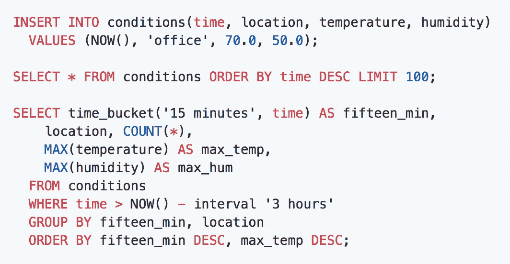
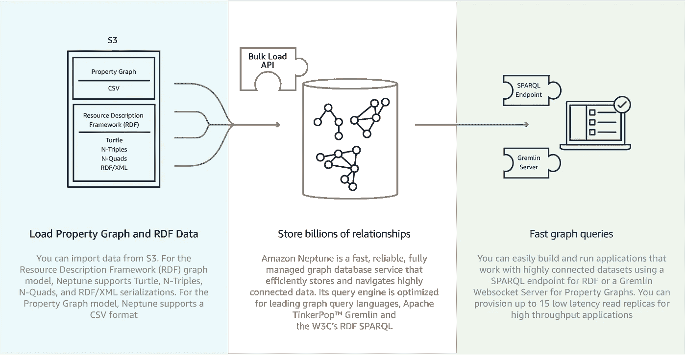
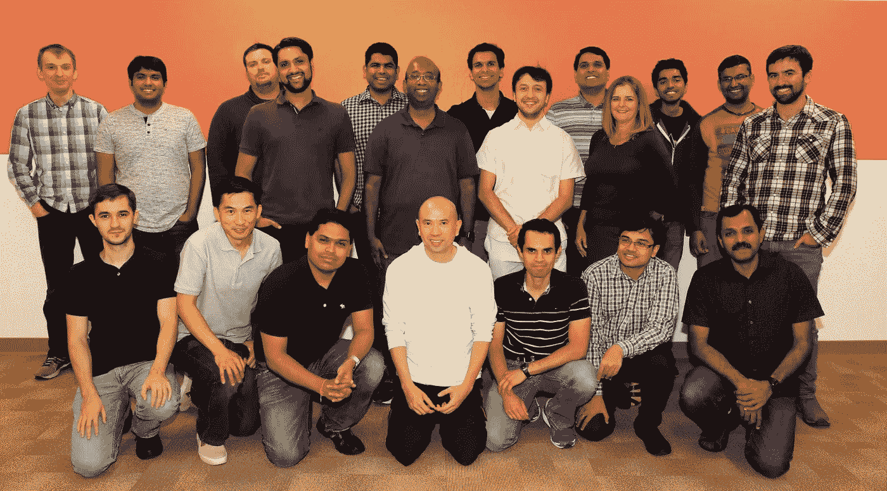
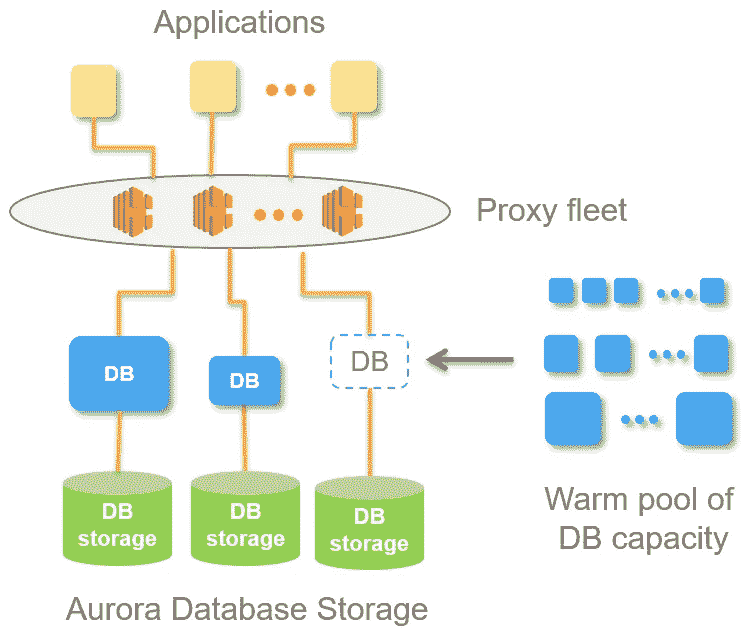
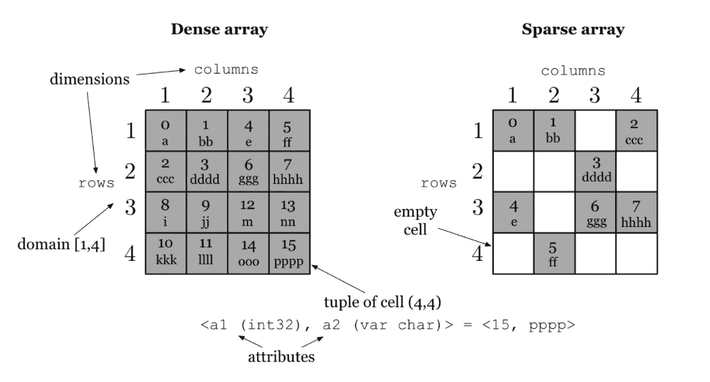
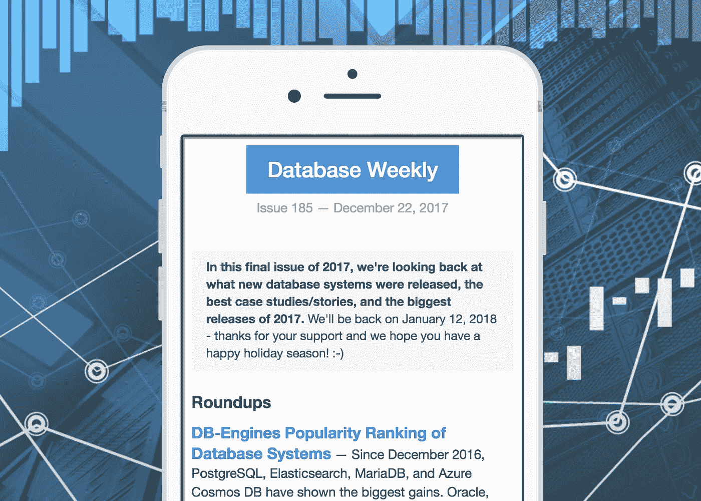

# 看看 2017 年发布的十个新数据库系统

> 原文：<https://medium.com/hackernoon/a-look-at-ten-new-database-systems-released-in-2017-94a3aa4c2aab>

作为 [Database Weekly](https://dbweekly.com/) 的编辑，这是一份关于数据库和数据存储领域最新动态的每周时事通讯，我喜欢探索新的数据库系统，看看未来几十年哪些想法可能会最终影响日常开发人员。

数据库世界并不是每周都有令人难以置信的公告，但在一年中，我们*做的*看到的新事物之多，以及进展之快，总是让我感到惊讶。2017 年也不例外，所以我想反思一些有趣的新版本，包括**事务图形数据库、地理复制多模型数据库和新的高性能键/值存储。**

# TimescaleDB——基于 Postgres 的时间序列数据库，具有自动分区功能

PostgreSQL 的几个令人兴奋的新扩展之一，[时标](https://github.com/timescale/timescaledb/)是 Apache 2 许可的，但由一个[博士包装的](http://www.timescale.com/about)创业公司支持。

时标通过自动分区为 Postgres 添加了时间序列存储特性，但是包装在通常的 Postgres 接口和工具中。使用常规 SQL 对提供时序数据接口的“超表”执行查询。

 [## 时间刻度|一个开源的时间序列 SQL 数据库，针对快速接收、复杂查询和…

### 一个与 Postgres 完全兼容的开源时间序列数据库，用于快速接收和复杂查询。

www.timescale.com](http://www.timescale.com/) 

# 微软 Azure Cosmos DB——微软的多模型数据库

[Cosmos DB](https://docs.microsoft.com/en-us/azure/cosmos-db/introduction) 本质上是对 Azure 旧版本 *DocumentDB* 的重塑和再开发，但可以轻松地在 Azure 的各个数据中心之间分发数据。全局分布是 Cosmos DB 的杀手锏，可以将数据库请求路由到包含您的数据的最近区域，而无需更改配置。

“多模型”部分也很重要。虽然一切都是无模式的 JSON，但有一个 SQL API 来查询它，还有一个 MongoDB API、Cassandra API，甚至还有一个图形数据库 API(基于 [Gremlin](https://tinkerpop.apache.org/gremlin.html) )。

了解更多关于 Cosmos 的更好方法之一是在微软第 9 频道的这个 15 分钟的视频介绍中:

 [## Azure Cosmos DB 简介

### 基里尔·加夫里柳克(Kirill Gavrylyuk)周五顺道拜访 Azure，与斯科特·汉瑟曼(Scott Hanselman)讨论宇宙 DB。观看该行业的快速概览…

channel9.msdn.com](https://channel9.msdn.com/Shows/Azure-Friday/Introducing-Azure-Cosmos-DB) 

# 云扳手——谷歌的全球分布式关系数据库

谷歌的[云扳手](https://cloud.google.com/spanner/)已经工作了很长时间，在[一篇非常有趣的 2012 年学术论文](https://research.google.com/archive/spanner.html)中首次公开解释(尽管开发始于 2007 年)。最初开发它是因为谷歌需要一个全球分布、高可用性的存储系统，但现在它也对公众开放。

谷歌认识到，使 Cloud Spanner 适合其自身用途的功能也使其对企业具有吸引力，因此它承诺 99.999%的可用性、无计划停机和“企业级”安全性。

Cloud Spanner 支持 ANSI 2011 SQL，为已经熟悉关系数据库概念的开发人员带来了一个久经考验、高可用性、水平扩展的关系数据库。

 [## 云扳手|具有大规模事务一致性的自动分片| Google 云平台

### 唯一的企业级、全球分布、高度一致的关系数据库服务。

cloud.google.com](https://cloud.google.com/spanner/) 

# Neptune——亚马逊全面管理的图形数据库服务

我们已经介绍了微软和谷歌，为什么不介绍亚马逊呢？另一个数据库仅限于特定的云，在亚马逊最近的 re:Invent 会议上宣布了 [Neptune 的预览。](https://aws.amazon.com/blogs/aws/amazon-neptune-a-fully-managed-graph-database-service/)

Neptune 承诺成为一个快速可靠的图形数据库服务，旨在快速为开发人员带来图形数据库所能提供的洞察力，而没有任何操作上的麻烦。当然，是有代价的。

Neptune 支持跨图查询的两个标准，即日益“黄金标准”的 [Gremlin](https://tinkerpop.apache.org/gremlin.html) ，以及 SPARQL(其中您的图被视为 RDF)。

 [## Amazon Neptune -为云构建的快速、可靠的图形数据库

### Amazon Neptune 是一个快速、可靠、完全托管的图形数据库服务，使其易于构建和运行…

aws.amazon.com](https://aws.amazon.com/neptune/) 

# YugaByte——一个开源的云原生数据库

YugaByte 今年跳出了“隐形模式”,提供了一个支持 SQL 和 NoSQL 操作模式的数据库。直接针对在云中的使用，它被设计成“作为容器的有状态补充”。

[开源](https://github.com/yugabyte/yugabyte-db)用 C++构建，支持 Cassandra 的查询语言(CQL)，以及 Redis 协议。对 PostgreSQL 协议的支持正在进行中，Spark 应用程序可以在其上运行。

The YugaByte team

YugaByte 是另一个由创业公司支持的项目(由在脸书扩展 Apache HBase 平台的工程师创建),其商业模式是一个“企业版”,与开源的社区版并列，并添加了多种功能，如云计算集群编排、监控和警报、分层存储和支持。

# peloton——“自驱动”SQL 数据库管理系统

Peloton 探索了一些有趣的想法，特别是在使用人工智能自动优化数据库方面。它还支持字节寻址 NVM 存储技术，并且是 Apache 许可的开源软件。

“自驱动”数据库背后的想法是，DBMS 有可能自主操作和调整自己。它可以预测工作负载趋势，并相应地做好准备，而无需 DBA 或运营人员掌舵。

也许并不令人惊讶的是，Peloton 源于一个学术项目(具体来说来自卡耐基梅隆大学)，它的创始人之一[写了一篇关于*为什么*建造它](http://www.cs.cmu.edu/~pavlo/blog/2017/03/building-a-new-database-management-system-in-academia.html)的长篇文章。它已经开发了几年，但在 2017 年变得更加开放。

# Janus Graph——一个基于 Java 的分布式图形数据库

[JanusGraph](http://janusgraph.org/) 是一个实用的、现成的数据库，内置了许多集成，并且[构建在 TitanDB](https://www.datanami.com/2017/01/13/janusgraph-picks-titandb-left-off/) 的坚实基础上。它针对可伸缩性、存储和查询巨大的图形数据库进行了优化，同时支持事务和大量并发用户。

它可以使用 Cassandra、HBase、Google Cloud Bigtable 和 BerkeleyDB 作为其存储后端，并且可以与 Spark、Giraph 和 Hadoop 集成。它甚至通过集成 ElasticSearch、Solr 或 Lucene 支持全文和地理定位搜索。

# aurora server less——AWS 上一个即时可扩展的“按需付费”关系数据库

亚马逊 re:Invent 会议的另一个公告是他们成功的 Aurora 数据库服务的*无服务器*版本 [Aurora 无服务器](https://aws.amazon.com/blogs/aws/in-the-works-amazon-aurora-serverless/)。

Aurora Serverless 的理念是，许多数据库用例不需要一致的性能或使用水平，相反，您可以“按需付费”(以秒为单位)购买一个按需扩展的数据库，这一理念巧妙地融入了“无服务器”平台的最新趋势，该平台有望让您永远摆脱扩展和操作难题。

它目前只是预览版，但有望在 2018 年成为一件大事。

 [## 工作中-亚马逊 Aurora 无服务器|亚马逊网络服务

### 你可能已经知道了。Aurora 有兼容 MySQL 或 PostgreSQL 的版本，它…

aws.amazon.com](https://aws.amazon.com/blogs/aws/in-the-works-amazon-aurora-serverless/) 

# TileDB —海量密集和稀疏多维数组的存储

[TileDB](https://www.tiledb.io/) 是麻省理工学院和英特尔开发的数据库，旨在存储多维数组数据，这是基因组学、医学成像和金融时间序列等领域常见的需求。

它支持许多压缩机制(如 gzip、lz4、Blosc 和 RLE)和存储后端(如 GFS、S3 和 HDFS)。

 [## TileDB -主页

### 阵列数据管理变得快速简单

tiledb.io](https://tiledb.io/) 

# memgraph——一个高性能的内存图形数据库

[Memgraph](https://blog.memgraph.com/hello-memgraph-44f51032434a) 背后的动机是提供一种工具，用于快速分析和使用来自人工和机器智能以及设备和物联网日益增长的互联性的数据。因此，优先考虑的是“速度、规模和简单性”

它仍然处于 Memgraph 的早期阶段，并且不是开源的，但是可以通过请求下载[。它支持 openCypher 图形查询语言，支持内存中的 ACID 事务，并具有基于磁盘的持久性机制。](https://memgraph.com/signup/)

 [## Memgraph | Memgraph——高性能、内存中的事务图形数据库

### 图形数据库为开发人员带来构建下一代智能系统所需的简单性、速度和规模…

memgraph.com](https://memgraph.com/) 

# 如何在未来跟上时代

喜欢这个综述吗？我每周都在[数据库周刊](https://dbweekly.com/)上做这件事，这是一份致力于数据库世界的每周时事通讯，关注什么是新的，什么在地平线上，什么在更新。

 [## DB 周刊

### 关于数据库技术和系统的每周时事通讯。

dbweekly.com](https://dbweekly.com/)