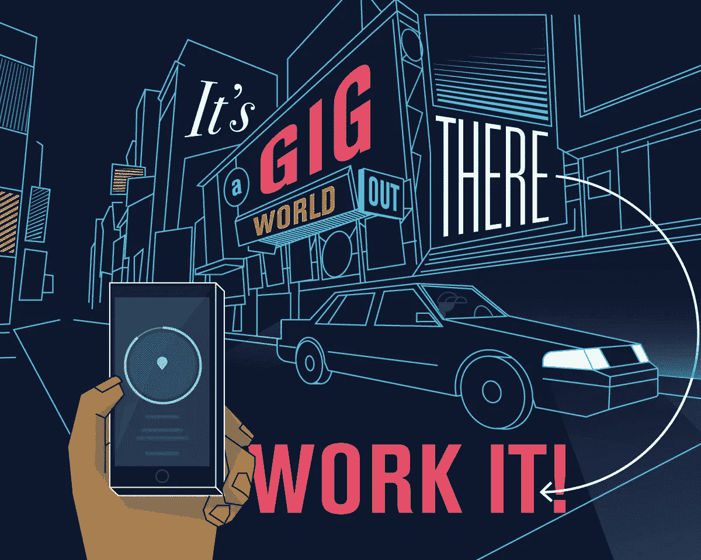
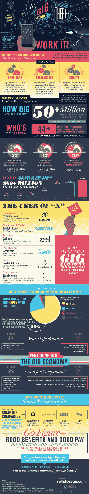

# 零工经济的内幕

> 原文：<https://medium.com/hackernoon/a-look-inside-the-gig-economy-6727ede7456a>

作为雇主，你希望成本尽可能低。出于这个原因，许多公司都将所谓的“零工经济”视为从预算中消除工资税、办公空间和培训成本等费用的一种方式。这给优步带来了巨大的回报，它在短短 5 年内达到 600 亿美元，成为历史上增长最快的初创公司。

将员工归类为独立承包商可能会很棘手。你必须放弃对它们如何、何时、何地工作的控制。这对于运送你的货物或服务来说是一个挑战，尤其是在高峰时期。围绕这种分类也可能存在法律问题，而且很可能会有更多的规则出台。

许多开始使用零工经济模式的公司已经过渡到更传统的商业模式。由办公室清洁服务公司 Q 和杂货递送服务公司 Instacart 管理的这两家公司是最近的皈依者。有时候旧的做生意方式最有效。

从这张信息图中了解更多关于零工经济的信息。不管它是否适合你的公司，这种模式正在经历实质性的增长，而且不太可能很快走向任何地方。

