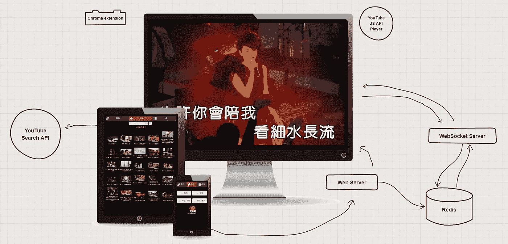
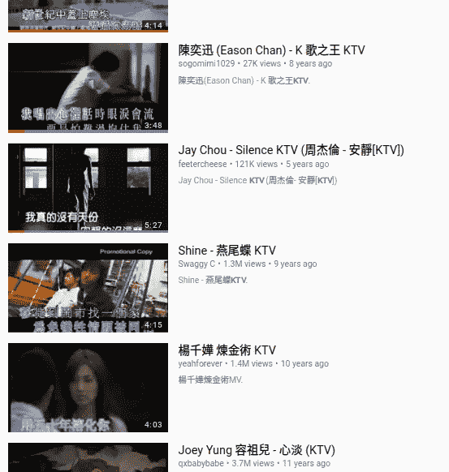
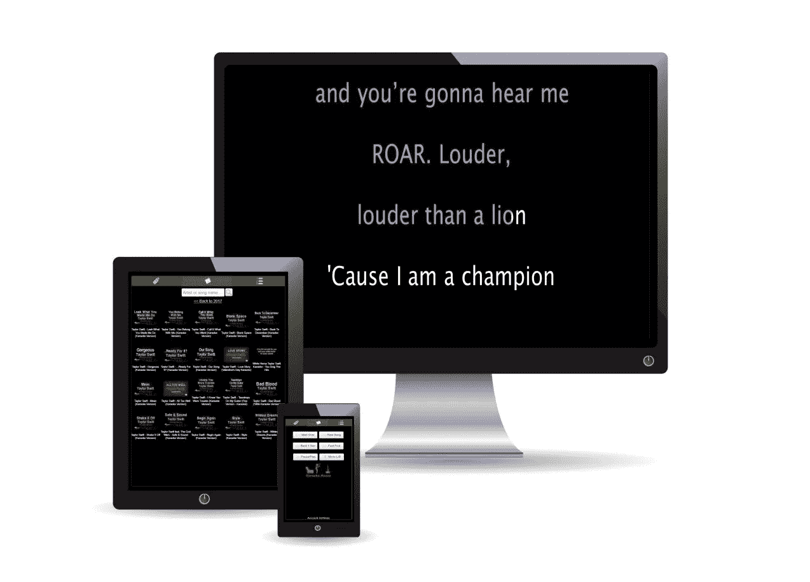
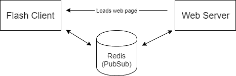
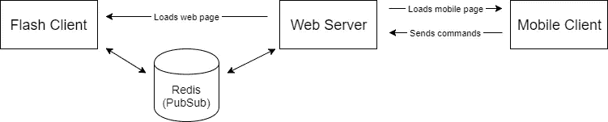
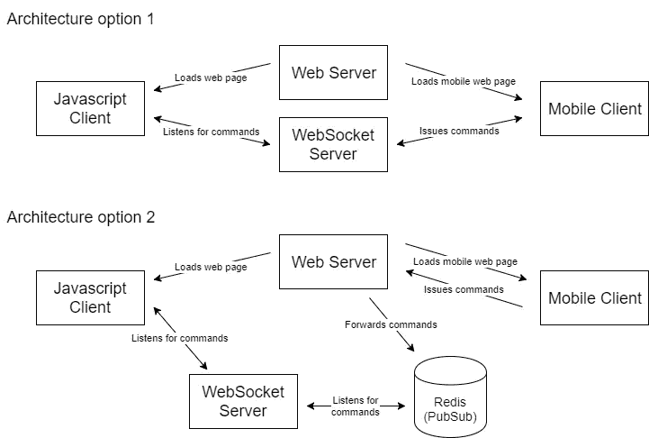
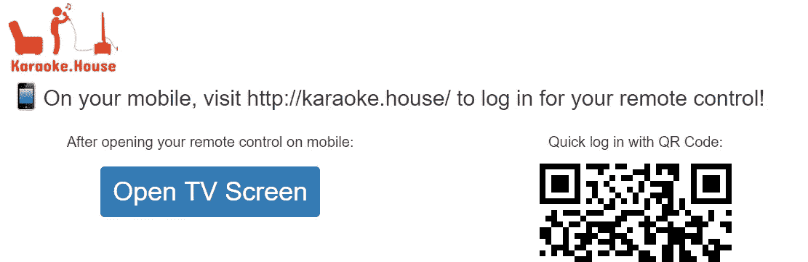
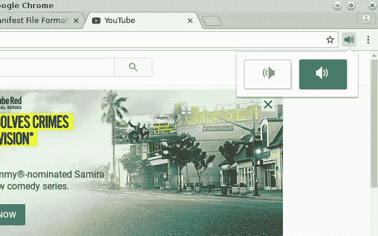

# 用 YouTube API、WebSocket、Redis、QR 码和 Chrome 扩展/WebAudio 构建的现代家庭卡拉 ok 系统

> 原文：<https://medium.com/hackernoon/a-modern-home-karaoke-system-built-with-youtube-api-websocket-redis-qr-codes-and-a-chrome-dc8c23a52985>



***2020 年 11 月更新*** *: Youtube 在今年夏天关闭了对卡拉 Karaoke.house 和 Singk.net 的 API 访问，在审查后认为这不符合他们的服务条款。因此，这些网站将在今年年底永久下线。这是一个很好的运行，有一小部分狂热的用户，而它持续！*

我既是一名软件工程师，也是一名歌手。像大多数歌手一样，我以各种方式从事唱歌，像在乐队演奏，去卡拉 ok。



YouTube search results for “KTV”

早在 2012 年，我就注意到很多 YouTube 用户上传中国卡拉 ok 音乐视频(也称为 KTV 视频)到 YouTube 上，不管有没有许可证。这让我开始思考和尝试——我可以在家里用 YouTube 上的内容唱卡拉 ok，但是 YouTube 的界面不是为卡拉 ok 设计的，所以有很多不便。事实证明，有效地选择歌曲、移动队列中的歌曲、跳过曲目，甚至调整乐器或原声的音频都很困难。(大部分中文 KTV 视频利用左右声道，一个是原声，一个是器乐专用。您必须调整 Windows 或 Mac 的音量控制设置，只输出左声道或右声道，以获得想要的音频。)

This was when I first had the idea to create a home karaoke system using modern web technologies — using the YouTube API to create a custom video player, and a layer built around it with functionality to work like the software you’d find at karaoke studios. Around late 2013, I finally began working on a prototype. This is the beginning of what would become [**SingK.net**](http://singk.net) (唱 K 網; Chinese version) and [**Karaoke.house**](http://karaoke.house) (English version).

这个爱好项目可能是我做过的技术上更加多样化的项目之一；经历了两个版本和一些实验原型。在这篇文章中，我想介绍一下技术，讨论一些架构设计和样本代码。

## 产品理念



基本想法是让它像你在亚洲卡拉 ok 厅找到的软件一样工作。电视屏幕播放音乐视频(底部有歌词作为字幕)，独立的电脑(带遥控器)用于搜索歌曲、跳过曲目、暂停、重启等。

这个想法是在家里复制这种体验:使用电脑屏幕(理想情况下连接到客厅的电视，就像在媒体 PC 设置中一样)播放视频，使用智能手机(或平板电脑)作为“遥控器”，结合界面来搜索歌曲。

具体的特征要求是:1)移动控制需要实时影响计算机上的视频播放器(即，单独的设备)，并且这包括从遥控器排队歌曲以在计算机上播放它们，以及像暂停/播放这样的视频回放控制功能；2)能够调整视频上的左/右音频通道。

# V1: YouTube Flash API，Redis(2013–2014)

回到 2013 年，Flash 还没有完全死亡。由于当时在脸书游戏公司工作，我碰巧也有一些动作脚本编码的背景。我相信内置这个是正确的技术选择，原因如下:

1.  更好的声音转换功能集。我需要能够只输出左声道或右声道。当时浏览器并不广泛支持 Javascript 的 WebAudio。Flash 毫不妥协地提供了这一点。此外，将 WebAudio 与 YouTube 的 Javascript player API 一起使用将会是一个问题，我们将在稍后的 V2 会议上讨论这个问题。
2.  WebSocket 在 2013 年仍是一项相对较新的技术，得到的支持较少。为了实现两个设备之间的实时通信，包括让 web 浏览器客户端*同步接收*数据，我需要它来保持与服务器的开放套接字连接。如果没有 WebSocket，那么很大程度上就是在 Flash 中使用套接字连接。
3.  YouTube 当时仍然为视频播放器提供 Flash API，使得整个项目成为可能。

为了完成上面的#2，我将直接从 Flash 客户端打开一个到 Redis 服务器的套接字连接(打开服务器防火墙上的 Redis 端口)，并利用[Redis’**pub sub**](https://redis.io/topics/pubsub)功能，该功能让客户端 **sub** 编写并监听服务器执行的命令 **pub** 。



现在，从安全的角度来看，向公众开放 Redis 服务器听起来很疯狂，但是 Redis 实际上有一些特性可以帮助做到这一点。使用`rename-command`配置(如此处的[所示](https://redis.io/topics/security)，您可以禁用那个面向公众的 Redis 实例上的每个命令，除了`PUBLISH`、`SUBSCRIBE`和`QUIT`。这也有助于运行这个 Redis 实例，而不是关闭默认端口 6379，这将大大减少扫描程序/机器人找到你的开放 Redis 实例。

一旦这些都设置好了，运行在计算机网页上的用户 Flash 客户端就可以实时监听来自服务器的命令。(当用户在页面上时，连接始终保持打开状态)

之后，所需要的就是移动客户端(移动 web 即普通网页)向网络服务器发出发布命令的请求。要发出播放/暂停、改变音频频道、排列歌曲等命令，它只需像其他网页一样用 Javascript 向服务器发出 AJAX 请求。完整的架构图如下所示:



## 问题:闪光的终结

众所周知，苹果决定不支持 iPhone 上的 Flash。现在，这实际上不会影响我们，因为我们在桌面上运行我们的视频播放器。然而，闪死的趋势是非常真实的。在我使用上面的架构完成这个项目的 V1 后不久，YouTube 也决定结束对其 Flash API 的支持。所有使用 YouTube 的 Flash API 的开发者都应该迁移到新的 Javascript API 播放器。

这给我带来了一些问题，因为我选择 Flash 不仅仅是因为 YouTube 播放器，还有其他几个原因，如上所述。YouTube 在 2015 年左右否决了 Flash API，并在 2016 年的某个时候完全停止了它的工作。这时候 app 已经坏了。

我现在需要将这个应用程序的视频播放器部分迁移到 YouTube JS API。为此，我需要重写两个主要特性:

1.  与 Redis 保持开放的套接字连接。
2.  Flash 中声音转换(左/右音频通道隔离/选择)必须用不同的技术重做。

幸运的是，当我从事这项工作时，已经是 2017 年了，WebSocket 被所有现代浏览器广泛采用。

# V2: YouTube JS API、WebSocket、Redis、二维码和 WebAudio/Chrome 扩展(2017)

因为需要改变，V2 不仅仅是视频播放器客户端从 Actionscript 到 Javascript 的重写，也是对其架构的重新设计。

要从 Flash Redis Web 服务器架构转移到 WebSocket 架构，有两种架构设计方案可以实现实时通信:



乍一看，选项 1 在架构上看起来更简单；但是它实际上在实施中提出了更多的挑战:

1.  WebSocket 服务器需要更多的逻辑:它需要能够区分哪个是移动客户端，哪个是桌面客户端；以便监听来自移动设备的命令，并将它们发送给桌面客户端。
2.  它还要求移动客户端打开一个 WebSocket 连接。在这个应用中，移动客户端是一个移动 web 应用。在演唱期间，用户的手机可以进入和退出待机/屏幕关闭模式，甚至可以进入和退出网络浏览器本身。这使得维护 WebSocket 连接变得古怪和迟缓；在最坏的情况下，当按下按钮什么也做不了时，它会产生一个可怜的 UX。

选项 2，虽然在架构图中看起来更复杂，但实际上与我们最初的设计有更多的相似之处，使得重写 V1 的实现更容易，范围更小。

1.  移动客户端的工作方式完全相同:它不需要了解 WebSocket 服务器，只需通过常规的 AJAX 请求向 web 服务器发送命令。web 服务器也以完全相同的方式工作，它通过 publish(pubsub 的 pub 部分)向 Redis 发送命令。
2.  与 Flash 客户端相比，新的 Javascript 桌面 web 客户端的主要变化是，它现在不是直接连接到 Redis，而是连接到 WebSocket 服务器。
3.  这使得我们的 WebSocket 服务器非常简单:只有一种类型的客户端可以连接到它；它只能对客户端做一种事情(向它发送命令)。它确实需要打开与 Redis 服务器的连接，但这相对来说并不重要。
4.  尽管我们仍然使用 Redis，但我们现在可以从公众中关闭我们的 Redis 服务器(关闭防火墙中的那个端口)。这是因为现在只有 WebSocket 服务器需要与它对话，而不是像以前一样需要所有的 Flash 客户端。

出于以上原因，我选择了架构选项 2。

## nodejs:web socket 服务器的完美技术

该项目的 web 服务器后端一直是 PHP。在这个项目之前，我已经使用它 10 多年了，在我开始这个项目的 2013 年，PHP 仍然相对流行，而 nodejs 作为 web 服务器后端还不太普及。

因此，当需要编写 WebSocket 服务器时，我自然会尝试坚持使用 PHP，为同一个项目保持相同/较小的技术堆栈，而不必在我的服务器上安装新软件。

我很快发现，由于 PHP 的非异步特性，PHP 中的 WebSocket 库在您所能做的事情方面受到了相当大的限制——web socket 服务器的异步方面通常在一个事件循环中处理，这使得在同一个服务器程序代码中很难有一个完全独立的异步方面(例如，一个用于连接 Redis 并使用`SUBSCRIBE`监听命令，当命令到来时触发回调)。这是当我决定 PHP 不是正确的[工具](https://hackernoon.com/tagged/tool)的时候。

这已经是 2017 年了，nodejs 作为一个开发平台已经非常成熟了。不仅有大量的 npm 包可用于任何事情，nodejs 的异步特性也使它成为这个用例的完美工具。

使用 [ws](https://www.npmjs.com/package/ws) 和 [redis](https://www.npmjs.com/package/redis) npm 包，WebSocket 服务器的 nodejs 代码可以归结为:

```
const WebSocket = require('ws'),
  Redis = require('redis');const redis = Redis.createClient({host: 'localhost', port: 6379});/**
 * Listens for Redis messages
 */
redis.on("message", function(channel, message) {
  // parse message from web server that came through redis pubsub
  // then issue a send() command to a websocket connection
});const websocketServer = new WebSocket.Server({ port: 8080 });websocketServer.on('connection', function connection(client) {
  // store the connected client for making send() to later
});
```

当然，还有一些事情，比如日志记录、错误处理和清理连接。此外，使用`ws`包，您将希望手动保持心跳以保持连接。但是最终，整个 WebSocket 服务器归结为一个文件中大约 100 行 nodejs 代码。

## 登录:二维码

正如您现在已经猜到的，让整个架构工作的前提是让 Javascript 桌面 web 客户端和移动客户端登录到同一个帐户。

完成这项工作很简单:因为您使用用户名和密码登录，所以您只需在桌面端和移动端输入相同的用户名/密码。之后，从手机发出的每一个命令都会转到正确的桌面客户端(同一个账号)。这是自 V1 以来的运作方式。

然而，众所周知，在移动设备上输入密码并不是一件愉快的 UX。

经过一番思考，我想到这可能是二维码的一个完美用例。要使用[卡拉 ok 屋](http://karaoke.house)，你*总是*必须同时登陆桌面和移动。你几乎总是先登录桌面，然后用同一个账户登录手机。为什么不在桌面登录后生成一个二维码图像，让移动设备扫描后登录，而不需要输入任何东西？(对于那些熟悉 Whatsapp 的人来说，Whatsapp Web 的工作方式与此类似，但却是相反的——你首先登录手机，然后用手机扫描 web.whatsapp.com 上的二维码，让桌面 Web 客户端登录到与手机相同的账户。)



The first screen you see as you log in on desktop

在大多数语言中，生成 QR 码相对容易，因为已经有为此编写的开源库。在我的例子中，通过一个 PHP web 服务器后端，我使用了 [PHP 二维码](http://phpqrcode.sourceforge.net/)来做这件事。

二维码实际上只是一个文本字符串，它被编码成一个方块，方块内有一些更小的方块。实现 QR 码登录系统的方法是简单地生成一个足够长的随机字符串，然后将其存储到您的数据库(或 Redis)中，将它与已经在桌面上登录的用户的帐户相关联。然后，您只需将二维码输出为您选择的图库的图像。

```
// A not very up to current cryptographically-secure standard way
// of generating a random string: just one example way to do it
// in PHP. Generates a 60-character hex string randomly.
$qrString = bin2hex(openssl_random_pseudo_bytes(30));// Store the string into database, associate it with the user ID
// of the currently logged in account.// Using the PHP QR Code library, this generates/outputs a QR code
QRcode::png($qrString);
```

在移动客户端，我使用的是 [Instascan](https://github.com/schmich/instascan) JS 库，创建一个可用的 QR 扫描仪的代码非常简单:

```
var scanner = new Instascan.Scanner({ video: document.getElementById('preview'), mirror: false });scanner.addListener('scan', function (content) {
  // When scanner detected a QR code successfully.
  // The "content" variable will contain that random string
  // you generated from the server side above.
  // Submit login form here with that data to log in as that user.
});Instascan.Camera.getCameras().then(function (cameras) {
  if (cameras.length > 0) {
    scanner.start(cameras[cameras.length-1]);
  }
});
```

除了一些额外的错误处理，没有太多的代码需要有一个工作的二维码登录。当然，在服务器端，登录端点将需要读取 QR 字符串，并从数据库中查找它以匹配要登录的用户帐户。

## 最后一个问题:Javascript WebAudio 中的左/右声道

在这一点上，我们几乎重新创建了 V1 Flash 版本的所有功能，甚至改进了许多东西(例如 QR 登录，没有 Flash 插件要求，不再有面向公众的 Redis 服务器)。

V2 的最后一块拼图是声音。诚然，这对于英文版的[卡拉 ok 屋](http://karaoke.house)来说问题要小得多，因为英文卡拉 ok 视频不倾向于分别使用左右声道。但是，这几乎是中国 KTV 视频的要求。

我们的答案在于 Javascript 中的 WebAudio API，它允许你在网页上用声音做各种各样的事情。然而，事情会变得棘手。

WebAudio JS 代码将网页上的声音修改为仅使用单声道左声道或单声道右声道，如下所示:

```
audioCtx = new (window.AudioContext)();source = audioCtx.createMediaElementSource(node);
// "node" is the DOM node that contains the element with sound,
// can be a <video> or <audio> element.splitter = audioCtx.createChannelSplitter(2);
source.connect(splitter, 0, 0);
gainLeft = audioCtx.createGain();
gainRight = audioCtx.createGain();
splitter.connect(gainLeft, 0);
splitter.connect(gainRight, 1);
gainLeft.connect(audioCtx.destination, 0);
gainRight.connect(audioCtx.destination, 0);// from here on, if you want to switch to left-only, do:
gainLeft.gain.value = 1;
gainRight.gain.value = 0;// and vice versa for right-only.
```

如果它与 YouTube 的 JS API 一起工作，这将是相对容易的，我们将在这里完成。但是，事实并非如此。

YouTube JS API 播放器的实现方式是，视频播放器本身(即`<video>`标签本身)存在于一个 iframe 中。这样做是出于各种各样的原因，这对 YouTube 来说是有意义的(主要是安全原因)，但这也使我们不可能做上面的 WebAudio 声音更改。在另一个域的 iframe 中访问一个`<video>` DOM 节点将是跨源资源共享(CORS)，这是 YouTube 的服务器配置所不允许的(当然)。



这样做的唯一真正方法就是 Chrome 扩展。这就是为什么我创建了[左右声音选择扩展](https://chrome.google.com/webstore/detail/left-right-sound-select/gjaliinpmkmkehebabkfkhpbfaekgljn?hl=en-US)([source code/GitHub repo here](https://github.com/bigicoin/left-right-sound-select))，它基本上包含了上面的代码，但是适用于在一个页面上找到的所有视频或音频 DOM 节点(只要你启用了扩展，并且从扩展弹出菜单中选择了左声道或右声道，如上所示)。

该应用程序的中文版[SingK.net](http://singk.net)，提示用户安装扩展，如果他们希望有音频通道选择功能。不理想，但考虑到限制因素，这是我能做的最好的了。幸运的是，至少英语卡拉 ok 视频没有这些分离的音频通道，所以没有必要为[卡拉 ok 屋](http://karaoke.house)提示这一点。

最终，这不是一个我希望接触到数百万用户并成长为一家公司的项目；这是一个有点太小众的用例和受众。喜欢卡拉 ok 的人想在家里做，并且有一台媒体电脑(有相当好的立体声系统和麦克风！)设置在他们的客厅里。然而，这是我做过的技术上更有趣的副业之一，引导我探索 Flash Actionscript 声音转换、WebSocket、QR 码、Javascript WebAudio API，甚至 Chrome 扩展。希望这里的知识能帮助到一些人，甚至启发一些人去做一个项目！

比如唱歌？给 [**歌厅**](http://karaoke.house) 一个尝试，如果只是为了检查它是如何工作的！