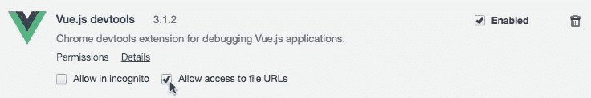
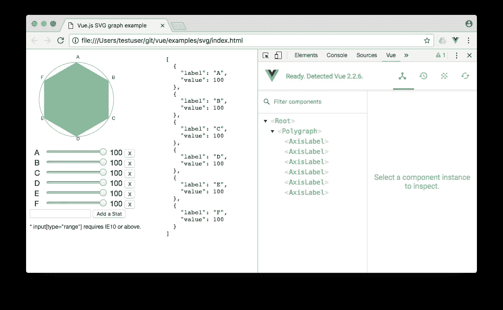
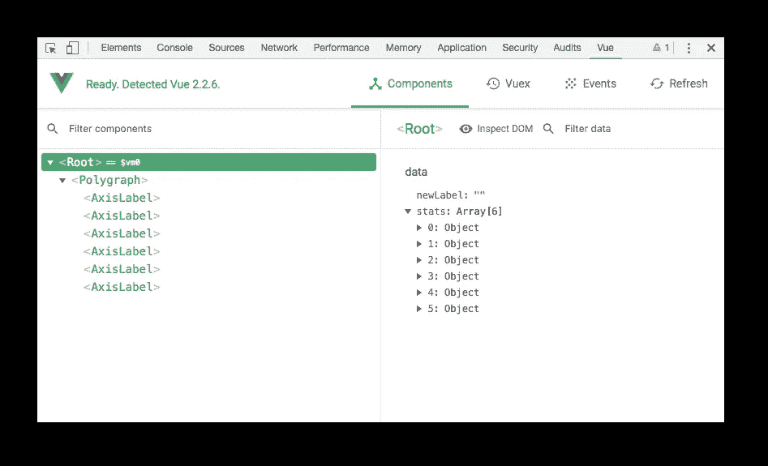
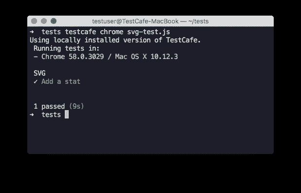

# 对 Vue.js 应用进行 E2E 测试的现代方法

> 原文：<https://medium.com/hackernoon/a-modern-way-to-do-e2e-testing-for-vue-js-apps-cebe0a07499c>

# 介绍

当你为一个 web 应用程序编写 [e2e](https://hackernoon.com/tagged/e2e) 测试时，你有时别无选择，只能编写笨拙的选择器，比如

```
#vueRootContainer > ul > li > div
```

这种结构导致代码难以阅读和理解。在本文中，我们介绍了一种全新的方法，允许您摆脱不可读的选择器，并编写清晰易懂的测试代码。

```
const todoItem = VueSelector('todo-list todo-item');
```

Vue.js 允许您使用基于组件或声明性的方法来定义 web 应用程序结构。基于组件的方法更适合复杂的应用程序，因为它们需要组件之间更严格的关注点分离。 [TestCafe](http://github.com/devexpress/testcafe) 团队创建了 [testcafe-vue-selectors](https://github.com/devexpress/testcafe-vue-selectors) 模块——一个插件，允许你使用基于组件的方法来测试 Vue.js 应用。这个插件允许你通过名字或者名字列表来选择一个 Vue.js 组件。

您还可以在测试代码中访问组件属性。

到目前为止，TestCafe 是唯一一个为 Vue.js 应用提供原生测试体验的框架。让我们看看用 TestCafe 测试一个 Vue.js 应用程序有多简单。

# 设置测试环境

## 安装 TestCafe 和 testcafe-vue 选择器

因为 TestCafe 是一个纯粹的 [Node.js](https://hackernoon.com/tagged/nodejs) 应用程序，所以它的安装很简单:

`npm install testcafe`

用同样的方法安装`testcafe-vue-selectors`模块:

`npm install testcafe-vue-selectors`

## 测试应用程序

设置测试环境以测试 Vue.js 示例中的 [SVG](https://github.com/vuejs/vue/blob/dev/examples/svg/index.html) 应用程序。

1.  克隆 Vue.js repo。

`git clone [http://github.com/vuejs/vue](http://github.com/vuejs/vue)`

2.为谷歌 Chrome 安装 [Vue DevTools](https://github.com/vuejs/vue-devtools) 扩展。

Vue DevTools 的描述提到了两个要求:

1.  如果页面使用 Vue.js 的生产/缩小版本，默认情况下禁用 devtools 检查，因此 Vue 窗格不会显示。
2.  要让它适用于通过`file://`协议打开的页面，你需要在 Chrome 的扩展管理面板中勾选这个扩展的“允许访问文件 URL”。

让我们解决这两个需求:

1.  允许 Vue DevTools 通过`file://`协议访问文件。



2.用开发版本替换生产 vue.js 版本。

为此，打开`vue/examples/svg/index.html`并更改

```
<script src="../../dist/vue.min.js"></script>
```

到

```
<script src="../../dist/vue.js"></script>
```

现在在谷歌浏览器中打开`vue/examples/svg/index.html`，激活 Vue DevTools。如果一切操作正确，将显示以下图片:



# 测试应用程序

## 页面对象

让我们探索一下应用程序组件结构。



该页面包含一个带有六个 AxisLabel 子级的 polygraph 组件。接下来，基于这个结构定义[页面对象](https://devexpress.github.io/testcafe/documentation/recipes/using-page-model.html)。

因为添加新 stat 的表单是用声明性方法定义的，所以我们使用内置的 TestCafe 选择器。

有关 TestCafe 选择器的详细信息，请参见[选择器](https://devexpress.github.io/testcafe/documentation/test-api/selecting-page-elements/selectors.html)。

图上绘制的统计数据是用基于组件的方法定义的，我们使用 VueSelector。

有关 VueSelector 的更多信息，参见 [testcafe-vue-selectors](https://github.com/devexpress/testcafe-vue-selectors) 。

创建文件夹`testcafe`并将页面对象定义保存到`page-object.js`文件中。稍后，我们将把这个文件作为一个常规模块导入。

## 测试场景

**动作、断言和文件协议**

让我们创建`svg-test.js`文件，并将其放入`testcafe`目录。TestCafe 支持`file://`协议，所以您不需要设置一个本地 HTTP 服务器来运行测试。您所需要的只是将测试页面的路径指定为目标页面 URL。

测试场景添加了一个标记为`G`的新统计数据，并检查统计数据的数量是否从 6 变为 7。

这段代码使用模拟用户动作的方法:[键入文本](https://devexpress.github.io/testcafe/documentation/test-api/actions/type-text.html)和[点击](https://devexpress.github.io/testcafe/documentation/test-api/actions/click.html)。你可以在[动作](https://devexpress.github.io/testcafe/documentation/test-api/actions/)文档主题中找到更多关于动作的细节。

我们使用内置断言来检查 HTML 元素的属性是否具有预期的值。它们公开了各种方法来比较值，并提供了[智能断言查询机制](https://devexpress.github.io/testcafe/documentation/test-api/assertions/#smart-assertion-query-mechanism)。有关断言的详细信息，请参见[断言](http://devexpress.github.io/testcafe/documentation/test-api/assertions/)。

由于`VueSelector`继承自`Selector`，所以您可以使用 TestCafe 选择器的所有功能。例如，上面的代码使用了选择器 API 中的`count`属性。

**组件状态和属性**

`testcafe-vue-selectors`插件还允许您获取 Vue.js 组件属性。用验证添加的 stat 属性的代码扩展上面的测试:

这段代码使用`getVue()`方法来获取 Vue 组件的属性。这个方法返回一个包含`props`、`state`和`computed`属性的对象。您可以在`[testcafe-vue-selectors](https://github.com/devexpress/testcafe-vue-selectors)`资源库中找到详细信息。

# 运行测试

创建一个新的`package.json`文件，并向其中添加一个测试运行命令。：

```
{
   "scripts": {
       "test": "testcafe chrome testcafe/svg-test.js"
   }
}
```

现在您已经准备好运行您的第一个测试了。在控制台中键入:

```
npm test
```

之后，TestCafe 启动 Google Chrome 浏览器，执行测试场景，关闭浏览器，并将结果输出到控制台。



TestCafe 允许您在本地安装的浏览器、移动设备和云测试平台上运行测试。详细信息请参见[浏览器支持](https://devexpress.github.io/testcafe/documentation/using-testcafe/common-concepts/browser-support.html)。

您还可以选择呈现测试运行报告的格式:spec、list、minimal、xUnit 和 JSON 格式都是现成的。更多信息见[记者](https://devexpress.github.io/testcafe/documentation/using-testcafe/common-concepts/reporters.html)。

# 结论

在本文中，我们学习了如何测试 Vue.js 应用程序。例如，我们使用了 Vue.js 存储库中的 SVG 应用程序。我们讨论了设置测试环境、创建测试、运行和查看测试结果。如果您有问题，请访问我们的[论坛](https://testcafe-discuss.devexpress.com/)。如果你想报告一个问题或者提交一个建议，去 [TestCafe](https://github.com/devexpress/testcafe) 和 [testcafe-vue-selectors](https://github.com/devexpress/testcafe-vue-selectors) 库。

[](http://bit.ly/HackernoonFB)[](https://goo.gl/k7XYbx)[](https://goo.gl/4ofytp)

> [黑客中午](http://bit.ly/Hackernoon)是黑客如何开始他们的下午。我们是 [@AMI](http://bit.ly/atAMIatAMI) 家庭的一员。我们现在[接受投稿](http://bit.ly/hackernoonsubmission)并乐意[讨论广告&赞助](mailto:partners@amipublications.com)机会。
> 
> 如果你喜欢这个故事，我们推荐你阅读我们的[最新科技故事](http://bit.ly/hackernoonlatestt)和[趋势科技故事](https://hackernoon.com/trending)。直到下一次，不要把世界的现实想当然！

