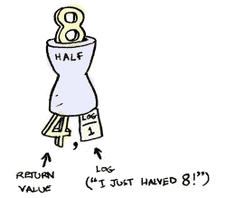

# F#的单子作者

> 原文：<https://medium.com/hackernoon/a-monad-writer-for-f-26aa987e4a3a>



几年前开始学 **F#** 。这让我走上了只用纯函数方法在 F# 中为纯函数语言构建完整编译器的道路。

从那以后，我转到了 Scala，再也没有回到。NET 框架。但是，有时候我很怀念 **F#** 的简洁和表现力。我在之前写的一些帖子里已经演示过了比如 Scala 中的( [***| >运算符***](https://hackernoon.com/operator-in-scala-cbca7b939fc0) ***，*** [***高阶函数，它们是什么？***](https://hackernoon.com/higher-order-functions-what-are-they-be74111659e8)*[***下一个高阶函数***](/@anicolaspp/what-comes-next-to-higher-order-functions-2279d07b4efc) )。*

*回到今天的 F# 只是为了怀念一些我经常使用的 Scala 构造，即*单子作者*。*

*日志记录是我们应用程序的重要组成部分。然而，我们很少做纯功能日志。我不打算解释为什么或者为什么不进行函数式日志记录，但是我们将看到通过使用*单子编写器*在 **F#** 中编写和使用纯函数式日志记录是多么简单。*

*我们需要做的第一件事，是创建一个 *Writer* 的方法。具体来说，我们希望能够访问我们将在下一步操作中使用的初始编写器。*

*这应该像下面这样简单:*

```
*let writer = bind 5 "starting"*
```

*`bind`操作应该返回一个*写入器*，其初始值为`5`，要记录的初始值为`starting`。*

*为了做到这一点，我们需要定义一个*编写器*的样子。*

```
*type Writer<'a, 'L> = AWriter of 'a * List<'L>*
```

*一个简单的区别对待的联盟就足够了。我们需要一个通用类型`‘a`和通用`‘L`，这是我们的日志。当然，我们并不局限于只记录`string`。事实上，日志的元素可以是任何类型的。为了方便和简单，我们大部分时间都将使用`string`,但是我们可以使用任何其他类型作为日志的一部分。*

*此时，我们只需要`bind`函数，这样它就创建了所需的*编写器*。*

```
*let bind = function 
         | (v, itemLog) -> AWriter(v, [itemLog])*
```

*`bind`是一个接收两个参数的函数，一个通用值`v`和第一个要记录的项目`itemLog`，然后它返回我们最初的*作者*。*

*现在，我们需要一种方法来映射*写入器*的值，这样我们就可以在不影响日志的情况下改变装箱值的类型。让我们看看如何写`map`*

```
*let map fx = function
         | AWriter(a, log) -> AWriter(fx a, log)*
```

*在这里，`map`使用另一个函数`fx`，通过创建一个新的*写入器*来应用于*写入器*值`a`。请注意，我们从不改变一个作者，我们只是创造新的*作者*。*

*只有这两个，我们可以开始定义其他函数，这些函数在保持引用透明的同时返回 *Writers* (做日志记录)。*

*让我们定义一些可以在程序中使用的函数。*

```
*let sum x y = bind (x + y, "sum")
let mul x y = bind (x * y, "mul")
let mod1 x y = bind (x % y, "mod")
let minus x y = bind (x - y, "minus")*
```

*请注意，所有这些函数只有一个单一的职责，求和、乘法、求模和计算差。他们不了解全局记录器，也不向共享状态添加任何内容。它们非常小，测试起来非常简单；它们是纯函数。*

*我们可以看到，它们都通过函数`bind`返回一个*编写器*。由于先进的 **F#** 类型系统和类型推断，像这样定义函数是一件非常容易的事情。*

*通过使用`map`，我们可以进行如下转换。*

```
*let str a = a.ToString()let to_string a = a |> map strsum 5 5 |> to_string*
```

*让我们仔细看看这部分。*

*首先，我们创建了一个具有值`5 + 5 = 10`和日志`["sum"]`的*写入器*，然后我们调用`to_string`，它基本上调用`map`，因此结果是一个具有值`"10"`和相同日志`["sum"]`的*写入器*。我们已经通过`map`修改了*写入器*的值，而没有触及日志。*

*从*作家*那里得到的东西呢？*

*让我们定义一个简单的方法来提取当前值和我们到目前为止一直在构建的日志。*

```
*let run = function
         | AWriter(a, log) -> (a, log)*
```

*`run`是接收*写入器*并以元组形式返回值和日志的函数。现在我们可以看看*作者*的内容了。*

```
*let (v, log) = run (sum 5 5)*
```

*或者用更惯用的 **F#***

```
*let (v, log) = sum 5 5 |> run*
```

*在这里，`v`是数值`10`，`log`是`["sum"]`。*

*之前，我们已经定义了不同的函数，其中所有的函数都返回 *Writers* ( *sum，mul，mod1，minus* )，但是我们没有办法将定义的操作组合起来，以便将每个操作的结果聚合到一个日志中。*

*缺少的操作是`flatMap`。*

```
*let flatMap fx = function
         | AWriter(a, log) -> 
             let (v, new_log) = fx a |> run
             AWriter(v, List.append log new_log)*
```

*`flatMap`接收一个类型为`'a -> Writer(b, List<`L>`的函数并返回一个新的*编写器*。如果我们仔细观察一下，`flatMap`负责聚合来自多个编写器的日志。*

*让我们看一个可能更有启发性的例子。*

```
*let result = 
         sum 5 5 
         |> flatMap (mul 2) 
         |> flatMap (mod1 25) 
         |> flatMap (minus 10)*
```

*最后一个值`result`，是一个*写入器*，我们可以在这里调用`run`。*

```
*let (v, log) = run resultSystem.Console.WriteLine vfor i in log do
    System.Console.WriteLine i*
```

*这将打印出:*

```
*5
sum
mul
mod
minus*
```

*其中`5`是`5 + 5 = 10 * 2 = 20; 25 % 20 = 5; 10 — 5 = 5`的结果，并且执行了订单操作中的日志。*

*至此，我们已经用最简单的方式在 **F#** 中完整定义了一个*单子作者*。我们实际上可以向它添加更多的功能，但是在这个练习中让它尽可能简单。*

**作者*的整个代码看起来像这样*

```
*module MonadWriter = 

     type Writer<'a, 'L> = AWriter of 'a * List<'L>

     let bind = function 
         | (v, itemLog) -> AWriter(v, [itemLog])

     let run = function
         | AWriter(a, log) -> (a, log)

     let map fx = function
         | AWriter(a, log) -> AWriter(fx a, log)

     let flatMap fx = function
         | AWriter(a, log) -> 
             let (v, new_log) = run (fx a)
             AWriter(v, List.append log new_log)*
```

## *结论*

*Monad Writer 是一种非常优雅的方式，可以让你的函数保持纯净，同时它们有一个单一的职责，比如做像`a + b`这样的小操作。此外，通过遵循这种模式，我们避免了在我们的代码中注入日志程序，或者更糟的是，避免了访问全局日志程序，这在多线程/并行执行环境中是非常危险的。*

*我们大多数人在使用面向对象语言时都使用过糟糕的记录器，但是这只会在代码中产生更深的依赖性，同时破坏了单一责任原则。*

*尤其是在分布式系统中，这是或者仅仅是转向功能性日志记录方式的决定。你可以通过阅读 [***如何登录 Apache Spark，一个函数式的方法***](https://hackernoon.com/how-to-log-in-apache-spark-a-functional-approach-e48ffbbd935b) 来看看在 Apache Spark 中是怎么做的。*

> *日志安全，功能正常。*