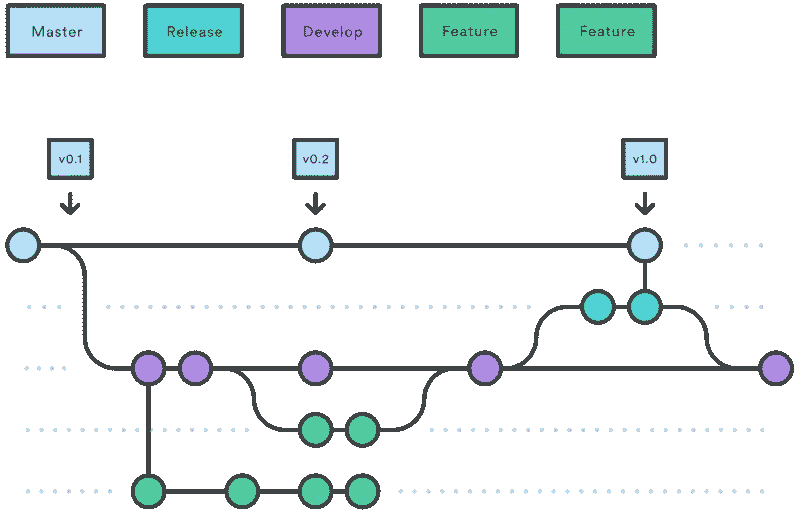
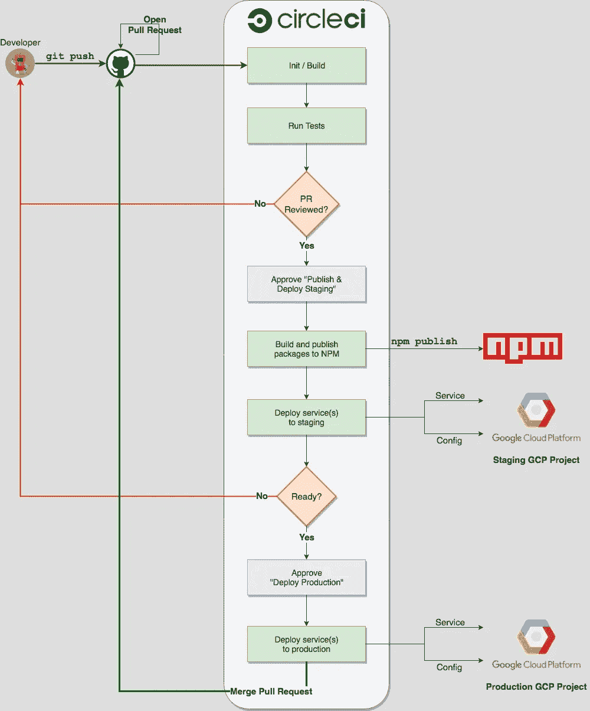

# monorepo、GitHub 流程和自动化 FTW

> 原文：<https://medium.com/hackernoon/a-monorepo-github-flow-and-automation-ftw-c41a2d9c48bb>

## 我们的生产部署如何从🙀到一块🍰

访问 https://www.mikenikles.com 的****获取我的最新博文。****

***这篇博文是我分享我们从部署在 AWS 上的单片应用程序(每个都有自己的源代码库)迁移到部署在 Google 云平台上的分布式服务架构(所有源代码都托管在 monorepo 中)的系列文章的一部分。***

*   ***第 1 部分(本文):“monorepo、GitHub 流和自动化 FTW”***
*   ***第 2 部分:“* [*一对多——为什么我们从多个 git 回购转移到一个 monorepo，以及我们如何设置它*](/@mikenikles/one-vs-many-why-we-moved-from-multiple-git-repos-to-a-monorepo-and-how-we-set-it-up-f4abb0cfe469)*”***
*   ***第三部分:* [*一个(大部分)自动化的发布过程*](/@mikenikles/a-mostly-automated-release-process-63bb9516985a)**
*   ****第四部分:* [我们对软件开发一致性的方法](/@mikenikles/our-approach-to-software-development-consistency-d101995bb843)***
*   *****第 5 部分(即将推出):“本地调试微服务”*****

****我认为在新项目中降低风险的最简单的方法是坚持你所知道的。虽然有时候，为了取得进步，最好走出你的舒适区。****

# ****背景(三层架构)****

****2017 年早些时候，当我加入一家新的创业公司领导工程团队时，我坚持我所知道的。很快，很明显，一点点的不适和探索正是我们所需要的。不过，首先要说明一下我们做了什么:我们为市场研究人员建立聊天机器人，与他们的社区互动。高层次的要求是:****

*   ****一个管理网络界面来创作，部署和监控聊天机器人****
*   ****一个后端系统来处理业务逻辑，验证和处理发送到聊天机器人的消息****
*   ****保存所有数据的(关系)数据库****

****这就叫“ [3 层架构](https://en.wikipedia.org/wiki/Multitier_architecture#Three-tier_architecture)”全部结束了，于是我们构建了一个 3 层架构。****

## ****您如何部署所有代码？****

*****回答*:你坚持你知道的。在我的例子中，我之前使用了 [Gitflow 工作流](https://www.atlassian.com/git/tutorials/comparing-workflows/gitflow-workflow)。****

********

****Gitflow Workflow (Source: [Atlassian](https://www.atlassian.com/git/tutorials/comparing-workflows/gitflow-workflow))****

****每当一个特性被合并到`develop`分支中，`develop`分支就会被部署到一个阶段环境中。
定期地(稍后会详细介绍)，从`develop`分支中创建一个`release`分支，审查并合并到`master`中。一旦发生这种情况，`master`就会被部署到生产环境中。****

****我们有多个 git 存储库(前端、后端、用于长期运行任务的作业服务和一个与后端 REST API 对话的 SDK)。Gitflow 工作流适用于所有存储库。****

## ****那么，“周期性”是什么意思呢？****

****这就是 Gitflow 工作流出现问题的地方。你在哪个时间点切一个`release`分支？每周一早上 9 点？如果有人在早上 8:30 将一个特性合并到`develop`中会怎样？你是否在周一上午 9 点创建一个`release`分支，彻底测试发布分支，并在周三/周四将`release`分支合并到`master`中？？？。谁负责生产部署？****

****在最坏的情况下，创建`release`分支，测试它并合并到`master`是一个冗长的过程。不知不觉中，距离您最后一次发布产品已经有一个月或更长时间了。🙀****

****我们尝试了各种方法，尝试了更多或更少的自动化，等等。****

# ****模块化程度更高，所有代码都在一个 monorepo 中****

****随着我们与上述方法的斗争加剧，我们聚集在白板前，重新定义了我们希望如何部署到生产环境中。****

****主要目标是更频繁地部署到生产环境中。在最好的情况下，我们在试运行环境中测试完每个拉请求后，就将它发布到生产中。****

*****第一步*:将所有代码放入一个 monorepo 中，以更好地处理依赖关系。(*这个值得自己博文。*)****

*****第二步*:去掉`develop`分支，只剩下`master`和`feature`分支。等一下…听起来很熟悉！当然是 [GitHub 流量](https://guides.github.com/introduction/flow/)💡。****

****第三步:自动化，自动化，自动化！(*值得再发一篇博文……*)****

****经过大量白板演示、试验和多次失败的部署后，我们现在有了一个 monorepo，遵循 GitHub 工作流程，每天多次部署到生产环境中。****

********

****Release Process with a monorepo and the GitHub workflow****

****绿色矩形是完全自动化的，蓝色矩形需要手动批准才能继续工作流程。****

# ****利益****

****采用上述方法，我们有许多好处:****

*   ****生产部署每天会发生几次。每个版本都是以前版本的一小部分。****
*   ****将代码部署到生产环境的责任由所有团队成员共同承担。在我们的例子中，拉取请求的审查者部署到试运行和生产。****
*   ****使用 GitHub 流程方法，我们需要处理的分支更少，而且发布代码的流程也更少。****

****在[的后续文章](/@mikenikles/a-mostly-automated-release-process-63bb9516985a)中，我将分享 CircleCI 配置和一些其他工具，它们帮助我们自动化大部分发布过程。****