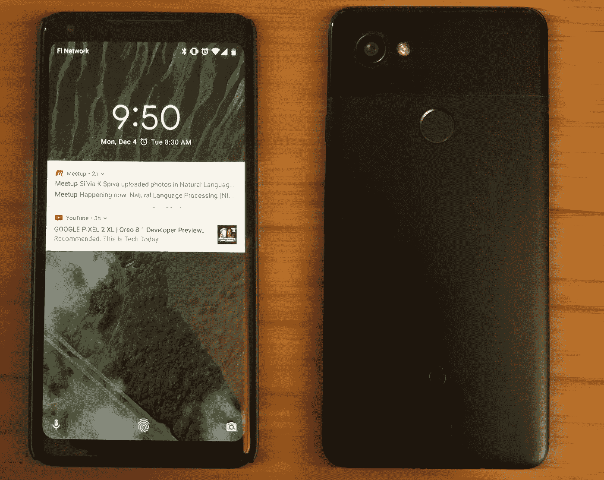
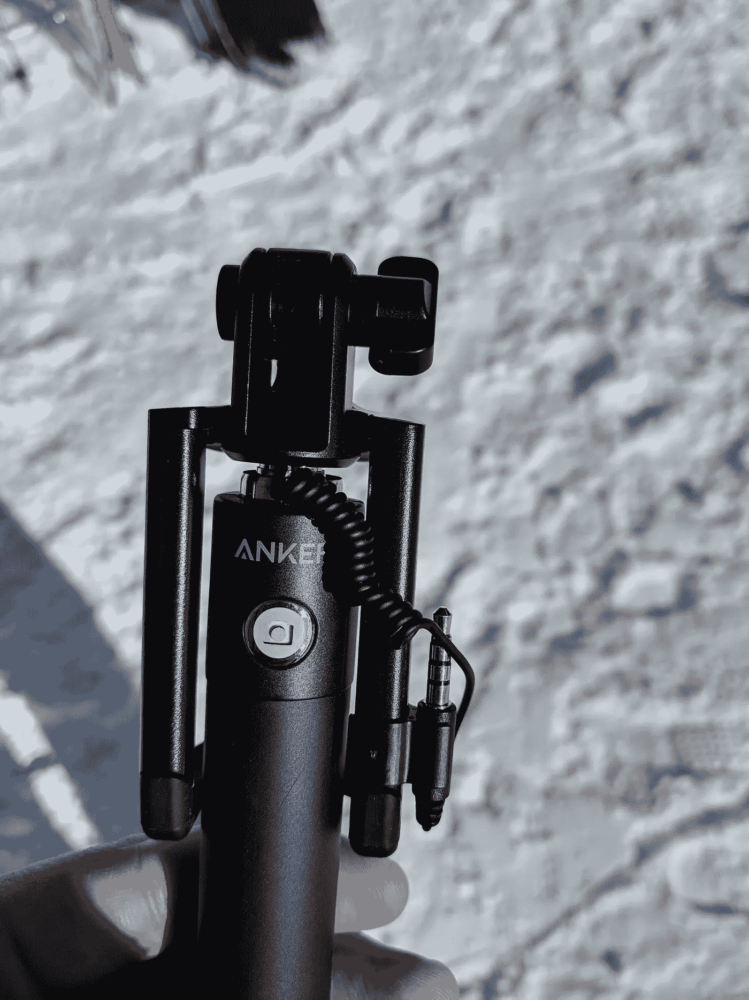
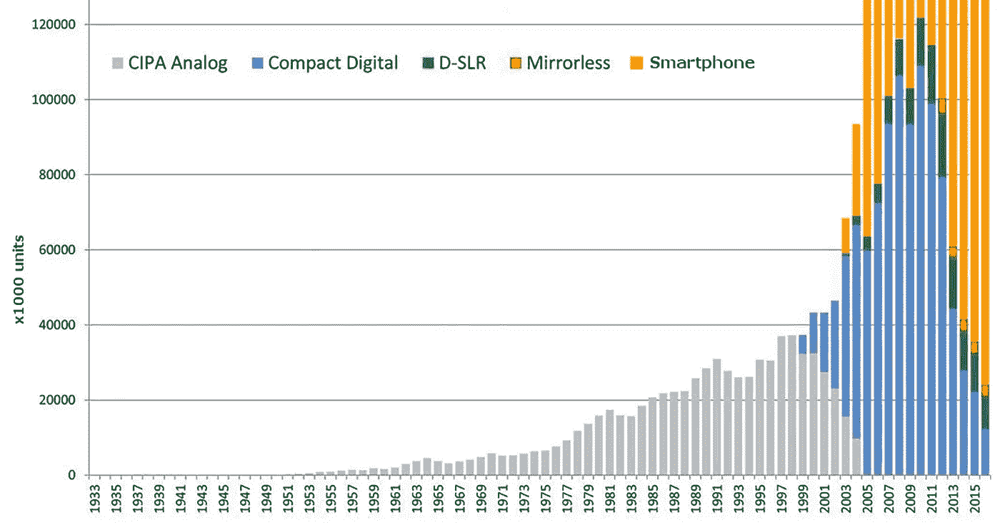
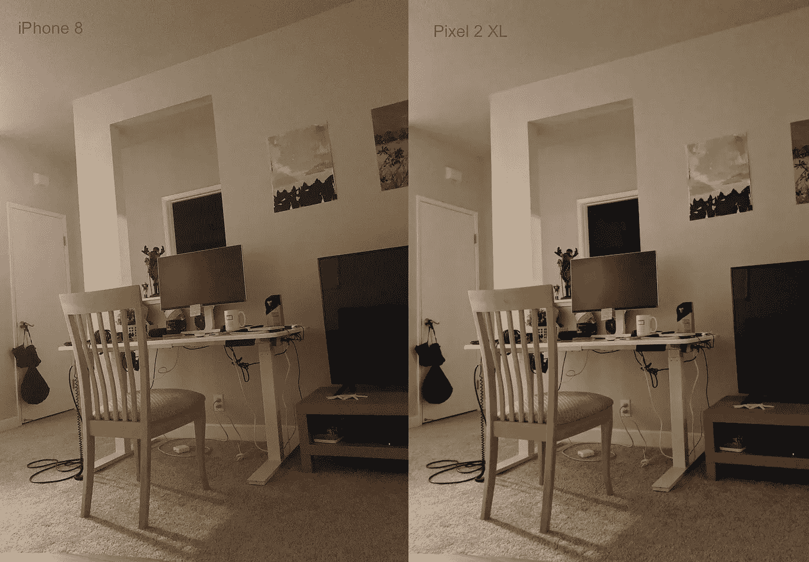
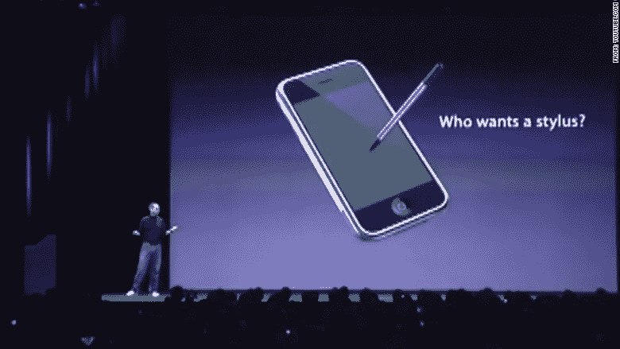

# 像素 2 XL 的一个月

> 原文：<https://medium.com/hackernoon/a-month-with-pixel-2-xl-1fe876bcf5aa>

今年夏末，我开始寻找一款新的智能手机。我在发布后立即购买了一台基本的 PH-1，那是一次相当奇怪的购买经历。我最终归还了它，并在[这篇文章](https://hackernoon.com/not-so-essential-phone-ddcab1bb1f75)中描述了我的想法。我等着谷歌新一代 Pixel 手机的发布，在 11 月初买了一台 Pixel 2 XL。我已经用了快一个月了，如果你看了下面的文章，你就会了解到我诚实的用户体验。

## 设计。

谷歌从来都不擅长设计，就我个人而言，那些能够提供方便又好看的东西的公司更接近失败者而不是领导者。所以，当我第一次在百思买看到 Pixel 2 XL 时，我的反应是:*拜托谷歌，为什么？你怎么能把 LG V30 弄得这么丑*？无边框手机上的这些厚厚的边框(是 2017 年大家都在卖的吗？)简直让我恶心。现在，经过一个月的使用，我已经习惯了它们，不再感到任何不和谐，但是的，它们很丑，特别是在几乎视觉上完美的基本手机之后。
机身是铝制的，但不知何故谷歌决定在上面覆盖一层额外的塑料。所以，背面感觉很好…塑料。我把我的手机放在盒子里，以防止它们被刮伤，并隐藏金属板，金属板是我汽车上的磁铁手机支架，所以背面的外观和感觉对我来说并不重要。
经过一些“习惯”过程后，我会说这款手机的视觉外观还可以，但远非完美。

## 立体声扬声器。

扬声器周围有很多激动人心的东西，我真的不明白。是的，它们听起来可能比任何单声道扬声器都好，但它们仍然是一对蹩脚的手机高音喇叭。与耳机或外部扬声器相比，它们听起来像垃圾，我永远不会考虑用它们听音乐。事实上，我拥有的唯一一个内置出色声音的移动设备是我的 3d 一代亚马逊 Kindle，老实说，我不知道他们是怎么做到的。这是一个真正的立体声**和低端**，我认为它比许多廉价耳机好得多。
因此，我会很容易地用 Pixel 2 XL 上的立体声扬声器来换取口袋里的额外空间或耳机插孔或任何其他有价值的东西。

## 耳机插孔。

抱怨没有耳机插孔是现在的一种事情。每个人都在指责苹果、谷歌和其他公司挖了这个重要的小洞。我有一副很好看的蓝牙耳机，对我来说没什么大不了的。然而，就在昨天我碰到了耳机孔真的不见了的情况:

我那便宜的十块钱的自拍杆现在没用了

## 展示。

关于劣质的像素 2 XL 显示器，媒体制造了很多噪音。两个主要的抱怨是:倾斜手机时的蓝色问题和屏幕老化问题。对于第一个，我会说它是真实的，它非常明显，但你必须知道要寻找什么。在正常使用过程中完全不会打扰我。然而，因为我知道它的存在，我有时会注意到它的色调，觉得我的手机并不完美。至于老化——我认为这完全是书呆子们编造的问题。是的，xOLED 屏幕确实有这个问题，我刚刚在我的旧 Nexus 6P 上运行了一个白屏应用程序，并立即注意到屏幕上的导航栏。我假设同样的事情最终会发生在我的像素上，但是拜托，你必须在实验室环境下才能注意到它。除了白屏应用程序之外，它在任何地方都不可见。

# 好的部分。

读完这篇文章的前半部分，看起来我好像不喜欢这款手机，但事实并非如此。事实上，以上所有的事情都是小问题。它们不会影响现代智能手机的主要用例，对我来说，它们是:

*   浏览网页
*   拍照
*   使用社交媒体和信使
*   在路上导航
*   打电话
*   玩游戏和使用其他应用程序

为了满足这些需求，手机应该满足四个简单的要求:

*   快一点
*   持续很久
*   拥有一台出色的相机
*   和一个很大的展示

所有这些 Pixel 2 XL 在 A+上做的，这就是为什么我认为它是真正的手机，应该被称为“*本质的*”

## 操作系统和硬件。

就规格而言，这是 2017 年的一款可靠手机。Snapdragon 835，4Gb 内存和 3520 mAh 电池，但你需要知道的是，它在你能想象到的所有应用程序中都工作得很快。
我之前对供应商定制的 Android(尤其是来自三星的)有过糟糕的体验，现在纯操作系统是我的决定因素之一。我喜欢股票 Android 在 Pixel 上的表现，老实说，我甚至没有什么可抱怨的，它只是完美的。拥有接收更新的能力(我的意思是实际接收更新，而不是等待一年，直到三星或 HTC 完成测试)也很棒。谷歌努力开发 Android，这些更新确实提高了性能或带来了新功能，尤其是主要版本。

## 相机。

[Sales of standalone cameras vs smartphones](https://petapixel.com/2017/03/03/latest-camera-sales-chart-reveals-death-compact-camera/)

智能手机几乎已经取代了市场上的傻瓜相机，制作有吸引力的照片的能力是任何智能手机在 2017 年销售的硬性要求。我喜欢拍照，我喜欢 Instagram，我喜欢 Nexus 6P 上的摄像头。我不准备在 2017 年得到一台质量较低的相机，所以这是我退回我的 [PH-1](https://hackernoon.com/not-so-essential-phone-ddcab1bb1f75) 的主要原因。Pixel 2 没有让我失望。无非是 Nexus 和第一代 Pixel 以来的进步。Pixel 2 相机棒极了。它速度快，颜色深，动态范围宽，在弱光下非常好，基于软件的人像模式令人兴奋。

Daylight

Pretty low light

Another low light

Panorama

Portrait mode, selfie camera

谷歌是一家软件公司，所有的魔法都是通过计算完成的。你拍摄的每张照片都由谷歌相机应用程序进行后期处理，有时会发送到谷歌服务器进行 HDR+。在后期处理之前，它看起来很普通，我认为在硬件方面，Pixel 的相机应该与其他智能手机没有太大区别。第三方应用目前也无法从谷歌相机的强大功能中受益。他们得到了图片，但没有得到后处理。这将在 Android 8.1 中修复(还记得接收更新的能力吗？)，启用了新的 API 和来自谷歌的[定制图像处理芯片，这在 8.0 中并不活跃。](https://techcrunch.com/2017/10/17/googles-first-custom-consumer-chip-is-the-secret-behind-the-pixel-2s-camera-performance/)

## 可挤压边缘。

起初，我认为这是另一个必须立即禁用的奇怪实验功能。但是，用了一个月之后，我发现自己一天至少要挤几次手机，方便！我使用谷歌助手进行简单的搜索，启动导航，单位转换，天气预报等。挤压手机似乎真的是最轻松的启动方式。我从来不支持大喊“*好吧，谷歌！*“在公共场合长按手机上的 home 键比直接按搜索栏要长。挤压比这些都简单。

## IP67。

像素 2 终于防水了。虽然我从来没有把手机掉到马桶里，我也不打算拍泳池照片，但我以前肯定用水杀死过一些其他设备。所以，我很欣赏这样一个事实，我不必担心我的手机，而滑雪，在雨中拍摄或站在大水库附近。

## 内置项目 Fi SIM 卡。

我喜欢谷歌的 Project Fi，这是给 Fi 客户的一点小奖励:Pixel 2 内置了 e-SIM。所以，如果你在 Project Fi 上，你根本不需要使用任何 SIM 卡。我想知道我是否可以插入本国运营商的卡，并在回家的整个旅程中保持连接。下次飞行时我会检查一下。

## 电池寿命。

我的 Nexus 6P 用了不到半天就快没电了。我已经更换了电池，但它没有多大帮助。Pixel 撑过了整个 24 小时(包括睡眠时间)，即使考虑到我最近沉迷于一个愚蠢的在线游戏。所以，我假设两年后它会和 Nexus 一样，但目前为止我对电池寿命很满意。

## 我想补充一点…

很久以前，我有两部 Galaxy Note 手机。我可能下半辈子都会一直抱怨 TouchWiz 软件，但我喜欢那些手机上的触控笔。我现在正在做我自己的项目，我会见了很多新朋友，我必须定期做笔记。所以，我真的真的很想念手写笔…

## 价格。

64Gb 版本在谷歌商店需要 850 美元+税，这是这几天典型的旗舰价格。我在 Craigslist 上找到了我的，未开封的售价 750 美元。我不知道这些人从哪里弄来的，我希望他们不要偷，但我认为这是一笔非常划算的交易。如果你接受运营商的方案，你可以节省更多的钱，但是我不想离开 Fi 项目。

## 结论。

谷歌 Pixel 2 XL 有其缺点，但总体来说是一款优秀的手机。经过一个月的使用，我可以说我爱它。LG V30 和 Galaxy S/Note 8 都有自己的卖点，比如更好的设计，更强大的功能或者几个额外的功能(手写笔！)，但是一个超赞的摄像头，股票 Android 体验和 Project Fi 的使用能力对我来说都比它们重要。

我希望我的评论是有帮助的，让我知道，你们在评论中有什么想法。