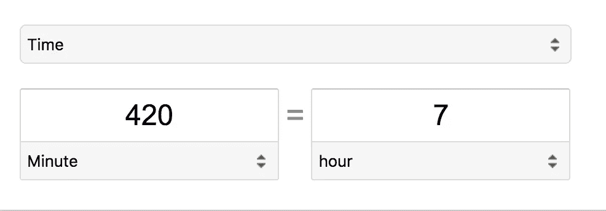

# (大部分)自动化的发布过程

> 原文：<https://medium.com/hackernoon/a-mostly-automated-release-process-63bb9516985a>

## 自动化你能自动化的事情，并分担剩余任务的责任

访问 https://www.mikenikles.com 的****获取我的最新博文。****

***这篇博文是我分享我们从部署在 AWS 上的单片应用程序(每个都有自己的源代码库)迁移到部署在 Google 云平台上的分布式服务架构(所有源代码都托管在 monorepo 中)的系列文章的一部分。***

*   ***第一部分:* [*一个 monorepo，GitHub 流和自动化 FTW*](https://hackernoon.com/a-monorepo-github-flow-and-automation-ftw-c41a2d9c48bb)**
*   ****第 2 部分:“* [*一对多——为什么我们从多个 git 回购转移到单一回购，以及我们如何设置它*](/@mikenikles/one-vs-many-why-we-moved-from-multiple-git-repos-to-a-monorepo-and-how-we-set-it-up-f4abb0cfe469)*”****
*   ****第三部分(这篇文章):“一个(大部分)自动化的发布过程”****
*   ****第四部分:* [我们对软件开发一致性的方法](/@mikenikles/our-approach-to-software-development-consistency-d101995bb843)***
*   *****第 5 部分(即将推出):“本地调试微服务”*****

# ****什么是“发布过程”？****

> ****发布管理是通过不同的阶段和环境管理、计划、调度和控制软件构建的过程；包括测试和部署软件版本。
> 来源:[维基百科](https://en.wikipedia.org/wiki/Release_management)****

****哇…这是一个很长的句子，它让我想起了我在🇨🇭.长大时写的德语句子****

****一种稍微不那么冗长的说法是:****

> ****“如何将代码从我的笔记本电脑转移到生产中。”
> 来源:[我](https://twitter.com/mikenikles)****

****最终，一切都与代码有关，在这个过程中，我们希望对代码做某些事情。比如:****

*   ****[吻](https://en.wikipedia.org/wiki/KISS_principle)；像 [ESLint](https://eslint.org/docs/about/) 这样的工具可以帮上忙。****
*   ****保持格式一致。[更漂亮](https://prettier.io/)是你在这里的必备工具。****
*   ****运行测试。****
*   ****将可重用的代码打包成包，并部署到 NPM。****
*   ****构建利用上述包的服务。****
*   ****给涉众一个在或多或少安全的环境中评审代码的机会，通常被称为“阶段化”。****
*   ****将经过评审的代码部署到真正重要的地方:🥁……
    生产环境🎉****

# ****为什么是“自动化”？****

****很好的问题，很高兴你问了。主要是因为我们可以。然而更重要的是，我认识的大多数开发人员日复一日地写代码，因为当他们发布帮助他人的软件时，他们感觉很好(你的里程数可能会有所不同)。很少(从来没有？)我是否遇到过热情的开发人员，他们会说，“你知道，我就是喜欢手动将 ssh 导入我的虚拟机，运行`git pull`，然后运行`sh ./scripts/release-carefully.sh --production=true`，然后抱最好的希望🤞".****

****根据经验法则，****

> ****如果一项任务可以在手工执行的时间内自动完成，那么就自动完成它。现在。****

****原因如下:热情的软件工程师希望把时间花在处理更重要的事情上。对于软件行业的任何人来说，自动化日常任务应该是优先考虑的事情。让我们计算一下，看看为什么:****

*   ****将一项新功能手动部署到您的试运行环境大约需要 21 分钟。****
*   ****你一天做一次，一周五天。****
*   ****数学是这样的:21 分钟 x 每周 5 天=每周 105 分钟 x 4 周=每月 420 分钟。****

********

****Source: [Google](https://www.google.ca/search?ei=5j4_Wv2MOpiajwOvjLz4CQ&q=400+minutes+to+hours&oq=400+minutes+to+hours&gs_l=psy-ab.3..0j0i5i10i30k1j0i5i30k1j0i8i30k1l2.126360.126360.0.126726.1.1.0.0.0.0.176.176.0j1.1.0....0...1.1.64.psy-ab..0.1.175....0.Tsb9aXPHVHE)****

****每月七小时是 **1 个完整工作日**。作为读者的一个练习，您可以添加部署到生产环境所需的时间，以及处理潜在的修补程序部署。****

****比方说，你最终得到 2 到 3 个工作日的总数。与其月复一月地花费时间，不如投入到编写自动化脚本中。在第二个月，你将有 2 到 3 个额外的工作日，在那里你可以指导一个更初级的团队成员或者组织一次午餐&学习与你所在城市的社区分享你的发布自动化脚本的细节🙌。****

# ****为什么是“大部分”？****

****我还没有遇到过一个软件应用程序 100%自动化的发布过程。虽然这对于库、框架等来说肯定是可以实现的。对于一个应用程序来说，它是一个不同的怪兽。****

****至少，在我们开始自动化发布过程之前，这就是我们的工作目标，自动化发布需要两个人工批准:****

1.  ****部署到暂存区。****
2.  ****部署到生产中。****

# ****所以…这是我们发布服务的方式****

****记住上面的内容，下面的图表，我在本系列的第一篇博客文章中简要提到过，概述了我们的(大部分)自动化发布过程:****

********

****如你所见，我们使用 [CircleCI](https://circleci.com/) 。使用 CircleCI 2.0 和[工作流](https://circleci.com/docs/2.0/workflows/)，上述内容会转化为以下`[.circleci/config.yml](https://circleci.com/docs/2.0/configuration-reference/)`文件:****

****您会注意到 7 个已配置的工作流作业，它们对应于上图中的 7 个矩形。****

****我们在部署工作中调用的`yarn deploy:*`脚本是围绕谷歌云平台`gcloud` CLI 的瘦包装器。脚本运行一些验证和一些逻辑来处理试运行和生产的情况。****

****这对我们来说是全新的。它工作得很好，但是我们总是在寻找加速或者简化过程的方法。下一个主要步骤是集成一种为每个包/服务自动创建`CHANGELOG.md`文件的方法，并让系统在发布到 NPM 时确定合适的 [semver](https://semver.org/) 版本。类似于 https://conventionalcommits.org/的东西看起来很有趣🤔。****

# ****结论****

****这是一个有起有落的伟大旅程，但最终的结果是让我们的日常生活变得简单。****

****从 2018 年开始，每个微服务都将有所有者，一个至少由两名开发者组成的团队。作为服务所有者，遵循“您构建它，您运行它”的原则。通过这篇博文中描述的发布过程，每个拉请求在被合并到`master`之前都被部署到生产中。所有者不仅要负责开发，还要负责服务的部署、监控和支持。如果有 bug，公司的任何人都可以在他们不拥有的服务中打开 PRs。尽管[服务所有者将拥有批准 PRs](https://help.github.com/articles/about-codeowners/) 的最终决定权。****

****如果您对上述方法有任何问题、想法、建议等，请告诉我。我很乐意讨论和学习其他人如何部署到生产中。****